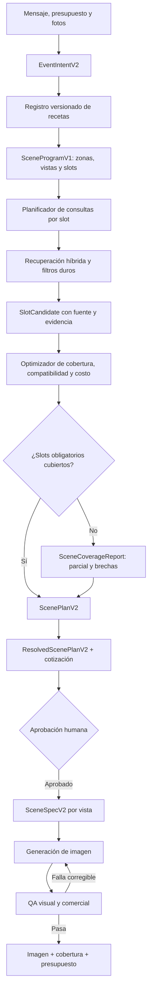

# Plan de arquitectura y RAG para escenas de boda completas

**Estado:** listo para ejecución, pendiente de implementación  
**Fecha de auditoría:** 2026-08-22  
**Alcance:** intención → RAG → plan comercial → presupuesto → aprobación → `SceneSpec` → generación → QA visual  
**Objetivo:** pasar de “un arco de globos aislado” a escenas de boda ricas, coherentes y comercialmente verificables, sin inventar productos, precios ni objetos decorativos.

---

## 1. Resultado esperado

Ante una petición como “quiero ideas para mi boda en un jardín”, el sistema debe producir un **programa de escena** antes de elegir productos. Para una vista de ceremonia, ese programa puede incluir:

- punto focal de ceremonia: altar, estructura o backdrop;
- pasillo y marcadores laterales;
- asientos de invitados visibles o preservados desde el lugar;
- flores, follaje o acentos equivalentes;
- iluminación ambiental cuando corresponda al horario;
- señalización, pedestales, faroles u otros acentos compatibles;
- relaciones espaciales, escala y jerarquía visual entre los elementos.

La escena solo se declarará “completa” si las funciones obligatorias están cubiertas por inventario verificable, alquiler verificable o elementos existentes del lugar. Si el catálogo no alcanza, el sistema debe entregar una propuesta parcial con brechas explícitas; nunca completar la imagen con mobiliario, flores o luces inventados.

### Verdades observables que deben quedar garantizadas

1. La complejidad se mide por **cobertura de funciones y zonas**, no por cantidad de SKU ni por cantidad de globos.
2. Todo objeto decorativo visible tiene una procedencia y un estado comercial.
3. Todo renglón cotizado se puede rastrear hasta una o más instancias visibles o de soporte declaradas.
4. Toda función obligatoria está cubierta, dispensada explícitamente o marcada como brecha.
5. El presupuesto usa el conjunto realmente seleccionado después de paquetes, cantidades, alquileres y servicios.
6. La imagen aprobada, el plan, la cotización y el informe QA comparten hashes de versión.
7. Una vista no intenta mostrar todo el evento: ceremonia, recepción y entrada pueden ser vistas distintas del mismo plan.

---

## 2. Diagnóstico verificado

### 2.1 El modelo actual es plano

`PlanDecoracion` contiene una lista de hasta ocho `estructuras`. Tiene roles como `focal`, `soporte`, `relleno`, `acento` y `servicio`, pero no representa:

- zonas del evento;
- funciones semánticas obligatorias;
- programa de ceremonia o recepción;
- dependencias entre mobiliario, estructura, flores, textiles e iluminación;
- cobertura mínima para llamar “completa” a una escena;
- diferencias entre compra, alquiler, elemento existente y contexto del lugar.

El prompt pide entre tres y cinco estructuras, pero el contrato de backend solo exige una estructura focal. Por eso una respuesta con un único arco puede pasar todas las validaciones actuales.

### 2.2 El catálogo vivo no cubre una boda completa

La consulta de solo lectura al PostgreSQL activo mostró esta distribución:

| Categoría activa | Productos |
|---|---:|
| `globo_latex` | 702 |
| `desechable` | 203 |
| `banderola_cartel` | 137 |
| `globo_metalizado` | 134 |
| `vela` | 80 |
| `kit` | 57 |
| `complemento` | 36 |
| `empaque` | 25 |
| sin categoría | 24 |
| `guirnalda_arco` | 13 |

El snapshot publicado inspeccionado contenía 1.411 productos, 3.592 variantes y 3.369 variantes disponibles. Solo se identificaron 4 variantes disponibles de `guirnalda_arco` con unidades de paquete cotizables, 8 cortinas, 18 textiles de mesa, 0 mobiliario, 0 flores/follaje físicos y 0 iluminación física. Solo 17 productos tenían etiqueta de boda y la mayoría eran globos impresos, desechables o textiles genéricos.

No existe cobertura comercial suficiente y verificada para mobiliario de boda, floristería, estructuras de altar, mantelería completa, centros de mesa o iluminación ambiental.

Además, existen tres fronteras de autoridad que hoy pueden mezclarse:

- PostgreSQL/Shopify: catálogo comercial vigente y fuente de verdad;
- `src/lib/catalog-data.ts` + SQLite: exactamente 14 productos demo ricos, sin proveedor, vigencia, modalidad ni fotos comerciales suficientes;
- `manualProducts` de `/api/generate`: piezas que no existen necesariamente en el catálogo real.

El seed y los productos manuales pueden servir para prototipos o referencias editoriales, pero no deben producir cotizaciones ni presentarse como inventario validado en producción.

### 2.3 El RAG recupera productos, no soluciones de escena

El parser actual genera una consulta plana por categoría, ocasión, color, forma, tamaño y precio. La recuperación por rol (`focal`, `soporte`, `relleno`, `acento`, `servicio`) distribuye presupuesto entre artículos, pero no prueba que se cubran altar, pasillo, asientos, iluminación o centros de mesa.

También hay problemas de señal y significado:

- todos los roles reutilizan el embedding del mensaje general, aunque el texto de rol sea distinto;
- `soporte` se asocia con `complemento`, categoría que contiene infladores, Hi-Float, tiaras y confeti, no estructuras escénicas;
- la canasta preliminar asume cantidad uno y subtotal igual al precio de variante, mientras el resolver posterior calcula paquetes, cantidades y merma; son dos modelos de costo incompatibles si se usan para decidir cobertura.

### 2.4 La generación pierde identidad semántica

En la ruta de generación, casi todas las estructuras terminan reducidas a `balloon_structure`; `backdrop` conserva su tipo y `kit/accesorio` se vuelve `other`. Esa reducción impide construir relaciones específicas como:

- flores fijadas a la estructura del altar;
- marcadores repetidos a ambos lados del pasillo;
- asientos alineados y fuera de la circulación;
- faroles apoyados en el suelo;
- iluminación suspendida sobre la zona correcta;
- centros de mesa anclados a mesas existentes o alquiladas.

También se confunden tres cantidades diferentes: la repetición de una instalación, sus componentes y lo que se factura. Por ejemplo, “un arco con 150 globos comprado como 3 paquetes” requiere `instance_count = 1`, un `component_bom` de 150 unidades y `billable_quantity = 3`; no una sola propiedad `quantity` con significados variables.

### 2.5 Conclusión

El problema no se resuelve agregando “más elementos” al prompt. Hace falta una capa de dominio entre la intención y el catálogo, recuperación por función, optimización de cobertura y un `SceneSpec` que preserve zonas, fuentes y relaciones espaciales.

---

## 3. Límites y decisiones de producto

### Dentro del alcance

- bodas de ceremonia, recepción o ambas;
- una o varias vistas coherentes por evento;
- inventario de venta, alquileres verificados y elementos existentes en el lugar;
- cobertura semántica, presupuesto y QA visual;
- migración gradual desde `PlanDecoracion` V1.

### Fuera del alcance inicial

- inventar proveedores, disponibilidad o tarifas;
- mostrar en una sola imagen todas las zonas de una boda completa;
- convertir el catálogo demo en oferta comercial real;
- sustituir el motor de paquetes y presupuesto que ya funciona;
- generar texto legible, logos, SKU o etiquetas dentro de la imagen;
- planificación logística completa de montaje, transporte y personal, salvo componentes de precio verificables.

### Decisión sobre “completo”

Se usarán dos niveles de cobertura:

- **Cobertura del evento:** qué zonas del evento están planificadas.
- **Cobertura de la vista:** qué funciones deben ser visibles en un encuadre específico.

Para el primer lanzamiento, la unidad renderizable principal será `ceremony_view`. Una boda completa podrá producir después `entrance_view`, `ceremony_view`, `reception_view` y `detail_view`, todas vinculadas al mismo plan y presupuesto.

---

## 4. Arquitectura objetivo



### Separación de responsabilidades

| Capa | Decide | No decide |
|---|---|---|
| `EventIntentV2` | tipo de evento, vista, estilo, presupuesto, restricciones | productos finales |
| receta | slots esperados y dependencias por tipo de vista | inventario disponible |
| RAG por slot | candidatos verificables para una función | composición final por sí solo |
| optimizador | conjunto compatible con mejor cobertura dentro del presupuesto | objetos sin fuente |
| plan resuelto | cantidades, paquetes, costos y brechas | libertad creativa no aprobada |
| `SceneSpecV2` | geometría, instancias, relaciones y visibilidad | nuevos productos |
| generador | apariencia fotográfica del spec | alterar selección o presupuesto |
| QA | fidelidad, composición, cobertura y artefactos | aprobar faltantes silenciosamente |

---

## 5. Ontología de escena

### 5.1 Perfiles de complejidad

| Perfil | Intención | Condición mínima de una vista de ceremonia |
|---|---|---|
| `focal_only` | petición explícita de una sola instalación | 1 zona, focal cubierto |
| `balanced_scene` | valor predeterminado para “boda” | focal + pasillo + contexto/asientos; al menos 4 familias semánticas |
| `immersive_scene` | decoración rica de una vista | al menos 4 zonas visibles y 6 familias, con primer plano/medio/fondo |
| `full_event` | planificación de ceremonia y recepción | varias vistas; slots núcleo de cada vista cubiertos |

El sistema no bajará automáticamente a `focal_only` sin decirlo. Si inventario o presupuesto obligan a degradar el perfil, el usuario verá el perfil logrado, el solicitado y la razón.

### 5.2 Zonas iniciales

- `ceremony_focal`
- `ceremony_aisle`
- `guest_seating`
- `entrance_welcome`
- `reception_head_table`
- `reception_guest_tables`
- `ambient_overhead`
- `floor_foreground`
- `photo_moment`

### 5.3 Funciones iniciales

- `altar_frame`
- `focal_backdrop`
- `focal_decor`
- `floral_foliage_accent`
- `balloon_accent`
- `aisle_runner`
- `aisle_marker`
- `guest_chair`
- `table_surface`
- `linen`
- `table_setting`
- `centerpiece`
- `ambient_light`
- `floor_light`
- `welcome_signage`
- `plinth_pedestal`
- `service_support`

La función es una relación muchos-a-muchos y no reemplaza la categoría del producto. Una cortina puede servir como backdrop o photo moment; un farol puede servir como marcador de pasillo o luz de suelo.

### 5.4 Receta inicial: `wedding_ceremony_garden@1`

| Slot | Zona | Prioridad | Puede cubrirse con elemento existente | Dependencias |
|---|---|---:|---:|---|
| estructura o superficie focal | `ceremony_focal` | obligatoria | sí | ninguna |
| decoración focal | `ceremony_focal` | obligatoria | no | estructura/superficie compatible |
| delimitación de pasillo | `ceremony_aisle` | obligatoria en `balanced+` | sí | circulación libre |
| asientos visibles | `guest_seating` | obligatoria en `balanced+` | sí | alineación con pasillo |
| acento botánico o equivalente | focal/pasillo | obligatoria en `immersive+` | sí | exterior/interior compatible |
| iluminación ambiental | `ambient_overhead` | condicional | sí | horario y soporte compatibles |
| bienvenida/señalización | `entrance_welcome` | opcional | sí | texto no se fuerza en vista lejana |
| acento de primer plano | `floor_foreground` | opcional | sí | no bloquear circulación |

Las recetas serán datos versionados y testeables, no párrafos ocultos dentro del prompt.

---

## 6. Procedencia y verdad comercial

### 6.1 Clases de fuente permitidas

| Clase | Uso visual | Presupuesto | Regla |
|---|---|---|---|
| `catalog_sale` | sí | compra verificada | producto/variante activos y disponibles |
| `catalog_rental` | sí | alquiler verificado | proveedor, período y tarifa vigentes |
| `venue_existing` | sí | excluido o costo proporcionado | debe observarse en foto/datos del lugar |
| `context_non_quotable` | arquitectura/naturaleza del lugar o fondo genérico pedido | no cotizable | no cuenta como decoración ni autoriza mobiliario u objetos nuevos |
| `editorial_reference` | solo estilo | nunca | no autoriza copiar ni renderizar un objeto |

### 6.2 Estados comerciales

- `PRICED`: precio completo disponible.
- `QUOTE_REQUIRED`: requiere cotización externa; no permite aprobación presupuestal final.
- `VENUE_EXISTING`: existe en el lugar y no se compra.
- `UNAVAILABLE`: no puede seleccionarse.

### 6.3 Invariantes de presupuesto

1. Todo monto usa enteros en COP.
2. Se distingue `unit_sale`, `package_sale`, `rental_period` y `service_fee`.
3. Depósito reembolsable, transporte, montaje y mano de obra no se mezclan con el subtotal de producto.
4. Un plan con `QUOTE_REQUIRED` puede presentarse como estimación, pero no como presupuesto verificado.
5. El hard gate bloquea generación aprobada si el total conocido supera el techo o si faltan precios obligatorios.
6. Los elementos `venue_existing` se ven, pero no aparecen como compras.
7. La cotización se calcula después de resolver cantidades, paquetes compartidos, repetición por slot y compatibilidades.

### 6.4 Invariantes anti-alucinación y revalidación

- Venta y alquiler requieren `offer_id`, snapshot, medio de identidad y precio verificable.
- `venue_existing` requiere una región de foto o confirmación explícita del usuario/lugar.
- `context_non_quotable` se limita a paredes, piso, cielo, terreno, luz ambiental y vegetación natural; flores arregladas, sillas, mesas, lámparas decorativas, carteles y centros nunca son contexto genérico.
- `uncovered` es un estado de slot, no una fuente utilizable.
- Productos demo o `manualProducts` no generan líneas comerciales en producción.
- Un cambio de oferta, precio, modalidad, disponibilidad o snapshot invalida `selection_hash`, `quote_hash` y cualquier aprobación anterior.
- La generación revalida esas versiones justo antes de consumir el proveedor de imagen; si cambiaron, exige una nueva aprobación.

---

## 7. Contratos de datos

Los nombres son objetivo; su implementación debe usar Zod y tipos inferidos.

### 7.1 `EventIntentV2`

```ts
type EventIntentV2 = {
  schema_version: "event-intent-v2";
  event_type: "wedding";
  event_scope: "ceremony" | "reception" | "both";
  requested_views: Array<"entrance" | "ceremony" | "reception" | "detail">;
  complexity_requested: "focal_only" | "balanced_scene" | "immersive_scene" | "full_event";
  budget_cop?: number;
  event_date?: string;
  event_location?: { country: string; city: string; venue_id?: string };
  rental_period?: { starts_at: string; ends_at: string };
  venue: { environment?: "indoor" | "outdoor"; existing_asset_refs: string[] };
  palette: string[];
  style_terms: string[];
  hard_constraints: Array<{ key: string; value: unknown; provenance: "user" | "image" }>;
};
```

### 7.2 `SceneProgramV1` y `SceneSlot`

```ts
type SceneSlot = {
  slot_id: string;
  view_id: string;
  zone: string;
  function: string;
  requirement: "required" | "conditional" | "optional";
  weight: number;
  min_instances: number;
  max_instances: number;
  allowed_sources: SupplySourceClass[];
  dependencies: string[];
  spatial_constraints: SpatialConstraint[];
};

type SceneProgramV1 = {
  schema_version: "scene-program-v1";
  recipe_id: string;
  recipe_version: number;
  intent_hash: string;
  views: SceneView[];
  slots: SceneSlot[];
};
```

### 7.3 `CatalogItemV3`, `CommercialOfferV1` y `SupplyBinding`

La identidad física no se acopla al proveedor ni a un precio. Un mismo artículo puede tener varias ofertas comerciales, y una oferta puede caducar sin alterar la identidad visual.

```ts
type SupplySourceClass = "catalog_sale" | "catalog_rental" | "venue_existing" | "context_non_quotable";
type NonCommercialReferenceClass = "editorial_reference" | "test_only";

type CatalogItemV3 = {
  item_id: string;
  category_v3: string;
  media_refs: Array<{ id: string; role: "identity" | "detail"; source_url_hash: string }>;
  scene_functions: Array<{ function: string; confidence: number; evidence: string }>;
  dimensions?: PhysicalDimensions;
  compatibility: {
    indoor_outdoor?: string[];
    requires_support?: string[];
    supports?: string[];
    mounting?: string[];
  };
};

type CommercialOfferV1 = {
  offer_id: string;
  item_id: string;
  variant_id?: string;
  source_ref: { source_id: string; snapshot_id: string; verified_at: string };
  source_class: "catalog_sale" | "catalog_rental";
  status: "PRICED" | "QUOTE_REQUIRED" | "UNAVAILABLE";
  availability: { status: "available" | "limited" | "unavailable"; checked_at: string };
  service_area?: { country: string; cities?: string[]; radius_km?: number };
  valid_from?: string;
  valid_until?: string;
  rental_period_rules?: { minimum_periods: number; period_unit: "event" | "day" };
  minimum_quantity?: number;
  price_components: PriceComponent[];
};

type SupplyBinding =
  | { kind: "sale"; item_id: string; offer_id: string; snapshot_id: string }
  | { kind: "rental"; item_id: string; offer_id: string; snapshot_id: string; periods: number }
  | { kind: "venue_existing"; evidence_ref: string; region_ref?: string }
  | { kind: "context_non_quotable"; context_kind: "wall" | "floor" | "sky" | "terrain" | "ambient_light" | "natural_vegetation" };
```

Para retrieval puede materializarse un `CatalogAssetView` que una item y oferta, pero no se persiste como nueva fuente de verdad.

### 7.4 `SlotCandidate` y `SceneCoverageReport`

```ts
type SlotCandidate = {
  slot_id: string;
  item: CatalogItemV3;
  offer?: CommercialOfferV1;
  supply_binding: SupplyBinding;
  retrieval: { lexical: number; semantic: number; rerank: number };
  eligibility: { pass: boolean; reasons: string[] };
  estimated_cost_cop?: number;
};

type SceneCoverageReport = {
  requested_profile: string;
  achieved_profile: string;
  accepted_profile?: string;
  weighted_coverage: number;
  required_covered: string[];
  required_gaps: Array<{ slot_id: string; reason: string; suggested_source_type?: string }>;
  waivers: Array<{ slot_id: string; accepted_by: "user"; accepted_at: string; reason: string }>;
  optional_covered: string[];
  distinct_families: string[];
  status: "COMPLETE" | "PARTIAL" | "BLOCKED";
};
```

### 7.5 `ScenePlanV2`, `ResolvedScenePlanV2` y `SceneSpecV2`

`ScenePlanV2` referencia slots y activos seleccionados; `ResolvedScenePlanV2` agrega instancias, cantidades, paquetes, costos, cobertura y estados comerciales. `SceneSpecV2` conserva por cada elemento:

- `scene_instance_id`;
- `slot_id`, `zone` y `function`;
- `source_ref` y `commercial_status`;
- geometría física y caja normalizada;
- relación con otras instancias;
- visibilidad esperada por vista;
- reglas de repetición y oclusión;
- `instance_count`, `component_bom` y `billable_quantity` como magnitudes separadas;
- política de conteo visual `exact | approximate | representative`;
- prohibición explícita de texto/IDs visibles.

Los hashes mínimos serán:

```text
intent_hash
program_hash
selection_hash
plan_hash
quote_hash
scene_spec_hash
qa_hash
```

La cadena de trazabilidad exigida será:

```text
elemento/píxel esperado
→ scene_instance_id
→ scene_slot
→ supply_binding
→ quote_line
→ commercial_offer
→ catalog_item
→ source_snapshot
```

Un elemento de venue/contexto termina en su evidencia, no en `quote_line`; esa bifurcación debe ser explícita y auditable.

---

## 8. Taxonomía V3 y persistencia

### 8.1 Familias mínimas

- `balloon_material`
- `balloon_structure`
- `backdrop_surface`
- `altar_frame`
- `floral_foliage`
- `aisle_decor`
- `ambient_lighting`
- `floor_lighting`
- `furniture`
- `linen`
- `table_setting`
- `centerpiece`
- `signage`
- `plinth_pedestal`
- `service_support`

### 8.2 Extensión no destructiva de PostgreSQL

Crear `scripts/migrations/012_scene_catalog.sql` con tablas de extensión, manteniendo `catalog_products` y `catalog_variants` como núcleo:

- `catalog_items`: identidad física estable o vista compatible sobre el producto actual;
- `catalog_sources`: proveedor, estado, fecha de verificación y política comercial;
- `catalog_commercial_offers`: modalidad, variante, snapshot, área, disponibilidad y vigencia;
- `catalog_product_capabilities`: función de escena, confianza y evidencia;
- `catalog_product_spatial`: dimensiones, montaje, soporte y ambiente;
- `catalog_price_components`: oferta, tipo de precio, monto COP, período, depósito/transporte/montaje y vigencia;
- `catalog_source_audit`: cambios y rechazos de procedencia.

No se deben guardar funciones de escena únicamente en embeddings. Los embeddings ayudan a recuperar; la elegibilidad comercial y física vive en columnas/relaciones consultables.

### 8.3 Incorporación de proveedores

La arquitectura admite adaptadores de venta y alquiler, pero el lanzamiento de escenas completas depende de fuentes reales. Para cada proveedor se exige:

- identidad y autorización de uso;
- catálogo o feed reproducible;
- precio o estado `QUOTE_REQUIRED`;
- disponibilidad/stock cuando aplique;
- fecha de vigencia;
- ciudad/área de servicio y reglas de período para alquileres;
- depósito, transporte, instalación y qué componentes están incluidos;
- dimensiones y condiciones de montaje;
- fotos utilizables como referencia;
- proceso de despublicación.

El catálogo demo se usará solo como fixture de evaluación hasta que cada registro tenga una fuente verificada.

---

## 9. RAG multizona

### 9.1 Flujo

1. El parser extrae `EventIntentV2`; Zod y reglas deterministas corrigen o rechazan ambigüedades.
2. Una receta versionada expande la intención en slots por vista.
3. El planificador crea una consulta estructurada por slot.
4. Los filtros duros eliminan activos inactivos, incompatibles, sin fuente o fuera de modalidad.
5. La búsqueda híbrida combina texto, taxonomía, atributos y similitud semántica.
6. Un reranker por slot valora función, estilo, color, escala, fuente y precio.
7. El optimizador selecciona un conjunto global compatible, no el mejor producto aislado de cada lista.
8. Se calcula cobertura y se exponen brechas.

### 9.2 Consulta por slot

Cada consulta incluye:

- función y zona;
- fuentes permitidas;
- compra/alquiler/existente;
- rango de dimensiones;
- ambiente interior/exterior;
- restricciones de montaje;
- paleta y estilo como preferencias, no como sustituto de elegibilidad;
- ocasión como señal de ranking para activos genéricos; solo es filtro duro cuando el artículo lleva texto/tema impreso incompatible;
- presupuesto provisional del slot;
- IDs excluidos y familias ya cubiertas para diversidad.

### 9.3 Rendimiento

- máximo inicial de ocho slots recuperables por vista;
- consultas PostgreSQL en paralelo con límite de concurrencia;
- 20 candidatos brutos y 5–8 candidatos finales por slot;
- una representación base del evento y un embedding semántico distinto por cada slot recuperable, calculados en un solo lote;
- caché por `intent_hash + recipe_version + catalog_snapshot_id`;
- timeout parcial: un slot vencido se marca como brecha técnica, no se rellena con invención.

### 9.4 Optimizador de conjunto

Restricciones duras:

- presupuesto conocido no superior al techo;
- stock y disponibilidad;
- fuente verificable;
- dimensiones y compatibilidad;
- dependencias cubiertas;
- no duplicar una compra compartible;
- no seleccionar un objeto `QUOTE_REQUIRED` como si estuviera presupuestado.

Objetivo lexicográfico:

1. cubrir todos los slots obligatorios;
2. maximizar cobertura ponderada;
3. alcanzar diversidad mínima de familias;
4. respetar coherencia visual y espacial;
5. minimizar costo y sobrantes de paquetes;
6. preferir evidencia y disponibilidad más fuertes.

Una forma inicial y testeable:

```text
score = 1000 * required_coverage
      + 100  * weighted_coverage
      + 20   * family_diversity
      + 10   * compatibility
      + 5    * source_confidence
      - normalized_cost
      - package_waste
```

Los pesos se calibrarán con fixtures; el orden de restricciones duras no queda a criterio del LLM.

---

## 10. Composición y generación

### 10.1 Grafo espacial

Cada vista tendrá un grafo de zonas y relaciones:

- `attached_to`
- `supported_by`
- `aligned_with`
- `mirrored_with`
- `repeated_along`
- `in_front_of`
- `behind`
- `overhead_of`
- `clearance_from`

La composición de una ceremonia equilibrada debe tener:

- foco inequívoco en fondo/medio;
- pasillo como línea de profundidad;
- elementos repetidos con ritmo, no clonación rígida;
- asientos a ambos lados sin bloquear circulación;
- acentos de primer plano sin tapar el foco;
- escalas derivadas de medidas físicas;
- densidad decorativa compatible con el perfil solicitado;
- espacio negativo suficiente para que la escena no parezca un catálogo amontonado.

### 10.2 Política de visibilidad

El generador solo recibe instancias `visible`, `support_hidden` o `context_preserved`. Los soportes ocultos pueden ser necesarios para geometría, pero no se promocionan como decoración. Un objeto presente en el plan general puede quedar fuera de una vista y conservar su trazabilidad.

### 10.3 QA visual V2

El informe debe evaluar:

- `required_slot_recall`: slots visibles esperados presentes;
- `unauthorized_object_precision`: ausencia de decoración no aprobada;
- `source_identity_fidelity`: material, forma, color y escala;
- `spatial_relationship_fidelity`: relaciones del grafo;
- `composition_hierarchy`: foco, profundidad, balance y circulación;
- `instance_count_fidelity`: repeticiones y cardinalidad;
- `text_artifacts` y `annotation_artifacts`;
- `physical_plausibility`.

Se permite un reintento correctivo automático usando solo el mismo `SceneSpecV2`. Si vuelve a fallar, se muestra “requiere revisión”; el reintento no puede agregar productos.

### 10.4 Texto y señalización

La existencia física de un letrero puede formar parte del plan, pero el modelo de imagen no escribirá texto. Cada instancia de señalización usa `text_policy: blank_surface | graphic_only | deterministic_overlay`. Si se necesita una frase exacta, se compone en una fase determinista posterior y se valida por separado; SKU, IDs internos y nombres de producto nunca entran al lienzo.

---

## 11. Plan de ejecución

### Matriz de olas

| Plan | Ola | Depende de | Puede correr en paralelo con |
|---|---:|---|---|
| 00 — línea base | 0 | — | — |
| 01 — dominio y recetas | 1 | 00 | 02 |
| 02 — fuentes y taxonomía | 1 | 00 | 01 |
| 03 — enriquecimiento y brechas | 2 | 02 | — |
| 04 — RAG por slot | 2 | 01, 02 | 03, después de contratos de 02 |
| 05 — optimizador y presupuesto | 3 | 03, 04 | — |
| 06 — orquestación y UI | 4 | 05 | — |
| 07 — `SceneSpecV2`, render y QA | 5 | 06 | — |
| 08 — E2E, métricas y despliegue | 6 | 07 | — |

### Plan 00 — Congelar la línea base

**Objetivo:** convertir el fallo observado en fixtures reproducibles antes de cambiar contratos.

#### Tarea 00.1 — Fixtures de intención y catálogo

**Archivos:**

- crear `src/lib/scene/__fixtures__/wedding-intents.ts`;
- crear `src/lib/scene/__fixtures__/catalog-capability-snapshots.ts`;
- crear `scripts/eval-scene-baseline.ts`.

**Acción:** registrar al menos ocho escenarios: boda en jardín de 150.000 COP con catálogo actual; catálogo completo verificado; petición explícita solo arco; foto con sillas existentes; presupuesto insuficiente; boda ceremonia+recepción; oferta modificada después de aprobar; y petición sin foto del lugar. El snapshot actual debe demostrar que mobiliario/floral/iluminación no tienen cobertura comercial.

**Verificación:** `npx tsx scripts/eval-scene-baseline.ts` produce JSON estable, detecta la propuesta “solo arco” y no modifica PostgreSQL.

**Terminado cuando:** el caso reportado por el usuario falla por cobertura semántica, aunque el plan V1 sea válido.

#### Tarea 00.2 — ADR e invariantes

**Archivos:**

- crear `docs/adr/001-scene-program-and-provenance.md`;
- crear `src/lib/scene/invariants.ts`;
- crear `scripts/test-scene-invariants.ts`.

**Acción:** documentar las decisiones “programa antes de productos”, “sin fuente no se renderiza”, “evento y vista son niveles distintos” y “precio desconocido bloquea aprobación final”. Codificar aserciones puras para esas reglas.

**Verificación:** `npx tsx scripts/test-scene-invariants.ts` prueba casos positivos y negativos.

**Terminado cuando:** las reglas críticas no dependen de texto del prompt.

#### Tarea 00.3 — Frontera de autoridad comercial

**Archivos:**

- actualizar `src/lib/products.ts`;
- actualizar `src/lib/generacion/provenance.ts`;
- actualizar `src/app/api/generate/route.ts`;
- crear `scripts/test-commercial-authority.ts`.

**Acción:** etiquetar explícitamente PostgreSQL/Shopify, seed SQLite y `manualProducts`; impedir que seed/manual produzcan líneas de cotización o estado comercial verificado fuera de test/desarrollo. Mantenerlos como `editorial_reference` o `test_only` cuando proceda.

**Verificación:** `npx tsx scripts/test-commercial-authority.ts` prueba que un item manual puede servir de referencia no cotizable en local, pero es rechazado como compra, alquiler o plan verificable en producción.

**Terminado cuando:** ninguna ruta puede convertir un producto sin oferta y snapshot en una línea comercial.

### Plan 01 — Dominio, recetas y cobertura

**Objetivo:** representar una boda como programa de zonas y funciones.

#### Tarea 01.1 — Contratos Zod V2

**Archivos:**

- crear `src/lib/scene/tipos.ts`;
- crear `src/lib/scene/hashes.ts`;
- crear `scripts/test-scene-contracts.ts`.

**Acción:** implementar `EventIntentV2`, `SceneProgramV1`, `SceneSlot`, `ScenePlanV2`, `SceneCoverageReport` y hashes canónicos. Rechazar IDs duplicados, pesos inválidos, slots sin vista, fuentes no permitidas y estados completos con brechas obligatorias.

**Verificación:** `npx tsx scripts/test-scene-contracts.ts` y `npx tsc --noEmit`.

**Terminado cuando:** los contratos aceptan los fixtures válidos y rechazan las inconsistencias enumeradas.

#### Tarea 01.2 — Registro de recetas

**Archivos:**

- crear `src/lib/scene/recipes.ts`;
- crear `src/lib/scene/recipes/wedding-ceremony-garden.v1.ts`;
- crear `src/lib/scene/coverage.ts`;
- crear `scripts/test-scene-recipes.ts`.

**Acción:** implementar perfiles y receta inicial; expandir determinísticamente intención a vistas/slots; calcular cobertura ponderada, familias distintas y perfil logrado.

**Verificación:** `npx tsx scripts/test-scene-recipes.ts` prueba `focal_only`, `balanced_scene`, `immersive_scene` y degradación explícita.

**Terminado cuando:** una boda genérica produce más requisitos semánticos que un arco y nunca se marca completa solo por cantidad de artículos.

### Plan 02 — Fuentes, taxonomía V3 y modelo comercial

**Objetivo:** hacer consultables la función, procedencia, geometría y modalidad comercial.

#### Tarea 02.1 — Migración aditiva

**Archivos:**

- crear `scripts/migrations/012_scene_catalog.sql`;
- actualizar `scripts/migrate.ts` solo si el cargador no descubre migraciones automáticamente;
- crear `scripts/test-scene-catalog-migration.ts`.

**Acción:** crear las tablas de extensión de la sección 8, claves foráneas, restricciones de estado e índices por función/fuente/vigencia. La migración debe ser idempotente y no borrar datos existentes.

**Verificación:** ejecutar dos veces `npm run rag:migrate`; después `npx tsx scripts/test-scene-catalog-migration.ts` contra PostgreSQL.

**Terminado cuando:** ambas ejecuciones pasan y los productos actuales siguen recuperables.

#### Tarea 02.2 — Contratos de activos y taxonomía

**Archivos:**

- crear `src/lib/rag/taxonomy/v3.ts`;
- crear `src/lib/rag/catalog/scene-asset-schema.ts`;
- crear `src/lib/rag/sources/provenance.ts`;
- actualizar `src/lib/rag/catalog/schemas.ts`.

**Acción:** definir categorías V3, identidad física separada de `CommercialOfferV1`, funciones muchos-a-muchos, clases de fuente, estados comerciales, componentes de precio y atributos físicos. Proveer adaptación explícita de V2 a V3 con confianza/evidencia; nunca inferir oferta, precio o proveedor.

**Verificación:** pruebas de esquema incluidas en `scripts/test-scene-contracts.ts` y `npm run rag:test-validation`.

**Terminado cuando:** globos, cortinas y velas actuales se adaptan sin pérdida y los activos ricos pueden expresarse sin `other`.

### Plan 03 — Enriquecimiento, proveedores y auditoría de brechas

**Objetivo:** conocer qué puede cubrir realmente el catálogo y habilitar fuentes verificadas.

#### Tarea 03.1 — Enriquecimiento con evidencia

**Archivos:**

- crear `src/lib/rag/catalog/derive-scene-capabilities.ts`;
- actualizar `src/lib/rag/catalog/normalize.ts`;
- actualizar `src/lib/rag/catalog/persist-staged.ts`;
- crear `scripts/enrich-scene-capabilities.ts`.

**Acción:** derivar funciones candidatas desde título, tipo, tags y atributos; guardar confianza y evidencia; mandar estados ambiguos a revisión. No usar el LLM para crear hechos comerciales.

**Verificación:** `npx tsx scripts/enrich-scene-capabilities.ts --dry-run` es determinista y no cambia filas; una ejecución de staging conserva auditoría.

**Terminado cuando:** cada capacidad publicada indica de qué dato de origen salió.

#### Tarea 03.2 — Adaptadores y reporte de brechas

**Archivos:**

- crear `src/lib/rag/sources/scene-source-adapter.ts`;
- crear `src/lib/rag/sources/verified-assets.ts`;
- crear `scripts/audit-scene-catalog.ts`;
- crear `docs/catalog/SCENE_SOURCE_ONBOARDING.md`.

**Acción:** definir el contrato para venta/alquiler; auditar cobertura por receta, slot, fecha, período y ciudad/área cuando aplique; listar proveedores o datos faltantes sin inventarlos. Mantener el catálogo demo como fixture con `editorial_reference` o `test_only`.

**Verificación:** una prueba wrapper ejecuta `npx tsx scripts/audit-scene-catalog.ts --recipe wedding-ceremony-garden@1 --require-balanced` y confirma que el código distinto de cero y las brechas tipadas son el resultado esperado mientras falten fuentes reales.

**Terminado cuando:** el sistema puede explicar exactamente qué tipo de fuente falta para dejar de producir solo globos.

### Plan 04 — Recuperación híbrida por slot

**Objetivo:** recuperar candidatos elegibles por función y no una lista plana de fiesta.

#### Tarea 04.1 — Parser y planificador de consultas

**Archivos:**

- crear `src/lib/rag/query-parser/event-schema.ts`;
- crear `src/lib/rag/query-parser/parse-event.ts`;
- crear `src/lib/rag/retrieval/slot-query-planner.ts`;
- crear `scripts/eval-event-query-parser.ts`.

**Acción:** extraer intención, resolver defaults deterministas y crear consultas por slot. Mantener la procedencia de restricciones; el LLM no puede convertir preferencias en filtros duros ni elevar el perfil alcanzado.

**Verificación:** `npx tsx scripts/eval-event-query-parser.ts` alcanza 100% en restricciones duras de los fixtures y serialización estable.

**Terminado cuando:** “boda en jardín” produce consultas diferenciadas para focal, pasillo, asientos y acentos.

#### Tarea 04.2 — Búsqueda, reranking y diversidad por slot

**Archivos:**

- crear `src/lib/rag/retrieval/by-scene-slot.ts`;
- crear `src/lib/rag/retrieval/scene-rerank.ts`;
- actualizar `src/lib/rag/retrieval/types.ts`;
- crear `scripts/eval-scene-retrieval.ts`.

**Acción:** aplicar primero filtros comerciales/físicos, después recuperación híbrida y reranking. Ejecutar slots en paralelo con límites, caché por snapshot y razones de elegibilidad.

**Verificación:** `npx tsx scripts/eval-scene-retrieval.ts`; ningún resultado inelegible llega al top-k y la prueba de catálogo actual devuelve brechas, no falsos positivos.

**Terminado cuando:** cada candidato puede explicar por qué cubre un slot y de qué fuente procede.

### Plan 05 — Optimización global, cantidades y presupuesto

**Objetivo:** seleccionar una solución completa y compatible dentro del techo.

#### Tarea 05.1 — Optimizador de cobertura

**Archivos:**

- crear `src/lib/scene/compatibility.ts`;
- crear `src/lib/scene/optimizer.ts`;
- crear `scripts/test-scene-optimizer.ts`.

**Acción:** implementar restricciones duras y objetivo lexicográfico; permitir activos compartidos entre slots sin doble cobro; emitir brechas tipadas (`NO_SOURCE`, `NO_STOCK`, `NO_PRICE`, `INCOMPATIBLE`, `BUDGET`).

**Verificación:** `npx tsx scripts/test-scene-optimizer.ts` incluye óptimos pequeños comprobables por enumeración y pruebas de determinismo.

**Terminado cuando:** el optimizador prefiere cobertura real frente a acumular más productos de una sola familia.

#### Tarea 05.2 — Resolver V2 y cotización

**Archivos:**

- crear `src/lib/scene/resolver.ts`;
- actualizar `src/lib/plan/optimizar-materiales.ts` para exponer reutilización sin romper V1;
- actualizar `src/lib/cotizacion/motor.ts`;
- crear `scripts/test-scene-budget.ts`.

**Acción:** convertir selección en instancias, separar `instance_count`, `component_bom` y `billable_quantity`, resolver paquetes/cantidades y normalizar compra, alquiler, servicio y existentes. El único costo usado para aprobación sale de este resolver, no de la canasta preliminar. Bloquear aprobación final con costos obligatorios desconocidos.

**Verificación:** `npx tsx scripts/test-scene-budget.ts`, `npm run plan:test` y `npm run plan:test-pg`.

**Terminado cuando:** total, subtotales, brechas y líneas visibles son reconciliables al peso; no hay doble cobro de paquetes compartidos.

### Plan 06 — Orquestación, aprobación y experiencia de usuario

**Objetivo:** introducir V2 sin romper conversaciones o planes V1.

#### Tarea 06.1 — Herramienta y flujo de chat V2

**Archivos:**

- actualizar `src/lib/ia/herramientas.ts`;
- actualizar `src/lib/ia/registro-herramientas.ts`;
- actualizar `src/lib/ia/prompt-sistema.ts`;
- actualizar `src/app/api/chat/route.ts`;
- actualizar `src/lib/ia/feature-flags.ts`.

**Acción:** agregar herramienta estructurada para crear `SceneProgramV1`/`ScenePlanV2`; el backend expande recetas y resuelve productos. Cuando haya alquiler, pedir o marcar como faltantes fecha, ubicación y período antes de presupuestar. Activar `SCENE_PLAN_V2_SHADOW` y comparar con V1 sin mostrar V2 inicialmente.

**Verificación:** pruebas de prompt/herramienta, `npm run ia:test-prompts`, `npm run plan:test` y fixtures de chat.

**Terminado cuando:** el modelo describe intención, pero no puede saltarse receta, cobertura, fuente ni presupuesto.

#### Tarea 06.2 — Revisión de cobertura y aprobación

**Archivos:**

- crear `src/components/SceneCoveragePanel.tsx`;
- crear `src/components/ScenePlanCard.tsx`;
- actualizar `src/app/page.tsx`;
- conservar `src/components/TarjetaPlanDecoracion.tsx` como fallback V1.

**Acción:** mostrar perfil solicitado/logrado, zonas, elementos existentes, compras/alquileres, brechas y costos desconocidos. Deshabilitar “Aprobar y generar” cuando el estado sea `BLOCKED`, exceda presupuesto o falte precio obligatorio. Un plan `PARTIAL` solo se vuelve generable después de que el usuario acepte explícitamente el perfil degradado; esa dispensa crea un nuevo hash y nunca cambia `PARTIAL` a `COMPLETE`.

**Verificación:** pruebas de componente o smoke E2E para estados completo, parcial, bloqueado y V1.

**Terminado cuando:** el usuario entiende por qué una escena quedó parcial y qué fuente/presupuesto falta.

### Plan 07 — `SceneSpecV2`, composición y QA

**Objetivo:** traducir el plan rico a una imagen rica sin perder trazabilidad.

#### Tarea 07.1 — Spec y layout por grafo

**Archivos:**

- actualizar `src/lib/ia/scene-spec.ts` con versión discriminada V1/V2;
- crear `src/lib/ia/scene-layout.ts`;
- actualizar `src/lib/plan/ubicaciones.ts` solo mediante adaptador V1;
- actualizar `src/app/api/generate/route.ts`.

**Acción:** dejar de colapsar categorías a `balloon_structure`; crear instancias por slot, zonas, cajas, anclajes y relaciones. Preservar objetos del lugar solo si tienen evidencia visual.

**Verificación:** `npx tsx scripts/test-scene-layout.ts`, `npm run ia:test` y `npm run plan:test-geometria`.

**Terminado cuando:** una ceremonia equilibrada produce focal, profundidad de pasillo, asientos y acentos con identidades distintas.

#### Tarea 07.2 — Prompt y QA visual V2

**Archivos:**

- actualizar `src/lib/ia/build-image-prompt.ts`;
- actualizar `src/lib/ia/image-qa.ts`;
- actualizar `src/components/references/GenerationQaSummary.tsx`;
- crear `scripts/eval-scene-image-fidelity.ts`.

**Acción:** serializar composición, visibilidad y fuentes sin IDs visibles; seleccionar referencias representativas por slot cuando se alcance el límite del proveedor; añadir políticas de conteo `exact`, `approximate` y `representative`, métricas de slots, objetos no autorizados y composición. El retry corrige relaciones/omisiones, no expande inventario.

**Verificación:** `npx tsx scripts/eval-scene-image-fidelity.ts`, `npm run ia:test` y `npm run ia:test-prompts`.

**Terminado cuando:** QA rechaza tanto “solo arco” para un plan equilibrado como una imagen rica con objetos no cotizados.

### Plan 08 — E2E, observabilidad y despliegue gradual

**Objetivo:** probar el flujo real y activar V2 con una salida segura.

#### Tarea 08.1 — Suite E2E integrada

**Archivos:**

- crear `scripts/eval-e2e-scene-v2.ts`;
- actualizar `scripts/test-plan-pg.ts` para fixtures V2 sin retirar V1;
- actualizar `package.json` con `scene:test` y `scene:e2e`.

**Acción:** cubrir los ocho escenarios de la sección 12, incluyendo generación real opcional y aserciones de hash, cobertura, presupuesto y fuentes.

**Verificación:** `npm run scene:test`, `npm run scene:e2e`, `npx tsc --noEmit`, `npm run build`.

**Terminado cuando:** todas las aserciones deterministas pasan antes de consumir generación de imagen.

#### Tarea 08.2 — Telemetría, shadow y flags

**Archivos:**

- actualizar `src/lib/ia/telemetria.ts`;
- actualizar `src/lib/rag/observability/log.ts`;
- crear `scripts/migrations/013_scene_plan_audit.sql` si `plan_audit_log` no puede extenderse de forma compatible;
- crear `scripts/scene-metrics.ts`.

**Acción:** registrar recetas/versiones, cobertura, brechas, fuentes, latencia por slot, costo y resultado QA sin datos sensibles. Despliegue: `shadow` → personal interno → porcentaje limitado → default; mantener kill switch a V1.

**Verificación:** `npx tsx scripts/scene-metrics.ts` reconcilia solicitudes con planes y QA; comparación shadow no cambia la respuesta del usuario.

**Terminado cuando:** es posible medir mejora y revertir V2 sin migración destructiva.

#### Flags y estados de despliegue

- `SCENE_PLAN_V2_SHADOW`: calcula V2, registra diferencias y responde con V1.
- `SCENE_PLAN_V2_ENABLED`: permite mostrar y aprobar V2 para la cohorte configurada.
- `SCENE_PLAN_V2_REQUIRE_VERIFIED_SOURCES`: permanece activo en todos los entornos no locales.
- `SCENE_PLAN_V2_VISUAL_QA`: habilita métricas y retry cerrado de V2.
- `SCENE_PLAN_V2_KILL_SWITCH`: fuerza V1 sin borrar planes, auditoría ni tablas V2.

Las flags se evalúan al inicio de la solicitud y su snapshot se incluye en la auditoría y los hashes de resolución; no pueden cambiar a mitad del flujo de aprobación/generación.

---

## 12. Escenarios E2E obligatorios

### E2E-1 — Catálogo actual, 150.000 COP

**Entrada:** “Quiero ideas para mi boda en un jardín”, perfil predeterminado `balanced_scene`.  
**Esperado:** propuesta parcial; identifica falta de asientos/floristería/estructura/iluminación verificables según el snapshot; no inventa esos objetos; no afirma que la boda está completa.

### E2E-2 — Catálogo rico y verificado

**Entrada:** misma intención con fixtures de proveedores verificados.  
**Esperado:** focal + pasillo + asientos/contexto + acentos, cuatro o más familias, presupuesto reconciliado y composición aprobada.

### E2E-3 — Solo globos solicitado explícitamente

**Entrada:** “Solo quiero un arco orgánico blanco y dorado”.  
**Esperado:** `focal_only`; el arco aislado es válido y no se agregan elementos de boda no solicitados.

### E2E-4 — Lugar con elementos existentes

**Entrada:** foto donde ya existen sillas, vegetación y sendero.  
**Esperado:** se preservan como `venue_existing`/`context_non_quotable`, no se cotizan y no autorizan mobiliario adicional inexistente.

### E2E-5 — Presupuesto insuficiente

**Entrada:** `immersive_scene` con techo inferior al mínimo verificable.  
**Esperado:** degradación explícita o `BLOCKED`; nunca se ocultan costos ni se usa precio cero.

### E2E-6 — Ceremonia y recepción

**Entrada:** `full_event`.  
**Esperado:** al menos dos vistas vinculadas al mismo plan; no se intenta meter altar, pasillo, mesas y pista en un único encuadre.

### E2E-7 — Oferta modificada después de aprobar

**Entrada:** plan aprobado; después cambia precio, disponibilidad o snapshot de una oferta seleccionada.  
**Esperado:** la generación se bloquea, invalida hashes derivados y exige resolver/reaprobar; nunca usa silenciosamente el precio anterior.

### E2E-8 — Sin foto de lugar

**Entrada:** boda en jardín sin imagen del venue.  
**Esperado:** puede crear terreno, cielo, arquitectura neutra, luz ambiente y vegetación natural como contexto; no agrega sillas, mesas, flores arregladas, faroles ni carteles sin `SupplyBinding`.

### Navegador integrado

Con el dev server y PostgreSQL levantados:

1. abrir `http://localhost:3000/`;
2. enviar cada intención desde una sesión limpia;
3. inspeccionar `SceneCoveragePanel` antes de aprobar;
4. comprobar que el botón se bloquea en estados no aprobables;
5. aprobar un fixture completo y generar;
6. revisar visualmente foco, profundidad, circulación, escala y ausencia de objetos no aprobados;
7. comparar plan, cotización, `SceneSpecV2` y QA por hashes;
8. revisar consola y red: cero errores, cero respuestas 5xx y cero llamadas duplicadas de generación.

---

## 13. Métricas de aceptación

### Dominio y RAG

- 100% de slots obligatorios cubiertos o con brecha tipada;
- 0 candidatos sin fuente verificable en planes aprobables;
- 0 artículos `UNAVAILABLE` en selección final;
- Recall@10 por slot ≥ 0,90 cuando exista una oferta válida;
- 0% de falsos positivos en slots sin catálogo;
- 100% de exactitud de modalidad venta/alquiler/venue/contexto en el conjunto contractual;
- ≥ 95% de exactitud de función en el conjunto dorado inicial;
- p95 de recuperación de hasta ocho slots < 4 s en el entorno de referencia;
- determinismo total para mismo snapshot, intención y flags.

### Presupuesto

- 100% de reconciliación entre líneas, paquetes y total;
- 0 planes marcados `VERIFICADO` con `QUOTE_REQUIRED` obligatorio;
- 0 dobles cobros por activos compartidos;
- 0 aprobaciones por encima del techo.
- venta reconciliada como `ceil(unidades / unidades_paquete) × precio_paquete`;
- alquiler reconciliado como `cantidad × períodos × tarifa`, con extras separados.

### Imagen

- `required_slot_recall = 1.0` para planes `COMPLETE`;
- `unauthorized_object_precision = 1.0` para decoración comercial;
- cero texto, SKU, etiquetas o anotaciones visibles;
- jerarquía, profundidad, escala y circulación aprobadas;
- un máximo de un retry automático.

### Producto

- una petición genérica de boda no termina en `focal_only` sin explicación;
- las brechas de catálogo son visibles y accionables;
- el usuario distingue claramente compra, alquiler, existente y no cotizado.

---

## 14. Riesgos y mitigaciones

| Riesgo | Impacto | Mitigación |
|---|---|---|
| No hay proveedores reales para categorías faltantes | no puede lograrse una escena completa vendible | onboarding verificable y estado `PARTIAL`; nunca usar fixtures como producción |
| El LLM infiere funciones incorrectas | productos irrelevantes | funciones persistidas con evidencia, filtros duros y conjunto dorado |
| Una escena rica excede presupuesto | inconsistencia comercial | optimización global, degradación explícita y hard gate |
| Se confunde variedad con saturación | imagen caótica | perfiles, grafo espacial, espacio negativo y QA compositivo |
| Una sola vista intenta mostrar todo el evento | composición imposible | cobertura separada por evento y por vista |
| Alquileres tienen costos incompletos | total engañoso | componentes de precio y `QUOTE_REQUIRED` bloqueante |
| Migración rompe planes existentes | regresión | contratos discriminados V1/V2, shadow mode y kill switch |
| RAG multislots aumenta latencia | mala experiencia | consultas paralelas limitadas, batching, caché y top-k acotado |
| El generador añade objetos típicos de boda | alucinación visual | allowlist por instancia, QA de objetos no autorizados y retry cerrado |
| El proveedor limita referencias visuales | pérdida de identidad en escenas ricas | priorizar una referencia de identidad por slot/item y registrar las descartadas |
| Conteos altos u oclusos no son auditables por visión | falsos fallos QA | política explícita `exact`, `approximate` o `representative` por instancia |
| Worktree con cambios previos | mezcla o pérdida accidental de trabajo | registrar checkpoint/estado inicial y asignar ownership de archivos por ola; no limpiar cambios ajenos |

---

## 15. Puertas de salida por ola

No avanzar a la siguiente ola si falla alguna puerta:

- **Ola 0:** el caso “solo arco” está reproducido como cobertura insuficiente.
- **Ola 1:** contratos, recetas, procedencia y migración son válidos e idempotentes.
- **Ola 2:** cada slot devuelve candidatos elegibles o una brecha honesta.
- **Ola 3:** optimizador y presupuesto son deterministas y reconciliables.
- **Ola 4:** la aprobación comunica perfil, cobertura y costos desconocidos.
- **Ola 5:** `SceneSpecV2` conserva identidades y QA rechaza omisiones/invenciones.
- **Ola 6:** E2E automatizado y navegador integrado pasan sin errores ni inconsistencias.

---

## 16. Criterio final de “todo solucionado”

El trabajo no se considera terminado por generar una imagen visualmente bonita. Se considera terminado cuando, para cada escenario aceptado:

1. la receta produce las zonas y funciones correctas;
2. RAG encuentra activos verificables o declara brechas;
3. el optimizador arma el mejor conjunto compatible dentro del techo;
4. plan y cotización se reconcilian exactamente;
5. el usuario aprueba una versión identificada por hash;
6. la imagen respeta esa versión sin añadir decoración;
7. QA confirma cobertura, composición, fidelidad y ausencia de artefactos;
8. la prueba E2E en el navegador integrado reproduce el resultado sin errores.

La limitación externa que debe permanecer visible es la cobertura real de proveedores. Hasta incorporar floristería, mobiliario, estructuras y/o iluminación verificables, el sistema puede mejorar radicalmente su razonamiento, pero no debe prometer una boda comercialmente completa usando solo el catálogo actual.
