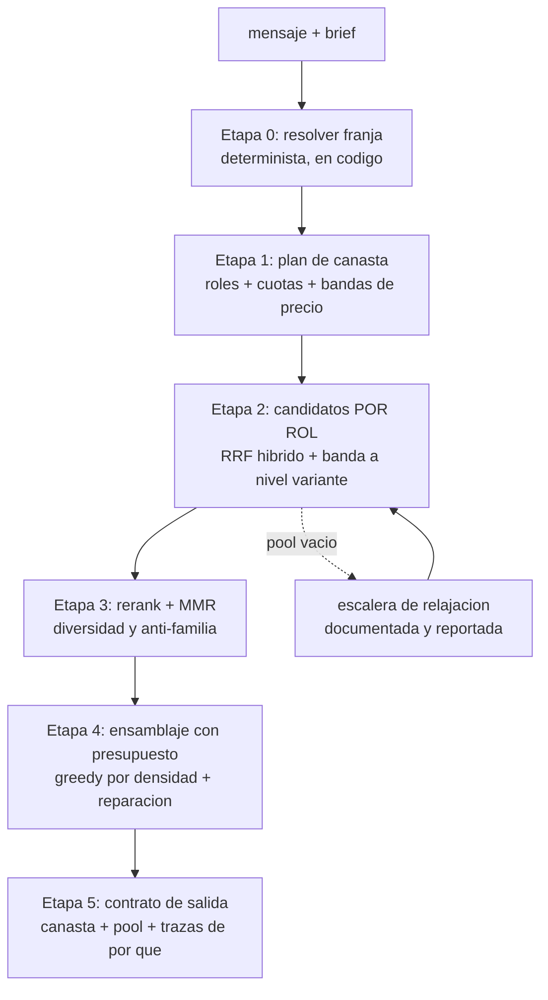

# Plan de implementación — 4 franjas de presupuesto en el RAG

> Estado: **implementado** (2026-08-19), detrás de `RAG_FRANJAS_ENABLED` (default `false`).
> Cubre F1–F7: franjas/roles/resolver/plan en código, fix de fuga de precio (F2),
> retrieval por rol con escalera de relajación (F3), rerank + diversidad por
> familia (F4), ensamblaje con presupuesto (F5), wiring del chat + prompt (F6),
> chips de UI + migraciones Postgres/SQLite (F7). Verificado extremo a extremo
> contra el catálogo real (Postgres) y un turno completo de chat. No implementado:
> UI de admin para editar `presupuesto_franjas` (la tabla override existe, sin
> pantalla) y `scripts/eval-presupuesto.ts` de §7 (las métricas se verificaron
> manualmente, no quedaron como suite repetible).
> Lectura del pedido: **4 rangos de presupuesto** (0–50k / 50–100k / 100–150k / 150k+ COP)
> como concepto de primera clase del retrieval, no como un filtro más de precio.
> Todos los números de este documento se midieron contra `data/demo.sqlite`
> (1.672 productos, 3.727 variantes, 1.454 productos disponibles) el 2026-08-19.

---

## 1. Qué problema resuelve esto

Hoy el presupuesto **no cambia prácticamente nada** en lo que el cliente recibe. No es una
opinión: es medible, y es la razón por la que el sistema "bota los primeros resultados y ya".

### 1.1 El filtro de precio actual es un no-op

`src/lib/rag/retrieval/search.ts:32-35` aplica `p.price_min <= precioMax`. Contra el catálogo real:

| Tope aplicado | Productos disponibles que pasan | % del catálogo disponible |
|---|---|---|
| ≤ $50.000 | 1.444 / 1.454 | **99,3 %** |
| ≤ $100.000 | 1.447 / 1.454 | 99,5 % |
| ≤ $150.000 | 1.449 / 1.454 | 99,7 % |

Un filtro que descarta 10 de 1.454 productos no discrimina nada. El presupuesto entra al pipeline,
se ejecuta como SQL, y sale sin haber cambiado el conjunto de candidatos. Después el LLM escoge
"entre 3 y 6 piezas coherentes" (`src/app/api/chat/route.ts:75`) sin ninguna restricción de total.
De ahí sale la falta de intencionalidad: **el ranking es puramente semántico y el presupuesto es decorativo.**

### 1.2 El filtro es además incorrecto: fuga por `price_min`

`price_min` es la variante **más barata** del producto. Un producto entra al conjunto por su
variante barata y luego el LLM puede seleccionar cualquier variante, incluida una carísima:

- 149 productos pasan el tope de $50.000 y tienen variantes por encima de $50.000.
- 9 productos pasan el tope de $50.000 y tienen variantes por encima de **$150.000**.
- Ejemplo real: `Globo Redondo Silk Verde Menta` → `precio_min` $7.550, `precio_max` **$207.150**.

Es decir: hoy un cliente con $50.000 de presupuesto puede terminar con una cotización de $207.150
en una sola línea, y el backend lo valida sin objetar (`validar.ts` verifica existencia,
pertenencia, stock e inventario — **nunca presupuesto**).

### 1.3 No existe la noción de canasta

`precioMax` es un techo **por pieza**. El presupuesto del cliente es un techo **del total**.
No es el mismo objeto matemático y hoy no hay nada que sume. El total sólo aparece después,
en `cotizar()` / `cotizarProductos()` (`src/lib/cotizacion/motor.ts`), cuando ya se decidió todo
y el precio ya se le mostró al cliente.

### 1.4 El top-k plano no tiene composición

`buscarHibrido` devuelve 15 candidatos ordenados por RRF (`FINAL_LIMIT = 15`). Ese orden es
"qué tan parecido es el texto", no "qué necesita una decoración para existir". Con una consulta
como *"cumpleaños infantil azul"* la cabeza del ranking son 5 bolsas de látex casi idénticas que
se diferencian sólo en el color del título, porque hay 1.966 variantes de `globo_latex` disponibles
contra 122 de `guirnalda_arco`. La cabeza del ranking **está estructuralmente sesgada al inventario**,
no a la intención.

### 1.5 Los precios reales obligan a que las franjas tengan recetas distintas

Medianas de variantes disponibles:

| Categoría | n | Mediana | Mín | Máx |
|---|---|---|---|---|
| `globo_latex` | 1.966 | $15.700 | $3.100 | $127.950 |
| `desechable` | 433 | $6.850 | $3.750 | $24.800 |
| `globo_metalizado` | 188 | $2.300 | $1.800 | $6.750 |
| `banderola_cartel` | 167 | $9.400 | $4.150 | $22.900 |
| `empaque` | 146 | $3.950 | $2.350 | $15.900 |
| `vela` | 140 | $4.200 | $2.450 | $10.150 |
| `guirnalda_arco` | 122 | **$79.800** | $28.700 | $179.000 |
| `complemento` | 52 | $13.650 | $2.750 | **$1.750.550** |
| `kit` | 25 | $24.600 | $5.715 | $47.350 |

Percentiles del total de variantes disponibles: p25 $6.350 · **p50 $11.650** · p75 $21.600 · p90 $47.250 · p99 $129.250.

Consecuencia dura: **una guirnalda/arco cuesta en mediana $79.800**. Eso es 160 % del techo de la
franja 1 y 80 % del techo de la franja 2. Un presupuesto de $0–50.000 no puede prometer un arco —
como máximo el arco más barato del catálogo ($28.700) consumiría el 57 % de todo el presupuesto.
Las franjas no son etiquetas de marketing: cambian **qué decoración es físicamente construible**.

### 1.6 La taxonomía tiene huecos que las franjas amplifican

- 626 / 1.672 productos (37 %) no tienen ninguna **ocasión** derivada.
- 432 / 1.672 (26 %) no tienen ningún **color** derivado.

Hoy un filtro duro de ocasión ya recorta 37 % del catálogo en silencio. Si le sumamos bandas de
precio por rol sin una escalera de relajación explícita, la combinación va a devolver cero con
frecuencia, y "cero" es el peor resultado posible: es el único que el LLM tiene tentación de rellenar.

### 1.7 Ya hay tres definiciones de presupuesto, desconectadas entre sí

| Lugar | Representación |
|---|---|
| `src/app/page.tsx:85-89` | 3 strings de UI: `"Hasta $30.000"`, `"Hasta $70.000"`, `"$100.000 a $200.000"` |
| `arquitectura_elementos.presupuestos` (`src/lib/db.ts:158`) | JSON `["low","mid","high"]` |
| `IntentQuerySchema.filtros_duros.precio_max` | número suelto, extraído por el LLM |

Ninguna se habla con las otras. El string de la UI llega al prompt como texto libre dentro del
brief y el LLM lo re-interpreta cada turno. Esto se unifica o el resto del plan no se sostiene.

---

## 2. Decisión de arquitectura: la franja como nodo de primera clase

**La franja no es un filtro. Es un contrato de composición** que define, para un rango de dinero:
qué roles debe tener la decoración, cuántas piezas, cómo se reparte la plata entre roles, cuánta
holgura se acepta, y qué se le puede prometer al cliente.

Esto reemplaza el par (`precio_max`, top-k plano) por un objeto declarativo, versionado y evaluable.

### 2.1 Las 4 franjas

| Slug | Nombre al cliente | Rango (COP) | Piezas | Intención |
|---|---|---|---|---|
| `detalle` | Detalle | $0 – $49.999 | 2–4 | Un punto bonito, no una escena. Sin arco. |
| `focal` | Punto focal | $50.000 – $99.999 | 4–6 | Un elemento protagonista + acompañamiento. |
| `escena` | Escena | $100.000 – $149.999 | 5–8 | Protagonista + fondo/soporte + acentos. |
| `escena_completa` | Escena completa | $150.000 + | 7–12 | Varias zonas: fondo, focal, relleno, mesa. |

**Intervalos semiabiertos `[min, max)`, sin solapamiento.** Tu mensaje decía "de 0 a 50k, **de 40** a
100k": tomé 50k como frontera para que un presupuesto de $45.000 tenga una sola franja posible.
Si el 40 era intencional (zona de traslape donde se pueden ofrecer las dos), está aislado en un solo
archivo y se cambia en una línea — ver §9.

### 2.2 Roles de composición

Los roles son el vocabulario que le faltaba al retrieval. Se mapean a `shopify_producto.categoria`,
que ya existe y está poblada:

| Rol | Qué es | Categorías elegibles |
|---|---|---|
| `focal` | Lo primero que se ve | `guirnalda_arco`, `kit`, `globo_numero_letra` |
| `soporte` | Fondo o estructura | `complemento`, `banderola_cartel` (formato grande) |
| `relleno` | Volumen y color | `globo_latex` |
| `acento` | Detalle y remate | `globo_metalizado`, `vela`, `banderola_cartel` |
| `servicio` | Mesa y servicio | `desechable`, `empaque` |

Nota deliberada: **no** reuso `arquitectura_tipos.nivel` (`component`/`module`/`composition`) porque
esa tabla está vacía hoy (0 elementos curados) y describe el papel *visual* para el dataset LoRA,
no el papel *presupuestal*. Los dos vocabularios pueden convivir; ver §5.3 para el puente.

### 2.3 Recetas por franja

Cuota = `[mín, máx]` piezas del rol. Tope = fracción máxima del techo de la franja que puede costar
**una** pieza de ese rol (se evalúa a nivel de **variante**, no de producto).

| Rol | `detalle` (techo 50k) | `focal` (100k) | `escena` (150k) | `escena_completa` (objetivo 150k+) |
|---|---|---|---|---|
| `focal` | **0–0** (excluido) | 1–1, tope 55 % | 1–1, tope 55 % | 1–2, tope 45 % |
| `soporte` | 0–0 | 0–1, tope 20 % | 1–1, tope 25 % | 1–2, tope 25 % |
| `relleno` | 1–2, tope 45 % | 2–3, tope 25 % | 2–3, tope 20 % | 3–5, tope 18 % |
| `acento` | 1–2, tope 20 % | 1–2, tope 12 % | 2–3, tope 10 % | 2–3, tope 8 % |
| `servicio` | 0–0 | 0–0 | 0–1, tope 12 % | 0–2, tope 10 % |

Validación con precios reales (mediana de cada categoría, un paquete por pieza):

- `detalle`: 2 × látex $15.700 + 2 × metalizado $2.300 = **$36.000** (72 % del techo). Cabe.
  Con el tope de 45 % ($22.500 por pieza de relleno), el látex mediano entra y el látex de $127.950 no.
- `focal`: arco más barato $28.700 + 3 × látex $47.100 + 2 × metalizado $4.600 = **$80.400** (80 %).
- `escena`: arco mediano $79.800 (53 %, bajo el tope de 55 %) + banderola $9.400 + 2 × látex $31.400
  + 2 × metalizado $4.600 = **$125.200** (83 %).
- `escena_completa`: arco $79.800 + soporte $13.650 + 4 × látex $62.800 + 3 × acento $6.900
  + desechables $6.850 = **$170.000**.

Las recetas se sostienen contra el catálogo que existe. Eso es lo que hace que la franja tenga
intencionalidad verificable y no sea otro número en un `WHERE`.

### 2.4 Utilización: la métrica que mata al "top 3 y ya"

Cada franja declara una **banda de utilización objetivo**: `[0,75 × techo, 1,00 × techo]`.
Una canasta que suma $18.000 en la franja `escena` (12 %) es un fallo, aunque cada pieza sea
relevante — le está entregando una escena de $18.000 a alguien que dijo tener $150.000.
Hoy nada mide eso. En el plan es un criterio de aceptación (§7).

Para `escena_completa` (sin techo) el objetivo es `max(150.000, cifra declarada por el cliente)` y
un tope de seguridad de 1,6 × objetivo: pasarse de ahí exige decírselo al cliente explícitamente,
nunca en silencio.

### 2.5 Dónde viven las franjas: config-as-code con override en DB

**Decisión: fuente de verdad en código** (`src/lib/rag/presupuesto/franjas.ts`), con una tabla
opcional de override editable desde el admin.

Por qué así:

- Las recetas son lógica de negocio con invariantes (las cuotas mínimas deben ser satisfacibles con
  el inventario real). En código se testean y se versionan con el git del proyecto.
- El eval (§7) necesita franjas reproducibles: si viven sólo en SQLite, `rag:eval` mide una cosa hoy
  y otra mañana sin que quede rastro en el diff.
- Pero el admin ya tiene UI de presupuestos (`ArquitecturaTab.tsx:415`), y el negocio va a querer
  mover el $50.000 sin un deploy. El override en DB cubre eso sin volver la config invisible:
  el código trae el default, la DB puede sobreescribir **rangos y cuotas**, nunca la existencia de
  las 4 franjas ni los roles.

---

## 3. Nuevo pipeline de retrieval



### Etapa 0 — Resolución de franja (determinista, nunca del LLM)

Entrada, en orden de prioridad:

1. Chip de presupuesto de la UI → deja de guardar un string y guarda `{ franja: "focal" }`.
2. Cifra explícita en el mensaje, extraída por el intérprete como **dato**, no como decisión:
   `{ tipo: "tope" | "rango" | "ninguno", min, max }`. La franja se calcula en código a partir de la cifra.
3. Sin señal → `franja = null` → **no se inventa**: el pipeline corre en modo actual (sin canasta)
   y el asistente tiene una razón para preguntar. Adivinar la franja es exactamente el tipo de
   autoridad que el proyecto le quita al LLM.

El LLM **nunca** nombra una franja. Recibe la que el backend resolvió, con su rango en pesos.

### Etapa 1 — Plan de canasta

Función pura: `planificarCanasta(franja, intencion) → PlanCanasta`.
Produce, por rol: cuota `[mín, máx]`, tope por pieza en pesos (`fracción × techo`) y las categorías
elegibles. Sin I/O, sin LLM, testeable con tabla de casos. Aquí también se resuelven ajustes de
intención sobre la receta base (ej. si el cliente pidió explícitamente "un arco" en franja `detalle`,
el plan marca `conflicto: focal_inalcanzable` para que el asistente lo diga en vez de callarlo).

### Etapa 2 — Candidatos por rol

Una llamada de retrieval **por rol** (no una global), cada una con:

- `semanticQuery` enriquecida con el rol (`"arco de globos boho tonos tierra"` vs `"globos de látex tono tierra"`).
- Filtro duro de categorías del rol.
- **Banda de precio a nivel variante** — el arreglo de §1.2:
  ```sql
  EXISTS (SELECT 1 FROM catalog_variants v
          WHERE v.product_id = p.product_id
            AND v.available = true
            AND v.price <= $tope_rol)
  ```
  Y la variante que después se propone es obligatoriamente una de esas. Se acaba la fuga de $207.150.
- El resto igual que hoy: RRF con `PESO_VECTOR 0.6 / PESO_TEXTO 0.4`, `RRF_K 60`, piso de similitud.
  El lookup exacto de SKU sigue igual y sigue saltándose todo el ranking.

Costo: hoy son 2 queries (vector + texto) por turno; pasan a `2 × roles_activos` (4–10 queries).
Sobre 1.454 productos con búsqueda vectorial exacta esto es barato, pero se mide antes de dar
por buena la fase (§8, presupuesto de latencia).

**Un solo embedding por turno**, no uno por rol: se embebe la consulta base y el rol entra como
sesgo de texto + filtro. Evita multiplicar por 5 el costo de la API de embeddings.

### Etapa 3 — Rerank con intencionalidad + diversidad

Dos piezas, en este orden:

**(a) Reranker por señales, local y explicable.** Score lineal con pesos calibrados por el eval:

| Señal | Por qué está |
|---|---|
| rank RRF | relevancia semántica y léxica (lo de hoy) |
| ajuste de precio a la banda del rol | premia usar bien la banda, castiga el fondo de gama |
| coincidencia de color con la paleta pedida | hoy el color es filtro duro o nada |
| coincidencia de ocasión | señal, **no** filtro duro (37 % del catálogo no la tiene) |
| completitud del registro (imagen, descripción, medidas) | una pieza sin foto arruina la propuesta visual |
| `unidades_paq` sano vs cantidad necesaria | evita 3 paquetes de 50 para un centro de mesa |
| disponibilidad e inventario | ya existe, hoy sólo como booleano |

Se elige esto **antes** que un reranker de modelo (Vertex `semantic-ranker-fast-004`) porque:
es determinista, gratis, cero latencia de red, y cada punto del score es una frase que se le puede
mostrar al cliente ("lo elegí porque cabe en tu presupuesto y es del color que pediste").
El código se escribe detrás de una interfaz `Reranker` para poder enchufar el modelo después, en A/B.

**(b) Diversidad: MMR + tope por familia.** Con los embeddings que ya están en `catalog_embeddings`:
MMR con λ ≈ 0,7 sobre el pool de cada rol, más un tope duro de **1 pieza por familia de título**
(los 5 `Globo Redondo Silk <color>` son una familia, no cinco opciones). Esto es lo que impide que
la propuesta sean cinco variaciones del mismo producto.

### Etapa 4 — Ensamblaje con presupuesto

Determinista, en código, en la línea de `motor.ts:142` ("cálculo en código, nunca del LLM"):

1. **Semilla:** satisfacer el mínimo de cada rol con el mejor candidato que quepa.
2. **Llenado:** mientras haya plata y roles bajo su máximo, agregar el candidato que maximice
   `score / precio_paquete` (knapsack greedy por densidad) con penalización de diversidad.
3. **Reparación:**
   - total > techo → bajar a una variante más barata del mismo producto/rol, o soltar el `acento` de menor score.
   - total < 75 % del techo → subir de variante o agregar una pieza en un rol con cupo libre.
   - iteraciones acotadas (≤ 8), determinista, sin LLM en el loop.
4. **El total se evalúa sobre el precio pagable real**, con paquetes enteros y merma del 8 %,
   reutilizando la semántica de `cotizar()`. Validar el presupuesto sobre precios unitarios y luego
   cotizar por paquetes cerrados es la forma más fácil de prometer $48.000 y facturar $61.000.

Si tras la reparación no se puede cumplir la franja, **no se fuerza**: se devuelve la mejor canasta
posible con `cumple_presupuesto: false` y el faltante en pesos, para que el asistente lo diga.
Es la misma regla de honestidad que ya rige sustituciones de color (`route.ts:44`).

### Etapa 5 — Contrato de salida

`buscar_catalogo_rag` deja de devolver una lista plana y devuelve:

```jsonc
{
  "franja": { "slug": "escena", "rango": [100000, 150000], "nombre": "Escena" },
  "canasta": {
    "piezas": [
      { "product_id": "...", "variant_id": "...", "rol": "focal",
        "precio_paquete": 79800, "paquetes": 1, "subtotal": 79800,
        "porque": ["mejor coincidencia de estilo boho", "usa 53% del presupuesto, dentro del tope del rol"] }
    ],
    "total": 125200, "utilizacion": 0.83, "cumple_presupuesto": true, "holgura": 24800
  },
  "pool_por_rol": { "focal": [ /* alternativas reales para intercambiar */ ] },
  "relajaciones": [],
  "conflictos": []
}
```

El LLM narra y puede intercambiar **dentro del pool**; no arma la canasta ni calcula totales.
`confirmar_seleccion_rag` gana una validación de presupuesto: si la selección confirmada excede el
techo de la franja, devuelve `excede_presupuesto: true` con el delta — **no recorta en silencio**
(mismo criterio que `validar.ts:120-131` con el inventario).

### Escalera de relajación (cuando un rol se queda sin candidatos)

Orden fijo, reportado en la respuesta, nunca silencioso:

1. Ampliar el tope del rol hasta +15 % (comiendo holgura de otro rol).
2. Soltar el filtro de **color** duro → pasa a señal de ranking.
3. Ampliar las categorías elegibles del rol (`focal`: `guirnalda_arco` → `kit` → `globo_numero_letra`).
4. Soltar la **ocasión** (es la que más recorta: 37 % sin dato).
5. Bajar la cuota mínima del rol a 0 y marcar `conflicto: rol_sin_inventario`.

Cada paso queda en `relajaciones[]` y se convierte en una frase honesta hacia el cliente.

---

## 4. Puntos de riesgo del inventario que la franja debe respetar

- **`guirnalda_arco` sólo tiene 122 variantes disponibles.** Es el pool de `focal` de las franjas 2–4.
  Si un filtro de color lo recorta, el rol se queda sin nada. Por eso `focal` tiene 3 categorías
  elegibles y el color no es filtro duro en este rol.
- **`complemento` va de $2.750 a $1.750.550.** El tope por rol a nivel variante es la única defensa.
- **218 productos no disponibles** y `inventory_quantity` a veces nulo: el ensamblaje usa la misma
  regla que hoy (tope sólo cuando hay número real).
- **`kit` tiene 25 variantes** con máx $47.350: sirve como `focal` en `detalle`/`focal`, no en `escena_completa`.

---

## 5. Datos y migraciones

### 5.1 Postgres — `005_franjas_presupuesto.sql`

```sql
-- Override editable de las franjas. El código trae los defaults; esta tabla
-- sólo puede mover rangos y cuotas, no crear ni borrar franjas.
CREATE TABLE IF NOT EXISTS presupuesto_franjas (
  slug            TEXT PRIMARY KEY,
  min_cop         NUMERIC NOT NULL,
  max_cop         NUMERIC,            -- NULL = sin techo (escena_completa)
  recetas         JSONB NOT NULL,     -- roles -> {min,max,tope_fraccion,categorias}
  utilizacion_min NUMERIC NOT NULL DEFAULT 0.75,
  activa          BOOLEAN NOT NULL DEFAULT TRUE,
  actualizado_en  TIMESTAMPTZ NOT NULL DEFAULT now()
);

-- Trazabilidad: sin esto no se puede responder "¿por qué esta canasta y no otra?"
ALTER TABLE rag_query_log ADD COLUMN IF NOT EXISTS franja TEXT;
ALTER TABLE rag_query_log ADD COLUMN IF NOT EXISTS plan_canasta JSONB;
ALTER TABLE rag_query_log ADD COLUMN IF NOT EXISTS canasta JSONB;
ALTER TABLE rag_query_log ADD COLUMN IF NOT EXISTS utilizacion NUMERIC;
ALTER TABLE rag_query_log ADD COLUMN IF NOT EXISTS relajaciones JSONB;
```

Índice para la banda de precio a nivel variante:
`CREATE INDEX IF NOT EXISTS ix_catalog_variants_price_avail ON catalog_variants (product_id, available, price);`

### 5.2 SQLite (`src/lib/db.ts`) — migración de 3 a 4 franjas

`arquitectura_elementos.presupuestos` guarda `["low","mid","high"]`. Hoy la tabla tiene **0 filas**,
así que la migración es baratísima *ahora* y cara después. Mapeo propuesto:

| Viejo | Nuevo |
|---|---|
| `low` | `detalle`, `focal` |
| `mid` | `focal`, `escena` |
| `high` | `escena`, `escena_completa` |

Se agrega columna `presupuestos_v1` con el valor original antes de reescribir (rollback sin backup completo).

### 5.3 Puente con la arquitectura visual

`arquitectura_tipos` ya tiene 12 tipos con `nivel`. Se agrega una columna `rol_presupuesto` que
mapea cada tipo a uno de los 5 roles (`arco`→`focal`, `fondo-cortina`→`soporte`, `globo-latex`→`relleno`,
`globo-metalizado`→`acento`, `mesa-vajilla`→`servicio`, …). Así, cuando el admin cure elementos, el
retrieval puede preferir los curados sobre los inferidos por categoría, sin cambiar el pipeline.

### 5.4 UI y brief

`PRESUPUESTOS` en `page.tsx:85` pasa de 3 strings a los 4 slugs con su etiqueta en pesos.
`Brief.presupuesto` pasa de `string` a `{ franja: string; cifra?: number }`. Compatibilidad: un brief
viejo con `"Hasta $70.000"` se parsea a `franja: "focal"` una sola vez, en el borde.

---

## 6. Fases de implementación

Cada fase deja el sistema funcionando y es reversible sola. Flag maestra: `RAG_FRANJAS_ENABLED`
(default `false`), igual que el `RAG_ENABLED` actual.

| Fase | Alcance | Archivos | Cierra cuando |
|---|---|---|---|
| **F1** Fundación | `franjas.ts` (4 franjas + recetas + roles), tipos, resolución determinista de franja, tests de tabla | `src/lib/rag/presupuesto/{franjas,roles,resolver}.ts` | `resolver(0..∞)` da la franja correcta en 30 casos borde, incluidas fronteras exactas ($49.999 / $50.000) |
| **F2** Fuga de precio | Banda a nivel variante en ambas ramas; la variante propuesta sale de la banda | `retrieval/search.ts`, `retrieval/types.ts`, migración índice | Los 149 productos con fuga dejan de poder proponer variante fuera de banda; `rag:eval` no empeora |
| **F3** Retrieval por rol | `buscarPorRol`, plan de canasta, escalera de relajación | `retrieval/search.ts`, `presupuesto/plan.ts` | Los 5 roles devuelven pool no vacío en las 4 franjas para 20 briefs de prueba, o reportan relajación explícita |
| **F4** Rerank + diversidad | Reranker por señales detrás de interfaz, MMR, tope por familia | `retrieval/rerank.ts`, `retrieval/diversidad.ts` | ≤ 1 pieza por familia; diversidad intra-canasta sobre el umbral |
| **F5** Ensamblaje | Greedy + reparación + paquetes/merma; validación de presupuesto en `confirmar_seleccion_rag` | `presupuesto/ensamblar.ts`, `chat/validar.ts`, `cotizacion/motor.ts` | 100 % de canastas dentro del techo o marcadas `cumple_presupuesto:false`; utilización media ≥ 0,75 |
| **F6** Contrato y prompt | Nueva salida de `buscar_catalogo_rag`, bloque de prompt de franjas, `pool_por_rol` para intercambios | `ia/herramientas.ts`, `api/chat/route.ts` | Regresión anti-alucinación existente sigue en verde |
| **F7** UI + observabilidad | 4 chips, brief estructurado, columnas nuevas de log, panel admin de franjas | `page.tsx`, `arquitectura.ts`, `ArquitecturaTab.tsx`, migración 005 | Cada turno queda reconstruible: franja, plan, canasta, relajaciones |

F2 vale la pena **incluso si el resto se descarta**: es un bug de cotización real, hoy en el demo.

---

## 7. Evaluación — cómo sabemos que hay intencionalidad y no azar

Se extiende el harness existente, respetando su principio (`eval-retrieval.ts:12-21`): el ground
truth se calcula con SQL independiente, no con mi juicio de qué es "relevante".

Nuevo script `scripts/eval-presupuesto.ts` (`npm run rag:eval-presupuesto`):

| Métrica | Definición | Meta |
|---|---|---|
| **Cumplimiento** | canastas con `total ≤ techo` (sobre precio pagable con paquetes) | **100 %** |
| **Utilización** | `total / techo`, promedio por franja | 0,75 – 1,00 |
| **Cobertura de roles** | cuotas mínimas satisfechas sin relajar | ≥ 95 % |
| **Separación entre franjas** | Jaccard de canastas de `detalle` vs `escena_completa` para el **mismo** brief | ≤ 0,30 |
| **Diversidad intra-canasta** | 1 − similitud media par a par (embeddings existentes) | ≥ umbral calibrado; 0 familias repetidas |
| **Poder discriminante del filtro** | % del catálogo que admiten los filtros duros de cada franja | Muy por debajo del 99,3 % actual, medido por rol |
| **Fuga de variante** | variantes propuestas fuera de la banda de su rol | **0** |
| **Recall@k por SKU/nombre** | métrica actual de `rag:eval` | No empeora (guardarraíl de no-regresión) |

La métrica de **separación entre franjas** es la traducción directa de tu pedido: si la canasta de
$40.000 y la de $200.000 son casi el mismo conjunto, el sistema sigue botando los primeros
resultados y ya, por más código que le pongamos encima.

Suites nuevas en `eval/prompts/`: `franjas-suite-v001.jsonl` (mismo brief × 4 franjas, para separación
y utilización) y `franjas-borde-v001.jsonl` (fronteras exactas, "arco con $30.000", presupuesto
ausente, cifra absurda como $5.000 y $10.000.000).

---

## 8. Riesgos y mitigación

| Riesgo | Mitigación |
|---|---|
| Latencia: 2 → hasta 10 queries por turno | Un embedding por turno; queries por rol en paralelo; presupuesto de latencia de retrieval ≤ 1,5 × el actual, medido en F3 antes de seguir |
| Cero resultados por sobre-restricción | Escalera de relajación de §3, con reporte obligatorio; el color y la ocasión nunca son filtro duro en `focal` |
| Pool de `focal` delgado (122 variantes) | 3 categorías elegibles + alerta cuando el pool queda bajo N |
| Recetas inventadas que el inventario no sostiene | Ya validadas contra medianas reales (§2.3); test de satisfacibilidad en CI contra la DB |
| El LLM "adivina" la franja | La franja la resuelve el backend; el LLM sólo la recibe. Sin señal, `franja: null` y se pregunta |
| Doble conteo de merma / IVA | El presupuesto se valida sobre el mismo total que cotiza `motor.ts`; un solo lugar calcula |
| Migración de `presupuestos` low/mid/high | Se hace ahora que la tabla está vacía; columna `presupuestos_v1` de respaldo |
| Regresión del flujo actual | Todo detrás de `RAG_FRANJAS_ENABLED=false`; con la flag apagada el pipeline es idéntico al de hoy |

**Rollback:** apagar `RAG_FRANJAS_ENABLED` revierte el comportamiento sin tocar datos. Las
migraciones son aditivas (`ADD COLUMN IF NOT EXISTS`, tabla nueva) y no borran nada.

---

## 9. Decisiones abiertas (necesito tu respuesta antes de F1)

1. **Frontera 40k vs 50k.** Asumí `[0, 50k)` y `[50k, 100k)` sin traslape. Si querías una zona de
   traslape 40–50k donde se ofrezcan las dos franjas, cambia el modelo de "una franja por
   presupuesto" a "franjas candidatas" y afecta §3 Etapa 0.
2. **Techo práctico de `escena_completa`.** Sin techo, "usar bien el presupuesto" no está definido.
   Propuse objetivo `max(150k, cifra del cliente)` con tope de seguridad 1,6 ×.
3. **Qué incluye el presupuesto.** Asumí **sólo producto**, con IVA incluido (`PRECIO_INCLUYE_IVA`
   default `true`) y sin domicilio ni mano de obra — consistente con `motor.ts` y con que el
   catálogo son insumos, no servicio de montaje.
4. **Los 4 chips reemplazan los 3 actuales** (`"Hasta $30.000"`, `"Hasta $70.000"`,
   `"$100.000 a $200.000"`). El de $30.000 desaparece dentro de `detalle`.

---

## 10. Referencias

- [Cost-Aware Query Routing in RAG: Empirical Analysis of Retrieval Depth Tradeoffs](https://arxiv.org/pdf/2606.02581) — enrutar por tipo de consulta en vez de un solo pipeline plano.
- [ComboShoppingBench: Evaluating LLM Agents for Budget-Constrained Basket Shopping](https://arxiv.org/html/2608.09282) — la mejor configuración de agente logra 61,2 % de éxito en canastas con presupuesto; usa validación determinística de IDs y de cumplimiento presupuestal, exactamente el patrón de §3 Etapa 4.
- [When Knowledge Is Not Free: Cost-Aware Evidence Selection in RAG](https://arxiv.org/html/2606.02245) — presupuesto explícito como restricción de primera clase del retrieval.
- [Automated Composition of Agents: A Knapsack Approach](https://arxiv.org/pdf/2510.16499) — knapsack con presupuesto para composición.
- [Shopping Companion: Long-Horizon Preference-Grounded E-Commerce Tasks](https://arxiv.org/html/2603.14864) — preferencias sostenidas entre turnos.
- [Reranking search results with VertexRanker](https://docs.cloud.google.com/gemini-enterprise-agent-platform/build/vector-search-2/query-search/reranking) — RRF y luego rerank semántico (`semantic-ranker-fast-004`); la opción de F4(b) si el reranker local no alcanza.
- [Building with Gemini Embedding 2](https://developers.googleblog.com/building-with-gemini-embedding-2/) — el modelo de embeddings que ya usa el proyecto.
- [Diversity in Recommendations — Maximal Marginal Relevance (MMR)](https://medium.com/data-science-collective/diversity-in-recommendations-maximal-marginal-relevance-mmr-0e7840c9399e) y [Determinantal Point Processes](https://medium.com/data-science-collective/diversity-in-recommendations-determinantal-point-processes-dpp-2427bf1b6324) — MMR es codicioso y miope pero barato; DPP evalúa el conjunto completo. Por eso el plan usa MMR **más** tope por familia en vez de DPP.
- [RAG Techniques Compared: Practical Guide 2026](https://blog.starmorph.com/blog/rag-techniques-compared-best-practices-guide) — RAG adaptativo: clasificar y enrutar antes de recuperar.
