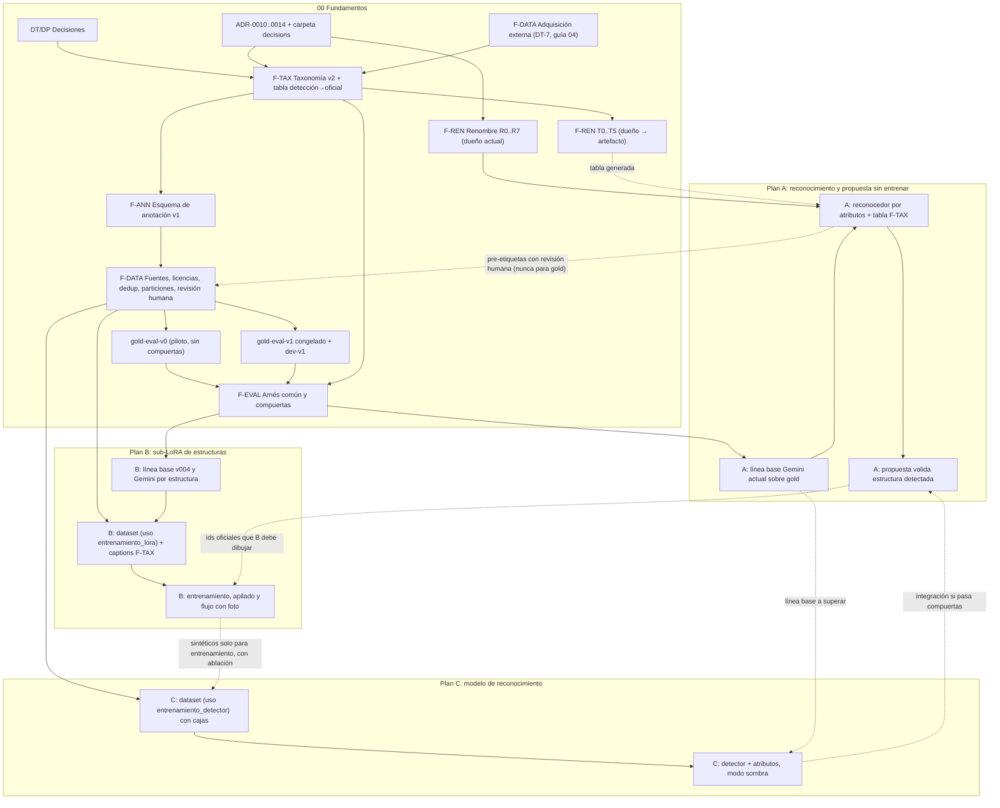
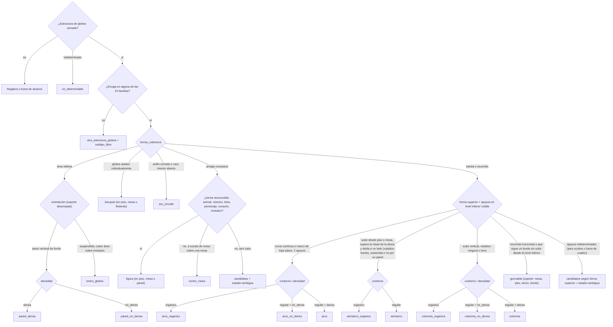

# 00 · Fundamentos compartidos: estructuras de globos (Planes A, B y C)

- **Estado:** borrador v0.2 para revisión, tras dos revisiones adversariales (dominio/datos e ingeniería/migración; ver §13). No implementa nada.
- **Fecha:** 2026-09-15. **Base de código:** rama `2026-09-14`, HEAD `1408f22`, con cambios locales sin commit en 6 archivos (ninguno toca la taxonomía).
- **Alcance de la verificación:** solo lectura. No se llamó a ningún proveedor de pago ni se escribió en la base de datos. En la revisión se inspeccionaron además imágenes locales (galería y carpeta descargada del blog de Sempertex), `deploy.yml`, `scripts/deploy-demo-decoracion.sh` y `services/ai-api/Dockerfile`.
- **Convenciones:**
  - **[H]** = hecho con evidencia (archivo:línea, commit, informe o URL).
  - **[I]** = inferencia.
  - **[P]** = propuesta que requiere aprobación.
  - Toda cifra que no sea medida lleva la etiqueta **estimación** y sus supuestos.
- **Informes de investigación usados como evidencia** (2026-09-15; hoy no están versionados, ver acción `F-ACC-01` en §10):

  | Clave de cita | Informe |
  |---|---|
  | `[crítica]` | Revisión de completitud (corrige a los demás informes) |
  | `[reconocimiento]` | Pipeline de reconocimiento de referencias |
  | `[propuesta]` | Armado del plan de decoración |
  | `[lora_infra]` | Infraestructura LoRA |
  | `[renombre]` | Mapa de impacto del renombre |
  | `[research_lora]` | Investigación LoRA FLUX.2 |
  | `[research_vision]` | Investigación de visión con Gemini |
  | `[reconocimiento_externo]` | Entrenamiento de un modelo de reconocimiento |
  | `[inventario]` | Inventario de datos |

  Cuando dos informes se contradicen, prevalece `[crítica]` si trae evidencia.

---

## 1. Propósito, alcance y uso con los Planes A, B y C

### 1.1 Propósito

Este documento es la **única fuente** de los acuerdos que comparten los tres planes sobre estructuras de globos:

1. qué estructuras existen y cómo se reconocen visualmente (taxonomía v2);
2. cómo se etiquetan las fotos (esquema de anotación v1);
3. de dónde salen los datos, con qué licencia y cómo se dividen;
4. cómo se mide cada sistema (arnés de evaluación);
5. cómo se ejecuta el renombre `*_asimetrico` → `*_organico`;
6. qué decisiones siguen abiertas y quién las toma.

Si un plan necesita cambiar algo de lo anterior, **cambia este documento**; no lo redefine en su propio texto.

### 1.2 Planes que se apoyan en este documento

| Plan | Objetivo | Qué consume de aquí |
|---|---|---|
| **A** | Mejorar el reconocimiento de estructuras sin entrenar (prompting, reglas, UX) y el armado de la propuesta | `F-TAX`, `F-REN`, set `gold-eval`, set `dev`, métricas de reconocimiento y propuesta (`F-EVAL`), contrato `prediccion-estructuras.v1`. Ejecuta el cambio del reconocedor que antes era `R4` (§6.4) |
| **B** | Entrenar e integrar un sub-LoRA de estructuras apilado con el LoRA de estilo, también en flujos con foto (FLUX.2 edit + LoRA) | `F-TAX` (vocabulario de captions), `F-ANN`, datos con uso `entrenamiento_lora`, suite `venue-inputs-v1` (§7.4), métricas de generación, compuertas de licencia |
| **C** | Entrenar un modelo de reconocimiento de estructuras | `F-ANN` (cajas y atributos), datos con uso `entrenamiento_detector`, `gold-eval`, métricas de detección; debe superar la línea base medida por A |

### 1.3 Identificadores estables

Los planes citan estos identificadores, no párrafos:

| Prefijo | Qué identifica |
|---|---|
| `DT-n` | Decisión tomada |
| `DP-nn` | Decisión pendiente |
| `F-TAX` | Taxonomía v2 (§4) |
| `F-ANN` | Esquema de anotación (§5) |
| `F-REN` | Migración del renombre (§6), con slices `R0`…`R7` (id y redacción, con el dueño actual) y `T0`…`T5` (mudanza del dueño de la taxonomía al artefacto de contrato, §6.8). Dueños: Fundamentos `R0`–`R3`, `R6`, `R7`, `T0`–`T2`, `T4`, `T5`; Plan A `R4` (A7) y `T3`; Plan B `R5` |
| `F-DATA` | Programa de datos (§7) |
| `F-EVAL` | Arnés de evaluación (§8) |
| `RSK-nn` | Riesgo (§9) |
| `ADR-00nn` | Registro de decisión (§10) |
| `Q-nn` | Pregunta para el negocio (§11) |

**Hitos de fundamentos** que los planes usan como prerrequisito:

| Hito | Contenido | Sale de |
|---|---|---|
| `F-M0` | Carpeta de ADRs recreada (restauración de los borrados solo tras confirmarlo el usuario, §10.1); ADR-0010 (taxonomía) y ADR-0011 (renombre) aceptados | §10 |
| `F-M1` | Taxonomía v2 aprobada **por clase** por al menos 2 decoradores Sempertex que clasifican a ciegas el set canónico y los casos límite con el árbol (κ entre decoradores reportado; desacuerdos resueltos en la guía). Estados por clase: `aprobada` o `provisional_sin_ejemplos`. Guía de etiquetado v1 y examen de calificación de anotadores | §4, §7.6 |
| `F-M2` | Piloto de etiquetado estratificado por pares confundibles, con acuerdo medido (emparejamiento definido en §7.5) y tasa de `ambigua`/`indeterminado` por atributo; definiciones ajustadas. Produce `gold-eval-v0` (**no apto para compuertas**) | §7.5 |
| `F-M3` | `gold-eval-v1` congelado (manifiesto con sha256) y `dev-v1` separado. Solo cuando estén cerradas `DP-02`, `DP-03`, `DP-16`, `DP-17` y las preguntas `Q-02`, `Q-03`, `Q-07`, `Q-08`, `Q-22` a `Q-26`. Cada clase con n efectivo por cluster ≥ objetivo; si no llega, se declara **sin compuerta** | §7.4, §7.7 |
| `F-M4` | Arnés común con pruebas deterministas en CI y evaluaciones offline versionadas; validado de punta a punta con `gold-eval-v0` antes de F-M3 | §8 |

**Calendario común de referencia [P] (estimación; lo usan A, B y C):** semana 0 = arranque de la adquisición externa (guía `04` §6.3, 2026-09-15). `F-M1` al final de la semana 4, `F-M2` en la 7, `F-M3` en la 11. La guía cierra la **selección** de imágenes de `gold-eval-v1` hacia la semana 8; entre la 8 y la 11 se completan doble anotación ciega, adjudicación y congelamiento. Ningún plan fija compuertas sobre `gold` antes de `F-M3`; B y C solo usan `dev-v1`/disyunción desde esa fecha. Un retraso del embudo de permisos desplaza `F-M3` 1:1.

**Dueños únicos de paquetes compartidos:** creación de `gold-eval-v0/v1` y `dev-v1` → Fundamentos (§7.5); adquisición externa de imágenes → Fundamentos (§7.7, guía `04`), con requisitos de B (B2.3) y C (C1.4); herramienta de etiquetado → `DP-08` (la guía `04` §5.3 y C solo aportan insumos); arnés y proyecto de métricas → `F-M4` (§8.5; cada plan aporta su runner); tabla de precios fechada → §8.6; línea base Gemini de **reconocimiento** → Plan A (A0.4), que C reutiliza; línea base de **generación** (Gemini imagen, v004) → Plan B (B1).

### 1.4 Reglas de uso

1. Cada plan declara la versión de este documento y el `taxonomy_version` que usa.
2. Un cambio de definición de clase sube `taxonomy_version` (§4.9) e invalida las métricas comparadas entre versiones, salvo que se re-etiquete.
3. Ningún plan entrena, ajusta prompts ni fija umbrales usando `gold-eval`. Para iterar existe `dev` (§7.4).
4. Toda decisión arquitectónica derivada se registra como ADR (§10), como exige `AGENTS.md` ("Record significant architectural decisions under `docs/architecture/decisions/`").

### 1.5 Diagrama de dependencias



---

## 2. Decisiones

### 2.1 Decisiones tomadas (usuario, 2026-09-15; vinculantes)

| Id | Decisión | Consecuencia para los fundamentos |
|---|---|---|
| **DT-1** | Renombrar en todo el producto: `arco_asimetrico`→`arco_organico`, `semiarco_asimetrico`→`semiarco_organico`, `columna_asimetrica`→`columna_organica`, y la redacción "asimétrico/a" → "orgánico/a" | §6. **[P] Interpretación a confirmar (`DP-05`):** aplica al concepto *variante oficial*. Los otros dos usos de "asimétrico" son geometría literal y no la variante: `distribucion: "asimetrica"` de relaciones físicas (`src/lib/plan/composicion.ts:116`) y `symmetry: "asymmetric"` de la composición de la imagen (`contracts/domain/v1/reference-blueprint.schema.json:743`, `contracts/chat/v1/request.schema.json:893`) `[renombre §0.1]` |
| **DT-2** | Significado de negocio de "orgánico": *"estructura de globos asimétrica, que usualmente se adapta al espacio y/o imita estructuras de la naturaleza"*. La mezcla de tamaños es frecuente pero **no** define la clase | `mezcla` (`clasica`, `organica_fina`, `organica_gruesa`, `solo_grandes`; `src/lib/plan/tipos.ts:35`) queda como eje **independiente**. El factor ×0,7 de las variantes (`anchoFinalBanda: 0.4` en `src/lib/plan/estructuras-oficiales.ts:84,87`; `src/lib/medidas/geometria.ts:227`) se considera **no calibrado** y debe revisarse con evidencia. Según el usuario, los pedidos orgánicos reales sugieren más globos, no menos; la evidencia numérica disponible no separa variantes y se trata en `DP-07` |
| **DT-3** | Alcance: las **16** estructuras oficiales desde el inicio: `arco`, `arco_organico`, `arco_no_denso`, `semiarco`, `semiarco_organico`, `columna`, `columna_organica`, `columna_no_densa`, `pared_densa`, `pared_no_densa`, `guirnalda`, `centro_mesa`, `bouquet`, `figura`, `aro_circular`, `techo_globos` | Cierra la ambigüedad 14 frente a 16 (ADR 0008 borrado: "las 14 pedidas más aro circular y techo de globos", `git show 67ea5b1:docs/architecture/decisions/0008-catalogo-interno-estructuras-oficiales.md`) `[crítica §1.8]`. Las estructuras Sempertex fuera de las 16 (canopy, topiario, malla, esfera, marco de foto, corazón orgánico `[crítica §2.1]`) se anotan como `otra_estructura_globos` y no se fuerzan (§4.2). El "arco filigree" del blog es un arco clásico, simétrico y denso con adornos de globos 260 (imagen `boda/arco-filigree.jpg` de la carpeta descargada), así que se anota `arco` con `adornos` (§4.1), no como otra estructura |
| **DT-4** | El sub-LoRA de estructuras, apilado con el LoRA de estilo Sempertex, debe soportar las 16 desde el inicio según buenas prácticas **y** generar también cuando el cliente sube una foto de referencia o del lugar (FLUX.2 edit + LoRA) | Hoy los flujos con foto usan Gemini imagen y el LoRA se rechaza con foto (§3.2). El régimen `/edit` nunca se midió (`src/lib/ia/sempertex-lora.ts:207-231`). El arnés debe incluir suites con foto de entrada (§8.4) |
| **DT-5** | Verdad terreno: la IA pre-etiqueta (Gemini o Claude) y un humano revisa y corrige | §7.5: pre-etiquetas versionadas y en dos etapas; en `gold_eval` la pre-etiqueta sale de una familia de modelos que no está bajo evaluación y la segunda anotación es siempre ciega; subconjunto ciego en el resto y doble anotación con acuerdo medido |
| **DT-6** | Se construyen tres planes sobre esta base: **A** (reconocimiento y propuesta sin entrenar), **B** (sub-LoRA y su integración, incluidos los flujos con foto), **C** (modelo de reconocimiento entrenado) | Estructura de este documento |
| **DT-7** (2026-09-15) | *"Todas las imágenes de entrenamiento y evaluación de las 16 estructuras vendrán de fuentes externas (no fotos propias ni de Sempertex) para tener variedad y diseños más elaborados."* | Se operacionaliza con `04-guia-fuentes-externas.md` (§7.1): **base** = permiso escrito del titular (decorador o fotógrafo); **complemento** = archivos CC0/PDM/CC BY verificados uno a uno, sesiones o encargos pagados en eventos reales y licencias de datos pagadas para los huecos. Instagram, Pinterest, TikTok y Google solo sirven para **encontrar autores**. Excluidos, **también para evaluar**: stock con licencia estándar, Unsplash, Pexels/Pixabay sin permiso, CC NC/ND, marcas de agua, personajes con licencia y menores identificables. **Manifiesto de procedencia por imagen obligatorio** (fal hace responsable al cliente de los derechos del input). Las fuentes internas (fotos Sempertex propias, órdenes v007, blog y Pinterest Sempertex, `web-NNN`, pseudo-órdenes, `structure-v001`, galería) **no** se usan para entrenamiento, `dev` ni `gold_eval`; como mucho, como referencia para diseñar la guía si sus derechos lo permiten, y se deduplica contra ellas. Los decoradores Sempertex pueden seguir actuando como revisores y adjudicadores (F-M1, `DP-11`) |

### 2.2 Decisiones pendientes

Los dueños son sugeridos. "Negocio" = usuario o responsable comercial; "Decorador" = decorador Sempertex designado; "Técnico" = responsable técnico del repo.

| Id | Decisión | Opciones y recomendación **[P]** | Dueño sugerido | Fecha límite relativa |
|---|---|---|---|---|
| **DP-01** | Dónde vive el dueño único de la taxonomía y de la tabla detección → oficial | Recomendado: artefacto de datos versionado + JSON Schema + vectores dorados como dueño, con **un único evaluador de referencia** (el generador) que precalcula la tabla completa; cada runtime (Python, TS, exportador de anotación) solo busca por clave (§4.8). Alternativas en §4.8 | Técnico | Antes de `F-M0` (ADR-0010) |
| **DP-02** | Precedencia cuando coinciden contorno orgánico y densidad no densa, y trato de combinaciones sin clase (p. ej. semiarco no denso) | Recomendado: se registran ambos atributos, la clase la decide la tabla con precedencia explícita (hoy gana la asimetría, `estructuras-oficiales.ts:163`) y se marca `combinacion_sin_clase` | Decorador + Negocio | Antes de `F-M1` |
| **DP-03** | Fronteras semiarco / columna / guirnalda (voladizo superior, pieza que trepa un panel), arco / aro (cobertura mínima del anillo), y si "dos apoyos" y "hueco visible = dos instancias" son reglas de negocio (hoy vienen de prompts del código, `reference-structure.ts:64` y `estructuras-oficiales.ts:228`) | Decidir con imágenes canónicas y con `Q-22` a `Q-24`; umbrales ordinales versionados en la tabla, sin fijar números antes de ver ejemplos | Decorador + Negocio | Antes de `F-M1` |
| **DP-04** | Vocabulario en inglés de "orgánico", "regular" y la mezcla de tamaños para los captions del sub-LoRA | Mantener el dialecto `scene_v004` y los sustantivos actuales mientras v004 esté en producción; vocabulario nuevo solo para el sub-LoRA, evaluado por A/B (§6.6) | Dueño del Plan B | Antes de escribir captions del dataset de entrenamiento del sub-LoRA |
| **DP-05** | ¿El renombre incluye los conceptos B (distribución) y C (simetría de composición)? | Recomendado: **no**; solo la variante oficial y su redacción al cliente (§6.1) | Negocio (confirma) + Técnico | Antes de `R2` |
| **DP-06** | Estrategia de versión del contrato para el renombre y política de retiro de valores | Recomendado: alias aditivo en v1 (§6.3). Retirar los valores obsoletos del enum en v1 solo se acepta con consumidor interno único, contador de ids obsoletos en 0 en ambos servicios y traducción a `PROPUESTA_DESACTUALIZADA`; alternativa: aceptar y canonizar para siempre. Se fija en ADR-0011 | Técnico | Antes de `R2` |
| **DP-07** | Factor ×0,7 de variantes orgánicas: mantener temporalmente, anular o invertir | El renombre conserva los números (sin cambio de cotización); la recalibración es un cambio aparte con evidencia de órdenes etiquetadas por variante (ADR aparte). Evidencia hoy: subconteo **general**, no atribuible a la variante: mediana de arco 174 globos comprados en órdenes (n=16) contra 118 en planes (n=101), con compras que incluyen merma y medidas distintas `[propuesta §4]` | Negocio + dueño de geometría | Antes de cualquier cambio de geometría; no bloquea `R2` |
| **DP-08** | Herramienta de etiquetado | Label Studio Community o CVAT Community autoalojados; Roboflow solo si se acepta alojar datos fuera `[reconocimiento_externo §4]`. La clase derivada se calcula al exportar con el evaluador de referencia (§7.5), no con lógica propia de la herramienta | Técnico | Antes de `F-M2` |
| **DP-09** | Almacenamiento de imágenes y manifiestos | Manifiestos versionados en git sin imágenes; imágenes en almacenamiento privado con versionado y cifrado (§7.8) | Técnico + Negocio (privacidad) | Antes de ingerir la primera fuente |
| **DP-10** | ~~Licencia y consentimiento por fuente interna (órdenes de clientes, blog Sempertex, pseudo-órdenes `950000xxx`)~~ **Resuelta por DT-7** para entrenamiento y evaluación: las fuentes internas no se ingieren. Queda abierto: plantilla de permiso escrito validada por abogado (guía §4.3, §7.2), contraprestación a titulares (guía §4.5) y licencia de v004 (`DP-14`) | Compuertas por tipo de fuente externa en §7.1 y guía §2 | Negocio + asesoría legal | Plantilla antes de enviar el primer contacto (semana 0 de la guía) |
| **DP-11** | Quién revisa (decoradores, equipo interno o proveedor) y cuántas horas hay | Revisión por personas con criterio de oficio que aprueben el examen de calificación; ≥2 decoradores para F-M1; adjudicación por decorador que no haya montado ni fotografiado la pieza adjudicada | Negocio | Antes de `F-M2` |
| **DP-12** | Matriz de costo del error y si se puede cotizar "a confirmar" | Propuesta provisional en §4.6 | Negocio | Antes de que A diseñe las preguntas al cliente |
| **DP-13** | Presupuesto de llamadas pagas: pre-etiquetado, líneas base fal/Gemini, evaluaciones | Presupuesto por corrida con costo estimado previo y reportado posterior (§8.6) | Negocio | Antes de la primera corrida paga |
| **DP-14** | Base de estilo para apilar: v004 (licencia `pending`) u otro estilo | Cerrar la licencia de v004 o entrenar un estilo nuevo `[lora_infra §2.2]` | Negocio + dueño del Plan B | Antes de entrenar en B |
| **DP-15** | Proveedores de pre-etiquetado y de evaluación, y términos de tratamiento de datos (enviar fotos a Gemini, Claude o fal) | Toda imagen que se envíe a un proveedor externo (pre-etiquetado, evaluación, entrenamiento en fal o entrada de generación) exige el uso correspondiente en `usos_permitidos` y `cubre_envio_a_proveedores_ia=true` (§5.2). En `gold_eval`, la familia que pre-etiqueta no puede ser la evaluada en la compuerta | Negocio + Técnico | Antes de enviar cualquier imagen a un proveedor |
| **DP-16** | Niveles de densidad visual | Recomendado: `densa`, `no_densa`, `indeterminada`; el `medium` del detector deja de heredar la densidad global (`reference-structure.ts:187`) | Decorador + Técnico | Antes de `F-M1` |
| **DP-17** | Contrato de salida del reconocedor: id oficial único, o atributos + candidatos + estado | Recomendado: atributos + `candidatos[]` + `estado` (`estable`, `ambigua`, `confirmada_cliente`) y el id derivado por la tabla `[research_vision §6]` | Dueños de A y C | Antes de iniciar A1 |
| **DP-18** | Hacer obligatorio `estructura_oficial` en planes nuevos con estructuras de globos (hoy es opcional, `tipos.ts:105`) | Evita que un nombre "Arco orgánico" sin campo se cotice como base (§6.6). Recomendado: obligatorio **solo** en el esquema de la herramienta (`herramientas.ts`) y en un validador de `confirmar_plan_decoracion`; el campo sigue opcional en `plan-decoracion.v1` para no romper la revalidación de planes firmados en `/api/generate` y `/api/plan-editar` | Técnico + dueño de A | Antes de `R3` |
| **DP-19** | Nombre interno de `forma`: hoy `"asimetrica"` convive con `"organica"` de `guirnalda` y `pared_no_densa` (`estructuras-oficiales.ts:19,92-93`) | Recomendado: separar `contorno` (`regular`/`organico`) de `forma` y re-expresar el `"organica"` actual como forma libre, después de revisar sus consumidores (`lora-caption-compiler.ts:972-975`) `[renombre §4.6]`. Si cambia el texto compilado de `product_v007`, se sube `LORA_CAPTION_COMPILER_VERSION` | Técnico | Antes de `R3` |
| **DP-20** | Dueño y tabla de la derivación de atributos observados hacia campos del plan: `mezcla_tamanos` + `rango_tamanos` → `mezcla`, `soporte` + `lado` → `ubicacion`, `grupo_piezas_identicas` → `repeticiones`, densidad visual → densidad comercial | Recomendado: la misma tabla de datos de `F-TAX` con vectores dorados (§4.10); el validador del Plan A la consume y no la reimplementa | Técnico + Decorador | Antes de iniciar A2 |
| **DP-21** | Proporciones objetivo por estrato en `gold_eval` (tope de fotos de estudio sobre fondo liso, mínimo de fotos de celular o escena real) y volumen y fuente de `venue-inputs-v1` | Fijar tras medir el embudo de fuentes externas (guía §6.2, semanas 1–2); la guía propone ≥25 % de fotos de celular en evaluación [P]; métricas reportadas por estrato | Negocio + dueños de A y B | Antes de `F-M3` |

---

## 3. Estado actual verificado (resumen con evidencia)

### 3.1 Cuatro taxonomías que no coinciden

| Taxonomía | Valores | Dónde | Observación |
|---|---|---|---|
| Detector de referencias (Gemini) | **11**: `arch`, `half_arch`, `column`, `garland`, `balloon_wall`, `centerpiece`, `ceiling_installation`, `cluster`, `sculpture`, `bouquet`, `hoop` | `src/lib/ia/reference-structure.ts:16-19` | Atributos: `outline` (2 valores, `:20`), `density` (3 valores, `:21`) y `top_overhang` (`:26`). La estructura oficial se infiere **después** con regex sobre texto (`estructuras-oficiales.ts:147-179`) `[reconocimiento §2.6]` |
| Estructuras oficiales del plan | **16** | `src/lib/plan/estructuras-oficiales.ts:24-32` | Dueño único según ADR 0008. Se exporta al contrato como `allOf` y `x-geometria-estructuras-oficiales` (`scripts/export-domain-contract-schemas.ts:67,73`) |
| Dataset `structure-v001` | **7**: `arco`, `semiarco`, `guirnalda`, `columna`, `bouquet`, `backdrop`, `instalacion_completa` | `src/lib/lora/schema.ts:6-14` | 0 imágenes de semiarco; mapea `aro-metalico→arco`; nunca se entrenó `[lora_infra §5.1]` |
| Anotaciones `annotation.v007` | **10**: `backdrop`, `columna`, `kit`, `centro_mesa`, `arco`, `guirnalda`, `bouquet`, `accesorio`, `semiarco`, `pared` | `data/staging/lora-v007/anotaciones/*.json` (361, versionadas por `.gitignore:66-72`) | Sin caja, densidad ni contorno por estructura; `symmetry` es de la escena `[lora_infra §5.2]` |

Además, las restricciones del cliente reconocen solo 7 alias de estructura (`src/lib/plan/restricciones.ts:16-24`) y no incluyen bouquet, figura, aro ni techo `[propuesta §2.6]`.

**[I]** No hay un dueño único de "detección → estructura oficial" que sirvan a la vez el reconocedor, el plan, los captions del LoRA y la anotación `[crítica §3.4]`.

### 3.2 Qué motor genera la imagen en cada flujo

| Flujo | Motor | Evidencia |
|---|---|---|
| Propuesta sin fotos, modo usuario con selector LoRA | FLUX.2 [dev] + LoRA v004 vía `fal-ai/flux-2/lora` (texto a imagen) | `src/lib/estado/modo-vista-reglas.ts:36-40`; `[lora_infra §3.1]` |
| Con foto del lugar, referencias o ajuste de imagen (modo usuario) | Gemini imagen (`gemini-3.1-flash-image` en `ai_call_log`) | `modo-vista-reglas.ts:39`; `[crítica §1.1]` (consulta de solo lectura a Neon) |
| Modo dev con LoRA y foto | Rechazado en servidor: "LoRA Sempertex genera desde texto…" | `src/app/api/generate/route.ts:1099-1100` |
| `/edit` con LoRA | Solo con `SEMPERTEX_LORA_EDIT=true`; experimental y nunca medido | `src/lib/ia/sempertex-lora.ts:207-231` |
| Reconocimiento de referencias | Puerto de chat de Gemini; `GEMINI_CHAT_MODEL`, con `gemini-3.6-flash` por defecto (el valor de producción no está en el repo) | `packages/agente-core/src/gemini/chat.ts:27`; `[crítica §4.7]` |
| QA de imagen | Observador Gemini con `sustantivoEn` oficial | `src/lib/ia/image-qa.ts`; `[renombre §2.6]` |
| Apilado de LoRA | Bloqueado: `LORA_MULTI_UNSUPPORTED`; también en `compatibility.ts:25` y `schema.ts:79-83`; retirado en `d239467` | `sempertex-lora.ts:233-235`; `[lora_infra §4]` |

Hay un efecto cruzado: el chat restringe el catálogo al pool del slot LoRA (`loraMode: training_1`) incluso cuando la imagen la hará Gemini (`src/app/page.tsx:1005`; `src/app/api/chat/route.ts:212-224`). Es una causa candidata de parte de los 165 `SIN_COBERTURA` `[crítica §1.2]`, `[propuesta §6]`.

### 3.3 LoRA de estilo en producción

- **[H]** Es `lora-run-v004-1000`: trigger `eventdecor_style_v2`, **154 imágenes**, 1000 pasos, lr 5e-5, rank 16. Aprobado con `lora-eval-v1` 6/6 a escala 0,8.
  - Ocupa los slots `unlimited` y `training_1`.
  - **Licencia `pending`** en BD.
  - Evidencia: `[lora_infra §1.1, §2.2]`, `[crítica §1.3]`. El comentario de `sempertex-lora.ts:210-212` coincide ("154 captions de escena… 6/6 a escala 0,8 y 1,0").
- **[H]** `DEFAULT_SEMPERTEX_LORA_TRIGGER = "eventdecor_style_v3"` (`sempertex-lora.ts:16`) es solo el respaldo del preflight. El trigger v3 corresponde a v007, que fue **rechazado** (0/6) `[crítica §1.3]`.
- **[H]** v004 solo se evaluó con un panel de composición (arco, dos columnas, mesa). No hay medición del LoRA en 14 de las 16 estructuras. La línea base "aro por arco 5/12" se midió con **Gemini** imagen, no con FLUX + LoRA `[crítica §1.4]`.

### 3.4 Datos disponibles por clase (ninguno con revisión humana)

Las cifras son **indicios** derivados de etiquetas de modelos y de regex sobre su texto, que pueden sobrecontar o subcontar; **no** son verdad terreno ni pisos.

| Estructura oficial (id nuevo) | v007: imágenes en el ZIP de 336, con variante inferida por regex `[lora_infra §5.4]` | v007 tras dedup d≤2 (clase base) `[inventario §4]` | `structure-v001` (114) | Galería Pexels, salida de Gemini `[reconocimiento §6]` | Etiqueta explícita de la variante en alguna fuente |
|---|---|---|---|---|---|
| `arco` | 66 | 68 | 37 (incluye aro metálico) | 0 | solo "arco" genérico |
| `arco_organico` | 1 | — | 0 | 1 | no |
| `arco_no_denso` | **0** | — | 0 | 0 | no |
| `semiarco` | 5 | 11 (clase base) | 0 | 0 | genérica |
| `semiarco_organico` | 6 | — | 0 | 0 | no |
| `columna` | 73 | 68 | 11 | 0 | genérica |
| `columna_organica` | 5 | — | 0 | 9 (sesgadas, ver §3.5) | no |
| `columna_no_densa` | **0** | — | 0 | 0 | no |
| `pared_densa` | 41 | 40 ("pared" sin densidad) | 0 (muro→backdrop) | 1 | no |
| `pared_no_densa` | 1 | — | 0 | 0 | no |
| `guirnalda` | 92 | 103 | 65 | 2 | sí |
| `centro_mesa` | 11 | 12 | 0 (→bouquet) | 1 | sí |
| `bouquet` | 125 | 121 | 20 | 0 | sí |
| `figura` | 15 + 15 candidatas (kit / accesorio) | — | 0 | 0 (mosaico rechazado) | no |
| `aro_circular` | 7 | — | 0 | 1 | no |
| `techo_globos` | **0 confirmadas**; 11 + 5 indicios (guirnaldas y bouquets con `placement=techo`) que, por la ficha de `guirnalda` (§4.5), probablemente son `guirnalda` | — | 0 | 0 (salió `pared_densa`) | no |

Notas:
- **[H]** Los conteos de instancias por tipo difieren entre informes (p. ej. bouquet 190 contra 147), porque uno suma el campo `count` y el otro cuenta entradas `[lora_infra §5.3]`, `[inventario §1.1]`.
- **[H]** Hay fuga entre fuentes: 43 pares casi idénticos `950000xxx` ↔ `web-NNN` están los dos dentro del ZIP de v007. En 11 de 26 duplicados exactos (d=0), los dos modelos anotadores asignaron tipos distintos `[inventario §3]`.
- **[H]** 264 de 336 imágenes de v007 y 53 de 114 de `structure-v001` tienen el lado menor por debajo de 1024 px, el mínimo que pide fal `[crítica §1.6]`.
- **[H]** `Downloads/referencias-estructuras/` (16 imágenes de Pinterest y tiendas) no tiene licencia. Su README lo advierte, y sus nombres en inglés son ambiguos: `semi_arch_02` es un arco completo `[crítica §2.4]`.

### 3.5 Sin verdad terreno humana y con sesgo observado

- **[H]** No existe un set etiquetado de forma independiente, ni P/R por estructura, ni arnés de N corridas, ni IoU de cajas `[reconocimiento §5.3]`.
- **[H]** Los 10 análisis de la galería (`src/lib/ia/analisis-ejemplos.json`) son salidas de Gemini. El commit `4bdb5c5` cambió títulos humanos "Semiarco(s)" por "Columna(s)" para que coincidieran con el modelo `[reconocimiento §5.3]`, `[crítica §1.8]`.
- **[H]** En esos 15 elementos de globos aprobados:
  - 14 de 15 salen `asymmetrical` y 15 de 15 con densidad `lujosa`;
  - 9 de 15 terminan en `columna_asimetrica`, con cajas de ancho/alto entre 0,40 y 1,05;
  - 10 de las 16 oficiales nunca aparecen `[reconocimiento §6]`.
- **[H]** La regla `top_overhang: slight` → columna **fuerza** `outline: asymmetric` (`reference-structure.ts:85,92`).
- **[H]** Ningún validador compara la estructura del plan con la detectada `[reconocimiento §2.8]`, `[propuesta §2.12]`.

### 3.6 Configuración de Gemini: contradicción de fuentes sin resolver

- **[H]** El análisis corre con `temperatura: 0` en los dos pases (`src/lib/ia/analizar-referencias-v2.ts:592,603`).
- **[H]** La guía de Gemini 3 recomienda dejar la temperatura en 1,0 (https://ai.google.dev/gemini-api/docs/gemini-3). La guía de function calling recomienda una temperatura baja (p. ej. 0) (https://ai.google.dev/gemini-api/docs/generate-content/function-calling) `[crítica §1.7]`.
- **[H]** El análisis hereda `GEMINI_CHAT_THINKING_LEVEL` (`src/lib/ia/registro.ts:63-73`), no fija el modo de llamada a funciones y no lee `finishReason` `[research_vision §0]`.
- **[I]** Solo se resuelve midiendo con N corridas sobre `dev` (lo hace el Plan A con el arnés de §8).

### 3.7 Estado de fal: incierto

- **[H]** `ai_call_log` registra `fal`:
  - 2 ok el 2026-09-09;
  - 18 errores el 2026-09-15 entre 01:48 y 06:44 UTC;
  - **1 ok** el 2026-09-15 a las 13:47 UTC.
- **[H]** La tabla no guarda el código de error `[crítica §1.5]`. El README documenta saldo agotado durante la iteración 4 `[lora_infra §6]`.
- **[I]** No se puede afirmar que hoy falte saldo. Hay que confirmarlo con `billing/user_balance` antes de dar por bloqueado el Plan B.

### 3.8 Carpeta de ADRs ausente

- **[H]** `docs/` contiene `planes-recuperados/` (vacía) y `docs/planes/` (este documento); no hay carpeta de ADRs. Los ADR `0001`–`0009` existen en `67ea5b1` (`git ls-tree -r 67ea5b1 docs/architecture/decisions/`) y se borraron en `c7facf3` ("limpieza de documentación"). Ese commit borró además otras dos series (`docs/adr/001-scene-program-and-provenance.md`, `docs/decisions/adr-001-provider-model.md`), `decision-log.md`, `contracts/README.md` (política de congelamiento de contratos) y `contracts/domain/v1/golden/plan-resolution/README.md` (procedimiento `--update`).
- **[H]** El ADR 0008 se contradice: la "Decisión" dice que la variante no cambia la cotización y las "Consecuencias" aplican ×0,7 `[crítica §1.8]`.

### 3.9 Pruebas que protegen la taxonomía y no corren en CI

- **[H]** `scripts/test-estructuras-oficiales.ts` no tiene script npm.
- **[H]** `ia:test-lora-compiler`, `lora:test-product-runtime`, `ia:test-qa-piezas-separadas` y `ui:test-presentacion-plan` no están en `plan:test` (`package.json:139`) ni en `.github/workflows/checks.yml` `[renombre §0.7, §2.9]`.
- **[H]** La paridad cruzada TS↔Python (`plan:test-paridad-python`) tampoco está en CI, aunque pasa 19/19 localmente `[propuesta §1.10]`.

### 3.10 Despliegue y cadena de contratos (restricciones para la migración)

- **[H]** `deploy.yml` se dispara cuando `Quality checks` termina bien en `main` y ejecuta por SSH `deploy-demo-decoracion.sh <sha>`, que construye y reemplaza **solo** el contenedor `demo-decoracion` (Next) (`scripts/deploy-demo-decoracion.sh:32-45`). ai-api se construye a mano en el servidor "desde el mismo commit" (`README.md:53`). El pipeline **no ordena** servicios: todo commit que llega a `main` despliega Next primero.
- **[H]** Los JSON Schema de dominio se generan desde Zod: `scripts/export-domain-contract-schemas.ts` importa `DomainContractSchemas` y las reglas de `estructuras-oficiales.ts`; `contracts:check` corre en CI (`checks.yml:26`). Cambiar el enum del contrato exige cambiar el Zod de Next en el mismo commit.
- **[H]** Python recibe los contratos **incrustados** en `generated_models.py` (`plan.py:86` usa `contract_schema("PlanDecoracion")`). `services/ai-api/Dockerfile` solo copia `app` (`COPY app ./app`): `contracts/` no existe dentro de la imagen. `generate_models.py` exige exactamente 39 esquemas (`:53-54`).
- **[H]** `/readyz` de ai-api hoy solo responde `{"status": "ready"}` (`services/ai-api/app/main.py:931-956`); no anuncia versión de contrato.
- **[H]** `test-analisis-ejemplos.ts:46` falla si `ANALYSIS_PARSER_VERSION` no coincide con el análisis fijo; subir la versión obliga a regenerar `analisis-ejemplos.json` con llamadas pagas.
- **[H]** El resolver TS es la reversión (`PYTHON_BACKEND_ENABLED=false`, ADR 0006 borrado), atiende `plan-editar`/`generate` de planes "next" y lo fuerzan las E2E deterministas (`scripts/test-segunda-e2e-backend.ts:20-21`). `calcularMedidas` busca la geometría con `esEstructuraOficialId(...)` (`geometria.ts:226`) y `incoherenciasEstructuraOficial` rechaza ids fuera de la lista (`estructuras-oficiales.ts:125`).

---

## 4. Taxonomía v2 de estructuras (`F-TAX`)

> Las definiciones son **[P]** hasta que al menos dos decoradores Sempertex las aprueben por clase con imágenes canónicas (`F-M1`). Ningún umbral numérico nuevo se fija aquí. Los ordinales existentes (`top_overhang`: <10 %, 10–35 %, >35 % "compared with the piece height", `reference-structure.ts:56`) se conservan como punto de partida calibrable, no como verdad.
>
> **Regla sobre ejemplos:** ninguna imagen se elige como canónica por su slug, título o nombre de tienda. Las imágenes cuyo nombre sugiere una clase (p. ej. los `*-organico-*` del blog o los títulos de la galería) entran como **casos límite con decisión escrita**. Motivo verificado: en la carpeta descargada del blog, `boda/arco-organico-dorados.jpg` tiene un solo extremo abajo (forma de semiarco), `boda/arco-organico-mr-y-mrs.jpg` sube por un lado, cruza arriba y deja un hueco antes de un racimo separado, y `halloween/mesa-con-arco-organico-calabazas.jpg` es un marco de tope plano casi espejable con mezcla de tamaños.

### 4.1 Ejes independientes

Cada instancia se describe con ejes separados. La estructura oficial se **deriva** de ellos; no se etiqueta a mano sin los ejes.

| Eje | Valores | Qué observa | Qué NO es |
|---|---|---|---|
| `familia` | `arco`, `semiarco`, `columna`, `pared`, `guirnalda`, `centro_mesa`, `bouquet`, `figura`, `aro`, `techo` (10 familias), más `otra_estructura_globos` y `no_determinable` | Forma de cobertura y geometría gruesa; el soporte solo desempata (árbol de §4.4) | — |
| `forma_cobertura` | `area_rellena`, `banda_o_recorrido`, `arreglo_compacto`, `globos_atados_individuales`, `anillo`, `indeterminada` | Primer corte del árbol (§4.4) | El soporte |
| `contorno` | `regular`, `organico`, `indeterminado` | La silueta de la pieza completa según la prueba de silueta (§4.3) | La textura a escala de globo que produce la mezcla de tamaños |
| `envolvente_irregular` | `si`, `no`, `indeterminado` | Racimos que sobresalen de la envolvente, tramos que se afinan, extremos en "cola" | **No decide** el contorno (§4.3); se registra para estudiar su relación con "orgánico" |
| `densidad` | `densa`, `no_densa`, `indeterminada` (`DP-16`) | Si se ve el fondo *a través* de la estructura en huecos repartidos a lo largo de la mayor parte de la pieza. **Provisional:** la definición viene de la descripción del código ("Arco ligero, con espacios entre los globos", `estructuras-oficiales.ts:85`), no del negocio, y hay 0 ejemplos (`Q-25`) | La densidad comercial del plan (`sencilla`, `media`, `lujosa`, λ 2,8 / 3,6 / 4,5; `geometria.ts:22-25`) |
| `mezcla_tamanos` | `uniforme`, `mixta`, `graduada`, `indeterminada` | Si los globos son de un solo diámetro, de varios sin orden, o graduados | La variante orgánica (DT-2) |
| `rango_tamanos` | lista de `pequenos`, `medianos`, `grandes`, `gigantes`, o `indeterminado` | Qué tamaños relativos aparecen (a ojo, contra la escala de la escena) | Diámetros exactos; permite derivar `mezcla` (§4.10) |
| `adornos` | lista de `globos_260_modelados`, `follaje_o_flores`, `foil_adosado`, `ninguno` | Elementos que acompañan la pieza sin cambiar su familia (p. ej. el "arco filigree" con 260) | Una familia distinta |
| Lado y curva | `lado` derivado del centro de la caja (`sideFromBBox`: <0,4 izquierda, >0,6 derecha; `reference-structure.ts:120-123`); `curva_hacia` etiquetada (`izquierda`, `derecha`, `ninguna`, `no_aplica`) | Posición en la imagen; dirección intrínseca de la curva | El lado no se etiqueta, se deriva `[reconocimiento_externo §2.3]` |
| Apoyo y soporte | `apoyos_en_piso` (0, 1, 2, `indeterminado`); `soporte` (`piso`, `mesa_superficie`, `techo`, `pared_plano`, `flota_con_peso`, `adosada_a_estructura`) | Dónde nace y se sostiene la pieza. "Piso" = **nivel de apoyo inferior visible** (piso, tarima, base o, en fotos de estudio sin piso, el borde inferior de la pieza). Si los pies están ocultos por mesa, muebles o encuadre: `indeterminado` | La ubicación comercial del plan (`ubicacion`), que se deriva |
| `voladizo_superior` | `ninguno`, `leve`, `fuerte`, `no_aplica`, `indeterminado` | Desplazamiento horizontal entre el **eje de la banda** en la base y el extremo superior del eje, dividido por la altura de la pieza (no entre bordes, para que el grosor de banda no lo infle). A ojo, con 2–3 imágenes ancla por valor en la guía; umbrales de partida <10 %, 10–35 %, >35 % | La inclinación como señal de contorno |
| Relación con el espacio | `adapta_al_espacio` (sí, no, indeterminado) + `elemento_del_espacio`; `motivo_natural` (sí, no, indeterminado) | Si la pieza sigue, rodea, trepa o cambia de dirección siguiendo un elemento del lugar; si evoca enredadera, rama, nube u ola | No bastan por sí solos para declarar orgánico (§4.3) |

**Keypoints opcionales** (obligatorios solo en `gold_eval` para arco, semiarco y columna): `pie` (uno por apoyo visible) y `cima` (extremo superior del eje). Permiten recalcular `voladizo_superior` y `apoyos_en_piso` y auditar desacuerdos `[reconocimiento_externo §2.1]`.

**Reconciliación de densidad [P]:**

| Valor del detector (`reference-structure.ts:21`) | Densidad visual v2 | Densidad comercial admitida en el plan |
|---|---|---|
| `dense` | `densa` | `media` o `lujosa` |
| `airy` | `no_densa` | `sencilla` (así lo exigen `arco_no_denso`, `columna_no_densa` y `pared_no_densa`, `estructuras-oficiales.ts:85,90,92`) |
| `medium` | `indeterminada` | No se infiere. Hoy hereda la densidad global de la composición (`reference-structure.ts:187`); la v2 lo prohíbe |

Queda abierta una ambigüedad del catálogo: `arco` admite cualquier densidad (sin `densidades` en `:83`), así que un `arco` con `sencilla` se solapa con `arco_no_denso` `[propuesta §4]`. Se resuelve en `DP-02`/`DP-16`.

### 4.2 Negativos y fuera de taxonomía

- **Negativos (no son estructura de globos):**
  - globos sueltos en el piso;
  - globos aerostáticos, cometas y burbujas (regla vigente, `reference-structure.ts:64`);
  - arcos florales;
  - telas, cortinas y paneles (`backdrop`);
  - aros metálicos sin globos (en v007 el aro desnudo es `accesorio`, `anotar-dataset-v007.ts:287` de la rama hermana `[lora_infra §5.2]`);
  - guirnaldas de luces.
- **Piezas híbridas de globos con flores o follaje [P, `Q-26`]:** son estructura de globos si los globos forman la mayor parte del volumen visible de la pieza; el follaje o las flores se registran en `adornos`. Un arco floral sin globos, o con globos como acento menor, es negativo. Son frecuentes: `ejemplo-01.jpg` de la galería lleva flores y `boda/arco-organico-mr-y-mrs.jpg` del blog lleva follaje.
- **`otra_estructura_globos`:** estructuras reales de globos fuera de las 16 (canopy, topiario, malla Link-O-Loon, esfera, marco de foto). Se guarda un `subtipo_libre` para que el negocio decida si se incorporan en una versión futura de la taxonomía. **Nunca se fuerzan a una de las 16.** El "arco filigree" no entra aquí: es `arco` con `adornos=globos_260_modelados` (DT-3).
- **`no_determinable`:** oclusión, desenfoque o recorte que impiden decidir. Es válida y no penaliza `[research_vision §2]`.

### 4.3 Definición operativa de "orgánico" (DT-2)

> **Condicionada a `Q-02`.** Esta definición es **[P]**. Si el negocio responde que una pieza simétrica que se adapta al espacio puede ser orgánica, o que la mezcla de tamaños con envolvente irregular basta, la regla cambia y sube la versión MAJOR de la taxonomía (§4.9).

"Orgánico" requiere **asimetría de silueta** a escala de la pieza completa. La adaptación al espacio y el motivo natural son **señales de refuerzo** ("usualmente" en la definición del usuario): se registran aparte, pero no deciden solas.

**Prueba de silueta (S1, única señal decisiva):**
1. Reducir o desenfocar la pieza hasta que no se distingan los globos individuales; queda su silueta.
2. Reflejar esa silueta sobre el eje propio de la pieza:
   - arco: eje vertical por el punto medio entre los dos apoyos;
   - columna: eje vertical por el centro de la base;
   - semiarco: no tiene eje espejo natural (su asimetría de familia no cuenta, regla 2). Se comparan el borde interior y el exterior a lo largo del recorrido, y el tramo inicial con el final. **[P, `DP-03`]** hasta tener imágenes canónicas aprobadas.
3. **S1 se cumple** si la silueta reflejada no coincide de forma clara: un lado es visiblemente más grueso, más cargado o más alto que el otro.

**Atributo registrado que no decide:** `envolvente_irregular` (racimos que sobresalen de la envolvente, tramos que se afinan, extremos en "cola"). No decide porque también aparece en piezas espejables de tamaños mezclados: `boda/columna-organica.jpg` del blog es casi simétrica, con base ancha y remate gigante. El piloto mide su relación con la clase que aprueben los decoradores.

**Señales de refuerzo** (se registran, no deciden):
- **R1.** `adapta_al_espacio=si`: la pieza trepa, rodea, sigue o cambia de dirección siguiendo un elemento del lugar (marco, panel, puerta, esquina, escalera, mueble, columna arquitectónica). Absorbe la antigua señal S3, que la duplicaba.
- **R2.** `motivo_natural=si`: evoca enredadera, rama, nube, ola o flor.

**Reglas de desempate:**
1. La **mezcla de tamaños no es orgánico**. Un arco con globos de varios tamaños y silueta espejable es `arco` con `mezcla_tamanos=mixta`, aunque tenga `envolvente_irregular=si`.
2. La **asimetría inherente de la familia no cuenta**. Un semiarco es de un solo lado por definición; es `semiarco_organico` solo si además cumple S1 según el paso 2.
3. La **inclinación leve de una columna no es orgánico**. `voladizo_superior=leve` describe geometría; el contorno se evalúa aparte. Esto **cambia** la regla actual (`reference-structure.ts:85,92`) y afecta al Plan A.
4. **[P, `DP-03`, `Q-22`, `Q-23`] Dos piezas separadas por un hueco visible se anotan provisionalmente como dos instancias.** La regla sale hoy de prompts del código (`estructuras-oficiales.ts:228`; `reference-structure.ts:64`), no del negocio, y el blog de Sempertex llama "arco orgánico" a composiciones con hueco (`boda/arco-organico-mr-y-mrs.jpg`). Mientras el negocio no decida, cada instancia registra además `grupo_composicion` (§5.2) para poder re-derivar "una pieza abierta" sin volver a etiquetar.
5. **Un par espejo no vuelve regular a cada pieza.** Dos columnas espejo (`mirrors_element`) pueden ser cada una orgánica o regular; se evalúa por pieza.
6. **Sin evidencia clara de S1**, `contorno=indeterminado`, nunca `organico` por defecto. Hoy el detector marca asimétrico 14 de 15 veces (§3.5).
7. **Solo arco, semiarco y columna tienen variante orgánica oficial.** En `guirnalda`, `pared`, `centro_mesa`, `bouquet`, `figura`, `aro` y `techo` el contorno se registra como atributo y no cambia la clase.

**Contraejemplos obligatorios en la guía:** una columna simétrica con remate gigante (tipo `boda/columna-organica.jpg`) y un arco de tamaños mezclados espejable (tipo `halloween/mesa-con-arco-organico-calabazas.jpg`). Sempertex llama "orgánicos" a ambos; con esta definición salen `columna` y `arco` con `mezcla_tamanos=mixta`. Esa consecuencia se confirma en `Q-02` antes de F-M1. Esas imágenes solo entran a la guía con licencia verificada (§7.1); si no, se buscan equivalentes licenciados.

### 4.4 Árbol de decisión (primero atributos, luego clase)

El orden sigue la evidencia de clasificación fina por atributos `[research_vision §2]`:

1. Primero la **forma de cobertura** (área rellena, banda o recorrido, arreglo compacto, globos atados individualmente, anillo).
2. Luego la forma superior y los apoyos en el nivel inferior visible.
3. Luego el contorno (organicidad) y la densidad.
4. El **soporte solo desempata** y, con la relación con el espacio, deriva la ubicación (§4.10).



**Reglas del árbol:**
- Si un atributo **decisivo** es `indeterminado`, el resultado no es una clase sino `candidatos[]` (las ramas posibles) con `estado=ambigua` (`DP-17`).
- **Pies ocultos** por la mesa, muebles o encuadre (caso muy frecuente): `apoyos_en_piso=indeterminado` y `oclusion` o `truncada_por_borde` según corresponda. La clase sale de la forma superior si esta basta; si no, `candidatos[]`.
- **Marco de tope plano con dos apoyos** (`forma_superior=marco_recto`): familia `arco` **provisional [P, `Q-22`]**. La geometría del plan (½ elipse) no lo modela; se registra para medir el efecto.
- **Pieza que sube por un panel** desde la mesa o el piso y se curva arriba (tipo `ejemplo-03.jpg`): `semiarco` si cumple la rama de semiarco, esté o no sostenida por el panel **[P, `Q-24`]**. Sustituye el criterio anterior de "pieza autónoma", que no era observable.
- Combinaciones sin clase propia, como `semiarco` + `no_densa` u `organico` + `no_densa`: se aplica la precedencia de `DP-02` y se marca `combinacion_sin_clase=true`. Hoy la asimetría gana (`estructuras-oficiales.ts:163-169`).
- Un arco cortado por el borde de la foto (un solo pie visible) es `arco` con `truncada_por_borde=true` si la curva continúa hacia el borde. No es `semiarco`.
- Las piezas adosadas (foil, figura o número fijados a otra estructura) pertenecen a la composición de esa estructura (regla vigente, `reference-structure.ts:64`). Si están apoyadas en el piso, en la mesa o en una varilla propia, son instancia aparte. La contención por caja actual da falsos positivos (F9 en `[reconocimiento §6]`).
- **Validación antes de F-M1:** el árbol se aplica, con decisión escrita y revisada por los decoradores, a estos casos límite: `ejemplo-01.jpg` y `ejemplo-03.jpg` de la galería; `boda/arco-organico-mr-y-mrs.jpg`, `boda/arco-organico-dorados.jpg`, `boda/columna-organica.jpg`, `boda/arco-filigree.jpg` y `halloween/mesa-con-arco-organico-calabazas.jpg` de la carpeta del blog. Las decisiones se guardan como vectores de la guía (no como imágenes canónicas mientras su licencia esté pendiente).

### 4.5 Definiciones por clase

Formato de cada ficha: **Definición** · **Atributos definitorios** · **Confusiones y desempate** · **Ejemplos canónicos requeridos**.

Requisito común de ejemplos, clasificados a ciegas con el árbol por al menos 2 decoradores Sempertex (seudónimo, rol y fecha; κ reportado; desacuerdos resueltos por escrito en la guía, §7.6):
- ≥3 positivos de eventos distintos, al menos 1 foto de celular o escena real (no solo estudio sobre fondo liso);
- ≥2 contraejemplos de la clase más confundible;
- ≥1 caso límite con la decisión escrita.

Solo con imágenes de licencia verificada, nunca elegidas por slug o título (§4 regla sobre ejemplos). Las imágenes de guía van a la partición `guia` y nunca a `gold_eval` ni a `dev` (§7.4).

**Estado de aprobación por clase:** `aprobada` (cumple el requisito) o `provisional_sin_ejemplos`. Una clase provisional se anota, pero **no entra en compuertas** hasta tener canónicos aprobados. Hoy `arco_no_denso` y `columna_no_densa` (0 candidatas) y `pared_no_densa` (1) arrancan provisionales; sus ejemplos dependen de la adquisición (§7.7).

#### Familia `arco`

**`arco`**
- **Definición:** banda continua de globos que nace en el nivel inferior en dos puntos separados y los une con una curva (o un tope plano, provisional) por encima, dejando abierto el espacio de abajo. Contorno regular: silueta espejable según la prueba de §4.3. Densa. Si hay panel o armazón detrás, sigue siendo arco cuando la banda de globos recorre de apoyo a apoyo. **[P, `Q-22`]** "Dos apoyos" es provisional hasta que el negocio diga si un arco puede tener un solo pie, cierre parcial o hueco.
- **Atributos definitorios:** `apoyos_en_piso=2` (o `indeterminado` con forma superior de arco), `forma_superior` ∈ {`curva_continua`, `marco_recto`}, `contorno=regular`, `densidad=densa`.
- **Confusiones y desempate:**
  - `aro_circular`: el aro cierra el anillo o casi.
  - dos `semiarco`: si hay hueco arriba, se anotan provisionalmente como dos piezas con el mismo `grupo_composicion` (§4.3 regla 4); si es "arco abierto" o "dos semiarcos", y cómo se cotiza cada caso, lo decide `Q-23` (caso `ejemplo-01.jpg`).
  - `guirnalda`: cubre solo la parte superior o un tramo de un marco sin llegar al piso por ambos lados; el caso F5 del informe (arco continuo detectado como guirnalda) se resuelve como arco.
  - `arco_organico`: ver §4.3.
- **Ejemplos canónicos:** arco sobre armazón metálico; arco con panel detrás; arco de tamaños mixtos con silueta regular (contraejemplo de orgánico).

**`arco_organico`**
- **Definición:** arco (dos apoyos y curva por encima, provisional según `Q-22`) con contorno orgánico según la prueba de silueta de §4.3: un lado visiblemente más cargado, grueso o alto. Suele seguir un marco, panel o puerta.
- **Atributos definitorios:** los del arco más `contorno=organico`; se registran `envolvente_irregular`, `adapta_al_espacio` y `motivo_natural`.
- **Confusiones y desempate:**
  - `arco` con mezcla de tamaños o envolvente irregular: sin S1 es `arco`.
  - `semiarco_organico` que trepa un panel: si solo un lado llega al nivel inferior, es semiarco.
  - `guirnalda` sobre marco.
- **Ejemplos canónicos:** positivos aprobados por los decoradores con licencia verificada. Los "arco-organico-*" del blog **no** son canónicos por su nombre: en la carpeta descargada solo hay 3 y ninguno encaja limpio en la ficha (§4, regla sobre ejemplos); entran como casos límite. Contraejemplo: arco regular de tamaños mixtos.

**`arco_no_denso`**
- **Definición:** arco de contorno regular con huecos repartidos a lo largo de la banda por los que se ve el fondo (globos espaciados, racimos separados).
- **Atributos definitorios:** los del arco más `densidad=no_densa`.
- **Confusiones y desempate:**
  - `arco` con un hueco puntual: sigue siendo denso.
  - `arco_organico` con extremos afinados: los huecos solo en los extremos no lo hacen no denso.
- **Ejemplos canónicos:** hoy hay **0** imágenes candidatas (§3.4); requiere adquisición (§7.7). Clase `provisional_sin_ejemplos`; qué montaje Sempertex es "no denso" lo responde `Q-25`.

#### Familia `semiarco`

**`semiarco`**
- **Definición:** pieza con un solo extremo en el nivel inferior (piso o mesa) que sube, supera la mitad de la altura de la composición y cuya parte superior se desplaza claramente hacia un lado (voladizo fuerte), abierta arriba o sin segundo apoyo, esté o no sostenida por un panel **[P, `Q-24`]**. Contorno regular.
- **Atributos definitorios:** `apoyos_en_piso=1`, `forma_superior=dobla_a_un_lado`, `voladizo_superior=fuerte`, `curva_hacia` ∈ {izquierda, derecha}, `contorno=regular`.
- **Confusiones y desempate:**
  - `columna` (voladizo ninguno o leve).
  - arco truncado por el borde.
  - `guirnalda` horizontal.
  - La frontera exacta del voladizo es `DP-03`.
- **Ejemplos canónicos:** semiarco regular sobre armazón; un par de semiarcos enfrentados con hueco (contraejemplo de arco).

**`semiarco_organico`**
- **Definición:** semiarco con contorno orgánico (S1 según el paso 2 de §4.3 para semiarco, provisional). Suele trepar y curvarse sobre el borde de un panel, marco o esquina. Referencia de mercado: el "semiarco orgánico" de Sempertex es una guirnalda de un solo lado que se curva `[crítica §2.1]`.
- **Atributos definitorios:** los del semiarco más `contorno=organico`.
- **Confusiones y desempate:**
  - `columna_organica`: la cima queda sobre la base. Es el caso F1: 9 de 15 piezas de la galería colapsaron en columna `[reconocimiento §6]`.
  - `guirnalda` que sube por un panel desde la mesa o el piso y se curva arriba: es semiarco si cumple la rama de semiarco del árbol, esté o no sostenida por el panel [P, `DP-03`, `Q-24`].
- **Ejemplos canónicos:** positivos aprobados con licencia verificada. Las fotos 01, 03 y 05 de la galería (títulos originales "Semiarco", `Q-04`) **no** son canónicas: sirvieron para iterar prompts y títulos (`4bdb5c5`) y van como casos límite con decisión escrita en la partición `guia` o en `dev` (§7.4).

#### Familia `columna`

**`columna`**
- **Definición:** banda o pieza que sube vertical desde un apoyo en el nivel inferior (piso o base) y cuya cima queda sobre la base (voladizo ninguno o leve, medido entre ejes, §4.1). Contorno regular: sección aproximadamente constante o con patrón repetido (espiral, racimos). Densa. Puede llevar un remate (foil o figura adosada).
- **Atributos definitorios:** `apoyos_en_piso=1`, `forma_superior=recta_vertical`, `voladizo_superior` ∈ {ninguno, leve}, `contorno=regular`, `densidad=densa`.
- **Confusiones y desempate:**
  - `semiarco`;
  - `bouquet` con peso (globos sueltos atados con cinta);
  - topiario (`otra_estructura_globos`);
  - "columna azul y plateada" de Sempertex, que es columna clásica de globos 260 torcidos `[crítica §2.1]`.
- **Ejemplos canónicos:** columna en espiral; columna con remate; par espejo de columnas.

**`columna_organica`**
- **Definición:** columna con contorno orgánico según la prueba de silueta (§4.3): un lado visiblemente más cargado, por ejemplo racimos que sobresalen hacia un solo lado. La inclinación leve sola no basta (§4.3 regla 3) y la envolvente irregular simétrica tampoco.
- **Atributos definitorios:** los de la columna más `contorno=organico`.
- **Confusiones y desempate:** `semiarco_organico`; columna regular de tamaños mixtos o con remate gigante.
- **Ejemplos canónicos:** positivos aprobados con licencia verificada. La "columna orgánica" del blog Sempertex (`boda/columna-organica.jpg`, casi espejable con base ancha y remate gigante) es **contraejemplo provisional**, sujeto a `Q-02`.

**`columna_no_densa`**
- **Definición:** columna regular con huecos repartidos donde se ve el soporte o el fondo (p. ej. globos espaciados sobre un tubo visible).
- **Atributos definitorios:** los de la columna más `densidad=no_densa`.
- **Confusiones y desempate:** bouquet vertical; columna densa con un hueco puntual.
- **Ejemplos canónicos:** hoy hay **0** candidatas (§3.4). Clase `provisional_sin_ejemplos` (`Q-25`).

#### Familia `pared`

**`pared_densa`**
- **Definición:** plano de globos que cubre un área de fondo, relleno en ancho y alto (no una banda), sin que se vea el fondo a través.
- **Atributos definitorios:** `forma_cobertura=area_rellena`, `soporte=pared_plano`, `forma_superior=plano`, `densidad=densa`.
- **Confusiones y desempate:**
  - `techo_globos`: el plano suspendido cubre el área sobre los invitados; el caso F4 (techo detectado como pared elevada) se resuelve por orientación y soporte.
  - panel de tela con guirnalda: el panel es `backdrop` y la guirnalda va aparte.
  - marco de fotos: `otra_estructura_globos`.
- **Ejemplos canónicos:** pared completa; pared con foil adosado (se anota en la composición).

**`pared_no_densa`**
- **Definición:** plano de globos con fondo visible entre globos repartido por el área (rejilla o malla espaciada).
- **Atributos definitorios:** los de la pared más `densidad=no_densa`.
- **Confusiones y desempate:** malla Link-O-Loon (¿`pared_no_densa` u `otra_estructura_globos`? Q-03); pared densa con huecos en los bordes.
- **Ejemplos canónicos:** hoy hay 1 candidata (§3.4). Clase `provisional_sin_ejemplos` hasta completar el requisito.

#### Resto de familias (una clase cada una)

**`guirnalda`**
- **Definición:** banda de globos cuyo recorrido es predominantemente horizontal o sigue una superficie o borde (mesa, piso, escalera, baranda, borde superior de un marco, borde del techo) **sin subir desde el nivel inferior hasta superar la mitad de la altura** (si lo hace y dobla, es semiarco; si une dos apoyos, es arco). Contorno y densidad se registran, pero no crean clase.
- **Atributos definitorios:** `forma_superior=recorrido_horizontal` o sigue un borde; `soporte` ∈ {mesa_superficie, piso, techo, adosada_a_estructura}.
- **Confusiones y desempate:**
  - `arco` y `semiarco` (§4.4).
  - `techo_globos`: una guirnalda colgada linealmente del borde del techo es `guirnalda` con `soporte=techo` [P]. El código actual la convierte en `techo_globos` si `ubicacion=techo` (`estructuras-oficiales.ts:157-158`); decide `DP-03`.
- **Ejemplos canónicos:** guirnalda sobre mesa principal; guirnalda que sube por una escalera.

**`centro_mesa`**
- **Definición:** arreglo compacto de globos armado sobre una mesa, a escala de la mesa, sin forma reconocible de figura.
- **Atributos definitorios:** `forma_cobertura=arreglo_compacto`, `soporte=mesa_superficie`.
- **Confusiones y desempate:** `bouquet` de helio atado a un peso sobre la mesa (→ `bouquet`); guirnalda a lo largo de la mesa (→ `guirnalda`).
- **Ejemplos canónicos:** centro de mesa de invitados; centro de mesa principal.

**`bouquet`**
- **Definición:** conjunto de globos individuales atados con cinta o varilla, separados entre sí por su amarre, que flotan con helio o se sostienen en un peso o base.
- **Atributos definitorios:** `forma_cobertura=globos_atados_individuales`; `soporte` suele ser `flota_con_peso` (también sobre mesa o piso con peso); globos no empaquetados en banda.
- **Confusiones y desempate:**
  - `centro_mesa`;
  - `columna`;
  - `cluster` del detector (hoy sin oficial, `reference-structure.ts:111`), que sale como `candidatos=[bouquet, centro_mesa]` con `estado=ambigua`;
  - bouquet con un foil de número: sigue siendo `bouquet` [P, Q-07].
- **Ejemplos canónicos:** bouquet de helio con peso; bouquet sobre mesa (contraejemplo de centro de mesa).

**`figura`**
- **Definición:** forma reconocible (animal, número, letra, personaje, corazón o mosaico relleno de globos) armada con globos como pieza propia. Un número de mosaico enmarcado con mini globos es `figura` [P]; hoy se rechaza (F6 en `[reconocimiento §6]`).
- **Atributos definitorios:** `forma_cobertura=arreglo_compacto` con forma reconocible; pieza propia no adosada a otra estructura; `soporte` puede ser piso, mesa o pared (p. ej. la bruja de globos sobre la mesa de `halloween/mesa-con-arco-organico-calabazas.jpg`).
- **Confusiones y desempate:**
  - remate de columna o foil adosado: composición de otra estructura;
  - un globo foil de forma suelto: material, no `figura` [P, Q-07];
  - "corazón orgánico" Sempertex: ¿`figura` u `otra_estructura_globos`? (Q-03).
- **Ejemplos canónicos:** número de mosaico; animal de globos modelados.

**`aro_circular`**
- **Definición:** marco circular (anillo cerrado o casi cerrado) cubierto de globos en todo o gran parte de su perímetro, con el interior abierto.
- **Atributos definitorios:** `forma_cobertura=anillo`, `forma_superior=anillo_cerrado`.
- **Confusiones y desempate:**
  - `arco` (dos pies y abierto abajo). Es la confusión central de la generación: 5 de 12 arcos salieron con forma de aro con Gemini imagen `[crítica §1.4]`.
  - aro metálico con guirnalda solo en un tramo: el aro desnudo es negativo y la guirnalda o semiarco va aparte. La cobertura mínima es `DP-03`.
  - panel redondo de tela con guirnalda.
- **Ejemplos canónicos:** aro completo; aro con guirnalda parcial (caso límite).

**`techo_globos`**
- **Definición:** instalación suspendida del techo o de una estructura elevada que cubre un área por encima de los invitados (globos colgando o contra el techo).
- **Atributos definitorios:** `forma_cobertura=area_rellena`, suspendida; `soporte=techo`; cobertura de área, no lineal.
- **Confusiones y desempate:** `pared_densa` elevada pero vertical; `guirnalda` colgada linealmente (ver guirnalda y `Q-09`). Hoy hay 0 imágenes confirmadas (§3.4).
- **Ejemplos canónicos:** techo de globos visto desde abajo; techo en perspectiva de salón.

### 4.6 Pares confundibles e impacto comercial

Impacto calculado con las reglas vigentes del resolver. **Acción provisional** hasta que el negocio fije la matriz de costo (`DP-12`):
- **preguntar** = el reconocedor no decide solo y la UI ofrece opciones;
- **avisar** = se usa la más probable y se muestra un aviso editable;
- **por defecto** = se resuelve sin interrumpir.

| Par | ¿Cambia la cotización hoy? | Por qué (evidencia) | Acción provisional |
|---|---|---|---|
| `arco` ↔ `aro_circular` | Sí | Eje de ½ elipse ≈ 6,2 m contra π×mín(ancho, alto) = 7,54 m con los valores por defecto 3 × 2,4 m (`medidas-defecto.ts:7`; `geometria.ts:88`; `[propuesta §4]`). El aro además implica marco | Preguntar |
| `arco` ↔ `guirnalda` | Sí | ½ elipse sobre 3 × 2,4 m contra largo 2,5 m (`medidas-defecto.ts:7,12`) | Preguntar |
| `arco` ↔ 2 × `semiarco` | Sí | Una pieza contra dos cuartos de elipse de 1,2 × 2,2 m y `repeticiones`. Qué es cada composición con hueco lo decide `Q-23` | Preguntar |
| `semiarco` ↔ `columna` | Sí | Eje de ¼ de elipse de 2,73 m con 1,2 × 2,2 m (`medidas-defecto.ts:8-11`) contra eje de alto 1,8 m (`:13`) | Preguntar (caso F1) |
| `semiarco` ↔ `guirnalda` | Poco con valores por defecto | Eje de 2,73 m contra 2,5 m; cambian la instalación y el dibujo | Avisar |
| `arco` ↔ `arco_organico`; `semiarco` ↔ `semiarco_organico` | Sí, mientras exista ×0,7 | `anchoFinalBanda: 0.4` → volumen ×0,7 (`estructuras-oficiales.ts:84,87`; `geometria.ts:227`). Un falso positivo de orgánico subcotiza | Preguntar mientras `DP-07` no se resuelva; luego según evidencia |
| `columna` ↔ `columna_organica` | No | Misma geometría (sin `geometria` en `estructuras-oficiales.ts:89`) | Avisar |
| densa ↔ no densa (`arco`, `columna`, `pared`) | Sí | Globos lineales en λ (`geometria.ts:251`): `sencilla` 2,8 contra `media` 3,6 (−22 %) o `lujosa` 4,5 (−38 %) | Preguntar |
| `pared_densa` ↔ `techo_globos` | Sí | Área ancho × alto contra largo lineal de 2,5 m (techo modelado como guirnalda; subestimación conocida `[propuesta §4]`) | Preguntar |
| `guirnalda` ↔ `techo_globos` | No en geometría (ambas lineales) | Cambia la instalación; defecto conocido del techo | Avisar |
| `bouquet` ↔ `centro_mesa` | Sí | Kit sin geometría con mínimo de 5 unidades declaradas (`estructuras-oficiales.ts:95`) contra geometría de eje 0,5 m (`medidas-defecto.ts:15`) | Preguntar |
| `bouquet` ↔ `figura` | Sí | Mínimos de 5 contra 20 unidades (`:95-96`) y productos distintos | Preguntar |
| `columna` ↔ `bouquet` con peso | Sí | Geométrica contra kit | Preguntar |
| Figura adosada ↔ autónoma | Sí | Una pieza más en el plan | Preguntar |
| `pared` ↔ `backdrop` sin globos | Sí | Con o sin globos (`validarReferenciaSinGlobos`) | Preguntar |
| `mezcla` (`clasica`, `organica_fina`, `organica_gruesa`, `solo_grandes`) | Sí, pero **no** es estructura oficial | `clasica` es 100 % 12" con banda 1,3; `organica_fina` usa 5 tallas (5" a 24") con banda 1,02; `organica_gruesa` 4 tallas sin 5"; `solo_grandes` 18" y 24" (`services/ai-api/app/plan.py:69-80`). "Uniforme ↔ mixta" no basta para separarlas: se derivan de `mezcla_tamanos` + `rango_tamanos` (§4.10) | Avisar con valor por defecto editable |
| Conteo de piezas (1 ↔ 2) | Sí | `repeticiones` | Preguntar |
| Lado izquierda ↔ derecha | No | Solo ubicación | Por defecto |

### 4.7 Tabla detección → estructura oficial (v2, propuesta)

**Paso 1: tipo del detector actual → `familia` v2.** Sirve de adaptador temporal mientras el detector no emita atributos v2.

| `structure_type` (detector v1) | `familia` v2 | Nota |
|---|---|---|
| `arch` | `arco` | Revisar la regla del aro: hoy `hoop` → `arco` + regex (`reference-structure.ts:116`; `estructuras-oficiales.ts:162`) |
| `half_arch` | `semiarco` | — |
| `column` | `columna` | Deja de forzar `organico` por `slight` (§4.3 regla 3) |
| `garland` | `guirnalda` | Si nace en el piso y se curva a un lado, el árbol v2 lo reclasifica como `semiarco` (F1, F5) |
| `balloon_wall` | `pared` | Si el soporte es techo y cubre área → `techo` (F4) |
| `centerpiece` | `centro_mesa` | — |
| `ceiling_installation` | `techo` | Hoy pasa por `guirnalda` + ubicación techo (`reference-structure.ts:110`) |
| `cluster` | sin familia única | `candidatos=[bouquet, centro_mesa]`, `estado=ambigua` |
| `sculpture` | `figura` | Añadir "frame, mosaic, number" como sustantivos (F6) |
| `bouquet` | `bouquet` | — |
| `hoop` | `aro` | Deja de forzar `arco_central` (F7, `reference-structure.ts:137`) |

Cuando el detector emita atributos v2, el paso 1 lo sustituye el árbol de §4.4 (atributos → `familia`), que forma parte del mismo artefacto (§4.8).

**Paso 2: `familia` + atributos → `estructura_oficial`.**

| `familia` | `contorno` | `densidad` | Resultado |
|---|---|---|---|
| `arco` | `organico` | cualquiera | `arco_organico` (precedencia actual; `DP-02`) |
| `arco` | `regular` | `no_densa` | `arco_no_denso` |
| `arco` | `regular` | `densa` | `arco` |
| `semiarco` | `organico` | cualquiera | `semiarco_organico` |
| `semiarco` | `regular` | cualquiera | `semiarco` (con `no_densa`: `combinacion_sin_clase`) |
| `columna` | `organico` | cualquiera | `columna_organica` |
| `columna` | `regular` | `no_densa` | `columna_no_densa` |
| `columna` | `regular` | `densa` | `columna` |
| `pared` | — | `densa` / `no_densa` | `pared_densa` / `pared_no_densa` |
| `guirnalda`, `centro_mesa`, `bouquet`, `figura` | — | — | Clase homónima |
| `aro` | — | — | `aro_circular` |
| `techo` | — | — | `techo_globos` |
| cualquiera | `indeterminado` en un eje decisivo | o `indeterminada` en un eje decisivo | `candidatos[]` con las filas compatibles y `estado=ambigua` |

Esta tabla la usan igual: el reconocedor (A y C), el validador de la propuesta (A), el compilador de captions y prompts (B), el exportador de anotaciones (`estructura_oficial_derivada`, §5) y el QA de imagen. **Ningún componente nuevo reimplementa la tabla con regex o lógica propia.** Excepciones existentes, cada una con condición de retiro:

| Componente | Qué hace hoy | Tratamiento | Condición de retiro |
|---|---|---|---|
| `identificarEstructuraOficial` (`estructuras-oficiales.ts:147-179`), incluida la regex legada `asimetric\|asymmetr` (`:151`) | Infiere la oficial por tipo, densidad y nombre | Se conserva como legado para planes sin `estructura_oficial` (§6.6) | `DP-18` aplicado y ventana `R6` cumplida sin eventos de planes sin campo |
| `STRUCTURE_TYPE_MAP` (`reference-structure.ts:103-117`) | Tipo del detector → tipo del plan | Adaptador temporal del paso 1 | El reconocedor del Plan A emite atributos v2 y consume la tabla generada |
| `restricciones.ts:16-24` | Interpreta **texto del cliente** en español (no detecciones) | No es la tabla; pasa a consumir los sinónimos por clase del artefacto | Slice `T4` (§6.8) |
| `SOURCE_TO_TYPES` (`build-structure-dataset-v001.ts:73-85`) | Mapeo de un dataset nunca entrenado (`structure-v001`) | Se marca obsoleto; no se usa para datos nuevos | Borrado cuando el Plan B tenga su dataset v1 |

### 4.8 Dueño único y ubicación (`DP-01`, ADR-0010)

Hechos que condicionan la decisión (§3.10): el único consumidor de producción de la tabla detección → oficial es el reconocedor, que vive en Next `[reconocimiento §0]`; los contratos de dominio salen de Zod; la imagen de ai-api no contiene `contracts/`; Python recibe los contratos incrustados en `generated_models.py`, con un conteo fijo de 39 esquemas.

**Opciones:**

| Opción | Descripción | A favor | En contra |
|---|---|---|---|
| 1. Mantener TS como autor (camino del ADR 0008) | `estructuras-oficiales.ts` sigue siendo dueño y exporta además la tabla v2 | Menor cambio inmediato; ya existe el export a Python | Contradice la dirección de autoridad Python del ADR 0005 borrado `[propuesta §1.2]`; la tabla tiene comodines, precedencias y `candidatos[]`, así que Python y el exportador de anotaciones tendrían que repetir esa lógica |
| **2. Artefacto de datos como dueño, con un único evaluador de referencia que precalcula la tabla** (recomendada **[P]**) | Documento de datos versionado + JSON Schema + vectores dorados. Un generador (el evaluador de referencia) expande el árbol (§4.4) y la tabla (§4.7) a todas las combinaciones de ejes decisivos, incluido `indeterminado`, y precalcula `familia`, `estructura_oficial`, `candidatos`, `estado` y `combinacion_sin_clase`. Python, TS y el exportador de anotaciones solo **buscan por clave** | Una sola implementación de la regla; cumple "one authoritative owner" y "generated TypeScript client/types" (`AGENTS.md`); ningún runtime reimplementa precedencias | Nuevo generador con `--check`; el tamaño del artefacto expandido está sin medir (si no es viable, variante 2b) |
| 2b. Variante si la expansión completa no es viable | Paso 2 (familia + contorno + densidad, del orden de 100 filas) precalculado; el árbol de §4.4 como lista ordenada de reglas de primera coincidencia interpretada en Python y TS | Artefacto pequeño | Dos intérpretes de la misma regla: el de TS se declara **adaptador temporal**, con condición de retiro "el reconocedor pasa a ai-api", y ambos se prueban con los mismos vectores |
| 3. Servicio Python que clasifica | Next llama a ai-api para derivar la clase | Una sola implementación en ejecución | Acopla el reconocedor a ai-api. Su costo de latencia **no está medido** (el análisis ya admite hasta 120 s, `src/app/api/references/analyze/route.ts:7`), así que no se usa como argumento. Se reevalúa si el reconocedor migra a Python |

**Propuesta concreta (opción 2):**
- **Artefactos** (rutas sujetas al ADR):
  - `contracts/taxonomia/v1/taxonomia-estructuras.schema.json` (`$id: taxonomia-estructuras.v1`). Va **fuera** de `contracts/domain/v1/*.schema.json` para no romper el conteo de 39 de `generate_models.py` ni crear un modelo Pydantic innecesario (alternativa: actualizar ese conteo de forma explícita en el mismo commit);
  - `contracts/taxonomia/v1/data/taxonomia-estructuras.json`: `taxonomy_version`, clases, familias, ejes, valores, árbol, tabla de derivación, precedencias, alias obsoletos, sinónimos en español para las restricciones del cliente, vocabulario por dialecto y tablas de §4.10;
  - `contracts/taxonomia/v1/golden/*.json`: vectores atributos → resultado.
- **Evaluador de referencia y generador:** script con entrada CLI separada de la lógica; valida el documento contra su esquema, expande la tabla y escribe los módulos generados; `--check` en CI.
- **Python:** módulo **incrustado** `services/ai-api/app/generated_taxonomia.py` (la tabla expandida como datos), igual que `generated_models.py`; su `--check` corre en el job de Python de `checks.yml`. Prueba de humo que importa el módulo sin `REPO_ROOT`, porque la imagen solo copia `app`.
- **TS:** `src/lib/taxonomia/generated/taxonomia-estructuras.ts` (ids, tipos y tabla expandida), con `--check` dentro de `npm run contracts:check` (`package.json:13`; `checks.yml:26`).
- **Orden de regeneración** (script único `contracts:generate` [P]): 1) generador de taxonomía (JSON → TS y Python generados); 2) export de dominio desde Zod (`export-domain-contract-schemas.ts`); 3) `generate_models.py`. En CI, el job de Node verifica 1 y 2 y el de Python verifica los módulos Python generados.
- **Adaptador temporal:** `estructuras-oficiales.ts` toma ids, nombres y alias del generado y conserva geometría y coherencia (su export actual a `plan-decoracion.v1`) hasta un slice posterior. **Condición de retiro:** geometría y coherencia movidas al artefacto, con la paridad 19/19 en CI.
- **Consumidores:** reconocedor (`reference-structure.ts`, `estructuras-oficiales.ts`), plan (`tipos.ts:105`, `herramientas.ts:152`, `plan.py`), restricciones del cliente (sinónimos), captions y QA (`lora-caption-compiler.ts`, `image-qa.ts`), exportador de anotación (§7.5) y evaluación (§8).
- **Migración:** slices `T0`–`T5` (§6.8), separados del renombre `R0`–`R7`, que usa el dueño actual.

### 4.9 Versionado de la taxonomía

- **Formato:** `taxonomy_version = "estructuras-MAJOR.MINOR.PATCH"`. Esta versión v2 arranca en `estructuras-2.0.0`.
  - **MAJOR:** cambia el significado de una clase, se agrega o retira una clase, o cambia la tabla de derivación de forma que altera resultados existentes. Obliga a re-etiquetar o re-derivar y a no comparar métricas entre versiones sin re-etiquetado.
  - **MINOR:** atributo nuevo opcional, alias nuevo o valor nuevo en `otra_estructura_globos`.
  - **PATCH:** redacción o ejemplos sin cambio de resultado.
- Cada anotación, corrida de evaluación, dataset de entrenamiento, caption compilado y análisis de referencia guarda `taxonomy_version`.
- El análisis de referencias ya versiona su parser (`ANALYSIS_PARSER_VERSION = "semantic-layers-v13-box-2d"`, `analizar-referencias-v2.ts:89`). Agregar `taxonomy_version` a su clave de caché y a su análisis fijo cambia `reference-blueprint.v2` y lo ejecuta el Plan A con versionado de contrato (antes `R4`, §6.4).

### 4.10 Derivación hacia los demás campos del plan (`DP-20`)

La tabla de §4.7 solo produce `estructura_oficial`. Otros campos del plan también cambian la cotización (§4.6) y hoy no tienen dueño ni vectores dorados. **Propuesta [P]:** viven en el mismo artefacto de `F-TAX` (§4.8), con vectores dorados; el validador del Plan A los consume y no los reimplementa.

| Campo del plan | Se deriva de | Regla inicial [P, a validar con decoradores] |
|---|---|---|
| `mezcla` (`plan.py:69-80`) | `mezcla_tamanos` + `rango_tamanos` | `uniforme` + solo `medianos` → `clasica`; solo `grandes`/`gigantes` → `solo_grandes`; `mixta` con `pequenos` → `organica_fina`; `mixta` sin `pequenos` y con `grandes` o `gigantes` → `organica_gruesa`; cualquier otro caso o `indeterminado` → sin derivación (valor por defecto editable, acción "Avisar" de §4.6) |
| `ubicacion` | `soporte` + `lado` derivado + familia | Tabla por familia (p. ej. `centro_mesa` → mesas; par lateral → `repeticiones: 2` con lados); `indeterminado` → sin derivación |
| `repeticiones` | `grupo_piezas_identicas` | Número de instancias del grupo |
| Densidad comercial | Densidad visual (§4.1) | Reconciliación de §4.1; `indeterminada` no se infiere |
| Composición abierta (una pieza o dos) | `grupo_composicion` | Pendiente de `Q-23`; hasta entonces cada instancia es una estructura |

---

## 5. Esquema de anotación por instancia v1 (`F-ANN`)

### 5.1 Principios

- **Unidad:** una instancia por **pieza física separada**. Dos piezas con hueco visible son dos instancias **provisionalmente** (§4.3 regla 4, pendiente de `Q-22`/`Q-23`); comparten `grupo_composicion` cuando forman una misma composición, para poder re-derivar "una pieza abierta" sin re-etiquetar.
- **Se etiquetan ejes, no solo la clase.** `estructura_oficial` la **deriva** la tabla de §4.7 al exportar (`estructura_oficial_derivada`), con el evaluador de referencia (§4.8). El anotador puede fijar `estructura_oficial_humana`; si difieren, se abre revisión.
- **Lado y conteo se derivan:** el lado de la caja y el conteo de los grupos de piezas idénticas.
- **Abstenerse es válido:** `no_seguro=true` con motivo.
- **Coordenadas normalizadas 0–1** en formato `xywh` (origen arriba a la izquierda, sobre la imagen con la orientación EXIF ya aplicada). La conversión desde `box_2d` de Gemini (`[ymin, xmin, ymax, xmax]` en 0–1000, `[research_vision §1]`) es determinista y lleva prueba. La hipótesis de desalineación por EXIF está sin verificar `[reconocimiento_externo §0]`.
- **Auditable:** se conserva la anotación independiente de cada pasada y la versión adjudicada, para recalcular acuerdo y revisar la adjudicación.
- **Sin identificadores re-identificables:** números de orden, nombres de cliente y rutas con esos datos se sustituyen por seudónimos HMAC con clave fuera del repo.

### 5.2 Boceto del esquema (`$id: anotacion-estructuras.v1`)

Ubicación propuesta: `contracts/datasets/v1/anotacion-estructuras.schema.json` (ADR-0013).

```json
{
  "schema_version": "anotacion-estructuras.v1",
  "taxonomy_version": "estructuras-2.0.0",
  "image": {
    "image_id": "img_000123",
    "sha256": "hex64",
    "dhash64": "hex16",
    "dedup_cluster_id": "cl_0042",
    "event_group_id": "evt_hmac_<hex16> | null",
    "particion": "gold_eval | dev | entrenamiento | guia | excluida | pool_sin_asignar",
    "usos_entrenamiento": ["lora", "detector"],
    "width_px": 1200,
    "height_px": 800,
    "exif_eliminado": true,
    "orientacion_normalizada": true,
    "framing": "escena_completa | recorte_parcial | primer_plano",
    "tipo_foto": "profesional | estudio_fondo_liso | celular | captura_web | render_sintetico",
    "venue": {
      "entorno": "interior | exterior | indeterminado",
      "tipo_lugar": "salon | casa | jardin | local_comercial | otro | indeterminado",
      "superficie_fondo": "texto corto sin datos personales"
    },
    "composicion_simetria": "simetrica | asimetrica | indeterminada",
    "contiene_estructuras_globos": true,
    "usable": true,
    "motivo_no_usable": null
  },
  "provenance": {
    "source": {
      "kind": "sempertex_propia | blog_sempertex | pinterest_sempertex | orden_cliente | pseudo_orden | encargo_decorador | stock_licenciado | pexels | sintetico | tercero_sin_licencia",
      "ref": "seudónimo HMAC o ruta sin datos personales",
      "url_origen": null
    },
    "license": {
      "status": "verificada | pendiente | rechazada",
      "documento_ref": "id del contrato/aprobación",
      "declaracion_dataset_ref": "p. ej. manifest v007 2026-09-02 (no sustituye el estado por imagen)",
      "usos_permitidos": ["evaluacion_local", "evaluacion_con_proveedor_externo", "prelabel_proveedor_externo", "entrenamiento_lora", "entrenamiento_detector", "entrada_generacion", "guia_etiquetado"],
      "verificada_por": "rol",
      "verificada_en": "2026-09-15"
    },
    "consent": {
      "status": "no_aplica | obtenido | pendiente | denegado",
      "registro_ref": null,
      "cubre_envio_a_proveedores_ia": false
    },
    "pii": {
      "personas_identificables": false,
      "texto_con_datos_personales": false,
      "tratamiento": "ninguno | difuminado | excluida"
    }
  },
  "instances": [
    {
      "instance_id": "i1",
      "bbox": { "x": 0.12, "y": 0.05, "w": 0.30, "h": 0.90 },
      "polygon": null,
      "keypoints": { "pies": [{ "x": 0.14, "y": 0.95 }], "cima": { "x": 0.40, "y": 0.06 } },
      "truncada_por_borde": false,
      "oclusion": "ninguna | parcial | fuerte",
      "es_estructura_globos": true,
      "familia": "arco | semiarco | columna | pared | guirnalda | centro_mesa | bouquet | figura | aro | techo | otra_estructura_globos | no_determinable",
      "subtipo_libre": null,
      "grupo_composicion": "gc1 | null",
      "atributos": {
        "forma_cobertura": "area_rellena | banda_o_recorrido | arreglo_compacto | globos_atados_individuales | anillo | indeterminada",
        "apoyos_en_piso": "0 | 1 | 2 | indeterminado",
        "soporte": "piso | mesa_superficie | techo | pared_plano | flota_con_peso | adosada_a_estructura | indeterminado",
        "forma_superior": "curva_continua | marco_recto | dobla_a_un_lado | recta_vertical | anillo_cerrado | recorrido_horizontal | plano | libre | indeterminado",
        "voladizo_superior": "ninguno | leve | fuerte | no_aplica | indeterminado",
        "curva_hacia": "izquierda | derecha | ninguna | no_aplica",
        "contorno": "regular | organico | indeterminado",
        "envolvente_irregular": "si | no | indeterminado",
        "adapta_al_espacio": "si | no | indeterminado",
        "elemento_del_espacio": "marco_puerta | panel | esquina | escalera | mueble | columna_arquitectonica | otro | null",
        "motivo_natural": "si | no | indeterminado",
        "densidad": "densa | no_densa | indeterminada",
        "mezcla_tamanos": "uniforme | mixta | graduada | indeterminada",
        "rango_tamanos": ["pequenos", "medianos", "grandes", "gigantes"],
        "adornos": ["globos_260_modelados", "follaje_o_flores", "foil_adosado"],
        "colores_visibles": ["concept_id del vocabulario de producto o color canónico del catálogo"],
        "acabado": "mate | perlado | metalico | cromado | transparente | mixto | indeterminado",
        "altura_relativa": "baja | media | alta | no_aplica",
        "grupo_piezas_identicas": "g1 | null",
        "espejo_de": "i2 | null",
        "figuras_adosadas": false
      },
      "derivados": {
        "lado": "izquierda | centro | derecha",
        "conteo_en_grupo": 2,
        "estructura_oficial_derivada": "arco_organico | null",
        "candidatos": [],
        "combinacion_sin_clase": false
      },
      "estructura_oficial_humana": null,
      "confianza_anotador": "alta | media | baja",
      "no_seguro": false,
      "motivo_abstencion": null,
      "notas": null
    }
  ],
  "labeling": {
    "prelabel": {
      "provider": "google | anthropic | none",
      "familia_modelo": "gemini | claude | none",
      "model": "id exacto del modelo",
      "etapas": [
        { "etapa": "cajas_genericas", "prompt_id": "prelabel-estructuras-cajas", "prompt_version": "1.0.0", "prompt_sha256": "hex64", "raw_output_sha256": "hex64" },
        { "etapa": "atributos_por_recorte", "prompt_id": "prelabel-estructuras-atributos", "prompt_version": "1.0.0", "prompt_sha256": "hex64", "raw_output_sha256": "hex64" }
      ],
      "params": { "temperature": null, "thinking": null, "media_resolution": null },
      "usage_reportado": { "input_tokens": 0, "output_tokens": 0 },
      "costo_estimado_usd": null,
      "created_at": "ISO-8601"
    },
    "anotaciones_por_pasada": [
      { "pass_id": "p1", "annotator_id": "anon_07", "rol": "anotador | revisor | adjudicador", "vio_prelabel": true, "inicio": "ISO-8601", "fin": "ISO-8601", "archivo_ref": "sha256 del JSON de esa pasada" }
    ],
    "version_adjudicada": { "pass_ids_base": ["p1", "p2"], "archivo_ref": "sha256", "adjudicador_id": "anon_02" },
    "review": {
      "decision": "aceptada_sin_cambios | corregida | rechazada | adjudicada",
      "campos_corregidos": ["familia", "atributos.contorno", "bbox"],
      "reviewer_id": "anon_02",
      "reviewed_at": "ISO-8601",
      "en_muestra_de_acuerdo": true,
      "item_centinela": false
    }
  }
}
```

Reglas del esquema:
- `additionalProperties: false` en todos los objetos.
- Enums cerrados.
- `bbox` obligatoria salvo `familia=no_determinable` con región a ignorar.
- `polygon` opcional (subconjunto asistido con SAM; `[reconocimiento_externo §2.1]`).
- `keypoints` opcionales; obligatorios en `gold_eval` para arco, semiarco y columna (§4.1).
- `colores_visibles` y `acabado` opcionales, con revisión humana muestral; los necesita el Plan B para que los captions no amarren paleta y acabado a la geometría `[research_lora §3.3–3.4]`.
- `particion` tiene un solo valor; los usos de entrenamiento se expresan en `usos_entrenamiento[]` (una imagen puede servir al LoRA y al detector) y deben estar cubiertos por `license.usos_permitidos`.
- Todo envío a un proveedor externo (pre-etiquetado, evaluación, entrenamiento en fal, entrada de generación) exige el uso correspondiente y `consent.cubre_envio_a_proveedores_ia=true` cuando hay consentimiento aplicable. `entrenamiento_lora` en fal implica subir las imágenes a fal.
- Los identificadores de anotador son seudónimos: no se guardan nombres. `event_group_id` y `source.ref` usan HMAC con clave fuera del repo cuando derivan de órdenes (el número de orden enlaza con `desglose.json.cliente`).
- No se guardan conversaciones ni la imagen dentro del JSON.

### 5.3 Mapeo desde `annotation.v007` y qué se migra

Fuente: 361 archivos; claves verificadas en `[inventario §1.1]` y `[lora_infra §5.2]`.

| Campo v007 | Campo v1 | ¿Automático? | Nota |
|---|---|---|---|
| `image_sha256` | `image.sha256` | Sí | Recalcular `dhash64` y `dedup_cluster_id` (§7.3) |
| `source.kind`, `source.ref`, `source.orden` | `provenance.source` | Sí, con reclasificación y seudonimización | `order_photo` se separa en `orden_cliente` (103 fotos de 97 órdenes Shopify) y `pseudo_orden` (173 `950000xxx`, origen no documentado `[inventario §1.2]`). `ref` y `orden` pasan a HMAC (§5.2) |
| `provenance.model`, `prompt_sha256`, `generado_en` | `labeling.prelabel` | Sí | `sonnet` 169; `openai/gpt-5.6-luna` 192. El anotador v007 no está versionado (rama hermana `demo-decoracion-codex-lora-vocabulario`) `[lora_infra §0.7]` |
| `scene.framing` | `image.framing` | Sí | `full_scene` → `escena_completa`; `partial_crop` → `recorte_parcial` |
| `scene.symmetry` | `image.composicion_simetria` | Sí | Es de la escena (concepto C), **nunca** `contorno` |
| `scene.venue_surface` | `image.venue.superficie_fondo` | Sí, previa revisión de PII | Texto libre |
| `usable` | `image.usable` | Como pre-etiqueta | 5 `false` |
| `structures[].structure_type` | `familia` (pre-etiqueta) | Pre-etiqueta, **requiere revisión** | `kit`/`accesorio` → candidatos `figura`/`bouquet`/negativo; `backdrop` → negativo; ruido documentado: "arco" incluye aros y marcos, "semiarco" incluye una columna asimétrica `[lora_infra §5.2]` |
| `count` | `grupo_piezas_identicas` | **No**: requiere separar instancias y dibujar cajas | v007 agrupa piezas; v1 anota cada pieza |
| `placement` | pre-etiqueta de `soporte` y ubicación | Parcial | `techo` → sugiere `soporte=techo`; `lateral_*` → contrastar con el lado derivado de la caja |
| `relation.kind = bilateral_pair` | `espejo_de` | Pre-etiqueta | 30 casos |
| `size_relation` | `mezcla_tamanos` | Pre-etiqueta | `single_size` → `uniforme`; `mixed_organic` → `mixta` (**no** `contorno=organico`); `graded` → `graduada` |
| `structures[].visible_concept_ids` | `colores_visibles` (pre-etiqueta) | Pre-etiqueta, revisión muestral | Ids de `product-vocabulary.v1`; los necesita el Plan B para captions |
| `structures[].visible_sizes` | `rango_tamanos` (pre-etiqueta) | Pre-etiqueta | Códigos `R-5`→`pequenos`, `R-9`/`R-12`→`medianos`, `R-18`→`grandes`, `R-24` o mayor→`gigantes` [P] |
| `verdad_referencia` (`allowed_concept_ids`, `confirmed_size_codes`) | pre-etiqueta de `colores_visibles` y `rango_tamanos` a nivel imagen | Pre-etiqueta | Viene del desglose de la orden; no es verdad visual por instancia |
| `evidence` | `notas` (solo interno) | Sí | Texto de modelo, no evidencia humana |
| `design_role`, `salience` | fuera del esquema v1 | — | Se conservan en el archivo de origen |
| (no existe) | `bbox`, `keypoints`, `forma_cobertura`, `contorno`, `envolvente_irregular`, `densidad`, `apoyos_en_piso`, `voladizo_superior`, `curva_hacia`, `adapta_al_espacio`, `motivo_natural`, `adornos`, `acabado`, `grupo_composicion`, `oclusion`, `truncada_por_borde`, licencia y consentimiento por imagen | **Humano** (con pre-etiqueta nueva) | Es la mayor parte del trabajo |

- **Conclusión:** v007 aporta procedencia, encuadre, pre-etiquetas de familia, mezcla y pares. **Toda etiqueta de clase o atributo requiere revisión humana**: 11 de 26 duplicados exactos tienen etiquetas incoherentes entre modelos `[inventario §3]`.
- **Galería (`analisis-ejemplos.json`):** las cajas se convierten automáticamente, pero sus clases y atributos (15 de 15 `lujosa`, 14 de 15 asimétricas) **no** se aceptan como pre-etiqueta de `contorno` ni `densidad` sin revisión.

---

## 6. Migración del renombre asimétrico → orgánico (`F-REN`)

> Estrategia consolidada de `[renombre]`, ajustada a DT-1 y DT-2. **No implementar desde este documento.**

### 6.1 Alcance

| Concepto | Ejemplos | ¿Se renombra? |
|---|---|---|
| **A. Variante oficial** | Ids `arco_asimetrico`, `semiarco_asimetrico`, `columna_asimetrica`; `nombre` para el cliente; guía del chat; iconos | **Sí** (DT-1) |
| **B. Distribución espacial** | `distribucion: "asimetrica"` (`composicion.ts:116`; 6 schemas de dominio y `chat.v1`) | **No** [P, `DP-05`]: es geometría literal; renombrarlo rompe `chat.v1`, `reference-blueprint.v2` y `scene-spec.v1` sin beneficio `[renombre §0.1]` |
| **C. Simetría de composición** | `symmetry: "asymmetric"` (reference-blueprint.v2, chat.v1, 264 anotaciones v007) | **No** [P, `DP-05`] |
| Detector (inglés) | `DETECTED_OUTLINES = ["symmetric","asymmetric"]` (`reference-structure.ts:20`) | Se **redefine** en v2 como `contorno` (`regular`, `organico`) dentro del Plan A (antes slice `R4`, ahora fuera de `F-REN`), no como renombre textual |
| Tokens en inglés del LoRA y el QA | `sustantivoEn: "asymmetrical …"` (`estructuras-oficiales.ts:84,87,89`) | **No en v004** (§6.6) |

### 6.2 Inventario por capa `[renombre §1–§3]`

| Capa | Ocurrencias verificadas | Implicación |
|---|---|---|
| Búsqueda global `asim[eé]tric\|asymmetr` | 576 en 326 archivos (respetando `.gitignore`); 781 en 373 sin ignorar | 51 archivos versionados de código, contratos y pruebas, más 275 de `data/staging/lora-v007` |
| Contratos JSON Schema | 8 archivos y 66 ocurrencias; concepto A en `plan-decoracion`, `plan-resolution-request`, `plan-resuelto` y `plan-resolution-result` | Generados desde Zod (`scripts/export-domain-contract-schemas.ts`); CI con `contracts:check` |
| Vectores dorados | 6 archivos y 40 ocurrencias; ids en `10`, `11`, `12` y `16`; solo nombres en `18` y `19` | Guardan `plan_hash`; se regeneran con `test-paridad-plan-python.ts --update`, que recalcula `expected` con el código nuevo y por eso **no** prueba estabilidad: R1 congela copias legadas que no se regeneran |
| Python generado | `generated_models.py`: 66 ocurrencias en 8 líneas | `generate_models.py --check` en CI (`checks.yml:93`) |
| Dominio TS | `estructuras-oficiales.ts` (14), `presentacion-cliente.ts` (7), `geometria.ts:280` (supuesto visible al cliente "asimétrico: banda afinada…", se cambia en R3); `geometria.ts:226` y `estructuras-oficiales.ts:125` (búsqueda por id: sin canonización, un id alias cae en factor 1,0 o se rechaza en la ruta TS de reversión) | `GRAMATICA_OFICIAL` e `IconoEstructura.tsx` son `Record` exhaustivos: `tsc` obliga a actualizarlos. La canonización TS entra en R2 |
| Prompts del chat | `creatividad.ts:150` ("variantes oficiales audaces (asimétricas o no densas)", calibrado con 100 imágenes en `f57a0f3`); `prompt-sistema.ts:126` ("estructura orgánica" en el sentido de mezcla) | Cambiar la primera invalida su calibración (recalibración requerida en R3); la segunda debe desambiguarse frente a la variante `*_organico` |
| Compilador `product_v007` | `productDialectNoun` depende de `forma === "asimetrica"` (`lora-caption-compiler.ts:972-975`) | Si `DP-19` cambia `forma`, cambian los prompts compilados: subir `LORA_CAPTION_COMPILER_VERSION` |
| Python dominio | `plan.py`: 1 comentario; geometría leída del contrato incrustado (`plan.py:84-87,556-558`) | **Riesgo silencioso:** `.get(official, {})` devuelve factor 1,0 si el alias no tiene geometría (+43 % de globos frente a ×0,7) `[renombre §0.6]`. Lo cubren los invariantes de §6.3 |
| Reconocimiento | `reference-structure.ts` (8); `analisis-ejemplos.json` (26, sin ids) | El análisis fijo depende de `ANALYSIS_PARSER_VERSION` |
| Compilador LoRA, prompt y QA | `lora-caption-compiler.ts` (6; `:161` semiarco base ya dice "asymmetrical"); `scene-spec.ts:266`; `image-qa.ts:163-201` | Captions entrenados ligados por hash (`caption_sha256`, `zip_sha256`): no se reescriben |
| Datasets | v004 en producción: 8 de 154 captions con "asymmetr" y 32 de 154 con "organic"; v007: 11 de 336 | No se tocan |
| Pruebas | `test-estructuras-oficiales.ts` (26, fuera de CI), `test-presentacion-cliente.ts` (11), `test-lora-product-runtime.ts` (11), `test-image-qa-piezas-separadas.ts` (9), E2E 2 y 3 (en CI), `test_plan.py` (8, en CI) | Conectar las huérfanas antes de migrar |
| Base de datos | 0 filas con ids en 45 tablas; `plan_audit_log`: texto histórico en 4 `geometry`, 4 `instances` y 2 `error` | Sin backfill; la auditoría no se reescribe |
| Navegador | `sessionStorage` `demo_chat_v4` (planes) y `demo_generaciones_v1` (por `planHash`) | Planes con ids viejos durante la vida de la sesión |
| Consumidores externos | Esquemas `happie-*`: 0 ocurrencias; `happie_webhook_requests`: 0 | Sin impacto conocido |

### 6.3 Versionado del contrato (`DP-06`)

Opciones evaluadas en `[renombre §5]`:
- **A.** Renombre directo en v1: rompe planes firmados con 400 `SOLICITUD_INVALIDA` y obliga a desplegar a la vez.
- **B.** Alias aditivo en v1.
- **C.** Contratos v2: duplica 4 esquemas y el adaptador; desproporcionado con un consumidor interno.
- **D.** Solo etiquetas: no cumple DT-1.

**Recomendación [P]: B, alias aditivo en `plan-decoracion.v1`.**
- **Enum de entrada:** 16 ids canónicos nuevos más 3 obsoletos.
- **Tabla de alias** exportada al contrato (p. ej. `x-alias-estructuras-oficiales: {"arco_asimetrico": "arco_organico", …}`) con el **dueño actual**, `estructuras-oficiales.ts`, por el mismo camino que `x-geometria` (ADR 0008). Se muda al artefacto de taxonomía en `T2` (§6.8); `R0`–`R3` no dependen de `F-TAX` ni de la aprobación de F-M1.
- **Coherencia** (`allOf`) para los 19 ids.
- **Invariantes de geometría** (solo 3 de las 16 entradas tienen `geometria`: `arco_asimetrico`, `semiarco_asimetrico` y `aro_circular`, `estructuras-oficiales.ts:84,87,97`; las demás usan factor 1,0 a propósito):
  - `factor(id) == factor(canónico(id))` y `eje(id) == eje(canónico(id))` para los 19 ids, en TS y en Python;
  - `enum == canónicos ∪ claves(alias)`;
  - `valores(alias) ⊆ canónicos`;
  - Python falla al arrancar solo si un destino de alias no es canónico.
- **Durante la ventana**, ai-api **devuelve el valor tal como lo recibió**: Next valida la respuesta con `PlanResolutionResultV1Schema` (`python-adapter.ts:997`) `[renombre §4.2]`. No se reescribe el id, así que `plan_hash` y los tokens de 24 h se conservan (`aprobacion.ts:41`; hash sobre `{plan, snapshot}` con estructuras y compras resueltas en `plan.py:1890-1905`, `hash.ts:27-29`). Esta propiedad se **prueba** con vectores legados congelados (R1).
- **Planes nuevos:** con la bandera de R3 encendida, la herramienta `confirmar_plan_decoracion` y la guía del chat solo ofrecen ids nuevos.
- **Semántica:** el cambio de definición (DT-2) sube `taxonomy_version` a `estructuras-2.0.0` pero no cambia la forma del contrato del plan.
- **Retiro de valores obsoletos del enum en v1:** solo bajo la política de `DP-06` fijada en ADR-0011; si no se cumple, se aceptan y canonizan indefinidamente.

### 6.4 Slices ordenados: expandir y luego contraer

**Restricción de despliegue (§3.10):** todo merge a `main` despliega Next de inmediato y ai-api se despliega a mano después, desde el mismo commit. Por eso "ai-api antes que Next" no se puede garantizar. Cada commit mergeado debe ser **seguro en cualquier orden de despliegue**: primero ambos servicios aprenden a **leer** los 19 ids sin cambiar lo que Next **emite**; después se cambia la emisión detrás de una bandera. ADR-0011 documenta que el script remoto no ordena servicios.

| Slice | Contenido | Pruebas y verificación | Despliegue | Reversión |
|---|---|---|---|---|
| **R0** | Crear `docs/architecture/decisions/`; ADR-0010 (taxonomía) y ADR-0011 (renombre); confirmar `DP-05`, `DP-06` y `DP-19`. Restaurar los ADR borrados **solo si el usuario lo confirma** (§10.1) | Revisión y chequeo de enlaces y espacios | — | Revertir el commit de documentos |
| **R1** | Red de seguridad sin cambio de comportamiento: script npm para `test-estructuras-oficiales.ts`; conectar `ia:test-lora-compiler`, `lora:test-product-runtime`, `ia:test-qa-piezas-separadas`, `ui:test-presentacion-plan` y `plan:test-paridad-python` a `plan:test` o CI. **Congelar copias** de los vectores dorados 10, 11, 12, 16, 18 y 19 con sus ids y nombres viejos en `contracts/domain/v1/golden/plan-resolution-legacy-ids/`, con `expected.plan_hash` y `expected_python.plan_hash` byte a byte; `plan:test-paridad` y `test_plan_parity.py` fallan si cambian (esa carpeta no admite `--update`) | Todas pasan en la base actual; CI verde | Solo CI | Quitar los scripts y la carpeta |
| **R2** | **Expandir lectura en ambos servicios; la emisión no cambia.** En un mismo commit: Zod acepta 19 ids; `x-alias` exportado; contratos y `generated_models.py` regenerados; canonización al leer en Python (geometría en `plan.py`) y en TS (`calcularMedidas`, `incoherenciasEstructuraOficial`, `identificarEstructuraOficial`, `reglasJsonSchemaEstructuraOficial`). Herramienta, guía, nombres e iconos **siguen emitiendo ids viejos**. ai-api anuncia en `/readyz` (o en un endpoint interno) el sha256 de `plan-decoracion.v1` y la lista de ids aceptados [P]. Emisión del evento `estructura_oficial_obsoleta_recibida` (R6) en ambos servicios | `npm run lint`; `npm run build --workspaces --if-present`; `npx tsc --noEmit`; `contracts:check`; `contracts:test:domain`; `plan:test` (con vectores legados intactos); `generate_models.py --check`; `pytest`; invariantes de §6.3 en TS y Python; los 19 ids en `plan:test-geometria` y `plan:test-python-rollback` | Merge: se despliega Next, que sigue emitiendo ids viejos (el ai-api anterior los acepta). Después, ai-api a mano desde el mismo commit; verificación en ejecución del anuncio de ids | Revertir el código de R2 solo si la bandera de R3 nunca se encendió o ya no quedan planes vivos con ids nuevos (matriz de abajo) |
| **R3** | **Cambiar la emisión detrás de la bandera `ESTRUCTURAS_EMITIR_ID_ORGANICO`** (apagada por defecto). Con la bandera encendida: herramienta y guía solo con ids nuevos; `nombre` "Arco orgánico", "Semiarco orgánico", "Columna orgánica"; `ESTRUCTURAS_OFICIALES`, `IconoEstructura` y `GRAMATICA_OFICIAL` por id canónico; guía reescrita con §4.3 y la separación de `mezcla`, desambiguando `prompt-sistema.ts:126` ("estructura orgánica" como mezcla); supuesto visible de `geometria.ts:280`; instrucción de creatividad `creatividad.ts:150` ("asimétricas o no densas"), **con recalibración requerida** porque se calibró con 100 imágenes en `f57a0f3` (costo en `DP-13`); regex de respaldo con `asimetric\|asymmetr` como legado **sin** agregar `orgánic`; `DP-18` (solo herramienta y validador) y `DP-19` si se aprueban, subiendo `LORA_CAPTION_COMPILER_VERSION` si cambia el texto compilado; canonización de ids donde ya se emiten hash y token nuevos (`plan-editar` modo `aplicar`, `confirmar_plan_decoracion`); vectores dorados nuevos con ids nuevos (los legados de R1 no se tocan). Next solo enciende la bandera si ai-api anuncia los 19 ids [P] | Las de R2; prueba de que con la bandera encendida la herramienta y la guía no exponen ids obsoletos; prueba de colisión: `nombre: "Arco orgánico"` sin `estructura_oficial` en un fixture viejo no cambia de geometría; vectores legados intactos | Merge con la bandera apagada; se enciende tras verificar el anuncio de ai-api | **Apagar la bandera**, sin revertir código; el código de R2 sigue leyendo los 19 ids |
| **R4** | **Movido al Plan A.** Cambiar el reconocedor (`outline` → `contorno` v2, fin de `slight`→orgánico, atributos v2) **no es un renombre**: quitar orgánicos falsos positivos elimina el ×0,7 y sube globos en flujos con foto. Condiciones que el Plan A debe cumplir: bandera y compuerta `A-REC` con medición antes/después del efecto en cotización; versionado de `reference-blueprint.v2` y `chat.v1` (campos opcionales aditivos o v3 con lectura dual, porque el blueprint llega del navegador, `chat/route.ts:208-210`) y regeneración de `generated_models.py`; subir `ANALYSIS_PARSER_VERSION` obliga a regenerar el análisis fijo con llamadas pagas contra un servidor (`test-analisis-ejemplos.ts:46`; `scripts/generar-analisis-ejemplos.ts`), con presupuesto en `DP-13`; el análisis fijo guarda `origen: modelo \| revisado_humano` para no presentar correcciones humanas como salida del modelo. ADR-0015/0016 | Las define el Plan A | Las define el Plan A (no es "solo Next": toca contratos) | Las define el Plan A |
| **R5** | **Vocabulario de imagen:** sin cambios para v004 y QA; vocabulario nuevo solo con el sub-LoRA (Plan B, `DP-04`) | Compilador y QA con fixtures; recalibración del QA si cambian frases (`f57a0f3`) | Con el Plan B | Mantener el dialecto anterior |
| **R6** | **Ventana medida.** Evento estructurado `estructura_oficial_obsoleta_recibida {servicio, ruta, request_id}` en Next y en ai-api, sin contenido del plan (el código viaja en R2). La ventana dura al menos N días [P] con cero eventos en ambos servicios, más el TTL de 24 h de los tokens y el vencimiento de `operational.operational_idempotency` (respuestas guardadas con `expires_at`, que pueden reproducir ids viejos) | Prueba determinista de emisión del evento en ambos servicios | — | — |
| **R7** | **Retiro del alias**, solo si ADR-0011 lo permite (`DP-06`). Primero Next traduce ids obsoletos a `PROPUESTA_DESACTUALIZADA` (no 400) antes de llamar a ai-api; en un commit posterior ai-api quita el alias, se regeneran contratos y se retiran los vectores legados | Prueba de traducción del error; contratos y modelos regenerados | El merge despliega Next primero y ai-api después, que es el orden seguro para contraer | Reactivar el alias |

**Condición de retiro de R7:** N días [P] con cero eventos `estructura_oficial_obsoleta_recibida` en ambos servicios, TTL de idempotencia vencido y 0 filas con ids obsoletos en tablas persistentes (hoy 0 `[renombre §3]`).

**Matriz de reversión:**

| Estado | Reversión permitida | Prohibido |
|---|---|---|
| R2 desplegado, bandera de R3 nunca encendida | Revertir R2 | — |
| Bandera de R3 encendida | Apagar la bandera | Revertir R2 mientras existan planes con ids nuevos vivos (tokens de 24 h, `sessionStorage`, respuestas de idempotencia) |
| R7 aplicado | Reactivar el alias | Quitar la traducción de Next antes de reactivar el alias en ai-api |

### 6.5 Datos persistidos, análisis fijos y datasets

- **Base de datos:** sin backfill. `plan_audit_log` es histórico y no se reescribe `[renombre §3]`.
- **Planes firmados:** con el alias que devuelve lo recibido, el hash no cambia (lo prueban los vectores legados de R1). Sin alias, el renombre directo produce 400 engañoso `[renombre §4.1]`. `plan-editar` firma un token nuevo al aplicar (`plan-editar/route.ts:548-575`), así que un plan viejo podría renovarse sin límite: por eso R3 canoniza ahí.
- **Análisis fijos de la galería:** no contienen ids. Solo cambian si cambia el vocabulario del detector, que ahora ejecuta el Plan A (antes R4). Entonces:
  - se sube `ANALYSIS_PARSER_VERSION` y CI exige regenerar el análisis fijo;
  - la galería llama a Gemini (con costo) hasta regenerar;
  - la regeneración pasa por revisión humana con la taxonomía v2, porque la "verdad" actual está sesgada por el modelo `[crítica §1.8]`, y se marca `origen`.

  `analisisFijoDeEjemplo` solo compara `parser_version` (`analisis-ejemplos.ts:31-37`), así que agregar `taxonomy_version` a esa comparación también lo hace el Plan A.
- **Datasets y captions:** inmutables (ligados por sha256). Las anotaciones v007 no se editan; se migran a v1 como pre-etiquetas (§5.3).

### 6.6 Tokens en inglés y colisión con "organic"

- **[H]** "organic" ya es el sustantivo de las piezas **base**: `arco` = "organic balloon garland arch", `columna` = "organic balloon column", `guirnalda` = "organic balloon garland" (`estructuras-oficiales.ts:83,88,93`). También aparece en 32 de 154 captions de v004, en las mezclas `organica_fina`/`organica_gruesa` y en fixtures donde "Arco orgánico" es un arco **base** (`scripts/lib/calibracion-creatividad.ts:102`, `test-lora-caption-compiler.ts:127`, entre otros) `[renombre §0.2]`.
- **[I]** Si la variante se describe como "organic", el prompt de `arco_organico` sería idéntico al de `arco`.
- **Propuesta [P]:**
  1. **Dialecto `scene_v004` (LoRA en producción) y QA:** conservar `sustantivoEn` actual ("asymmetrical …"), que está en la distribución de v004 (8 de 154 captions) y en la calibración del QA (`f57a0f3`).
  2. **Sub-LoRA de estructuras (Plan B):** vocabulario nuevo y explícito que no use "organic" como rasgo distintivo. Candidatos a evaluar, sin decidir aquí:
     - contorno: "freeform asymmetrical silhouette" frente a "evenly shaped symmetrical silhouette";
     - relación con el espacio: "wrapping around the doorframe";
     - mezcla: "mixed-size balloons" frente a "uniform-size balloons".

     Decisión en `DP-04` con evaluación A/B.
  3. **Sustantivos base:** reescribir "organic" solo en un dialecto nuevo; nunca en el dialecto de un LoRA ya entrenado sin volver a pasar su panel de evaluación.
  4. **Inferencia por nombre** (`estructuras-oficiales.ts:151`): no agregar `orgánic`. Con `DP-18`, los planes nuevos declaran `estructura_oficial` y la inferencia queda solo para planes antiguos.

### 6.7 ADR del renombre

ADR-0011 (§10) registra: alcance A frente a B y C; alias aditivo con el dueño actual; que el pipeline de despliegue no ordena servicios y por eso la migración es expandir/contraer con bandera de emisión; matriz de reversión; evento y ventana; política de retiro de valores en v1 (`DP-06`); vectores legados que prueban la estabilidad de `plan_hash`; invariantes de geometría y de tokens en inglés; la separación entre renombre (sin cambio de cotización) y recalibración del ×0,7 (ADR aparte, `DP-07`); y que el cambio del reconocedor pertenece al Plan A.

### 6.8 Mudanza del dueño de la taxonomía (`T0`–`T5`)

Track separado del renombre: `R0`–`R3` usan el dueño actual y no esperan a `F-TAX`. Estos slices mudan el dueño al artefacto de §4.8 una vez aceptados ADR-0010 y la taxonomía (F-M1). Cada uno se prueba y revierte por separado.

| Slice | Contenido | Pruebas y verificación | Despliegue | Reversión |
|---|---|---|---|---|
| **T0** | Artefacto de datos, JSON Schema, vectores dorados y generador (evaluador de referencia), sin consumidores | Pruebas del generador con los vectores; `--check` en CI | Solo CI | Borrar los archivos |
| **T1** | Módulos generados: `src/lib/taxonomia/generated/…` y `services/ai-api/app/generated_taxonomia.py`, con `--check` en los jobs de Node y Python; prueba de humo que importa el módulo Python sin `REPO_ROOT` | `contracts:check`; job de Python (`ruff`, `mypy`, `pytest`) | Solo CI; ningún runtime lo usa todavía | Borrar los módulos |
| **T2** | `estructuras-oficiales.ts` toma ids, nombres y alias del módulo generado (adaptador temporal); el export de dominio debe producir contratos **idénticos byte a byte** | `contracts:check` sin diferencias en `contracts/domain/v1`; `plan:test` con vectores legados intactos; `tsc` | Merge (Next); ai-api no cambia porque el contrato no cambia | Revertir el commit |
| **T3** | El reconocedor del Plan A consume la tabla generada (junto con su propio trabajo y su bandera) | Parser con salidas grabadas; vectores de la tabla | Next, con la bandera del Plan A | Apagar la bandera |
| **T4** | `restricciones.ts` consume los sinónimos del artefacto; `SOURCE_TO_TYPES` queda marcado obsoleto. **Cambio de comportamiento:** bouquet, figura, aro y techo pasan a ser exigibles | Pruebas de restricciones existentes más casos nuevos por clase | Next | Revertir el commit |
| **T5** | Geometría y coherencia se mudan al artefacto; retiro del adaptador | Paridad 19/19 en CI; contratos sin diferencias; vectores legados intactos | Expandir/contraer como en §6.4 si cambia el contrato | Revertir el commit |

---

## 7. Programa de datos etiquetados (`F-DATA`)

### 7.1 Fuentes, licencia, consentimiento y compuertas

**Regla general:** una declaración a nivel de dataset no sustituye la licencia por imagen. Ningún ingestor hereda `verified` de `lora_datasets.license_status`; mientras no haya verificación por imagen, `license.status=pendiente`. Los usos se mapean **exactamente** a lo aprobado; lo que no está aprobado no se infiere.

**DT-7 (fuentes externas únicamente).** Las particiones `entrenamiento`, `dev`, `gold_eval` y la suite `venue-inputs-v1` se alimentan **solo** de fuentes externas, con el semáforo, la plantilla de permiso, el flujo de estados y el manifiesto de `04-guia-fuentes-externas.md` (§2, §4, §5.1–§5.2). La guía es la referencia operativa; este documento fija las compuertas:

| Fuente externa | Usos posibles [P] | Compuerta antes de ingerir |
|---|---|---|
| Decorador o fotógrafo **titular** con permiso escrito (encontrado vía Instagram, Pinterest, TikTok, Google o su web; entrega el archivo original) — **base, ≈80–90 % [E]** | Todos los usos que cubra el permiso, incluido el envío a proveedores de IA | Permiso firmado con la plantilla revisada por abogado (guía §4.3); si fotógrafo y decorador son distintos, firman ambos o hay cesión declarada; evidencia archivada (guía §4.4) |
| Wikimedia Commons CC0/PDM/CC BY; Flickr CC solo con confirmación del autor — complemento ≈5–15 % [E] | Según licencia; CC BY-SA en LoRA solo tras revisión legal | Licencia verificada archivo por archivo y atribución en el manifiesto (guía §2) |
| Sesiones o encargos pagados en **eventos reales**, con cesión | Todos, según contrato | Contrato con cesión para IA; consentimiento del lugar y de personas; quien monta o fotografía no adjudica esas fotos |
| Licencia de datos pagada (stock de datos) | Según contrato | Contrato que cubra uso comercial del modelo **y** evaluación, revisado por abogado |
| **Excluidas, también para evaluar:** stock con licencia estándar, Unsplash, Pexels/Pixabay sin permiso escrito, redes o webs sin permiso, CC NC/ND, imágenes con marca de agua, personajes con licencia o logos de terceros (salvo negativos para bloquearlos), menores identificables, imágenes generadas por IA | Ninguno | — |

Cada imagen lleva **manifiesto de procedencia** (`rights_holder_id`, `permission_id`, licencia, URL de origen, `setup_id`, usos, consentimiento; guía §5.2) antes de salir de cuarentena: fal traslada al cliente la responsabilidad por los derechos del input. Sin manifiesto completo no hay envío a ningún proveedor.

**Fuentes internas (inventario histórico; NO se usan para entrenamiento, `dev` ni `gold_eval` bajo DT-7).** La tabla siguiente se conserva como evidencia del estado y para deduplicar contra ellas (guía §5.6). Su columna "Usos permitidos" describía el régimen anterior y **queda sustituida**: como máximo, uso `guia` (diseño de la guía de etiquetado y casos límite, sin entrar en ninguna partición medible) si sus derechos lo permiten. Las filas "Encargo", "Stock licenciado" y "Fotos de lugar" quedan regidas por la tabla de fuentes externas; "Sintéticos" conserva su regla (solo `entrenamiento`, con tope y ablación).

| Fuente | Volumen conocido | Licencia y consentimiento (evidencia) | Usos permitidos [P] | Compuerta antes de ingerir |
|---|---|---|---|---|
| Sempertex propias (`data/raw/sempertex-*`, `staging/sempertex-*`) | ~200 por conjunto, muy solapados; sin etiquetas de estructura | Sidecars `.license.json`: `sempertex-owned-public-ai-training`, "explicit internal approval confirmed by user on 2026-08-13", `approved_uses: ["lora_training", "model_evaluation", "image_inference"]`; no hay contrato en el repo `[inventario §1.6]` | `entrenamiento_lora` y `evaluacion_local`. **No** `entrenamiento_detector` ni `prelabel_proveedor_externo` ni `evaluacion_con_proveedor_externo` hasta ampliar la aprobación; `image_inference` es ambiguo y no se mapea hasta confirmarlo (`Q-12`) | Referencia al documento de autorización (`DP-10`) |
| Blog "Ideas de Fiesta" (carpeta descargada `SEMPERTEX-TRAINING (2)-unpacked`) | 274 imágenes, de ellas 93 en subcarpetas `pinterest*` (fila aparte); 223 sidecars `.source.json`; la mayoría 740×570 y algunas 1000×1000 (verificado en muestra) | Los 223 sidecars dicen `"approval": "pending_human_confirmation"` | Ninguno para entrenamiento o evaluación (DT-7); a lo sumo `guia` con confirmación escrita | `Q-12` resuelta por DT-7 salvo para uso `guia` |
| Pinterest de la cuenta Sempertex (subcarpetas `pinterest*` de la misma carpeta) | 93 | `.source.json`: "cuenta oficial verificada, tablero guardado — no necesariamente foto propia de Sempertex, el pin puede repostear de un tercero" | **Excluida** salvo procedencia verificada por imagen | Procedencia y licencia por imagen |
| `web-NNN` de sempertex.com | 94 | Manifiesto externo `license_ok` con `sourceUrl` de sempertex.com `[inventario §1.1]`; incluidas en la declaración de v007 | Como las Sempertex propias, una vez confirmada la declaración (`Q-12`) | Confirmación escrita; resolución <1024 px para LoRA |
| Órdenes reales de clientes (`ordenes-decoracion`) | 103 fotos de 97 órdenes | `desglose.json` con `cliente` (nombre) y `fecha`; sin licencia ni consentimiento por foto `[inventario §1.2]`; 5 revisiones humanas de 276. **Hay una declaración del usuario sin reconciliar:** el manifiesto de v007 dice `licenseStatus: "material propio de Sempertex, confirmado por el usuario (2026-09-02)"` y `humanReview: "…incluye fotos de pedidos…"`, y Neon marca v007 como `verified` | **Excluida** (DT-7; `Q-11` resuelta por DT-7 para entrenamiento y evaluación) | Base legal o consentimiento; PII eliminada; `cubre_envio_a_proveedores_ia` para cualquier envío a proveedor (`DP-15`) |
| Pseudo-órdenes `950000xxx` | 173 | Origen no documentado; muchas duplican `web-NNN` (43 pares d≤2) `[inventario §3]` | Como la fuente web de la que provengan | Deduplicar contra `web-NNN`; origen documentado |
| Pexels (galería) | 10 | "Pexels License" en el manifiesto; los términos de IA/ML restringen la recolección a escala para entrenar o evaluar sin permiso `[crítica §3.1]` (https://help.pexels.com/hc/en-us/articles/27292485713945-AI-and-ML-FAQ). Además, ya se usaron para iterar prompts y títulos (`4bdb5c5`) | Bajo DT-7: 🔴 sin permiso escrito (guía §2); a lo sumo `guia` si hay permiso; nunca `dev` ni `gold_eval` | Permiso escrito del fotógrafo o de la plataforma |
| Pinterest y web de terceros (`referencias-estructuras`, 16) | 16 | README: "no garantizan licencia" | **Excluida** salvo licencia explícita | Licencia por imagen |
| Encargo a decoradores Sempertex | 0 | A contratar: cesión de uso para IA (incluido envío a proveedores), consentimiento de personas y lugar | Según contrato; objetivo: todos los usos | Contrato firmado. Se fotografían **eventos reales**, no montajes hechos para el dataset; quien monta o fotografía no adjudica esas fotos |
| Stock licenciado | 0 | Licencia que cubra entrenamiento y evaluación de IA | Según licencia | Licencia archivada |
| Sintéticos (renders 3D, salidas del LoRA o de Gemini) | 0 | Propios; heredan sesgos del generador `[reconocimiento_externo §3]` | **Solo** `entrenamiento`, con tope y ablación; **nunca** `gold_eval` ni `dev` | Etiqueta verificada por humano; `tipo_foto=render_sintetico` |
| Fotos de lugar y de referencia para generar (`venue-inputs-v1`) | 0 | Por definir: salones, casas o exteriores con personas y datos personales posibles | `entrada_generacion` (y `evaluacion_con_proveedor_externo` para el juez) | Fuente, licencia, consentimiento del lugar y de personas, PII tratada (`Q-28`, `DP-21`) |
| Fotos subidas por clientes en producción | 0 retenidas (no se guardan: `Map` en memoria y miniaturas en `sessionStorage`) `[inventario §2]` | No hay flujo de consentimiento | Ninguno hoy | Flujo opt-in con retención limitada y borrado (fuera de alcance inicial) |

### 7.2 Privacidad

- **Datos personales:** eliminar `cliente` y `fecha` de `desglose.json` antes de copiar metadatos; no guardar nombres en manifiestos; seudónimos para anotadores; números de orden y rutas con órdenes sustituidos por HMAC con clave fuera del repo (el número de orden enlaza con el nombre del cliente).
- **Imágenes:** quitar EXIF (lo exige `DATASET_CARD-v001.md` `[lora_infra §5.6]`); difuminar o excluir personas identificables y texto con datos personales.
- **Logs:** no registrar imágenes completas ni conversaciones (`AGENTS.md`); solo ids, sha256 e identificadores de correlación.
- **Proveedores:** no enviar a Gemini, Claude, fal ni herramientas alojadas imágenes cuyo uso o consentimiento no cubra ese tratamiento (`DP-15`). Aplica al pre-etiquetado, a la evaluación, al entrenamiento en fal y a la generación con foto.
- **Normativa:** revisar la aplicable (p. ej. Ley 1581 de 2012 en Colombia si aplica) `[reconocimiento_externo §3]`.

### 7.3 Deduplicación antes de dividir

1. **sha256 exacto** para eliminar copias idénticas.
2. **dHash de 64 bits** sobre imágenes con la orientación normalizada. Unir pares con distancia de Hamming **d ≤ 6** (umbral usado en `[inventario §3, §5]`):
   - d ≤ 2 se considera fiable;
   - 3 ≤ d ≤ 6 pasa a **revisión humana**, porque hay falsos positivos con montajes parecidos `[inventario §6]`;
   - el snapshot recodificado (`data/snapshot/imagenes/`) no coincide por sha256 y sí por dHash.
3. **Similitud por embeddings (obligatoria)** con un modelo de visión local (sin proveedor de pago), para detectar el mismo montaje fotografiado desde otro ángulo, que dHash no detecta `[reconocimiento_externo §3]`. Umbral fijado en el piloto [P]; los pares por encima del umbral pasan a revisión humana para unir clusters. Es imprescindible en fuentes sin `event_group_id` (web, blog, pseudo-órdenes).
4. **Agrupar además por evento y montaje** (`setup_id`: mismo montaje o misma sesión de fotos del mismo titular) y deduplicar también contra los conjuntos internos excluidos por DT-7 (guía §5.6).
5. `dedup_cluster_id` = componente conexa de (pares perceptuales confirmados ∪ pares por embeddings confirmados ∪ mismo evento).
6. **La partición se asigna por cluster, nunca por imagen.**

Verificación de fuga después de asignar: `compute_leaky_splits()` de FiftyOne u otra equivalente `[reconocimiento_externo §3]`.

### 7.4 Particiones

El campo `particion` tiene un solo valor por imagen; los usos de entrenamiento van en `usos_entrenamiento[]` (§5.2).

**Asignación por titular y montaje (DT-7) [P]:** antes de ver las imágenes, cada titular de derechos se sortea al pool de evaluación con `sha256(rights_holder_id) mod 5 == 0` (≈20 %) y, dentro de él, a `gold_eval` o `dev` (≈2:1) (guía §5.7). Toda partición es disjunta por `rights_holder_id`, `setup_id` y `dedup_cluster_id`; la única excepción (clase rara con <5 titulares) se asigna por montaje con `split_regla=cluster_excepcion` y se reporta. Solo entran fuentes externas en verde (§7.1).

| Partición o suite | Propósito | Reglas |
|---|---|---|
| `gold_eval` (`gold-eval-v1`) | Medir A y C con la misma vara | **Congelado:** manifiesto con sha256 de cada imagen y del propio manifiesto. Disjunto por cluster de todo lo demás. Solo licencia verificada con `evaluacion_local`; los ítems que se envíen a un proveedor en una corrida exigen además `evaluacion_con_proveedor_externo` y `cubre_envio_a_proveedores_ia` (§8.1). 100 % con doble anotación, la segunda ciega (§7.5). Pre-etiqueta de una familia de modelos no evaluada. **Nunca** incluye imágenes de la galería, de la guía, del piloto ni imágenes vistas por quien itera prompts. Estratos: tipo de foto (con proporciones de `DP-21`), oclusión, varias estructuras, iluminación, interior/exterior `[research_vision §3]`. Se versiona `gold-eval-v2` solo con cambio MAJOR de taxonomía o ampliación planificada. Se congela solo en F-M3 (§1.3) |
| `gold-eval-v0` | Construir y validar el arnés de punta a punta (runners, métricas, costos) | Sale del piloto de F-M2 con fotos externas en verde (equivale al `smoke-eval-v0` de la guía §5.7, semana 3). **No apto para compuertas.** Después sus imágenes pasan a `dev` o `guia`, nunca a `gold-eval-v1` |
| `dev` (`dev-v1`) | Iteración de prompts, umbrales, temperatura y N corridas (Plan A); validación de B y C | Disjunto por cluster de `gold_eval` **y** de `entrenamiento`. Crece solo desde el pool sin asignar, nunca desde `entrenamiento` |
| `entrenamiento` | Datasets del sub-LoRA y del detector | `usos_entrenamiento` contiene `lora` (exige `entrenamiento_lora`, lado menor ≥1024 px —fal: "Minimum 1024x1024px"— o excepción documentada, y cubrir el envío a fal) y/o `detector` (exige `entrenamiento_detector`). Sintéticos con tope |
| `guia` | Canónicos, contraejemplos, casos límite, examen de calificación y ejemplos que el Plan A use en prompts (few-shot) | Exige `guia_etiquetado` o el uso correspondiente. Nunca `gold_eval` ni `dev`. Incluye los casos límite de §4.4 y, si se usan, las 10 fotos de la galería |
| `holdout_prompts_b` | Combinaciones de estructuras no vistas para B | No son fotos: prompts y escenas versionados `[research_lora §4]` |
| `venue-inputs-v1` (suite de generación, no partición de reconocimiento) | Fotos de lugar (vacío o amueblado, interior o exterior) y de referencia para los brazos con foto del Plan B (DT-4) | Fuente, licencia (`entrada_generacion`), consentimiento y PII propios (§7.1). Disjunta por cluster de `gold_eval`, para no usar el mismo set para generar y para medir reconocimiento. Volumen y estratos: `DP-21` [P] |
| `excluida` | Sin licencia, PII no tratable o duplicado sin resolver | Registrada con motivo |

### 7.5 Pre-etiquetado con IA y revisión humana (DT-5)

**Herramienta (`DP-08`):** Label Studio Community o CVAT Community **autoalojado**, por control de datos:
- Label Studio importa predicciones en JSON con coordenadas en porcentaje (https://labelstud.io/guide/predictions).
- CVAT tiene interactores SAM y SAM 3 (https://www.cvat.ai/resources/changelog/sam3-text-prompts).
- Detalle en `[reconocimiento_externo §4]`.

**Flujo:**
1. **Ingesta:** manifiesto de la fuente con licencia, consentimiento y PII tratada → dedup (§7.3) → asignación de partición por cluster.
2. **Pre-etiqueta en dos etapas** (con instrucciones largas, Gemini 2.5 Pro bajó de 13,3 a 6,1 mAP en RF100-VL `[research_vision §0.f, §1]`):
   - **etapa 1:** cajas genéricas de "estructura de globos" con prompt corto, pensamiento mínimo y `media_resolution` explícita;
   - **etapa 2:** atributos por recorte de cada caja, con enums cerrados y `indeterminado`/`no_visible`;
   - prompts versionados (semver + sha256) en el repo; modelo y parámetros explícitos; salida validada contra el esquema (§5.2); salida cruda guardada por hash, no en logs; uso reportado y costo estimado por imagen;
   - el piloto mide la **tasa de aceptación por campo**.
3. **Regla de familia para `gold_eval`:** la pre-etiqueta sale de una familia de modelos que **no** esté bajo evaluación en las compuertas que usen ese gold (si A y C se comparan contra Gemini, se pre-etiqueta con Claude). El prompt de pre-etiquetado nunca es el prompt candidato del Plan A. `familia_modelo` queda en el manifiesto. Si una compuerta futura evalúa la familia que pre-etiquetó, reporta sus métricas sobre la pasada ciega.
4. **Subconjunto ciego fuera de gold:** un 10 % de `dev` y `entrenamiento` se etiqueta **sin** pre-etiqueta para medir el sesgo de anclaje (tasa de aceptación y diferencias contra la versión corregida) `[reconocimiento_externo §4]`.
5. **Revisión:** el anotador corrige caja, keypoints, familia y atributos, y puede marcar "no seguro". La herramienta muestra la tabla de derivación como referencia estática; la clase derivada **no** se calcula con lógica propia de la herramienta: se calcula al exportar con el evaluador de referencia (§4.8) o con un backend ML que importe el módulo generado.
6. **Doble anotación:**
   - 100 % de `gold_eval` con dos personas independientes; **la segunda anotación es siempre ciega** (sin pre-etiqueta y sin ver la primera);
   - muestra aleatoria estratificada por clase en `dev` y `entrenamiento`. Rango de referencia: 10–15 % `[reconocimiento_externo §2.6]` a 20–30 % `[research_vision §3]`; se fija en el piloto (`F-M2`);
   - cada pasada se guarda aparte (`anotaciones_por_pasada`) junto con la versión adjudicada.
7. **Anclaje medido en gold:** se reporta por campo la diferencia entre la pasada ciega y la anclada. Si supera un umbral fijado tras el piloto [P], `gold_eval` se re-anota a ciegas.
8. **Calificación y centinelas:** antes de etiquetar a escala, cada anotador aprueba un examen sobre el set de la guía (umbral fijado en el piloto [P]). Durante la producción se intercalan ítems de oro (`item_centinela`) y se reporta su acierto por anotador.
9. **Métricas de acuerdo:**
   - **emparejamiento primero:** asignación húngara de instancias por IoU ≥ 0,5 [P]; una instancia sin pareja cuenta como desacuerdo;
   - **κ de Cohen** por clase oficial y por familia sobre las instancias emparejadas (dos anotadores);
   - **α de Krippendorff** para atributos ordinales o con más de dos anotadores;
   - **IoU medio** de cajas emparejadas (referencia humana ≈0,87–0,88 en Open Images y PASCAL `[reconocimiento_externo §2.6]`);
   - **acuerdo de segmentación en piezas:** proporción de imágenes con el mismo número de instancias y el mismo `grupo_composicion` (mide el desacuerdo "una pieza frente a dos" de §4.3 regla 4).

   Se interpretan con la escala Landis-Koch (0,6–0,8 sustancial, >0,8 casi perfecto). Criterio provisional [P]: una clase o atributo con κ/α por debajo de "sustancial" en el piloto dispara la revisión de su definición **antes** de etiquetar a escala. Un κ bajo indica mala definición, no mal modelo. Como un piloto sin enriquecer tendría κ indefinido en clases raras, el piloto se **estratifica por los pares confundibles de §4.6** y su criterio de salida incluye la tasa de `ambigua`/`indeterminado` por atributo.
10. **Adjudicación:** desacuerdos en clase, atributo decisivo, segmentación en piezas o IoU < 0,5 [P] → decorador adjudicador que no haya montado ni fotografiado la pieza; se registra `review.decision=adjudicada` y `version_adjudicada`. Los casos límite resueltos alimentan la guía (PATCH o MINOR de la taxonomía).
11. **Congelamiento:** exportar a `anotacion-estructuras.v1`, derivar clases con el evaluador de referencia, validar con el esquema, generar el manifiesto con sha256 y publicar la versión del dataset.

### 7.6 Esquema de la guía de etiquetado

1. Propósito y uso de la guía; `taxonomy_version`.
2. Qué es una instancia; piezas separadas, `grupo_composicion`, truncadas y ocluidas; regiones a ignorar.
3. Cómo dibujar la caja: globos más externos, sin cintas ni pesos (bouquet: incluir los globos, no la cinta hasta el peso [P]). Cómo marcar `pie` y `cima`.
4. Ejes y valores (§4.1), con 2 o 3 imágenes por valor; medición de `voladizo_superior` entre ejes con imágenes ancla.
5. Definición operativa de orgánico: prueba de silueta, `envolvente_irregular`, R1–R2 y reglas de desempate (§4.3), con los contraejemplos obligatorios.
6. Árbol de decisión (§4.4), tabla de derivación (§4.7) y casos límite validados.
7. Fichas por clase con ejemplos canónicos, contraejemplos, casos límite y estado de aprobación (§4.5).
8. Negativos, piezas híbridas con flores o follaje y `otra_estructura_globos` (§4.2).
9. Cuándo abstenerse.
10. Privacidad: qué excluir o difuminar.
11. Flujo en la herramienta y atajos; examen de calificación; ítems centinela; adjudicación.
12. Registro de cambios de la guía.

### 7.7 Objetivos por clase y plan de adquisición

**Referencias de tamaño** (ninguna es verdad para este dominio; se validan con curvas de aprendizaje):

| Uso | Referencia | Fuente y confianza |
|---|---|---|
| Evaluación (`gold_eval`) | ≥30 instancias por clase; 50–100 en pares confundibles y clases de alto impacto en la cotización. Wilson 95 % con 90 % de aciertos: n=30 → 0,74–0,97; n=50 → 0,79–0,96; n=100 → 0,83–0,95. **Orientativo:** Wilson supone instancias independientes; los intervalos reales se calculan con bootstrap por cluster (§8.1) y serán más anchos | `[research_vision §3]`; alta (estadística) |
| Entrenamiento del sub-LoRA | 30–40 mínimo por clase; 80–150 en confundibles (~800–1500 imágenes en total); el plan v002 pedía 20–30 por concepto | `[research_lora §4]`, confianza baja; `[lora_infra §0.5]` |
| Entrenamiento del detector | Piloto: 100–200 instancias por familia. v1: 400–1000 por familia y 150–300 por valor de atributo (orgánico, no denso) | `[reconocimiento_externo §3]`; estimación, confianza baja-media |

**Regla de prioridad [P]:** una clase es prioritaria si participa en un par con acción "Preguntar" de §4.6 o tiene un fallo documentado (F1–F7 de `[reconocimiento §6]` o la línea base 5/12 de `[crítica §1.4]`). Aplicada hoy, la regla marca **las 16 clases** (bouquet y centro de mesa por su par "Preguntar"; las demás además por fallos documentados). Por eso:
- objetivo de evaluación de **50 instancias efectivas por clase**;
- **100** en las clases de los dos fallos con magnitud medida: F1 (`semiarco`, `semiarco_organico`, `columna`, `columna_organica`: 9 de 15 piezas colapsadas) y arco↔aro (`arco`, `aro_circular`: 5 de 12).

**Objetivos por valor de atributo** (aprovechan el diseño de primero atributos): `contorno=organico` agregado sobre arco, semiarco y columna ≥150 instancias efectivas; `densidad=no_densa` agregado sobre arco, columna y pared ≥150. Así el contorno y la densidad se pueden medir aunque alguna clase derivada no llegue a su objetivo.

**Estimación del tamaño de `gold_eval` en instancias:**
- mínimo 16 × 50 = **800**; máximo 10 × 50 + 6 × 100 = **1100**;
- supuestos: sin contar negativos; n contado por cluster (instancias de clusters distintos).

**Reporte y compuerta:** cada clase derivada se reporta con su n efectivo por cluster y su intervalo por bootstrap. Si no llega al objetivo, se marca **"no concluyente"** y la clase se declara **sin compuerta** en F-M3 (§1.3).

**Factibilidad (estimación):** con n contado por cluster, cada una de las 3 clases no densas y las 3 orgánicas necesita del orden de 50 montajes físicos distintos solo para `gold_eval`, más al menos 30–40 disjuntos para el sub-LoRA: unos 6 × (50 + 30) ≈ **480 montajes distintos** como mínimo para esas seis clases. Bajo DT-7 salen de permisos de titulares externos y de sesiones pagadas en eventos reales; la viabilidad se mide con el embudo de la guía (§6.2, semanas 1–2) antes de comprometer compuertas por clase (`Q-15`).

**Metas por clase de la adquisición externa** (montajes distintos, no fotos; guía §6.1): 9 clases prioritarias (`arco`, `arco_organico`, `arco_no_denso`, `aro_circular`, `semiarco`, `semiarco_organico`, `columna`, `columna_organica`, `guirnalda`) con 150–200 montajes cada una (`gold_eval` 50–60, `dev` 15–20, `entrenamiento` 85–120; mínimo 90); las otras 7 con 100–120 (`gold_eval` 30–35, `dev` 10, `entrenamiento` 60–75; mínimo 70). Total 2.050–2.640 (mínimo 1.300) más 8–10 % de negativos difíciles. **Nota de encaje:** la guía usa 30–35 en `gold_eval` para las 7 "otras", por debajo de las 50 instancias efectivas de arriba; para esas clases se acepta el objetivo de 30 de la tabla de referencia y, si no llegan a 50, se reportan con su intervalo y sin compuerta estricta [P].

**Brechas y adquisición (DT-7):** el "disponible hoy" interno (§3.4) ya no cuenta para las metas; sirve solo como indicio de dónde habrá escasez.

| Clases | Indicio interno (§3.4, no usable) | Brecha principal | Plan de adquisición externa [P] |
|---|---|---|---|
| `arco_no_denso`, `columna_no_densa`, `pared_no_densa`, `techo_globos` | 0, 0, 1, 0 | Total | Permisos de titulares buscados con las consultas de la guía §3.2 + sesiones pagadas en **eventos reales** (cada montaje desde varios ángulos = **un** cluster). Para no densas, primero `Q-25` |
| `arco_organico`, `semiarco_organico`, `columna_organica` | 1, 6, 5 | Total y con definición nueva (DT-2) | Permisos de decoradores con portafolio orgánico (fuente principal), variantes regular/orgánico en eventos distintos; Commons solo como complemento. El blog Sempertex queda fuera (DT-7); a lo sumo, casos límite de la guía si hay derechos |
| `aro_circular`, `centro_mesa`, `figura`, `semiarco` | 7, 11, 15–30, 5–11 | Alta | Permisos + Commons CC0/PDM/CC BY verificadas + sesiones pagadas o licencia de datos si la cotización lo justifica. Sintéticos **solo** para `entrenamiento`, con tope inicial ≤10–15 % en LoRA `[research_lora §4]` o ≤20–30 % en detector `[reconocimiento_externo §3]` y ablación contra solo-real medida en `gold_eval` |
| `arco`, `columna`, `guirnalda`, `bouquet`, `pared_densa` | 40–125 | Recolección externa completa; tope por titular (≤5 % del total, guía §7.1) para no copiar un estilo firma | Permisos de titulares; recortar clases dominantes en vez de duplicar raras; flujo de revisión de §7.5 |

Negativos difíciles: 0–10 % de imágenes sin estructuras (arcos florales, aros sin globos, backdrops de tela) `[reconocimiento_externo §2.4]`.

**Sesgo de muestreo:** casi todo lo licenciable es foto profesional o de estudio sobre fondo liso, donde `apoyos_en_piso`, `soporte` y `adapta_al_espacio` casi no se observan, mientras que los clientes suben fotos de celular y capturas. Por eso `tipo_foto` distingue `estudio_fondo_liso`, `gold_eval` tiene proporciones objetivo por estrato (`DP-21`) y todas las métricas se reportan por estrato (`RSK-21`).

### 7.8 Almacenamiento y versionado (`DP-09`)

- **Hoy [H]:** `/data/*` está ignorado (`.gitignore:43`), con excepciones (`:66-72`). Los artefactos LoRA viven solo en disco local y en fal, sin copia verificada `[lora_infra §2.3]`. El anotador v007 no está versionado `[lora_infra §0.7]`.
- **Propuesta [P]:**
  - **Manifiestos versionados en git**, sin imágenes (p. ej. `datasets/estructuras/manifests/<dataset_id>.jsonl`): una línea por imagen con `image_id`, `sha256`, `dhash64`, `dedup_cluster_id`, `particion`, `usos_entrenamiento`, fuente (seudonimizada), licencia y usos, consentimiento, `familia_modelo` de la pre-etiqueta, `taxonomy_version`, `annotation_schema_version` y sha256 del JSON de anotación y de cada pasada. Un manifiesto de manifiestos fija el sha256 de cada versión (`gold-eval-v0`, `gold-eval-v1`, `dev-v1`, `entrenamiento-lora-v1`, `entrenamiento-detector-v1`, `venue-inputs-v1`).
  - **Imágenes y JSON de anotación** en almacenamiento privado con versionado de objetos, cifrado y acceso restringido; ruta por sha256.
  - **Scripts** de ingesta, dedup, conversión v007→v1, validación y exportación dentro del repo, con entrada CLI separada de la lógica, **modo preview** y comportamiento documentado de reejecución (`AGENTS.md`). También se trae al repo el anotador y el empaquetador v007.
  - **Clave HMAC** de seudonimización fuera del repo, con rotación documentada.
  - **Un checkout limpio** falla con mensaje claro si faltan las imágenes; nunca depende en silencio de archivos ignorados.

### 7.9 Horas humanas (estimación)

**Supuestos** (el piloto mide minutos por campo, por instancia y por imagen, y la tabla se recalcula antes de F-M3):
- `t_inst` con pre-etiqueta: 25–50 s por instancia (caja 10–20 s + atributos 15–30 s, `[reconocimiento_externo §4]`). Ese informe suponía 6–10 atributos; el esquema v1 tiene unos 20 campos por instancia, así que **probablemente subestima**.
- `t_inst` sin pre-etiqueta (pasada ciega): el doble, 50–100 s (**supuesto sin fuente**).
- Campos por imagen (encuadre, tipo de foto, lugar, PII): 0,5–1 min por pasada (**supuesto sin fuente**).
- Instancias útiles por imagen `k`: 1,5–3 (**supuesto sin fuente**; único supuesto usado en toda la tabla).
- Adjudicación: 20 % de las instancias con doble anotación, 3–5 min cada una (**supuesto sin fuente**).
- Revisión muestral en entrenamiento: +15 % `[reconocimiento_externo §4]`.
- No incluye keypoints, horas de encargo fotográfico ni costo del pre-etiquetado.

| Trabajo | Cálculo | Estimación |
|---|---|---|
| Guía v1 y aprobación de canónicos | 16 clases × (3 positivos + 2 contraejemplos + 1 caso límite) = 96 imágenes; selección técnica 8–16 h; clasificación ciega por 2 decoradores 96 × 2 × 1–2 min; resolución de desacuerdos 2–4 h (tiempos sin fuente) | 13–26 h |
| Piloto (`F-M2`), 100–150 imágenes, doble anotación completa (segunda ciega) | 150–450 instancias × (25–50 s + 50–100 s) + 2 pasadas × 100–150 imágenes × 0,5–1 min + adjudicación del 20 % | 6–31 h |
| `gold_eval`: primera pasada con pre-etiqueta | 800–1100 instancias × 25–50 s + 270–730 imágenes × 0,5–1 min | 8–27 h |
| `gold_eval`: segunda anotación ciega (100 %) | 800–1100 × 50–100 s + 270–730 × 0,5–1 min | 13–43 h |
| `gold_eval`: adjudicación | 20 % de 800–1100 instancias × 3–5 min | 8–18 h |
| Entrenamiento del sub-LoRA (si es independiente del detector) | 800–1500 imágenes × (k × 25–50 s + 0,5–1 min) + 15 % | 17–101 h |
| Entrenamiento del detector | 2000–4000 imágenes × (k × 25–50 s + 0,5–1 min) + 15 % | 43–268 h |
| Subconjunto ciego (10 % del pool del detector) | 200–400 imágenes × (k × 50–100 s + 0,5–1 min) | 6–40 h |
| Adquisición externa (DT-7): contactos, permisos, ingesta, QC y curación sin cajas | Guía §6.3: ≈275–500 contactos, ≈22–60 permisos × 20–40 min + curación | 80–260 h humanas + 25–55 h técnicas, una vez |

**Costos de adquisición externa (DT-7, estimación de la guía §6.4):** contraprestación a titulares US$0–26.000 según `Q-29`; sesiones o encargos en eventos reales US$1.000–6.000 por sesión; revisión legal por cotizar. Calendario de referencia: `gold-eval-v1` congelable hacia la semana 8 de la guía (≈15 nov 2026) y mínimo de 1.300 montajes hacia la semana 8–10; son estimaciones hasta medir el embudo.

Los datos de entrenamiento del LoRA y del detector comparten esquema: las horas **no se suman** en las imágenes compartidas. El costo del pre-etiquetado se estima antes de correr con la fórmula de §8.6 y se mide en el piloto con el uso reportado.

---

## 8. Arnés de evaluación común (`F-EVAL`)

### 8.1 Principios

- **Mismo set y misma taxonomía:** `gold-eval-v1` y `taxonomy_version` fijos por corrida (`gold-eval-v0` solo para validar el arnés).
- **Una sola interfaz entre sistemas y métricas:** contrato `prediccion-estructuras.v1` (§8.5). Los sistemas bajo prueba viven en tres runtimes (TS con `analizarReferenciasV2`, Python con el detector de C, fal para generación); cada uno tiene un runner que escribe ese formato.
- **Versionar todo:**
  - modelo exacto;
  - prompt (semver + sha256);
  - parámetros (temperatura, pensamiento, `media_resolution`, `guidance_scale`, pasos, escalas LoRA);
  - seeds;
  - versión del parser o compilador;
  - `taxonomy_version` y sha256 del manifiesto;
  - `catalog_snapshot_id`, backend y versión del resolver y versión de la tabla de geometría (para el error de cotización);
  - commit del repo.
- **Separar** invariantes deterministas (CI) de evaluaciones probabilísticas (offline) (`AGENTS.md`).
- **Umbrales:** se fijan después de medir la línea base, nunca antes.
- **Estadística con dependencia:** las instancias de una misma imagen, los pares espejo y las fotos de un mismo evento están correlacionados. Intervalos y comparaciones pareadas se calculan con **bootstrap por cluster** (`dedup_cluster_id`) sobre las mismas imágenes; McNemar y Wilson por instancia solo se reportan como orientación. Cada compuerta reporta el n efectivo por cluster.
- **Confianza:** la confianza verbalizada del modelo no sirve como umbral. Se usa el soporte k/N entre corridas `[research_vision §2]`.
- **Consentimiento en corridas con proveedor:** el runner rechaza cualquier manifiesto con ítems que no tengan `evaluacion_con_proveedor_externo` (o `entrada_generacion` en generación) y `cubre_envio_a_proveedores_ia=true` cuando aplique. Una prueba determinista lo cubre.

### 8.2 Métricas de reconocimiento (A y C)

| Métrica | Definición | Notas |
|---|---|---|
| P, R y F1 por clase oficial y por familia; F1 macro | Instancias emparejadas por IoU ≥ 0,5 con la verdad | Reportar también a nivel familia `[research_vision §3]` y por estrato de `tipo_foto` |
| Matriz de confusión | Filas = verdad, columnas = predicción, con fila y columna de "fondo/omitida" | Destacar los pares de §4.6 |
| Error de cotización inducido | Para cada escena, Δ globos por talla y Δ precio entre el **plan canónico de evaluación** construido con las estructuras predichas y con las de verdad | Plan canónico: determinista, con medidas y `mezcla` por defecto por id y catálogo congelado (como el doble de `Pool` de los vectores dorados); dueño: el resolver Python; versionado. Hoy no existe función que construya un plan desde instancias (`visual_semantics.dimensions_m` nunca se llena, `[reconocimiento §2.8]`): es trabajo del arnés |
| Cajas | IoU medio emparejado, desplazamiento del centro, mAP@0,5 (y @0,5:0,95 informativo, C) | Techo humano ≈0,88 de IoU |
| Conteo y segmentación | MAE y % de imágenes con conteo exacto por familia; acuerdo de `grupo_composicion` | — |
| Lado y curva | Exactitud de `lado` derivado y de `curva_hacia` en instancias emparejadas | — |
| Atributos | Exactitud y F1 macro por eje (`forma_cobertura`, `contorno`, `densidad`, `mezcla_tamanos`, `rango_tamanos`, `apoyos_en_piso`, `voladizo_superior`) | Incluye los objetivos agregados por valor de atributo (§7.7) |
| Estabilidad (N=5 corridas por imagen) | Acuerdo con la moda, *flip rate* de clase, κ de Fleiss entre corridas, IoU medio entre corridas | Gemini; el detector de C debe ser determinista con el mismo runtime (verificarlo) |
| Abstención y calibración | Tasa de `ambigua`/abstención; curva riesgo-cobertura (error contra tasa de preguntas al cliente); ECE si hay puntajes | Umbral elegido en `dev`, reportado en `gold_eval` |
| Latencia y costo | p50 y p95 por imagen y por análisis de 1–3 fotos; costo estimado y reportado | La ruta tiene `maxDuration = 120` (`src/app/api/references/analyze/route.ts:7`); la página espera 45 s (`page.tsx:163`) |

### 8.3 Métricas de propuesta (A)

| Métrica | Definición |
|---|---|
| Coincidencia estructura–referencia | % de instancias de la referencia (verdad) cubiertas en el plan por una estructura con el mismo `estructura_oficial` (o equivalente aceptado por la matriz de costo), mismo conteo y lado compatible, vía `referencia_element_id` |
| Tasa de convergencia (**telemetría**, no evaluación offline) | Turnos con plan firmado / turnos que lo intentan; rechazos por turno por código; turnos sin plan (hoy 39 % con 1–6 rechazos y 17 turnos sin plan desde el 09-14, en tráfico mezclado `[propuesta §6]`). Sale de `plan_audit_log`, que mezcla producción, local y E2E; no se usa en compuertas sin separar el tráfico |
| Latencia de turno | p50 y p95 hasta el evento `fin`; % de turnos que superan 58 s y 75 s (`src/app/api/chat/route.ts:51`) |
| Corrección de cotización | Planes de escenas doradas resueltos contra los vectores dorados del resolver (globos, compras y precio); paridad TS↔Python |
| Preguntas al cliente | Preguntas por turno y % de preguntas que evitaron un error de §4.6 (evaluado con verdad) |

### 8.4 Métricas de generación de imagen (B, y Gemini como línea base)

- **Brazos:**
  - sin foto: base FLUX.2 sin LoRA / solo estilo / solo estructuras / estilo + estructuras `[research_lora §6.8]`, más Gemini imagen como referencia;
  - con foto (DT-4): Gemini imagen actual / FLUX.2 `/edit` + estilo / `/edit` + estilo + estructuras, usando fotos de la suite `venue-inputs-v1` (§7.4), **no** de `gold_eval`.
- **Suite sin foto versionada:** 16 clases × ≥4 prompts (simple, con conteo, con posición, combinado) × 4 seeds fijas ≈ **256 imágenes por brazo**.
  - **Estimación de costo:** ≈ US$8,5 por brazo a 1536×1024. Supuestos: precio publicado de US$0,021 por megapíxel (https://fal.ai/models/fal-ai/flux-2/lora) y LoRA que suman menos de 2 GB (dos pesos de 332 548 896 bytes, `data/lora-backup/`) `[crítica §1.3, §4]`.
- **Suite con foto:** tamaño `N_fotos × prompts × seeds` fijado con `DP-21` [P]. **Estimación de costo por imagen en `/edit`** (fal cobra "per megapixel of input and output" y redimensiona cada entrada a 1 MP, https://fal.ai/models/fal-ai/flux-2/lora/edit): con 1 foto de entrada, (1 + 1,57) MP × US$0,021 ≈ **US$0,054**; con foto del lugar y una referencia, (2 + 1,57) MP × US$0,021 ≈ **US$0,075**. Precios a reverificar en la fecha de la corrida.
- **Protocolo existente reutilizable:** 6 seeds fijas (101…606), escala 0,8, criterio escrito antes de entrenar, umbral de promoción 5/6 (`promover-lora.ts:472,518`) `[lora_infra §1.5]`.
- **Rúbrica atómica con dependencias** (estilo DSG `[research_lora §7]`), una pregunta por hecho:
  - **presencia:** cada estructura oficial pedida;
  - **forma por clase:** arco con dos pies en el piso y abierto abajo; aro como anillo cerrado; semiarco con un pie y cima desplazada; columna vertical; pared como plano; techo suspendido;
  - **variante:** contorno orgánico o regular; huecos visibles en no denso;
  - **conteo por clase;**
  - **ubicación:** izquierda/derecha/centro y anclaje a piso, mesa o techo;
  - **fidelidad de estilo;**
  - **producto:** color y acabado;
  - **artefactos:** globos fusionados, cuerdas imposibles, texto;
  - **con foto:** lugar preservado y estructura adaptada al espacio.
- **Conteo y posición también por detección:** cajas `box_2d` o detector de C sobre la imagen generada, no solo por juez VLM (los VLM cuentan mal: 58,07 % promedio en tareas simples, https://arxiv.org/abs/2407.06581).
- **Humano:** revisión ciega estratificada ≥20 % o todos los fallos del juez. Se mide el acuerdo juez–humano **antes** de usar el juez en compuertas. Puntuar imágenes sueltas o con orden aleatorio (sesgo de posición).
- **Regresión de estilo:** volver a pasar el panel de estilo de v004 con cada combinación candidata.

### 8.5 Contrato de predicciones, suites y proyecto de métricas

Estructura propuesta [P]:
- **Contrato `prediccion-estructuras.v1`** (JSON Schema versionado): JSONL con una línea por imagen y corrida: `run_id`, sha256 de la imagen, versiones del sistema (§8.1), instancias con `bbox`, `familia`, atributos, `candidatos`, `estado` y soporte k/N, `raw_output_sha256` y uso reportado. Es la **única** interfaz entre runners y métricas.
- **Runners** por sistema (TS para el reconocedor de A, Python para el detector de C, fal para generación), cada uno con plazos por llamada, concurrencia acotada y tope de presupuesto.
- **Proyecto de métricas separado** en Python: `tools/eval-estructuras/` con su propio `pyproject.toml` y `uv.lock` y su job de CI, para no engordar la imagen de producción de ai-api (que instala las dependencias principales con `uv sync --no-dev`). Calcula emparejamiento, κ, α, mAP, bootstrap por cluster y error de cotización (llamando al resolver con el plan canónico), con pruebas deterministas sobre predicciones grabadas.
- `eval/estructuras/suites/<suite_id>.json`: lista de ítems (imagen por sha256 o prompt), seeds, parámetros y versión de la suite.
- `eval/estructuras/prompts/`: prompts de pre-etiquetado, reconocimiento y juez con semver.
- `eval/estructuras/gates/<gate_id>.json`: compuertas pre-registradas, validadas contra un JSON Schema (en lugar de YAML, que ninguna dependencia actual valida).
- `eval/results/estructuras/<run_id>/`: `run.json` con todas las versiones, métricas, costo estimado y reportado, y salidas por hash. Las imágenes generadas quedan en almacenamiento privado; en git solo resúmenes.

### 8.6 Costo por corrida: estimado frente a reportado

- **Antes de correr:** `costo_estimado_usd` a partir de una tabla de precios **fechada y versionada**, con supuestos explícitos. Ejemplos de referencia (precios publicados, a reverificar):
  - fal `flux-2/lora`: US$0,021/MP; `/edit` cobra también la entrada (§8.4);
  - trainer: US$0,0064/paso → US$6,40 por 1000 pasos `[research_lora §1]`;
  - Gemini 3.6 Flash: US$0,75/M tokens de entrada y US$3,75/M de salida hasta el 2026-12-31 (×2 desde 2027-01-01; Batch −50 %); `gemini-3.1-flash-image` US$0,101 por imagen 2K;
  - **una sola tabla fechada** (`eval/estructuras/precios/<fecha>.json`, propuesta de B §6.0) que citan A, B, C y la guía `04`; ningún plan mantiene precios propios distintos;
  - tokens de Gemini o Claude según su página de precios en la fecha.
- **Estimación de la línea base de Gemini y del pre-etiquetado (pendiente de calcular, no inventada):** mediana de tokens de entrada y salida de las 242 llamadas `analisis_referencia` de `ai_call_log` `[inventario §2]` × N corridas × pases × imágenes × precio fechado. Se calcula con una consulta de solo lectura antes de pedir presupuesto en `DP-13` y se etiqueta "estimado".
- **Después de correr:** `uso_reportado` desde los metadatos del proveedor. `ai_call_log` hoy guarda tokens, modelo, bytes y ms, sin costo `[inventario §2]`.
- **Etiquetado:** todo costo derivado de tabla se marca "estimado"; nunca se presenta como facturado.
- **Presupuesto:** cada corrida declara presupuesto máximo y se detiene al alcanzarlo (`DP-13`). Concurrencia acotada y plazos por llamada; no se reintenta automáticamente un envío de entrenamiento incierto (`TRAINING_SUBMISSION_UNRECORDED`, `[lora_infra §2.3]`).

### 8.7 Formato de compuerta de aceptación

Ejemplo en JSON (validado contra el esquema de compuertas):

```json
{
  "gate_id": "A-REC-01",
  "plan": "A",
  "pregunta": "¿El reconocedor v2 mejora F1 macro por estructura oficial sin empeorar clases de alto impacto?",
  "preregistrado": { "fecha": "AAAA-MM-DD", "commit": "sha" },
  "dataset": { "id": "gold-eval-v1", "manifiesto_sha256": "hex64", "familia_modelo_prelabel": "claude" },
  "taxonomy_version": "estructuras-2.0.0",
  "sistema_base": {
    "id": "reconocedor-gemini-semantic-layers-v13",
    "modelo": "id exacto",
    "prompt_version": "x.y.z",
    "params": { "temperatura": 0, "thinking": "heredado" },
    "medido_en": { "run_id": "…", "fecha": "…" }
  },
  "sistema_candidato": { "id": "…", "modelo": "…", "prompt_version": "…", "params": {} },
  "corridas_por_imagen": 5,
  "metricas": [
    {
      "id": "f1_macro_estructura_oficial",
      "linea_base": null,
      "regla": "mejora pareada con intervalo por bootstrap por cluster que excluye 0; alfa fijado en el preregistro",
      "reportar_n_efectivo": true
    },
    {
      "id": "f1_por_clase_prioritaria",
      "regla": "no inferioridad con margen delta fijado tras medir la línea base",
      "n_min_efectivo_por_clase": 50,
      "si_no_llega": "clase sin compuerta, reportada como no concluyente"
    },
    { "id": "error_cotizacion_inducido_mediana", "regla": "no empeora frente a la línea base" },
    { "id": "latencia_p95_analisis", "regla": "≤ presupuesto de latencia aprobado por negocio (Q-14)" }
  ],
  "consentimiento": { "requiere_uso": "evaluacion_con_proveedor_externo", "requiere_cubre_envio_a_proveedores_ia": true },
  "presupuesto": { "costo_estimado_usd": null, "tope_usd": null },
  "decision_si_falla": "no se integra; se documenta en el run",
  "responsable": "rol"
}
```

`linea_base` se completa con la medición, nunca a mano.

### 8.8 División en CI

| Tipo | Qué incluye | Dónde |
|---|---|---|
| **Deterministas** (obligatorias, sin proveedores ni credenciales) | Validación del documento de taxonomía y de sus vectores dorados; generadores `--check` (taxonomía, dominio y modelos Python); prueba de humo del módulo Python generado sin `REPO_ROOT`; parser del reconocedor con salidas grabadas; conversión `box_2d`→`xywh`; tabla de derivación; validación de manifiestos, anotaciones de muestra, predicciones y compuertas contra sus esquemas; rechazo de manifiestos sin consentimiento en runners con proveedor; dedup sobre fixtures; métricas sobre predicciones grabadas; alias del renombre, invariantes de geometría, vectores legados de `plan_hash` y paridad TS↔Python | `plan:test`, `contracts:check`, `pytest` (`checks.yml:26,69,93-94`) y un job nuevo para `tools/eval-estructuras` |
| **Offline** (manual o nocturna, con llaves) | Pre-etiquetado; líneas base de Gemini (N corridas); suites de generación en fal; juez VLM; evaluación del detector | Scripts `eval:estructuras:*` fuera de la CI rápida. No bloquean el merge; bloquean la **promoción** o integración vía compuertas |

---

## 9. Riesgos transversales y licencias

### 9.1 Riesgos

| Id | Riesgo | Evidencia | Mitigación | Plan afectado |
|---|---|---|---|---|
| RSK-01 | Divergencia de taxonomías entre A, B y C | 4 taxonomías hoy (§3.1) | `F-TAX` como contrato único con `taxonomy_version`, evaluador de referencia y vectores dorados | A, B, C |
| RSK-02 | Pre-etiquetas de IA copian errores a la verdad (anclaje), y un gold pre-etiquetado con la familia evaluada la favorece | Detector 14 de 15 asimétricas; títulos cambiados por el modelo; "evaluar contra etiquetas de la misma familia infla las métricas" `[inventario §3]` | En gold: pre-etiqueta de familia no evaluada, segunda anotación ciega y Δ ciega/anclada con umbral; fuera de gold: subconjunto ciego; doble anotación y adjudicación humana (§7.5) | A, B, C |
| RSK-03 | Fuga entre particiones por duplicados perceptuales o por el mismo montaje desde otro ángulo | 43 pares 950*↔web en el mismo ZIP | Dedup por cluster con dHash, embeddings y evento antes de dividir (§7.3); `dev` disjunto de `entrenamiento` | A, B, C |
| RSK-04 | Usar datos sin licencia o sin consentimiento | Órdenes con nombres; declaración de 2026-09-02 sin reconciliar; v004 `pending`; Pinterest de la cuenta Sempertex con reposts de terceros | Compuertas por fuente y licencia por imagen (§7.1); usos mapeados exactamente; `DP-10`, `DP-15` | B, C |
| RSK-05 | Enviar fotos a proveedores de IA sin base legal | Pre-etiquetado, línea base de Gemini con N=5, `/edit` en fal y entrenamiento en fal | Usos `prelabel_proveedor_externo`, `evaluacion_con_proveedor_externo`, `entrada_generacion`; `consent.cubre_envio_a_proveedores_ia`; runners que rechazan manifiestos no conformes (§8.1) | A, B, C |
| RSK-06 | Silencio en la geometría con ids alias, en Python **y en TS** | `plan.py:556-558` `.get(…, {})` → factor 1,0; `geometria.ts:226` (factor 1 sin error) y `estructuras-oficiales.ts:125` (rechazo) en la ruta TS de reversión | Invariantes de §6.3 en ambos lenguajes; los 19 ids en `plan:test-geometria` y `plan:test-python-rollback` (R2) | Renombre |
| RSK-07 | Colisión de "organic" en prompts, captions y fixtures | §6.6; `prompt-sistema.ts:126` | Tokens v004 intactos; vocabulario nuevo evaluado (`DP-04`); desambiguación del prompt del chat en R3 | A, B |
| RSK-08 | Falso positivo de orgánico subcotiza (×0,7); corregirlo sube la cotización | `estructuras-oficiales.ts:84,87`; sobrepredicción | Preguntar mientras exista el factor; `DP-07` con evidencia; el cambio del reconocedor va con bandera y compuerta del Plan A | A |
| RSK-09 | n pequeño o instancias correlacionadas dan intervalos engañosos | Línea base aro-por-arco 5/12; pares espejo y varias piezas por imagen | n efectivo por cluster (§7.7); bootstrap por cluster; clases sin compuerta si no llegan; umbrales tras la línea base | A, B, C |
| RSK-10 | Sobreajuste de prompts o umbrales a `gold_eval` | Galería usada para iterar (`4bdb5c5`) | `dev` separado; galería, guía y piloto nunca en `gold_eval`; `gold` solo para compuertas | A |
| RSK-11 | No determinismo de Gemini | Temperatura 0 no garantiza estabilidad (https://thinkingmachines.ai/blog/defeating-nondeterminism-in-llm-inference/) | N corridas y soporte k/N | A |
| RSK-12 | fal no disponible o sin saldo; costos por encima del presupuesto | §3.7 | Consulta de saldo previa; topes por corrida (§8.6) | B |
| RSK-13 | Apilado con v004 da "doble dosis" o interferencia | v004 aprendió arco y columnas; compilador usa el primer trigger (`generate/route.ts:1204,1221`) | Evaluación de 4 brazos; decisión de base de estilo (`DP-14`) | B |
| RSK-14 | Sintéticos contaminan la evaluación o enseñan el "look render" | `[reconocimiento_externo §3]` | Solo partición `entrenamiento`, con tope y ablación | B, C |
| RSK-15 | Pérdida de datos o artefactos (solo disco local) | `[lora_infra §2.3]` | Almacenamiento privado versionado (§7.8) | B, C |
| RSK-16 | Herramientas no versionadas (anotador v007 en rama hermana) | `[lora_infra §0.7]` | Traerlas al repo con pruebas | B, C |
| RSK-17 | Blueprint de referencia de confianza cliente | `/api/chat` lo recibe del navegador sin firma (`chat/route.ts:208-210`) | Fuera del alcance de fundamentos; el Plan A debe firmar o re-derivar en servidor antes de validar estructura contra plan | A |
| RSK-18 | El juez VLM se usa como verdad | VLM 58 % en conteo simple | Conteo por detección + revisión humana calibrada | B |
| RSK-19 | Pruebas críticas fuera de CI | §3.9 | Slice R1 | A, B |
| RSK-20 | Carpeta de ADRs ausente; decisiones sin registro | §3.8 | ADRs de §10 antes de implementar | Todos |
| RSK-21 | Sesgo de muestreo: datos licenciables de estudio o por encargo que no se parecen a las fotos de clientes | Blog con recortes sobre fondo blanco y 740×570; clientes con celular y capturas | `tipo_foto=estudio_fondo_liso`; proporciones por estrato en gold (`DP-21`); encargo en eventos reales; métricas por estrato | A, B, C |
| RSK-22 | Desplegar Next con ids nuevos antes que ai-api | `deploy.yml` despliega solo Next en cada merge; ai-api es manual (§3.10) | Expandir/contraer con bandera de emisión y anuncio de ids en ai-api (§6.4) | Renombre |
| RSK-23 | Definiciones que codifican el criterio de una sola persona | Aprobación por un solo decorador en la versión anterior | ≥2 decoradores a ciegas con κ reportado; examen de calificación e ítems centinela (§1.3, §7.5) | A, B, C |
| RSK-24 | Pocos permisos externos o tardíos (DT-7): el embudo supone 5–15 permisos por cada 100 contactos | Guía `04` §6.2, estimación de confianza baja | Medir en semanas 1–2; contraprestación (`Q-29`); sesiones pagadas en clases raras; clases sin compuerta si no llegan (§7.7) | A, B, C |
| RSK-25 | Derechos de imágenes externas mal verificados (licencia CC mal asignada, doble titularidad foto/diseño, marcas de agua); fal traslada al cliente la responsabilidad por el input | Guía `04` §7.1 | Solo fuentes en verde; manifiesto de procedencia por imagen; revisión legal de la plantilla (`Q-30`); retiro (`takedown_status`) | A, B, C |

### 9.2 Licencias

| Elemento | Licencia o término | Implicación | Evidencia |
|---|---|---|---|
| FLUX.2 [dev] (pesos) | Licencia no comercial; en fal el uso comercial está incluido; BFL vende licencias comerciales sin precio público | Entrenar o servir **fuera de fal** exige licencia BFL (además de GPU) | https://bfl.ai/licensing; https://fal.ai/models/fal-ai/flux-2 `[crítica §3.3]` |
| FLUX.2-dev Fun-ControlNet Union | `flux-dev-non-commercial-license`; sin endpoint en fal | Descartado sin licencia y self-host | https://huggingface.co/alibaba-pai/FLUX.2-dev-Fun-Controlnet-Union `[research_lora §8]` |
| Ultralytics (YOLO, RT-DETR, YOLOE) | AGPL-3.0, que cubre también los modelos entrenados; o Enterprise License | En un SaaS obliga a publicar el código o comprar licencia (Plan C) | https://www.ultralytics.com/license `[reconocimiento_externo §1b]` |
| RF-DETR N–L | Apache-2.0 (XL y 2XL: PML 1.0) | Candidato preferente para C | https://github.com/roboflow/rf-detr |
| SAM 3 | Licencia propia de Meta con restricciones | Solo pre-etiquetado salvo revisión legal | `[reconocimiento_externo §1c]` |
| Pexels | Pexels License; restricciones de IA/ML | 🔴 sin permiso escrito, también para evaluar (DT-7, guía `04` §2) | https://www.pexels.com/terms-of-service/ |
| LoRA v004 y datasets v004, v005 y `structure-v001` | `license_status: pending` | No apilar ni fusionar sobre v004 en producción sin cerrar la licencia (`DP-14`) | `[lora_infra §2.2, §5.6]` |
| Fotos Sempertex propias (**no usadas bajo DT-7**) | `approved_uses: lora_training, model_evaluation, image_inference` | Sin entrenamiento de detector ni envío a proveedores para pre-etiquetar o evaluar hasta ampliar la aprobación | `data/raw/sempertex-training-v001/*.license.json` |
| Blog "Ideas de Fiesta" (carpeta descargada; **no usado bajo DT-7**) | 223/223 sidecars `pending_human_confirmation` | Sin uso hasta confirmación escrita | `.source.json` de la carpeta |
| Pinterest de la cuenta Sempertex | "no necesariamente foto propia", posibles reposts | Excluido salvo procedencia por imagen | `.source.json` de `BASE/pinterest` |
| Fotos de órdenes de clientes (**no usadas bajo DT-7**) | Sin consentimiento registrado; declaración del usuario de 2026-09-02 en el manifiesto de v007 ("incluye fotos de pedidos"), no reconciliada | Excluidas hasta `Q-11`; `license.status=pendiente` por imagen (§7.1) | `[inventario §1.2]`; `data/lora-artifacts/datasets/lora-dataset-v007-ordenes/manifest.json` |
| Referencias de Pinterest y tiendas | Sin licencia | Excluidas | `referencias-estructuras/README.md` |
| Fine-tuning de Gemini en Vertex | Imágenes en GCS; inferencia 1,5× en modelos 3.x tuneados (fuente secundaria) | Implicaciones de privacidad y costo si C lo explora | `[reconocimiento_externo §1a]` |

---

## 10. ADRs

### 10.1 Carpeta `docs/architecture/decisions/` y ADRs borrados

- **[H]** `0001`–`0009` existen en `67ea5b1` y se borraron en `c7facf3` ("limpieza de documentación"), junto con otras dos series (`docs/adr/001-scene-program-and-provenance.md`, `docs/decisions/adr-001-provider-model.md`), `decision-log.md`, `contracts/README.md` y `contracts/domain/v1/golden/plan-resolution/README.md` (§3.8).
- **[I]** El borrado pudo ser intencional, así que restaurar no es automático.
- **Acción [P] (slice R0):**
  - crear la carpeta (la exige `AGENTS.md`) con los ADR nuevos;
  - **preguntar al usuario** antes de restaurar los borrados;
  - si se restauran, se restauran **sin cambios** con `git show 67ea5b1:<ruta>`; los ADR aceptados no se editan: donde el código ya no coincide, un ADR nuevo los reemplaza parcialmente (p. ej. ADR-0010 y ADR-0011 reemplazan partes de 0008; la situación de 0005 se registra en el ADR que corresponda);
  - resolver la numeración de las otras dos series (renumerar dentro de `docs/architecture/decisions/` o dejarlas como históricas con referencia cruzada);
  - reescribir `contracts/README.md` (política de congelamiento y retiro de valores en v1, `DP-06`) y el README de los vectores dorados (procedimiento `--update` y vectores legados de R1).
- Numeración nueva desde `0010`, con formato: problema, decisión, alternativas, consecuencias y reversión (`AGENTS.md`).
- `F-ACC-01`: archivar los informes de investigación citados en `docs/planes/estructuras-2026-09/investigacion/` (hoy solo existen fuera del repo), revisando que no contengan datos personales ni credenciales.

### 10.2 ADRs de fundamentos (antes de implementar)

| ADR | Título | Problema en una línea |
|---|---|---|
| **ADR-0010** | Taxonomía de estructuras v2 y dueño único de "detección → estructura oficial" (artefacto + evaluador de referencia) | Cuatro taxonomías sin dueño común hacen divergir reconocimiento, plan, captions y anotación |
| **ADR-0011** | Renombre `*_asimetrico` → `*_organico` con alias aditivo, expandir/contraer y bandera de emisión | Renombrar ids que viajan en contratos, hashes y tokens firmados sin romper planes vigentes, con un pipeline que no ordena servicios |
| **ADR-0012** | Definición operativa de "orgánico" (prueba de silueta) separada de `mezcla` y de la densidad | "Orgánico" hoy mezcla asimetría, mezcla de tamaños y vocabulario base, lo que impide una clase separable |
| **ADR-0013** | Esquema de anotación v1 y programa de datos (licencias por imagen, consentimiento, dedup, particiones, almacenamiento, seudonimización) | No hay verdad terreno humana ni reglas de procedencia y fuga para datos de entrenamiento y evaluación |
| **ADR-0014** | Arnés de evaluación común, contrato de predicciones y compuertas pre-registradas | Sin métricas ni compuertas compartidas, A, B y C no pueden compararse ni decidir con evidencia |

### 10.3 ADRs previstos por los planes (los redacta cada plan)

| ADR | Plan | Problema en una línea |
|---|---|---|
| ADR-0015 | A | Configuración del análisis de referencias independiente del chat (temperatura, pensamiento, modo de función, esquema cerrado) y versionado de `reference-blueprint` para atributos v2 |
| ADR-0016 | A | La propuesta valida la estructura oficial contra la detectada y pregunta según el costo del error |
| ADR-0017 | Negocio y geometría | Recalibración del factor ×0,7 de variantes orgánicas con evidencia de órdenes (`DP-07`) |
| ADR-0018 | B | Reabrir el apilado de LoRA (revierte el límite de `d239467`) con perfiles registrados y ≤3 pesos |
| ADR-0019 | B | Generación con foto de referencia o lugar vía FLUX.2 `/edit` + LoRA (DT-4) |
| ADR-0020 | C | Elección del modelo de reconocimiento, licencia, despliegue en CPU o GPU y modo sombra |
| ADR-0021 | B | Protocolo del sub-LoRA de estructuras: trigger v2, IR y dialecto de captions, política de resolución, balance, trainer v2 |

---

## 11. Preguntas abiertas para el negocio

Deduplicadas de `[crítica §5]`, de los demás informes y de las dos revisiones adversariales. Las que DT-7 resuelve se marcan "resuelta por DT-7" sin borrarse. Se retiraron las respondidas por DT-1 a DT-6: H1/H2 queda cubierta por DT-2, el alcance de estructuras por DT-3 y el LoRA con foto por DT-4.

**Taxonomía y reglas comerciales**
- **Q-01.** ¿Qué decoradores Sempertex (al menos dos) clasifican a ciegas y aprueban los ejemplos canónicos, contraejemplos y casos límite por clase? ¿Con qué disponibilidad?
- **Q-02.** Con la definición de DT-2, ¿qué pesa más para llamar orgánica a una pieza cuando la asimetría es leve: adaptación al espacio o imitación de la naturaleza? ¿Una pieza simétrica que se adapta al espacio puede ser orgánica? ¿Se acepta que piezas que Sempertex llama "orgánicas" pero son espejables (su "columna orgánica" con remate gigante, su "arco" de calabazas) se clasifiquen como regulares con mezcla de tamaños mixta (§4.3)?
- **Q-03.** ¿Cómo se tratan las estructuras Sempertex fuera de las 16 (canopy, topiario, malla, esfera, marco de foto, corazón orgánico)? ¿Alguna equivale a una oficial (malla → `pared_no_densa`, corazón → `figura`, canopy → alguna variante de arco)?
- **Q-04.** Las fotos 01, 03 y 05 de la galería, ¿son semiarcos o columnas? (Los títulos humanos originales decían semiarco.)
- **Q-05.** Matriz de costo del error (§4.6): ¿qué confusiones obligan a preguntar? ¿Se puede cotizar una estructura "a confirmar" o un rango?
- **Q-06.** ¿Las orgánicas llevan más o menos globos que la base? ¿Hay órdenes o registros de montaje que permitan separarlas por variante para recalibrar el ×0,7?
- **Q-07.** ¿Un bouquet con un foil de número es `bouquet` o `figura`? ¿Un foil de forma suelto es `figura`?
- **Q-08.** ¿`arco` puede ser de densidad `sencilla` o eso es siempre `arco_no_denso`? ¿Hacen falta variantes no densas de semiarco y guirnalda, o variantes orgánicas no densas?
- **Q-09.** ¿Una guirnalda colgada linealmente del techo es `techo_globos`? ¿El aro circular siempre lleva marco (producto a cotizar)?
- **Q-10.** ¿Sempertex vende o cotiza estructuras clásicas (espiral, clusters de 4, globos 260) que el reconocedor deba distinguir más allá de `mezcla=clasica`? ¿La tabla de §4.10 que deriva `mezcla` de los tamaños observados es correcta?
- **Q-22.** ¿Un arco orgánico puede tener un solo pie, un cierre parcial o un hueco? ¿Un marco de tope plano con dos pies es un arco?
- **Q-23.** Cuando dos piezas enmarcan un panel con un hueco arriba (p. ej. `ejemplo-01.jpg`), ¿es un arco abierto o son dos semiarcos? ¿Cómo se cotiza cada caso?
- **Q-24.** Una guirnalda pegada a un panel que sube desde la mesa o el piso y se curva arriba (p. ej. `ejemplo-03.jpg`), ¿es semiarco (orgánico o no) o guirnalda?
- **Q-25.** ¿Qué producto o montaje Sempertex es "no denso"? ¿Existe alguna foto de referencia?
- **Q-26.** En piezas híbridas de globos con flores o follaje, ¿desde qué proporción de globos cuentan como estructura de globos?
- **Q-27.** Cuando un cliente pide "un arco orgánico", ¿qué se entiende: la variante `arco_organico` (asimétrica) o un arco normal con mezcla orgánica de tamaños, como se usa en el mercado? ¿Cómo debe interpretarlo y restringirlo el chat?

**Datos, licencias y etiquetado**
- **Q-11.** *(Resuelta por DT-7 para entrenamiento y evaluación: las fotos de órdenes no se usan. Sigue abierta solo para el análisis comercial de desgloses del Plan A (A6.1, `DP-07`) y la reconciliación de la declaración de v007 si ese dataset sigue en producción.)* ¿Hay consentimiento o base legal para usar en evaluación o entrenamiento las fotos de órdenes de clientes? ¿Cubre enviarlas a proveedores de IA? ¿Qué jurisdicción aplica? ¿Se confirma o se revoca la declaración del 2026-09-02 del manifiesto de v007, que dice que el material, incluidas fotos de pedidos, es propio de Sempertex?
- **Q-12.** *(Resuelta por DT-7 para entrenamiento y evaluación; queda abierta solo si se quiere usar ese material como `guia`.)* ¿Quién confirma por escrito la licencia del blog y la web de Sempertex (sidecars `pending_human_confirmation`) y la procedencia de las 93 imágenes de Pinterest de la cuenta Sempertex? ¿La aprobación del 2026-08-13 de las fotos propias se amplía a entrenar un detector y a enviarlas a proveedores para pre-etiquetar o evaluar? ¿Qué significa `image_inference` en esa aprobación?
- **Q-13.** ¿Se cierra la licencia `pending` de v004 antes de apilar, o se entrena un estilo nuevo?
- **Q-14.** ¿Quién etiqueta y revisa (decoradores, equipo interno, proveedor)? ¿Cuántas horas hay (§7.9)? ¿Qué presupuesto de latencia se acepta para N corridas de análisis?
- **Q-15.** (Reformulada por DT-7) ¿Qué presupuesto y ritmo se aprueban para la adquisición externa de la guía (≈275–500 contactos, 22–60 permisos, sesiones pagadas en eventos reales para las clases raras, del orden de 480 montajes solo para no densas y orgánicas, §7.7)? ¿Se aceptan sintéticos solo para entrenamiento?
- **Q-29.** (DT-7) ¿Qué contraprestación se ofrece a decoradores y fotógrafos por el permiso (solo crédito, pago por imagen US$2–10 u otra; guía §4.5)? ¿Quién firma y custodia los permisos y el manifiesto de procedencia?
- **Q-30.** (DT-7) ¿Se contrata la revisión legal de la plantilla de permiso y de las 10 preguntas de la guía §7.2 (Colombia/México, envío a fal y Google, Ley 1581) antes del primer contacto? ¿Se cotiza una licencia de datos de stock para los huecos?
- **Q-16.** ¿Dónde se permite almacenar imágenes y anotaciones (proveedor y región)?
- **Q-31.** (DT-7) ¿Cuenta como "externa" la foto propia de un artista independiente certificado por Sempertex o contactado por sus canales (guía `04` §3.1)?
- **Q-28.** ¿De dónde pueden salir fotos de lugares (salones, casas, exteriores) y de referencia con licencia y consentimiento para la suite `venue-inputs-v1` del Plan B? (Bajo DT-7: de las mismas fuentes externas en verde de §7.1.)

**Presupuesto, plazo y producto**
- **Q-17.** Presupuesto para: pre-etiquetado; líneas base de Gemini y v004 (≈US$8,5 por brazo sin foto y ≈US$0,054–0,075 por imagen con foto, estimación §8.4); entrenamientos (US$6,40 por 1000 pasos más barridos); verificación de dos LoRA; evaluación de 4 brazos; recalibración de la creatividad tras el renombre.
- **Q-18.** ¿Se descarta entrenar o servir FLUX fuera de fal (licencia BFL y GPU)? ¿Se acepta GPU alquilada para entrenar el detector del Plan C y la AGPL, o se exige Apache o MIT?
- **Q-19.** Fecha objetivo y prioridad entre A, B y C. ¿Qué parte del uso real llega con foto de referencia o del lugar?
- **Q-20.** ¿Hay clientes reales en la URL pública? (Neon mezcla tráfico de producción, local y E2E.)
- **Q-21.** Tolerancias de negocio para conteo, forma y estilo en imágenes generadas, necesarias para las compuertas.

---

## 12. Glosario

| Término | Definición en este documento |
|---|---|
| Estructura oficial | Uno de los 16 ids de DT-3; la derivan los ejes vía la tabla de §4.7 |
| Familia | Agrupación geométrica gruesa (`arco`, `semiarco`, `columna`, `pared`, `guirnalda`, `centro_mesa`, `bouquet`, `figura`, `aro`, `techo`): 10 familias |
| Forma de cobertura | Primer corte del árbol: área rellena, banda o recorrido, arreglo compacto, globos atados individualmente o anillo |
| Variante | Estructura oficial distinta de la base de su familia (`*_organico`, `*_no_denso`, `pared_no_densa`) |
| Contorno regular / orgánico | Silueta de la pieza completa espejable, frente a asimétrica según la prueba de silueta (S1, §4.3) |
| Prueba de silueta (S1) | Reducir la pieza a su silueta, reflejarla sobre su eje propio y comprobar si coincide; única señal decisiva de "orgánico" |
| Envolvente irregular | Racimos que sobresalen, tramos que se afinan o extremos en "cola"; se registra pero no decide el contorno |
| Señales R1–R2 | Señales de refuerzo (adaptación al espacio, motivo natural); se registran y no deciden |
| Densidad visual | `densa` / `no_densa` / `indeterminada`: si se ve el fondo a través de la estructura; distinta de la densidad comercial; provisional hasta `Q-25` |
| Densidad comercial | `sencilla` / `media` / `lujosa` del plan, con λ 2,8 / 3,6 / 4,5 globos por unidad de área |
| Mezcla | `clasica`, `organica_fina`, `organica_gruesa`, `solo_grandes`: reparto de tallas del plan; eje independiente de la variante |
| Mezcla y rango de tamaños (anotación) | `uniforme` / `mixta` / `graduada` y qué tamaños relativos aparecen (`pequenos`, `medianos`, `grandes`, `gigantes`); de ambos se deriva `mezcla` (§4.10) |
| Adornos | Elementos que acompañan la pieza sin cambiar su familia (globos 260 modelados, follaje o flores, foil adosado) |
| Voladizo superior | Desplazamiento horizontal entre el eje de la banda en la base y el extremo superior del eje, dividido por la altura de la pieza (ninguno <10 %, leve 10–35 %, fuerte >35 %, provisional) |
| Apoyos en piso | Número de puntos donde la pieza nace en el nivel de apoyo inferior visible (0, 1, 2 o `indeterminado` si están ocultos) |
| Keypoints `pie` / `cima` | Puntos opcionales (obligatorios en gold para arco, semiarco y columna) para recalcular apoyos y voladizo |
| Soporte | Dónde se sostiene la pieza (piso, mesa, techo, plano de pared, flota con peso, adosada); solo desempata en el árbol |
| Instancia | Pieza física separada; unidad de anotación |
| Grupo de composición | Instancias separadas por un hueco que podrían ser una misma composición abierta; permite re-derivar sin re-etiquetar (§4.3 regla 4) |
| Grupo de piezas idénticas | Instancias iguales que el plan expresa como `repeticiones` |
| `taxonomy_version` | Versión semántica de la taxonomía (`estructuras-2.0.0`) |
| Evaluador de referencia | Única implementación de la regla atributos → clase; genera la tabla expandida que consumen Python, TS y el exportador (§4.8) |
| Alias obsoleto | Id viejo (`arco_asimetrico`…) aceptado temporalmente y equivalente a uno nuevo |
| Expandir / contraer | Migración en la que ambos servicios aprenden primero a leer lo nuevo y solo después se cambia lo que se emite (y al revés al retirar) |
| Bandera de emisión | `ESTRUCTURAS_EMITIR_ID_ORGANICO`: controla que Next emita ids nuevos; su reversión es apagarla |
| Vectores legados | Copias congeladas de vectores dorados con ids viejos que prueban que `plan_hash` no cambia durante la migración |
| `plan_hash` / token de aprobación | Hash del plan resuelto y token HMAC de 24 h que lo firma (`aprobacion.ts`) |
| Análisis fijo | Análisis guardado para las fotos de la galería, válido si coincide `ANALYSIS_PARSER_VERSION` |
| Pre-etiqueta | Etiqueta propuesta por un modelo, en dos etapas (cajas y atributos por recorte), y revisada por un humano |
| Subconjunto ciego | Imágenes etiquetadas sin pre-etiqueta para medir el sesgo de anclaje; en gold, la segunda anotación completa es ciega |
| Ítem centinela | Ítem con verdad conocida intercalado durante el etiquetado para medir el acierto de cada anotador |
| Adjudicación | Resolución de desacuerdos entre anotadores por un decorador que no montó ni fotografió la pieza |
| κ de Cohen / α de Krippendorff | Acuerdo entre anotadores corregido por azar (2 anotadores / general y ordinal), calculado tras emparejar instancias |
| IoU | Intersección sobre unión de dos cajas |
| mAP@0,5 | Precisión media promedio con emparejamiento a IoU ≥ 0,5 |
| F1 macro | Promedio no ponderado del F1 por clase |
| n efectivo | Número de clusters independientes que aportan instancias a una métrica |
| Bootstrap por cluster | Remuestreo por `dedup_cluster_id` para intervalos y comparaciones pareadas con instancias correlacionadas |
| Flip rate | Proporción de corridas en que cambia la clase de una misma instancia |
| Curva riesgo-cobertura | Error del sistema en función de la proporción de casos que decide sin preguntar |
| Cluster perceptual | Grupo de imágenes casi idénticas (dHash d ≤ 6 confirmado), del mismo montaje por embeddings confirmados o del mismo evento |
| dHash | Hash perceptual por diferencias; distancia de Hamming entre hashes |
| Partición | `gold_eval`, `dev`, `entrenamiento` (con `usos_entrenamiento`), `guia`, `excluida` o `pool_sin_asignar` (§7.4) |
| `gold-eval-v0` | Set del piloto para validar el arnés; no apto para compuertas |
| `venue-inputs-v1` | Suite de fotos de lugar y de referencia para los brazos con foto del Plan B, disjunta de `gold_eval` |
| `prediccion-estructuras.v1` | Contrato JSONL único entre runners de sistemas y el proyecto de métricas (§8.5) |
| Plan canónico de evaluación | Plan determinista (medidas y mezcla por defecto, catálogo congelado) para medir el error de cotización inducido |
| Compuerta | Criterio pre-registrado que decide promover o integrar (§8.7) |
| Línea base | Medición del sistema vigente con el mismo set y protocolo antes de comparar |
| Estimado / reportado | Costo calculado con tabla de precios frente a uso devuelto por el proveedor |
| Brazo | Configuración de generación evaluada (base, estilo, estructuras, combinado) |
| Juez VLM | Modelo de visión que responde la rúbrica atómica |
| Trigger | Token del caption que activa un LoRA (`eventdecor_style_v2`, `eventdecor_structure_v1`) |
| Dialecto de caption | Formato de prompt ligado a un LoRA (`scene_v004`, `product_v007`) |
| Apilado de LoRA | Aplicar varios pesos LoRA en una misma generación (fal admite hasta 3) |
| FLUX.2 `/edit` | Endpoint de edición con imágenes de entrada (hasta 4 en fal) |

---

## 13. Registro de revisión

Revisión v0.1 → v0.2 (2026-09-15). Cada hallazgo se verificó contra los informes y el repo (solo lectura; imágenes locales inspeccionadas; sin llamadas pagas ni escrituras en BD). **A** = aceptado y aplicado; **P** = aceptado en parte; **R** = rechazado.

**Revisión de dominio, datos y evidencia**

| # | Hallazgo | Decisión | Aplicado en / motivo |
|---|---|---|---|
| D1 | Árbol y fichas contradicen los ejemplos reales de arco/semiarco orgánico | A | Imágenes verificadas; regla 4 y "2 apoyos" pasan a [P]; criterio observable de semiarco; prohibido elegir canónicos por slug; `grupo_composicion`; `Q-22`–`Q-24` (§4, §4.3, §4.4, §4.5) |
| D2 | `gold_eval` anclado a pre-etiquetas de la familia evaluada | A | Familia no evaluada, segunda anotación ciega, Δ con umbral, `familia_modelo` en manifiesto (§7.5, DT-5, RSK-02) |
| D3 | S2 y S3 no operacionalizan asimetría | A | Prueba de silueta como única señal (S1); S2 → `envolvente_irregular`; S3 fusionada en R1; contraejemplos (§4.3) |
| D4 | El árbol decide por soporte y contradice las fichas | A | Árbol reordenado por forma de cobertura; soporte desempata; ramas de pies ocultos, tope plano y figura sobre mesa; N1 = 10 familias; validación con casos límite (§4.4) |
| D5 | `voladizo_superior` sin medición operativa | A | Medición entre ejes / altura con anclas; keypoints `pie`/`cima` (§4.1, §5.2) |
| D6 | F-M1 con un solo decorador | A | ≥2 decoradores a ciegas con κ; examen de calificación; ítems centinela (§1.3, §4.5, §7.5, RSK-23) |
| D7 | Fugas entre splits y `split` de un solo valor | A | `particion` + `usos_entrenamiento[]`; `dev` disjunto de entrenamiento; partición `guia`; galería solo en `dev`/`guia` (§5.2, §7.4) |
| D8 | Objetivos por clase inalcanzables y blog orgánico casi vacío | A | Verificado (14 slugs, 740×570, 223 pendientes); objetivos por atributo agregado; n efectivo; clases sin compuerta; factibilidad; blog fuera de fuente principal (§7.7, F-M3) |
| D9 | Hechos de licencia incompletos o erróneos | A | Verificado; fila Pinterest (93); declaración 2026-09-02 y `Q-11`; licencia por imagen; `approved_uses` exactos; nuevos usos (§5.2, §7.1, §9.2) |
| D10 | DT-4 sin fuente de fotos de lugar | A | Suite `venue-inputs-v1` disjunta de gold, `entrada_generacion`, `Q-28`, `DP-21` (§7.1, §7.4, §8.4) |
| D11 | `mezcla_tamanos` no mapea a `mezcla` | A | `rango_tamanos` y tabla determinista observable → `mezcla` (§4.1, §4.10, `DP-20`) |
| D12 | "Arco filigree" mal clasificado; "no denso" sin definición de negocio | A | Imagen verificada; filigree = `arco` con `adornos`; no densas provisionales; `Q-25` (DT-3, §4.1, §4.2, §4.5) |
| D13 | Clases prioritarias no siguen §4.6 | A | Regla escrita de prioridad; hoy marca las 16; objetivo 50/100 derivado (§7.7) |
| D14 | Disponibilidad de `techo_globos` sobrestimada | A | 0 confirmadas; indicios probablemente `guirnalda`; fila de brecha casi total (§3.4, §7.7) |
| D15 | Protocolo de acuerdo no auditable | A | `anotaciones_por_pasada` y `version_adjudicada`; emparejamiento húngaro; acuerdo de segmentación; piloto estratificado (§5.2, §7.5) |
| D16 | Estadística ignora dependencia entre instancias | A | Bootstrap por cluster y n efectivo en compuertas (§7.7, §8.1, §8.7, RSK-09) |
| D17 | Dedup sin detección de otro ángulo | A | Paso obligatorio por embeddings con revisión humana (§7.3) |
| D18 | Sesgo de muestreo no gestionado | A | `estudio_fondo_liso`; proporciones por estrato (`DP-21`); encargo en eventos reales; RSK-21 (§5.2, §7.1, §7.7) |
| D19 | Horas con supuestos contradictorios | A | Supuesto único `k`; cifras sin fuente marcadas; tabla recalculada; piloto mide y recalcula (§7.9) |
| D20 | F-ANN sin campos para captions de B | A | `colores_visibles` y `acabado`; mapeo de `visible_concept_ids`, `visible_sizes`, `verdad_referencia` (§5.2, §5.3) |
| D21 | Pre-etiquetado ignora evidencia sobre prompts largos | A | Dos etapas y aceptación por campo (§7.5) |
| D22 | Dependencia circular F-M1 ↔ adquisición | A | Aprobación por clase con `provisional_sin_ejemplos`; arista de adquisición en el diagrama (§1.3, §1.5, §4.5) |
| D23 | Ids de orden en manifiestos versionados | A | Seudónimos HMAC con clave fuera del repo (§5.1, §5.2, §7.2, §7.8) |
| D24 | DT-2 usa como evidencia una brecha que no distingue variantes | A | Cifra movida a `DP-07` como subconteo general; DT-2 conserva solo la afirmación del usuario (§2) |
| D25 | Detalles menores (indicios, `docs/planes`, híbridos con flores, Q-02 vs §4.3, [P] en IoU, "quiero un arco orgánico") | A | §3.4, §3.8, §4.2, §4.3, §7.5 y `Q-26`, `Q-27` |

**Revisión de ingeniería, contratos y migración**

| # | Hallazgo | Decisión | Aplicado en / motivo |
|---|---|---|---|
| E1 | Orden R2 → R3 imposible con el pipeline real | A | Verificado (`deploy.yml`, script remoto, export desde Zod); §6.4 reescrito como expandir/contraer con bandera y anuncio de ids en ai-api; §3.10; RSK-22 |
| E2 | Reversión de R3 no limpia | A | Reversión por bandera y matriz de reversión (§6.4) |
| E3 | La imagen de ai-api no puede leer el artefacto | A | Verificado (`COPY app`, conteo 39); módulo Python incrustado con `--check`, esquema fuera del glob, prueba de humo (§4.8, §6.8) |
| E4 | "Python como autoridad" nominal y dos evaluadores | A | Dueño = artefacto + esquema + vectores con un evaluador de referencia que precalcula; variante 2b con adaptador temporal; argumento de latencia retirado por no medido (§4.8, `DP-01`) |
| E5 | Falta migrar el dueño de la taxonomía; alias depende de algo no planificado | A | Track `T0`–`T5` separado; R0–R3 con dueño actual; orden de regeneración; arista `TAX→REN` sustituida (§1.5, §4.8, §6.3, §6.8) |
| E6 | No se prueba que `plan_hash` de planes viejos quede igual | A | Vectores legados congelados en R1 que fallan si cambian (§6.4) |
| E7 | Ruta TS de reversión sin cubrir para alias | A | Verificado (`geometria.ts:226`, `:125`); canonización TS en R2; pruebas en `plan:test-geometria` y `plan:test-python-rollback`; RSK-06 ampliado |
| E8 | Invariante de geometría mal formulado | A | Verificado (3 de 16 con `geometria`); invariantes reescritos (§6.3) |
| E9 | DP-18 y R7 rompen v1 sin política | A | DP-18 solo en herramienta y validador; política de retiro en `DP-06`/ADR-0011 (§2.2, §6.3) |
| E10 | Ventana R6 no acotada y contador vago | A | Evento estructurado en ambos servicios; canonización en `plan-editar`/`confirmar`; TTL de idempotencia; condición de R7 (§6.4, §6.5) |
| E11 | R4 no es un renombre | A | R4 sacado de F-REN al Plan A con bandera, compuerta, versionado de blueprint, `origen` y presupuesto (§6.4, §6.5, §4.9) |
| E12 | Faltan consumidores de la redacción | A | Verificado (`creatividad.ts:150`, `geometria.ts:280`, `prompt-sistema.ts:126`, `productDialectNoun`); filas en §6.2 y contenido de R3, con recalibración y versión del compilador |
| E13 | Arnés sin contrato de predicciones, lenguaje ni dependencias | P | Aceptado: `prediccion-estructuras.v1`, runners, proyecto `tools/eval-estructuras` con su lock y CI, compuertas en JSON (§8.5, §8.7). Matiz: ai-api ya trae `scipy` de forma transitiva por `sentence-transformers`, pero el argumento de no acoplar la imagen de producción se mantiene |
| E14 | Error de cotización sin componente | A | Plan canónico de evaluación con dueño y versión; versiones en `run.json`; convergencia marcada como telemetría (§8.1–§8.3) |
| E15 | Evaluación con proveedores sin compuerta de consentimiento | A | Uso `evaluacion_con_proveedor_externo`; runner que rechaza manifiestos con prueba determinista (§5.2, §8.1, §8.8) |
| E16 | Fuga de ajuste hacia `gold_eval` (galería, canónicos) | A | Regla explícita: galería, guía y piloto nunca en gold (§7.4); unificado con D7 |
| E17 | Gold congelado demasiado pronto | A | `gold-eval-v0` sin compuertas para validar el arnés; v1 solo con decisiones cerradas (§1.3, §7.4) |
| E18 | Costos estimables no estimados | P | Aceptado para `/edit` (≈US$0,054–0,075 por imagen, §8.4) y para la fórmula de Gemini (§8.6). Rechazada la cifra de Gemini ahora: los informes no traen la mediana de tokens y calcularla exigiría una consulta nueva; publicarla sin medir sería inventarla |
| E19 | Restaurar ADRs sin considerar borrado intencional | A | Verificado (otras series y README borrados); confirmar con el usuario, restaurar sin cambios, reemplazar con ADRs nuevos (§3.8, §10.1) |
| E20 | §4.7 contradice §6.6 | A | Tabla de excepciones con condición de retiro (§4.7) |
| E21 | Derivación hacia otros campos del plan sin dueño | A | §4.10 y `DP-20` |
| E22 | "Clase derivada en vivo" en la herramienta no dimensionada | A | Derivación al exportar con el evaluador de referencia o backend ML que importa el módulo generado (§7.5, `DP-08`) |

Ningún hallazgo se rechazó por completo; los dos parciales se explican arriba.

**Edición de consistencia (2026-09-15, tras DT-7):** DT-7 en §2.1; §7.1, §7.3, §7.4, §7.7 y §7.9 pasan a fuentes externas con la guía `04`; `DP-10`, `Q-11`, `Q-12` marcadas como resueltas por DT-7; nuevas `Q-29`–`Q-31`, `RSK-24`, `RSK-25` y ADR-0021 en §10.3; calendario común, dueños únicos de paquetes compartidos y dueños de slices en §1.3; precios de Gemini en la tabla única de §8.6.
