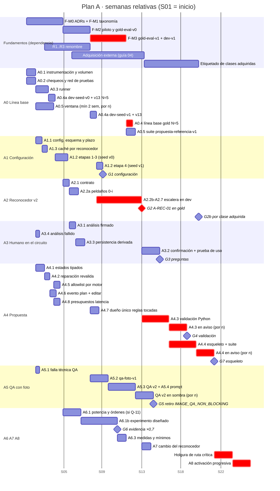

# 01 · Plan A: reconocimiento de estructuras en fotos de referencia y armado de la propuesta (sin entrenar modelos)

- **Estado:** borrador v0.2 para revisión, tras una revisión adversarial de factibilidad, evidencia y buenas prácticas (registro en §13). No implementa nada.
- **Fecha:** 2026-09-15. **Base de código:** rama `2026-09-14`, HEAD `1408f22`, con 6 archivos modificados sin commit (`git status`: `.env.local.example`, `scripts/test-armazon-ui.ts`, `src/app/api/generate/route.ts`, `src/components/references/ReferenceAnalysisController.tsx`, `src/lib/estado/espera-analisis.ts`, `src/lib/ia/feature-flags.ts`).
- **Fundamentos usados:** `00-fundamentos-compartidos.md` v0.2 (texto releído el 2026-09-15 tras su revisión editorial). **`taxonomy_version`:** `estructuras-2.0.0` (Fundamentos §4.9). Si Fundamentos cambia, manda su texto más reciente; los cambios que este plan necesita de Fundamentos están en §3.5 y no se aplican aquí.
- **Verificación:** solo lectura. No se llamó a proveedores de pago ni se escribió en la base de datos. Hubo 3 consultas `SELECT` dentro de `BEGIN READ ONLY … ROLLBACK` sobre `ai_call_log` y `plan_audit_log` (scripts `plan-a-uso.cjs`, `plan-a-chat.cjs`, `plan-a-audit.cjs` en el scratchpad; no se re-ejecutaron en la v0.2) y dos consultas públicas de la página de precios de Gemini (la segunda, en la revisión, confirmó que la salida incluye los tokens de pensamiento).
- **Convenciones:** las de Fundamentos: **[H]** hecho con evidencia, **[I]** inferencia, **[P]** propuesta que requiere aprobación. Toda cifra no medida lleva la etiqueta **estimación** y sus supuestos. Las citas `[crítica]`, `[reconocimiento]`, `[propuesta]`, `[research_vision]`, `[renombre]`, `[inventario]`, `[reconocimiento_externo]`, `[lora_infra]` y `[research_lora]` son los informes del encabezado de Fundamentos.

---

## 1. Resumen ejecutivo

- **Objetivo:** que la estructura de globos de la foto del cliente (una de las 16 oficiales, DT-3) llegue sin pérdida al plan cotizado y a la imagen, sin entrenar modelos.
- **Por qué:** nadie mide el reconocimiento; 14 de 15 piezas salen "asimétricas"; la oficial se infiere con regex sobre texto en 7 puntos del código; ningún validador compara plan y foto; la reparación firma sin revalidar colores (§4).
- **Cómo:** medir primero (línea base v13 en `dev-seed` desde la semana 4 y en `gold-eval-v1` en la 12); reconocer por atributos con la tabla única `F-TAX` mediante una **escalera de ablación** (reglas baratas antes que etapas caras, cada peldaño paga su costo y su latencia); abstenerse y preguntar al cliente solo las dudas caras; validar plan↔referencia y armar un esqueleto determinista en Python; separar la falla técnica de la QA de la no conformidad.
- **Resultado esperado:** F1 macro por estructura oficial (sobre las clases con compuerta) mejor que la línea base con intervalo por bootstrap por cluster; 0 planes firmados que incumplan un color obligatorio; análisis dentro de la espera de la UI; retiro medido de `IMAGE_QA_NON_BLOCKING`.
- **Compuertas:** G0 línea base, G1 configuración, G2 reconocedor (con Δ de cotización firmado por el negocio) y G2b por clase adquirida, G3 preguntas, G4 validador, G5 QA, G6 ×0,7, G7 esqueleto. G2 tiene rama degradada explícita.
- **Costo y tiempo (estimación):** ≈95–141 persona-días técnicos (≈12–18 menos si G2 cierra sin peldaño válido), ≈26–71 h humanas propias de A, ≈US$210–1230 en Gemini a precios vigentes hasta el 2026-12-31 (la parte de `gemini-3.6-flash` se duplica desde el 2027-01-01); ≈23–25 semanas con `F-M3` en la semana 11 y 2 semanas de holgura. No incluye las horas de etiquetado de Fundamentos §7.9 ni la adquisición externa de imágenes (DT-7, Fundamentos §7.9, guía `04` §6).
- **Riesgos principales:** retraso de `gold-eval-v1` y de las licencias que habilitan `dev-seed`; latencia del reconocedor frente a la espera de 45 s; poca potencia estadística en producción; que v2 suba cotizaciones al quitar orgánicos falsos; privacidad de los derivados de fotos de clientes.

---

## 2. Objetivo, alcance y fuera de alcance

### 2.1 Objetivo

Reconocer con exactitud medida las 16 estructuras oficiales, sus atributos, su conteo y su lado en fotos de referencia. El resultado se convierte en hechos tipados que:
- el plan respeta de forma determinista;
- el cliente confirma cuando la duda cambia la cotización;
- la imagen generada en el flujo con foto reproduce, verificado por una QA con precisión y recall medidos.

### 2.2 Alcance

| Área | Incluye |
|---|---|
| (a) Línea base | Métricas de Fundamentos §8.2 del sistema actual en `dev-seed` (A0.4a) y en `gold-eval-v1`/`dev-v1` (A0.4). Chequeos rápidos: EXIF, conversión de cajas, cajas por defecto, pruebas fuera de CI. Experimentos de configuración de Gemini (modo de función o salida estructurada, temperatura, `thinkingLevel`, `media_resolution`, `finishReason`). Volumen real de turnos con foto para dimensionar compuertas de producción |
| (b) Reconocedor v2 | Escalera de ablación: reglas deterministas y adaptador (§4.7 paso 1), etapa de atributos con Set-of-Mark, recorte y votos. Atributos de `F-ANN` y clase derivada con la tabla generada (§4.4, §4.7, §4.8). Organicidad por la prueba de silueta S1 (§4.3). Abstención. Confirmación del cliente. Análisis firmado. Plazo de servidor y presupuesto de latencia. Análisis fijo por reconocedor y hash |
| (c) Propuesta | Errores tipados. Reparación que revalida. Validación plan↔referencia en Python (familia completa). Esqueleto determinista en el flujo con foto con globos. Allowlist del chat según el motor. Evidencia para ×0,7, mínimos y medidas por defecto. Presupuestos de latencia |
| (d) Imagen con foto | QA con criterios atómicos; falla técnica ≠ no conformidad; criterio medible de retiro de `IMAGE_QA_NON_BLOCKING` |
| (e) Cambio del reconocedor (antes `R4`) | Condiciones de Fundamentos §6.4 fila R4: bandera y compuerta con medición del efecto en cotización, versionado de `reference-blueprint.v2` y `chat.v1`, regeneración de `generated_models.py`, análisis fijo con `origen` y presupuesto en DP-13. Consumo de `R2`/`R3` |

### 2.3 Fuera de alcance

- **Entrenar o afinar modelos:** sub-LoRA (Plan B), detector (Plan C), SFT de Gemini.
- **Taxonomía, esquema de anotación, particiones, etiquetado de `gold-eval-v1`, prompt de pre-etiquetado y arnés común** (`tools/eval-estructuras/`): son de Fundamentos (`F-TAX`, `F-ANN`, `F-DATA`, `F-EVAL`). A los consume y aporta requisitos e implementación del lado TS. El prompt de pre-etiquetado nunca es el prompt candidato de A (Fundamentos §7.5 paso 3).
- **Generación con FLUX.2 `/edit` + LoRA** (DT-4, ADR-0019, Plan B). A mide la QA de forma agnóstica al motor; A5.4 aplica solo a Gemini.
- **Flujo sin foto:** solo le aplican A4.1, A4.2 y A4.6.
- **Retener imágenes de clientes** para datasets (Fundamentos §7.1, DP-10, Q-11).
- **Migración completa de las reglas duplicadas TS↔Python** (`[propuesta §5.2]`): A migra solo las que toca (A4.3, A4.7).
- **Cambiar geometría o cotización:** decide el negocio (ADR-0017, DP-07). A aporta evidencia (A6) y mide el Δ de cotización que induce su propio cambio (G2).

---

## 3. Decisiones que aplica y dependencias

### 3.1 Decisiones tomadas (Fundamentos §2.1)

| Decisión | Cómo la aplica este plan |
|---|---|
| **DT-1** renombre a orgánico | A7 ejecuta el cambio del reconocedor (antes `R4`, Fundamentos §6.4). El reconocedor v2 emite ids nuevos cuando `R2`/`R3` estén desplegados y la bandera `ESTRUCTURAS_EMITIR_ID_ORGANICO` encendida; antes, en sombra, canoniza con la tabla de alias (Fundamentos §6.3) |
| **DT-2** definición de orgánico | `contorno` se decide solo con la prueba de silueta S1, única señal decisiva (Fundamentos §4.3); `envolvente_irregular`, `adapta_al_espacio` (R1) y `motivo_natural` (R2) se registran sin decidir. Sin evidencia de S1 → `contorno=indeterminado` (regla 6). `mezcla_tamanos` y `rango_tamanos` son ejes aparte. Se elimina `slight`→`asymmetric` (`reference-structure.ts:85,92`; regla 3). El ×0,7 se trata como no calibrado (A6) |
| **DT-3** 16 estructuras | Todas las métricas se reportan por las 16 clases, por familia y con `otra_estructura_globos` y `no_determinable`. Las compuertas usan solo clases con compuerta (estado `aprobada` en `F-M1` y n efectivo ≥ objetivo en `F-M3`, Fundamentos §4.5, §7.7); las demás se fuerzan a `estado=ambigua` hasta pasar G2b |
| **DT-4** LoRA con foto | A5 define la QA y la rúbrica con foto que el Plan B reutiliza. A4.5 ata el origen de la allowlist a la fecha de ADR-0019 / G-B5 |
| **DT-5** pre-etiquetas + humano | A no crea verdad terreno: consume `gold-eval-v0` (solo como `dev-seed`, nunca para compuertas), `gold-eval-v1` y `dev-v1`. Las correcciones del cliente (A3.3) nunca entran a la verdad sin revisión humana y consentimiento |
| **DT-6** tres planes | Este documento es el Plan A |
| **DT-7** fuentes externas | `dev-seed`, `dev-v1`, `gold-eval-v1`, `qa-foto-v1` y `propuesta-referencia-v1` usan **solo** imágenes externas en verde con manifiesto de procedencia (Fundamentos §7.1; `04-guia-fuentes-externas.md`). Las 10 fotos Pexels de la galería, las Sempertex propias y el blog quedan fuera de toda evaluación (a lo sumo `guia` con permiso). A no crea gold: lo produce Fundamentos (§7.5) |

### 3.2 Decisiones pendientes y preguntas que bloquean o condicionan a A

| Id | Qué bloquea en A | Propuesta de A si se le consulta |
|---|---|---|
| DP-01 (dueño de la taxonomía) | A2.1, A2.2a, A4.3–A4.4 consumen la tabla generada (`T1`) | Opción 2 de Fundamentos §4.8 |
| DP-02, DP-03, DP-16 | Enums, precedencias y la prueba S1 del semiarco en el prompt de atributos | — |
| DP-07 (×0,7) | A6.2 y la secuencia del Δ de cotización de G2 | Regla de evidencia en A6 |
| DP-15, Q-30 (DP-10 y Q-12 resueltas por DT-7) | Qué imágenes entran a `dev-seed-v0`: solo externas en verde con `evaluacion_con_proveedor_externo` (Commons verificado y primeros permisos de la guía `04`) | Priorizar en la semana 0–2 de la guía 10–60 candidatas de Commons y los primeros permisos (§12) |
| DP-12 / Q-05 (matriz de costo) y Q-21 | Pares que se preguntan (A3.2), punto de operación (G3), márgenes δ de G2 y tolerancias de G4/G5 | Provisional: tabla §4.6; δ con cálculo de potencia pre-registrado |
| DP-13 (presupuesto de llamadas pagas) | Toda corrida de A0.4a, A0.4, A1.2, A2, A4.4, A5 y la regeneración del análisis fijo | Topes por corrida en §6 |
| DP-17 (contrato de salida del reconocedor) | Inicio de A2 | Atributos + `candidatos[]` + `estado` ∈ {`estable`, `ambigua`, `confirmada_cliente`}, sin estados nuevos (§3.5) |
| DP-18 (`estructura_oficial` obligatoria) | A2.7, A4.4 | Obligatoria en la herramienta y en planes compuestos desde un esqueleto |
| DP-20 (derivación hacia campos del plan, §4.10) | A2.1 (qué atributos deben viajar), A4.4 | Consumir la tabla de datos de `F-TAX` con vectores dorados |
| DP-21 (estratos) | Reporte por estrato en A0.4 y G2; fotos de A5.2 | Reportar todas las métricas por estrato |
| Q-11 | A6.1 (órdenes excluidas hasta que Q-11 confirme o revoque la declaración, Fundamentos §7.1). DT-7 ya las excluye de entrenamiento y evaluación de modelos; A6.1 es análisis comercial de desgloses para `DP-07`, no un set de evaluación, y sigue necesitando base legal | Si se niega, A6 se apoya solo en el experimento diseñado A6.1b |
| Q-14 | Presupuesto de latencia (§6.0), G1, G2, G7 | Provisional: espera de la UI menos margen |
| Q-15, Q-29 | G2b (clases escasas) | Sin adquisición externa suficiente (Fundamentos §7.7, guía `04`), esas clases quedan sin compuerta y en `ambigua` |
| Q-20 | Potencia de G3, G4, G5 y A4.5 en producción | Medir volumen en A0.1 antes de fijar ventanas |
| Q-22, Q-23 | Regla de conteo del validador A4.3 (arco frente a 2 × semiarco) | Cada instancia es una estructura (Fundamentos §4.10) y el par se pregunta (§4.6) |

### 3.3 Hitos de Fundamentos de los que depende

Calendario común de referencia (Fundamentos §1.3, compartido con B y C): `F-M1` al final de la semana 4, `F-M2` en la 7 y `F-M3` en la 11. La adquisición externa (DT-7, Fundamentos §7.7, guía `04` §6.3) alimenta `gold-eval-v1`; lo que llegue después de `F-M3` afecta a G2b, no a G2.

| Hito | Paquetes de A que lo necesitan |
|---|---|
| `F-M0` (ADR-0010/0011) | A2.1, A7 |
| `F-M1` (taxonomía aprobada por clase) | Prompt de atributos A2.2b; ilustraciones de A3.2; qué clases pueden tener compuerta |
| `F-M2` (piloto, `gold-eval-v0`) | Enums finales de A2.2b; `dev-seed-v1` (las imágenes de `gold-eval-v0` pasan a `dev` o `guia`, Fundamentos §7.4) |
| `F-M3` (`gold-eval-v1` y `dev-v1`) | A0.4, suite `propuesta-referencia-v1`, G2, G3, G7 |
| `F-M4` (arnés común) | A0.3 aporta el runner TS; las métricas viven en `tools/eval-estructuras/` (Fundamentos §8.5) |
| `T0`–`T1` (tabla generada) | A2.1, A2.2a |
| `R1` (red de pruebas en CI) | Antes de A2 y A7 |
| `R2`, `R3` | Pasar A2 de `sombra` a `activo` con ids nuevos; A4.4 |

### 3.4 Dependencias con los otros planes

| Plan | A entrega | A recibe |
|---|---|---|
| **B** | Ids oficiales tipados por pieza. Módulo de QA y rúbrica atómica con foto (A5), que B usa en sus brazos. Regla de allowlist por motor (A4.5, ADR-A3). Medición de latencia de la etapa L sobre imágenes generadas (A5.2) | Fecha de G-B5 (semana 22 del calendario de B): si el flujo con foto pasa a `/edit` + LoRA, A4.5 cambia el origen de la allowlist y A5.4 deja de aplicar al motor nuevo. Suite `venue-inputs-v1` para A5.2 |
| **C** | Línea base medida (A0.4) y predicciones grabadas en `prediccion-estructuras.v1`. Contrato DP-17 (A2.1) que el detector debe emitir. Tabla de correcciones sin imagen (A3.3), que es la **única** fuente de los eventos de corrección que C7.1 describe (se unifican campos: `origen: cliente | revisor`, `model_version`, `taxonomy_version`) | Detector en sombra conectable al mismo contrato; integración autoritativa solo si pasa compuertas. Fixtures EXIF compartidos (C0.6) |

### 3.5 Cambios que A propone a Fundamentos (no aplicados aquí)

1. **§8.2 y §4.8 (opción 3):** `maxDuration = 120` no es un límite efectivo en el despliegue actual. La documentación incluida de Next dice que "Deployment platforms can use `maxDuration`" (`node_modules/next/dist/docs/01-app/03-api-reference/03-file-conventions/02-route-segment-config/maxDuration.md`) y el despliegue es `node server.js` con salida `standalone` (`Dockerfile:37`; `next.config` con `output: "standalone"`). **[I]** No se aplica en autoalojado; el límite real es la espera de 45 s de la UI y los plazos explícitos.
2. **§8.7:** añadir a la plantilla de compuerta la regla de agregación de las N corridas, la corrección por multiplicidad y un registro de intentos contra `gold` (máximo y reparto de α), para cumplir la regla 3 de §1.4.
3. **DP-17:** representar "no es una estructura" confirmado por el cliente con `estado=confirmada_cliente` y `es_estructura_globos=false` (campos existentes de F-ANN), sin crear un estado `descartada`.
4. **§7.4:** reconocer `dev-seed` como etapa temprana de `dev` (A0.4a), con la regla de exclusión por cluster frente a `gold-eval-v1`.
5. **§1.3:** estimar la fecha de `F-M3` y la de las compuertas por clase incluyendo la adquisición de §7.7. *(Incorporado: calendario común de referencia en Fundamentos §1.3.)*

---

## 4. Línea base verificada y brechas

### 4.1 Reconocimiento

| # | Hecho | Evidencia |
|---|---|---|
| L1 | Un análisis son 2 llamadas de herramienta (inventario y auditoría) con `temperatura: 0`, `maxTokens` 6000/4000, sin `toolConfig`, sin `mediaResolution` y sin lectura de `finishReason` | `src/lib/ia/analizar-referencias-v2.ts:588-605`; `packages/agente-core/src/gemini/chat.ts:207-230`; Fundamentos §3.6 |
| L2 | Uso real en `ai_call_log` (tráfico mezclado de producción, local y E2E):  • **inventario:** 117 ok y 3 error; mediana 3347 tokens de entrada, 1489 de salida y 0 de pensamiento; p50 9,8 s y p95 27,0 s • **auditoría:** 122 ok; mediana de **29 tokens de salida**; pensamiento p50 178 y p95 672; p50 2,9 s y p95 7,0 s • modelo `gemini-3.6-flash` en todas | `SELECT` de solo lectura del 2026-09-15 (`plan-a-uso.cjs`) |
| L3 | `thinking_level` es `null` en **todas** las filas de análisis, mientras `chat_turno` registra `low` en 748 llamadas. El análisis usa el puerto de `chatDe`, que toma `GEMINI_CHAT_THINKING_LEVEL` (`low`, `minimal` o sin fijar) | `plan-a-uso.cjs`, `plan-a-chat.cjs`; `src/lib/ia/registro.ts:63-73` |
| L4 | `coste_estimado` es `null` en las 270 filas de análisis y QA, aunque `ai_call_log` tiene `pricing_id`, `coste_estimado`, `coste_es_estimado`, `tokens_cacheados` e `intento`, y existe `ai_model_pricing` | `scripts/migrations/021_ai_call_log.sql:49-78`; `plan-a-uso.cjs` |
| L5 | El SDK `@google/genai` 2.16.0 expone `FunctionCallingConfigMode.VALIDATED`, `MEDIA_RESOLUTION_HIGH/ULTRA_HIGH` y `finishReason`. El repo ya usa salida estructurada con `responseJsonSchema` en la QA | `node_modules/@google/genai/dist/genai.d.ts`; `src/lib/ia/image-qa.ts:282-283` |
| L6 | **EXIF.** Las 10 fotos de la galería no traen EXIF. La UI aplica `createImageBitmap(file, { imageOrientation: "from-image" })` antes de recomprimir (`src/app/page.tsx:365-384`). **[I]** La hipótesis EXIF es improbable en la UI y queda abierta para llamadas directas a la API: `analisis-http.ts` valida bytes pero no normaliza orientación | `src/app/api/references/analyze/analisis-http.ts:26-131` |
| L7 | Clave de caché: versión del parser, modo, prompts, `REAR_LAYER_RULE`, catálogo, modelo e imágenes. **No** incluye temperatura, pensamiento, `maxTokens` ni `taxonomy_version`. El análisis fijo compara solo `parser_version` | `analizar-referencias-v2.ts:491-496`; `analisis-ejemplos.ts:31-37` |
| L8 | Sesgo y colapso en la galería: 14 de 15 piezas "asymmetrical" y 15 de 15 `lujosa`; 9 de 15 `columna_asimetrica` con ancho/alto de caja 0,40–1,05; 10 de 16 oficiales nunca aparecen | `[reconocimiento §6]` F1–F3; Fundamentos §3.5 |
| L9 | La oficial se infiere con `identificarEstructuraOficial`, que usa regex sobre `nombre`, en **7 puntos**: del lado de la referencia `prompt-sistema.ts:185` (`shape`) y `presentacion-cliente.ts:559` (`shape + name`), con divergencia chat↔UI; del lado del plan o la escena `build-image-prompt.ts:92`, `image-qa.ts:201`, `TarjetaPlanDecoracion.tsx:271`, `lora-caption-compiler.ts:441` y `restricciones.ts:615,652`, que pasan `estructura_oficial` cuando existe y caen en la regex cuando falta | `grep identificarEstructuraOficial src`; `estructuras-oficiales.ts:147-179`; `[reconocimiento §2.6]` F16 |
| L10 | Otros modos de fallo: F4 techo como pared; F5 arco como guirnalda; F6 figura de mosaico rechazada; F7 aro fijado en `arco_central`; F9 foil absorbido por contención de caja; F10 caja por defecto 0,1/0,1/0,2/0,2; F11 el verificador reescribe el tipo con IoU ≥ 0,35; F14 composición de la primera imagen e `image_id` reasignado | `[reconocimiento §6]` |
| L11 | Estabilidad medida solo en una foto (3/3). No hay P/R por clase, ni IoU, ni N corridas | `README.md:114`; `[reconocimiento §5.2-5.3]` |
| L12 | Pruebas fuera de CI: `ia:test-referencias-reglas`, `-perceptual`, `-fixture`, `-ruta` (`package.json:94-98`), `ui:test-armazon` (`:76`), `ia:test-qa-esperados` (`:100`) e `ia:test-generate-qa-plan` (`:104`) no están en `plan:test` (`:139`) ni en `.github/workflows/checks.yml` | Lectura de `package.json` y `checks.yml` |
| L13 | La UI espera el análisis como máximo 45 s (`LIMITE_ESPERA_ANALISIS_MS`, cuyo comentario dice "p95 medido: 20 s", distinto del p95 de 27 s de L2). Si no llega, el turno sale sin blueprint y las reglas de referencia devuelven `[]` | `src/app/page.tsx:163,980`; `[reconocimiento §2.8]` |
| L14 | El blueprint viaja desde el navegador sin firma a `/api/chat` y `/api/generate` | `src/app/api/chat/route.ts:208-210`; RSK-17 |
| L15 | Cambio local sin commit: duración mínima del escaneo de 5 s (`DURACION_MINIMA_ANALISIS_MS`). Es un **piso**: solo retrasa análisis más rápidos que 5 s y no se suma a uno más lento | `src/lib/estado/espera-analisis.ts:34-38` |
| L16 | **Sin plazo de servidor efectivo.** La ruta de análisis declara `maxDuration = 120` y solo propaga `request.signal`; **[I]** en autoalojado `maxDuration` no se aplica (§3.5). El puerto reintenta errores reintentables hasta 3 intentos con espera exponencial | `src/app/api/references/analyze/route.ts:7,25`; `Dockerfile:31,37`; `packages/agente-core/src/retry.ts:20-22`; `chat.ts:205` |
| L17 | `sharp` es dependencia de ejecución (`package.json:174`, bloque `dependencies`) y se importa en runtime solo en `src/lib/lora/snapshot-imagenes.ts`; el resto de usos está en `scripts/`. No está verificado que la salida `standalone` lo incluya para una ruta nueva | `grep` de imports |

### 4.2 Propuesta

| # | Hecho | Evidencia |
|---|---|---|
| P1 | El modelo decide estructuras, medidas, densidad, mezcla y unidades. `estructura_oficial` es opcional | `[propuesta §1.1, §3]`; `tipos.ts:105` |
| P2 | Ningún validador compara tipo, oficial, cantidad o lado del plan con lo detectado. Las validaciones de referencia existentes (`validarCoberturaReferencia`, `validarEstructurasFueraDeReferencia`) viven solo en TS | `[propuesta §2.12]`; `restricciones.ts:281,527`; `registro-herramientas.ts:19,487,603` |
| P3 | La reparación tras 2 rechazos quita materiales sin cobertura y firma sin revalidar colores, unidades, números ni referencia | `registro-herramientas.ts:727-741`; `[propuesta §7.1]` |
| P4 | `rechazosPlan` cuenta cualquier `ok:false`, fallos técnicos incluidos. Con ≥2 se dejan de reclamar los colores de la foto | `registro-herramientas.ts:353-355, 1345-1355` |
| P5 | Umbrales fijos 2/4 y cortes 40/58/75 s sin medición. `cierreAnticipado` solo actúa entre vueltas; la resolución Python usa 75 s por defecto | `convergencia-plan.ts:25-28`; `chat/route.ts:51`; `operational-v1.ts:5-6`; `[propuesta §7]` |
| P6 | Auditoría desde el 09-14 (tráfico mezclado): 54 de 138 turnos con plan (39 %) tuvieron 1–6 rechazos; 17 turnos sin plan; 165 `SIN_COBERTURA` en total | `[propuesta §6]` |
| P7 | `plan_audit_log.flag_snapshot` guarda estados de flags (`planBudgetGateV2`, `planCostOptimizerV2`, `scenePlanV2Shadow`), no hechos de la petición. No hay registro de foto, `loraMode` ni clase de rechazo. **[I]** Hoy no se puede atribuir qué parte de los `SIN_COBERTURA` viene de la allowlist LoRA | `plan-a-audit.cjs`; `registro-herramientas.ts:668`; `src/lib/rag/observability/log.ts:189-221` |
| P8 | La UI siempre manda `loraMode` y el chat limita el catálogo a ese pool, también con foto, donde la imagen la hace Gemini | `page.tsx:1005`; `chat/route.ts:212-224`; `modo-vista-reglas.ts:36-40`; `[crítica §1.2]` |
| P9 | Costo por turno de chat (171 turnos, tráfico mezclado): mediana de 4 llamadas; entrada p50 73 925 y p95 181 472 tokens; salida más pensamiento p50 2036 y p95 5690; tiempo de modelo p50 19,4 s y p95 52,0 s | `plan-a-chat.cjs` |
| P10 | Otros defectos: piezas del prompt cortadas en 20 con cobertura que exige todas; plan firmado solo en `fin`; manejadores sin try/catch; `plan-editar` no revalida; `ESTIMACION_INCONSISTENTE` muerto con Python; mínimos 5/20 sin calibrar | `prompt-sistema.ts:171`; `[propuesta §7]` 5, 6, 8, 15, 16, 33; `restricciones.ts:622-629` |
| P11 | El ×0,7 no está calibrado. La única cifra disponible es un subconteo **general, no atribuible a la variante** (arco: mediana de 174 globos comprados, n=16, frente a 118 en planes, n=101, con merma y medidas distintas) | DT-2; DP-07; `[propuesta §4]` |
| P12 | No existe un tipo de unión de estados del plan: hay 14 literales `status` en `registro-herramientas.ts` (`BACKEND_NO_DISPONIBLE`, `COBERTURA_REFERENCIA_INCOMPLETA`, `COLORES_REFERENCIA_OMITIDOS`, `ESTIMACION_INCONSISTENTE`, `ESTRUCTURA_SIN_GLOBOS`, `NUMERO_INCORRECTO`, `PLAN_NO_CONVERGE`, `PLAN_SIN_GLOBOS`, `PRESUPUESTO_EXCEDIDO`, `PRODUCTO_VARIANTE_INCONSISTENTE`, `REFERENCIA_SIN_GLOBOS`, `RESTRICCIONES_INCONSISTENTES`, `SIN_COBERTURA`, `UNIDADES_INSUFICIENTES`) | `grep 'status: "'` |

### 4.3 Imagen con foto (Gemini) y QA

| # | Hecho | Evidencia |
|---|---|---|
| Q1 | Con foto, en modo usuario, la imagen la hace Gemini imagen. El LoRA se rechaza con foto en dev | `modo-vista-reglas.ts:36-40`; Fundamentos §3.2 |
| Q2 | El observador de QA recibe la caja de cada elemento y la orden "Mark placement failure when its canonical placement **or bbox region** is wrong". Corre con `ThinkingLevel.MINIMAL`, salida estructurada y 30 s de plazo | `src/lib/ia/image-qa.ts:203, 252, 280-287` |
| Q3 | **[H por lectura, no ejecutado]** Si el observador falla o se agota, devuelve `null` y `buildGenerationQa` produce `pass: null`; la ruta bloquea con `IMAGEN_NO_FIEL` cuando `pass !== true` (`bloquearPorQa`, sin commit) | `image-qa.ts:293-296`; `src/lib/ia/generation-qa.ts`; `src/app/api/generate/route.ts` (copia de trabajo) |
| Q4 | Límites documentados (calibración sin foto, 48 imágenes): no detecta guirnaldas flotando ni la columna sobrante; detectó 3 de 5 arcos con forma de aro; la forma del arco falló en 5 de 12 | `README.md:128-136` |
| Q5 | Con foto, en producción 1 de 2 aprobaciones terminó en "no fiel" antes de `photoSetting` (`1408f22`) | `README.md:139` |
| Q6 | `IMAGE_QA_NON_BLOCKING` (sin commit, por defecto `false`) entrega la imagen no conforme; su condición de retiro no tiene medición | `src/lib/ia/feature-flags.ts` (copia de trabajo); `.env.local.example` |
| Q7 | Uso de `qa_visual`: 28 ok; mediana 1838 tokens de entrada y 218 de salida; p50 5,7 s y p95 17,9 s | `plan-a-uso.cjs` |
| Q8 | Precios: `gemini-3.6-flash` US$0,75/M de entrada y US$3,75/M de salida "(including thinking tokens)" hasta el 2026-12-31; US$1,50 y US$7,50 desde el 2027-01-01. `gemini-3.1-flash-image`: US$60/M tokens de imagen de salida (US$0,067 por imagen 1K y US$0,101 por 2K) | https://ai.google.dev/gemini-api/docs/pricing (consultada el 2026-09-15) |

### 4.4 Brechas que cierra el plan

| Brecha | Paquete |
|---|---|
| B1. Sin línea base por clase ni estabilidad; sin set temprano para iterar | A0 (A0.4a, A0.4) |
| B2. Configuración del análisis implícita, atada al chat y sin plazo de servidor | A1 |
| B3. Clase inferida por regex; atributos sobrepredichos; sin abstención; sin ablación por componente | A2 |
| B4. Sin confirmación del cliente; blueprint sin firma; sin derivados para medir en producción | A3 |
| B5. Plan libre frente a la foto; reparación sin revalidar; errores sin clase; allowlist acoplada; latencias sin medir | A4 |
| B6. QA con falsos positivos de ubicación y falla técnica tratada como no conformidad | A5 |
| B7. ×0,7, mínimos y medidas por defecto sin evidencia | A6 |
| B8. Cambio del reconocedor (antes R4) | A7 |

---

## 5. Principios y buenas prácticas que guían el plan

| # | Principio | Fuente | Por qué aplica aquí |
|---|---|---|---|
| 1 | **Medir la línea base antes de cambiar; umbrales tras medir** | `AGENTS.md` ("Performance changes require a reproducible scenario and before/after evidence. Set budgets from requirements and a measured baseline"); Fundamentos §8.1 | No existe métrica de reconocimiento (L11). Por eso A0.4a mide v13 en `dev-seed` antes de A1.2 y A2 |
| 2 | **Separar el set de iteración del de decisión y limitar los intentos contra el de decisión** | Fundamentos §1.4 regla 3, §7.4; RSK-10 | Prompts y umbrales se iteran en `dev-seed`/`dev-v1`; `gold-eval-v1` solo decide, con máximo 2 intentos y solo métricas agregadas visibles |
| 3 | **Estadística con dependencia y multiplicidad** | Fundamentos §8.1 (bootstrap por cluster; McNemar y Wilson solo orientativos); Holm, "A simple sequentially rejective multiple test procedure", *Scandinavian Journal of Statistics* 6(2), 1979 | Varias instancias por imagen están correlacionadas; G2 prueba macro, clases, *flip rate*, cotización y latencia a la vez |
| 4 | **Potencia antes de la ventana; decidir por n alcanzado, no por calendario** | Kohavi, Tang y Xu, *Trustworthy Online Controlled Experiments* (Cambridge University Press, 2020), capítulos de potencia y duración | P9 cuenta 171 turnos en tráfico mezclado; ventanas de "2 semanas" no garantizan n (G3, G4, G5) |
| 5 | **Modelo simple primero; cada componente paga su costo (escalera de ablación)** | Google, *Rules of Machine Learning*, regla 4 ("Keep the first model simple and get the infrastructure right", https://developers.google.com/machine-learning/guides/rules-of-ml); `[research_vision §1]` da confianza **media** a Set-of-Mark y a la separación de etapas | Las reglas deterministas cuestan 0 y atacan F1, F4, F7 y F14; la etapa C, el recorte y los votos cuestan latencia y dinero y deben demostrar ganancia |
| 6 | **Primero atributos, luego clase; jerarquía familia → variante** | Finer/AttrSeek (https://arxiv.org/html/2402.16315): nivel fino de 18,8 % a 53,1 %; Menon & Vondrick (https://arxiv.org/abs/2210.07183); https://arxiv.org/abs/2512.21529 | F1 (semiarco→columna) y la sobrepredicción de "asimétrico" son errores de nivel fino |
| 7 | **Una sola tabla dueña de "atributos → estructura oficial"** | `AGENTS.md` ("Give every business rule one authoritative owner"); Fundamentos §4.7-4.8 | Hoy la regla vive en 4 lugares y se consume por regex en 7 puntos (L9) |
| 8 | **Prompts cortos para localizar; silueta en vista completa; recorte para el detalle a escala de globo** | RF100-VL (https://arxiv.org/html/2505.20612v1): instrucciones ricas bajan a Gemini 2.5 Pro de 13,3 a 6,1 mAP; ViCrop (https://arxiv.org/abs/2502.17422), que según `[research_vision §1]` "sirve más para densidad, acabados, bouquets y centros de mesa que para la silueta de un arco"; Set-of-Mark (https://arxiv.org/abs/2310.11441); Fundamentos §4.3 (el contorno "NO es la textura a escala de globo") | El recorte decide `densidad` y `mezcla_tamanos`; `contorno` sale de la silueta de la pieza completa |
| 9 | **Esquema cerrado, pero medir la degradación por formato restringido** | Function calling `VALIDATED` y structured output (https://ai.google.dev/gemini-api/docs/generate-content/function-calling; https://ai.google.dev/gemini-api/docs/structured-output); "Let Me Speak Freely" (https://arxiv.org/abs/2408.02442), confianza media `[research_vision §5]` | El esquema abierto causa campos inventados; restringirlo puede costar exactitud: se mide estricto frente a laxo |
| 10 | **La temperatura no da determinismo; la contradicción de fuentes se resuelve midiendo** | Guía de Gemini 3 frente a la guía de function calling `[crítica §1.7]`; https://thinkingmachines.ai/blog/defeating-nondeterminism-in-llm-inference/ | Se decide con N corridas (A1.2) |
| 11 | **`maxOutputTokens` incluye pensamiento; leer `finishReason`** | https://github.com/googleapis/python-genai/issues/2062 (confianza media `[research_vision §0c]`); página de precios (salida "including thinking tokens") | Posible causa de "malformed output"; hoy no se registra (L1, L3) |
| 12 | **La confianza verbalizada no calibra; soporte k/N y curva riesgo-cobertura** | https://arxiv.org/abs/2405.02917; KnowNo (https://arxiv.org/abs/2307.01928); Fundamentos §8.1 | `detection_confidence` no debe usarse como umbral |
| 13 | **Abstenerse es válido; preguntar según el costo del error** | Fundamentos §4.2, §4.6; KnowNo | Un falso positivo de orgánico subcotiza mientras exista ×0,7 (RSK-08) |
| 14 | **Humano en el circuito con corrección eficiente** | Amershi et al., Guidelines for Human-AI Interaction (https://www.microsoft.com/en-us/research/wp-content/uploads/2019/01/Guidelines-for-Human-AI-Interaction-camera-ready.pdf) | La confirmación en `AnalisisFoto` debe ser de un solo paso y acotada |
| 15 | **Pruebas de uso pequeñas e iterativas** | Nielsen (https://www.nngroup.com/articles/why-you-only-need-to-test-with-5-users/) | Detectar fricción antes de medir en producción, donde la potencia es baja |
| 16 | **El LLM traduce, un validador determinista decide** | LLM-Modulo (https://arxiv.org/abs/2402.01817); LLM + SMT (https://arxiv.org/html/2404.11891v3); "poka-yoke" (https://www.anthropic.com/engineering/building-effective-agents) | 39 % de turnos con rechazos y reparación sin revalidar (P3, P6) |
| 17 | **Errores tipados que separan fallas técnicas de rechazos corregibles** | `AGENTS.md` ("Do not swallow exceptions or return fabricated success"; "stable error codes"); `[research_vision §5]` | Dos fallos técnicos relajan reglas (P4); una QA caída se muestra como "no fiel" (Q3) |
| 18 | **Contratos versionados, validación en runtime, Python como autoridad de negocio y un solo dueño por regla** | `AGENTS.md` (Contracts; Python migration: "use explicit temporary adapters"); ADR 0005 borrado (`git show 67ea5b1:docs/architecture/decisions/`), `[propuesta §8]` | Validador y esqueleto nacen en Python; las validaciones de referencia TS pasan a adaptador con condición de retiro |
| 19 | **Plazos explícitos y propagados; reintentos acotados y contados en el costo** | `AGENTS.md` ("External operations need deadlines and bounded concurrency. Retry only recoverable failures") | Sin plazo de servidor (L16) y con `conReintento` de hasta 3 intentos |
| 20 | **No confiar en datos del navegador en fronteras de autorización; fallar cerrado** | `AGENTS.md` (Security) | Validar el plan contra un blueprint editable no protege nada (L14) |
| 21 | **Invariantes deterministas en CI; evaluaciones probabilísticas offline** | `AGENTS.md` (Verification); Fundamentos §8.8 | Una prueba que no corre en CI no es criterio de aceptación (L12) |
| 22 | **Los VLM cuentan mal: contar por detección y usar rúbricas atómicas** | https://arxiv.org/abs/2407.06581 (58,07 % en conteo simple); Fundamentos §8.4 | La QA no ve la columna sobrante ni la guirnalda flotante (Q4) |
| 23 | **Minimización de datos y privacidad desde el diseño** | `AGENTS.md`; Fundamentos §7.2 | A3.3 persiste solo derivados con HMAC y retención limitada |
| 24 | **Despliegue progresivo con modo sombra, flags congeladas durante las ventanas de medición y kill switch** | `[reconocimiento_externo §6]`; ADR 0006 borrado, `[propuesta §2.8]`; Kohavi et al. (2020) | Cambios simultáneos contaminan la comparación antes/después (A0.5) |

---

## 6. Fases y paquetes de trabajo

**Supuestos comunes de esfuerzo (estimación):**
- Una persona desarrolladora con experiencia en el repo; 1 persona-día (pd) = 6 h efectivas.
- Incluye pruebas, revisión y la verificación de `AGENTS.md` (`npm run lint`, `npm run build --workspaces --if-present`, `npx tsc --noEmit`, `contracts:check`, `plan:test`, y `generate_models.py --check` y `pytest` cuando toca contratos o Python).
- Las horas humanas propias de A están en §6.2; las de etiquetado de Fundamentos (§7.9), no.

**Precios** (Q8, verificados el 2026-09-15; se reverifican antes de cada corrida): `gemini-3.6-flash` US$0,75/M de entrada y US$3,75/M de salida con pensamiento incluido hasta el 2026-12-31, el doble desde el 2027-01-01, Batch a mitad de precio; `gemini-3.1-flash-image` US$0,067 (1K) y US$0,101 (2K) por imagen.

**Costo unitario derivado (estimación)** con las medianas de L2:
- **Un análisis de 1 foto ≈ US$0,0103:** (3347 + 1928) × 0,75/M + (1489 + 29 + 178) × 3,75/M.
- **Rango de trabajo: US$0,01–0,03** (p95 de pensamiento y salida; más pensamiento o `media_resolution` alta).
- **Un recorte ≈ US$0,002–0,005** (~1500 tokens de entrada y ~300–1000 de salida).
- **Una llamada de QA ≈ US$0,0022.** **Un turno de chat ≈ US$0,063 (p50) a US$0,157 (p95)** (P9).

**Reglas de corrida para toda evaluación paga:**
- presupuesto aprobado (DP-13) y tope que detiene la corrida; el tope cuenta **cada intento** del puerto (`conReintento`, hasta 3, `retry.ts:20-22`; columna `ai_call_log.intento`) y el reintento de formato, con peor caso ×3 en la estimación previa;
- concurrencia ≤ 4 llamadas y plazo explícito por llamada (60 s en offline; en producción, el de §6.0);
- reanudable por `run_id`; costo estimado antes y uso reportado después (Fundamentos §8.6);
- solo ítems con `evaluacion_con_proveedor_externo` y, si aplica, `cubre_envio_a_proveedores_ia=true`; el runner rechaza manifiestos no conformes (Fundamentos §8.1).

### 6.0 Presupuesto de latencia del análisis (se fija antes de A2.2b)

- **Límite real:** la UI espera 45 s (L13); el servidor no tiene plazo efectivo (L16). **Regla [P]:** p95 de punta a punta del análisis ≤ `LIMITE_ESPERA_ANALISIS_MS` − margen, con margen provisional de 5 s (red, subida y serialización; se sustituye por el medido en A0.1) o el presupuesto de Q-14 si existe.
- **Aritmética de partida (v13, L2):** inventario p95 27,0 s + auditoría p95 7,0 s ≈ 34 s en secuencia. **[I]** La suma de p95 acota por arriba el p95 de la suma; el p95 de punta a punta se mide en A0.4a. La duración mínima de 5 s (L15) es un piso y no se suma.
- **Holgura para v2:** si la auditoría se retira (A2.6), quedan ≈ 40 s − p95(etapa L) para el resto. Las llamadas en paralelo por imagen aportan el **máximo** de sus p95, no la suma; los votos N=3 en paralelo suben el p95 de su etapa (máximo de 3 muestras). Cada etapa tiene presupuesto = p95 medido en `dev-seed`; si la suma de las etapas secuenciales no cabe, el peldaño no se adopta o se usa **respuesta progresiva** (A2.2b tarea 6).
- **Plazo de servidor:** `AbortSignal.any([request.signal, AbortSignal.timeout(T_srv)])` en `/api/references/analyze` y en el modo sombra, con `T_srv` = espera de la UI + 2 s [P]; al agotarse → error tipado `ANALISIS_PLAZO_AGOTADO` y contador (A1.1). Se verifica si la UI aborta el `fetch` al rendirse; si no lo hace, hoy el servidor sigue gastando.

---

### A0 · Línea base y chequeos rápidos (sin cambio de comportamiento)

#### A0.1 Instrumentación del análisis, la propuesta, la QA y el volumen

- **Objetivo.** Poder medir lo que hoy no queda registrado (L3, L4, P7) y conocer el volumen real que dimensiona las compuertas de producción (Q-20).
- **Tareas:**
  1. `packages/agente-core/src/gemini/chat.ts`: `finishReason` y `blockReason` del primer candidato en `RespuestaChat` (campo opcional nuevo).
  2. `src/lib/ia/analizar-referencias-v2.ts` y `src/lib/ia/telemetria-llamadas.ts`: registrar por pase `finish_reason`, `thinking_level` efectivo, `prompt_version` y `analysis_config_hash` (A1.3). `intento` y `tokens_cacheados` ya existen en `ai_call_log` (`021_ai_call_log.sql:61-69`).
  3. Migración `scripts/migrations/024_telemetria_plan_a.sql` con rollback:
     - `ai_call_log`: `finish_reason TEXT`, `config_hash TEXT`;
     - `plan_audit_log`: columnas propias para hechos de la petición (`tiene_referencia BOOLEAN`, `tiene_foto_espacio BOOLEAN`, `lora_mode TEXT`, `motor_imagen_previsto TEXT`, `clase_rechazo TEXT`, `rechazos_turno SMALLINT`, `superficie TEXT`). `flag_snapshot` sigue guardando solo estados de flags e incorpora los flags nuevos de A.
  4. Filas de `ai_model_pricing` para `gemini-3.6-flash` y `gemini-3.1-flash-image`, con `fuente` y las vigencias de 2026 y 2027, para que `coste_estimado` se llene con `coste_es_estimado = true`.
  5. Auditar también `PLAN_NO_CONVERGE` y los errores de esquema (`[propuesta §7.36]`).
  6. Consulta versionada `scripts/consultas/volumen-turnos-con-foto.sql`: turnos por semana con `tiene_referencia`, excluyendo E2E y local por `superficie` y `correlation_id` (criterio documentado). Es la entrada de los cálculos de potencia de G3, G4, G5 y A4.5.
- **Entregables:** PR con migración, telemetría, consultas y pruebas.
- **Criterios de aceptación:**
  - Prueba determinista con puerto simulado: `finish_reason`, `config_hash` y `thinking_level` no nulos en el 100 % de los eventos grabados.
  - Prueba que recorre telemetría y auditoría de los fixtures y falla si aparece base64 de imagen o texto de mensajes del cliente.
  - A los 7 días de desplegar, ≥ 99 % de las filas nuevas de `analisis_referencia` y `qa_visual` tienen `finish_reason` y `coste_estimado` (consulta versionada).
  - Informe de volumen semanal con foto a los 14 días, con el criterio de exclusión de tráfico.
- **Dependencias:** ninguna.
- **Esfuerzo:** 3–4 pd (estimación).
- **Costo de proveedores:** 0.
- **Riesgos:** cambio del tipo del puerto (campo opcional y build de workspaces); precio desactualizado (`vigente_desde` y revisión); tráfico real indistinguible (G3–G5 se deciden entonces con las suites offline, §7).
- **Rollback:** revertir el PR; la migración trae su rollback. Sin flag (no cambia comportamiento).
- **Pruebas:** deterministas (telemetría con puerto simulado, ausencia de contenido sensible, migración en `rag:migrate` de CI).
- **ADR:** no.

#### A0.2 Chequeos rápidos deterministas y red de pruebas

- **Objetivo.** Descartar causas baratas y que los criterios "deterministas" de A corran de verdad en CI.
- **Tareas:**
  1. **EXIF:** fixture JPEG con orientación 6 a `/api/references/analyze` con puerto simulado, compartido con C0.6 del Plan C (`eval/fixtures/exif/`). Si falla, normalizar en `analisis-http.ts` con `sharp().rotate()`, previa verificación de que `sharp` entra en la salida `standalone` (L17: build de Docker y prueba de humo de la ruta dentro de la imagen).
  2. **Conversión `box_2d`→`xywh`:** vectores fuera de rango, ejes invertidos y área mínima (`candidatos-referencia.ts:90-102`).
  3. **Red de pruebas:** agregar a `plan:test` en el mismo PR `ia:test-referencias-reglas`, `-perceptual`, `-fixture`, `-ruta`, `ui:test-recorte-referencia`, `ui:test-armazon`, `ia:test-generate-qa-plan` e `ia:test-qa-esperados` (L12). Antes se corren en la base: si alguna no pasa, se documenta como deuda previa sin desactivarla (`AGENTS.md`). `scripts/test-armazon-ui.ts` tiene cambios locales sin commit: se coordina con su autor para no pisarlos. Complementa `R1`.
  4. **Cajas por defecto:** la prueba que prohíbe la caja 0,1/0,1/0,2/0,2 en el análisis fijo **no** se agrega aquí (hoy hay 1, F10); se agrega en A7 junto con la corrección. Mientras tanto, una prueba valida una lista explícita de excepciones (el elemento de `E03` del análisis fijo) con condición de retiro "A7 fusionado".
  5. **Laboratorio:** corregir `idsDelJson` (F18) o retirar la página, previa confirmación de uso (§11 pregunta 10).
- **Criterios de aceptación:** todas las pruebas agregadas pasan en CI o figuran como deuda previa documentada; la prueba EXIF pasa o existe un PR con normalización; `plan:test` sigue verde.
- **Dependencias:** ninguna.
- **Esfuerzo:** 2–3 pd (estimación).
- **Costo de proveedores:** 0.
- **Riesgos:** CI más larga (todas sin red y con proveedor simulado).
- **Rollback:** quitar los scripts de `plan:test`.
- **Pruebas:** solo deterministas.
- **ADR:** no.

#### A0.3 Runner de reconocimiento (lado TS de `F-M4`)

- **Objetivo.** Correr el sistema actual y los candidatos con el protocolo de Fundamentos §8 y escribir el contrato común.
- **Tareas:**
  1. **Runner TS** `scripts/eval/estructuras/reconocimiento.ts` con la lógica en `src/lib/eval/estructuras/` (scripts import-safe, `AGENTS.md`):
     - llama a `analizarReferenciasV2` o al candidato con `forzarNuevoAnalisis`;
     - escribe **`prediccion-estructuras.v1`** (Fundamentos §8.5) con una función de mapeo blueprint → predicción probada con vectores; es la única interfaz hacia las métricas;
     - guarda las salidas crudas de inventario y auditoría **por separado** (por hash, en almacenamiento privado) para ablar sin volver a pagar;
     - tope de costo, concurrencia ≤ 4, plazo por llamada, `--preview` sin red y reanudación.
  2. **Métricas:** viven en `tools/eval-estructuras/` (Fundamentos §8.5). A aporta lo que necesita: emparejamiento húngaro con IoU ≥ 0,5; P/R/F1 por clase y familia; F1 macro sobre un subconjunto declarado de clases; **bootstrap por cluster** de diferencias pareadas; *flip rate*, κ de Fleiss e IoU entre corridas; curva riesgo-cobertura; corrección de Holm; McNemar y Wilson solo como orientación.
  3. **Regla de agregación de corridas [P]:** si la configuración de producción usa N=1, la métrica primaria es el **promedio sobre las N corridas** de la métrica de una corrida (desempeño esperado en producción); la moda se reporta para estabilidad. Si la configuración vota (A2.4), la métrica es la del agregado que usa producción. Queda en cada pre-registro.
  4. **Error de cotización inducido:** plan canónico de evaluación resuelto con `plan.py` (Fundamentos §8.2), predicción frente a verdad; y **Δ de cotización entre dos reconocedores** (v13 frente a candidato) sobre las mismas escenas, para G2.
  5. **Adaptador `familia` v1→v2:** paso 1 de la tabla de Fundamentos §4.7 para puntuar v13 contra `estructura_oficial_derivada` (también es el peldaño 0 de A2).
- **Entregables:** runner, mapeo y aportes a `tools/eval-estructuras/`; compuertas en `eval/estructuras/gates/<id>.json` validadas contra su esquema (Fundamentos §8.5, §8.7).
- **Criterios de aceptación:** vectores dorados sintéticos con resultado conocido (≥ 1 por métrica) en CI; `metrics.json` idéntico byte a byte al recalcular sobre predicciones grabadas; `--preview` sin llamadas (prueba con puerto que falla si se invoca); el mapeo produce predicciones válidas contra `prediccion-estructuras.v1`.
- **Dependencias:** `F-ANN`; coordinación con `F-M4`.
- **Esfuerzo:** 5–7 pd (estimación; ≈ 2–3 pd menos si `F-M4` entrega las métricas).
- **Costo de proveedores:** 0.
- **Riesgos:** salidas crudas con texto sensible (por hash, nunca en logs ni en git).
- **Rollback:** no afecta a producción.
- **Pruebas:** deterministas.
- **ADR:** no (ADR-0014).

#### A0.4a `dev-seed` y línea base v13 temprana

- **Objetivo.** Tener un set de iteración y una línea base v13 **antes** de A1.2 y A2, sin tocar `gold`.
- **Sets:**
  - **`dev-seed-v0` (semanas 2–4):** 10–60 fotos **externas en verde** (DT-7) con `evaluacion_con_proveedor_externo` verificado y manifiesto de procedencia: candidatas de Commons CC0/PDM/CC BY y primeros permisos de la guía `04` (semanas 0–2 de la guía), del titular sorteado al pool de evaluación (guía §5.7). Las 10 Pexels de la galería, las Sempertex propias y el blog **no** entran (DT-7). Etiqueta rápida de familia por un revisor, **sin uso para exactitud**.
  - **`dev-seed-v1` (semana 8):** `dev-seed-v0` ∪ imágenes de `gold-eval-v0` (100–150, con doble anotación y segunda pasada ciega). Fundamentos §7.4 prevé que tras el piloto pasen a `dev` o `guia`. Sirve para exactitud **direccional**.
- **Garantía de disjunción con `gold-eval-v1`:**
  1. Antes de asignar, dedup de Fundamentos §7.3 (sha256, dHash d ≤ 6 con revisión, embeddings locales) contra todo lo ingerido.
  2. Cada cluster con una imagen del seed queda con `particion=dev` en `datasets/estructuras/manifests/dev-seed-v*.jsonl`.
  3. Cada ingesta posterior re-ejecuta el dedup contra esos clusters; una imagen que se une a un cluster `dev` hereda `dev`.
  4. El constructor de `gold-eval-v1` (`F-M3`) toma solo de `pool_sin_asignar`; una prueba determinista del validador de manifiestos falla si los clusters de `gold-eval-v1` y de `dev-seed-*` se intersecan.
  5. Las imágenes del seed son "vistas por quien itera prompts" y nunca van a `gold` (Fundamentos §7.4).
- **Tareas:** manifiestos con licencia por imagen; corrida de v13 tal cual (parser `semantic-layers-v13-box-2d`, temperatura 0, pensamiento de producción, modo AUTO) con N=5; p50/p95 por pase y de punta a punta; tasa malformada y `finishReason`; *flip rate*; en `dev-seed-v1`, métricas de §8.2 como direccionales. Esta corrida es el brazo "actual" de A1.2 (no se paga dos veces).
- **Criterios de aceptación:** manifiestos validados y prueba de disjunción en CI; `run.json` completo (Fundamentos §8.1); p95 por etapa publicado para §6.0; costo reportado dentro de ±30 % del estimado (si no, se corrige la tabla antes de A1.2).
- **Dependencias:** A0.1, A0.3, DP-13; primeras imágenes externas en verde (Fundamentos §7.1, guía `04`); `F-M2` para v1.
- **Esfuerzo:** 2–3 pd (estimación).
- **Costo (estimación):** v0: 10–60 × 5 × US$0,01–0,03 = US$0,5–9; v1: 110–210 × 5 × US$0,01–0,03 = US$5,5–32 → **≈US$6–41**.
- **Riesgos:** si el día 8 hay menos de 10 imágenes externas en verde, la etapa 1 de A1.2 espera a tenerlas y las etapas 2–3 a `dev-seed-v1`; si el embudo de permisos es lento, A1.2 entera espera a `dev-seed-v1`.
- **Rollback:** no aplica.
- **Pruebas:** deterministas (validación y disjunción de manifiestos); offline (corrida).
- **ADR:** no.

#### A0.4 Línea base de Gemini actual en `gold-eval-v1` y `dev-v1`

- **Objetivo.** Medir v13 con el protocolo completo sobre el set congelado.
- **Tareas:**
  1. N=5 corridas por imagen sobre `gold-eval-v1` y `dev-v1`; métricas de §8.2 con bootstrap por cluster, latencia y costo.
  2. Ablación de la auditoría a costo cero (solo inventario frente a inventario + auditoría). **[I]** L2 sugiere un aporte marginal.
  3. Punta a punta: fotos recomprimidas a 1800 px como en la UI.
  4. Peldaño 0 de la escalera (v13 + adaptador + reglas de A2.2a) calculado sobre las salidas grabadas, sin llamadas.
  5. Registro en `eval/estructuras/gates/A-REC-01.json` con modelo, prompts (sha256), parámetros y commit.
- **Criterios de aceptación:** `run.json` completo; n efectivo por clase y por cluster con intervalo bootstrap; cada clase marcada `con compuerta` o `sin compuerta` según `F-M3` y el objetivo de 50 instancias efectivas (Fundamentos §7.7, §8.7); desglose por estrato (DP-21); reproducibilidad; costo dentro de ±30 %.
- **Dependencias:** `F-M3`, A0.1, A0.3, A0.4a, DP-13; modelo de producción confirmado (`[crítica §4.7]`).
- **Esfuerzo:** 2–3 pd (estimación).
- **Costo (estimación):** `gold-eval-v1` con 270–730 imágenes (Fundamentos §7.9) × 5 × US$0,01–0,03 = **US$14–110**; `dev-v1` con la misma fórmula, dentro de A2.
- **Riesgos:** n pequeño en clases raras (RSK-09; reporte por familia y por valor de atributo agregado, Fundamentos §7.7); modelo de producción distinto al medido.
- **Rollback:** no aplica.
- **Pruebas:** offline.
- **ADR:** no.

#### A0.5 Línea base de la propuesta y del flujo con foto

- **Objetivo.** Medir convergencia, latencia y `SIN_COBERTURA` por foto y `loraMode` (P6–P9).
- **Tareas:**
  1. **Ventana en producción** tras desplegar A0.1, con **los flags de A congelados en `off`** (A1.1, A4.1, A4.2, A4.5, A5.1 y siguientes) y su estado registrado en `flag_snapshot`; el congelamiento y el n objetivo quedan en el pre-registro. Dura hasta alcanzar el n calculado con el volumen de A0.1, con mínimo de 2 semanas y máximo de 6 [P]. Consultas versionadas: rechazos por turno por código y clase; turnos sin plan; p50/p95 hasta `fin`; % de turnos por encima de 58 s y 75 s; `SIN_COBERTURA` por `tiene_referencia` × `lora_mode`; fracción de `SIN_COBERTURA` resuelta por el modelo en el reintento frente a la reparación del servidor (insumo de A4.1).
  2. **Suite offline `propuesta-referencia-v1`** (tras `F-M3`): 60 escenas [P] con foto de `dev-v1`, estructuras verdaderas, mensaje del cliente y creatividad; brazo "actual" con N=3; coincidencia estructura–referencia (Fundamentos §8.3) y corrección de cotización. Antes de `F-M3` solo se valida el runner con 10 escenas de `dev-seed-v1` (`propuesta-referencia-v0`, sin compuertas).
- **Entregables:** informe de línea base; `eval/estructuras/suites/propuesta-referencia-v0.json` y `-v1.json`.
- **Criterios de aceptación:** consultas reproducibles con su commit; tráfico E2E y local excluido con criterio documentado; si la ventana cierra sin n, se declara "no concluyente" y manda la suite offline; coincidencia con intervalo bootstrap por escena.
- **Dependencias:** A0.1, DP-13; `F-M3` para la tarea 2.
- **Esfuerzo:** 3–4 pd (estimación).
- **Costo (estimación):** v0: 10 × 3 × US$0,063–0,157 ≈ US$2–5; v1: 60 × 3 × US$0,063–0,157 = US$11–28 por ronda, dentro del total de A4.4.
- **Riesgos:** tráfico real insuficiente (Q-20) → decisión con la suite offline.
- **Rollback:** no aplica.
- **Pruebas:** offline.
- **ADR:** no.

---

### A1 · Configuración explícita del análisis (ADR-0015)

#### A1.1 Configuración propia, esquema cerrado, `finishReason` y plazo de servidor

- **Objetivo.** Que el análisis no herede la configuración del chat, no acepte salidas truncadas o fuera de esquema y no corra sin plazo.
- **Tareas:**
  1. **Dueño único de la configuración:** `src/lib/ia/analisis-referencia-config.ts` con modelo, temperatura, `thinkingLevel`, modo (`functionCallingConfig` o `responseJsonSchema`), `mediaResolution`, `maxOutputTokens` y plazos por pase; todo entra en `analysis_config_hash`.
  2. **Puerto:** `ChatPort` acepta por llamada `toolConfig`, `responseJsonSchema`, `mediaResolution` y `thinkingLevel` opcionales (`packages/agente-core`).
  3. **Esquemas cerrados:** `additionalProperties: false`; `required` completos; `box_2d` con 4 enteros 0–1000; `structure` obligatorio si `category = balloon_structure`; esquema real para `AUDIT_TOOL` (hoy `additionalProperties: true`, `analizar-referencias-v2.ts:189-208`). Se conserva la variante laxa para medir la degradación por formato (A1.2 etapa 4).
  4. **`finishReason`:**

     | Valor | Tratamiento |
     |---|---|
     | `STOP` | ok |
     | `MAX_TOKENS` | `ANALISIS_TRUNCADO`, reintentable **una** vez con más presupuesto de salida (el análisis no tiene efectos) |
     | `MALFORMED_FUNCTION_CALL` | reintento de formato existente |
     | `SAFETY`, `PROHIBITED_CONTENT`, `RECITATION`, `BLOCKLIST` | error tipado no reintentable con mensaje estable (`ui-error-v1.ts`) |
     | otros | `ErrorIA` desconocido, registrado |

  5. **Plazo de servidor** de §6.0 en la ruta y en el modo sombra, con `ANALISIS_PLAZO_AGOTADO`; los reintentos de `conReintento` quedan dentro del mismo plazo.
- **Entregables:** módulo, puerto y esquemas detrás de `REFERENCIA_ANALISIS_CONFIG_V2` (`off` | `activo`) en `src/lib/ia/feature-flags.ts`, preservando su cambio local sin commit.
- **Criterios de aceptación:** pruebas deterministas del mapeo de `finishReason`, del rechazo de `box_2d` de 3 elementos, valores fuera de rango y propiedades extra, del cambio de hash con cualquier parámetro y del plazo con reloj simulado (ningún reintento fuera de plazo); `test-feature-flags` cubre el flag.
- **Dependencias:** A0.1.
- **Esfuerzo:** 3,5–4,5 pd (estimación).
- **Costo:** 0.
- **Riesgos:** `VALIDATED` o el esquema cerrado no admiten alguna construcción (lo detecta A1.2 etapa 1); el plazo corta análisis que hoy terminan entre 45 y 120 s (se mide su frecuencia con A0.1 antes de activar).
- **Rollback:** flag en `off`.
- **Pruebas:** deterministas.
- **ADR:** **ADR-0015**.

#### A1.2 Experimentos de configuración

- **Objetivo.** Resolver con datos la contradicción de temperatura y elegir modo, pensamiento y resolución, midiendo también la degradación por formato restringido.
- **Diseño escalonado** (cada etapa pre-registrada con fecha y commit; el brazo actual reutiliza A0.4a):

  | Etapa | Set | Configuraciones | Métricas | Uso de la exactitud |
  |---|---|---|---|---|
  | 1 | `dev-seed-v0` (≥ 10) | Modo ∈ {AUTO actual, ANY, VALIDATED, salida estructurada `responseJsonSchema`} con temperatura 0 y pensamiento de producción | Tasa malformada, `finishReason ≠ STOP`, violaciones de esquema, latencia, costo | No se usa |
  | 2 | `dev-seed-v0` (≥ 30) o, si no se llega, `dev-seed-v1` | Mejor modo × temperatura {0; 1,0} × `thinkingLevel` {`minimal`, `low`, `medium`}. Se retira el brazo "sin fijar" porque coincide con `low` si producción usa `GEMINI_CHAT_THINKING_LEVEL=low` (`registro.ts:63-67`); el valor se confirma el día 1 | *Flip rate* de familia y de `estructura_oficial` derivada, κ de Fleiss, IoU entre corridas, p95 | Solo estabilidad |
  | 3 | Igual que la 2 | `media_resolution` {por defecto; `high`} sobre las 2 mejores | Igual que la 2 | Solo estabilidad |
  | 4 | `dev-seed-v1` | Las 2 mejores, y esquema estricto frente a laxo en la mejor | Exactitud direccional de familia y de atributos decisivos con bootstrap por cluster; *flip rate*; p95 | Direccional |

- **Regla de decisión pre-registrada [P]** (G1): menor *flip rate* de `estructura_oficial` que cumpla:
  1. tasa malformada más truncada ≤ la de la configuración actual en el mismo set;
  2. en la etapa 4, exactitud de familia no inferior a la actual con el margen δ fijado en el pre-registro mediante cálculo de potencia (se reporta el efecto mínimo detectable; con n ≈ 100–150 el resultado es direccional);
  3. p95 de punta a punta ≤ mín(1,25 × p95 de v13 medido en A0.4a en el mismo set; presupuesto de §6.0).

  Se confirma en `dev-v1` con N=5 antes de G2.
- **Entregables:** `run.json` por etapa; memo; valores por defecto de `analisis-referencia-config.ts`.
- **Dependencias:** A0.3, A0.4a, A1.1, DP-13.
- **Esfuerzo:** 3–4 pd (estimación).
- **Costo (estimación):** etapa 1: 4 × 10–30 × 5 = 200–600; etapa 2: 6 × 30 × 5 = 900; etapa 3: 2 × 30 × 5 = 300; etapa 4: 3 × 100–150 × 3 = 900–1350 → 2300–3150 análisis × US$0,01–0,03 = **US$23–95**; tope US$100.
- **Riesgos:** sobreajuste al seed (confirmación en `dev-v1`; `gold` intacto); pensamiento que encarece (tope).
- **Rollback:** no aplica (offline).
- **Pruebas:** offline.
- **ADR:** actualiza ADR-0015 con valores y evidencia.

#### A1.3 Caché y análisis fijo por reconocedor y hash de configuración

- **Objetivo.** No servir análisis viejos tras cambiar prompts, modelo o parámetros (L7), permitiendo que v13 y v2 convivan por flag.
- **Tareas:**
  1. `analysis_config_hash` = sha256 de `ANALYSIS_PARSER_VERSION`, `taxonomy_version`, prompts, esquemas, modelo, temperatura, pensamiento, modo, `media_resolution`, `maxOutputTokens` e id del reconocedor; se usa en `analysisCacheKey`.
  2. `analisis-ejemplos.json` pasa a entradas por reconocedor (`reconocedor_id`, `config_hash`, `origen: modelo | revisado_humano`, análisis); `analisisFijoDeEjemplo` elige la entrada del reconocedor activo y compara su hash.
  3. `ia:test-analisis-ejemplos` verifica solo la configuración **activa por defecto**; las iteraciones de A2 no regeneran nada. Se regenera solo al publicar un candidato (G2 go y A7), con revisión humana.
- **Criterios de aceptación:** deterministas: cambiar un carácter del prompt, la temperatura o el modelo invalida caché y análisis fijo de ese reconocedor; con v2 en `sombra` la galería sigue sirviendo v13 sin llamar al proveedor; con el mismo hash, el atajo no llama (prueba existente).
- **Dependencias:** A1.1.
- **Esfuerzo:** 1,5–2,5 pd (estimación).
- **Costo:** regeneración ≈ 10 fotos × US$0,03 = < US$1, en A7.
- **Riesgos:** galería con coste si la entrada activa queda desactualizada (CI lo exige en el mismo PR que cambie el valor por defecto).
- **Rollback:** revertir; volver a comparar solo `parser_version`.
- **Pruebas:** deterministas.
- **ADR:** no (ADR-0015).

---

### A2 · Reconocedor v2: atributos primero, clase derivada y escalera de ablación

**Escalera pre-registrada en `dev`** (principio 5). Cada peldaño se compara con el anterior sobre las mismas imágenes y corridas, con bootstrap por cluster:

| Peldaño | Contenido | Paquete | Costo marginal |
|---|---|---|---|
| 0 | v13 tal cual + adaptador `familia` (Fundamentos §4.7 paso 1) + tabla generada + reglas deterministas | A2.2a | 0 (sobre salidas grabadas) |
| i | Peldaño 0 con la configuración ganadora de A1 | A2.2a | Corrida nueva de v13 |
| ii | + etapa L por imagen y etapa C de atributos con Set-of-Mark | A2.2b | Una llamada extra por imagen |
| iii | + recorte de instancias disparadas | A2.3 | K recortes por análisis |
| iv | + votos k/N en instancias disparadas | A2.4 | N−1 llamadas extra por instancia disparada |

**Regla de adopción [P]:** un peldaño se adopta solo si (1) mejora de forma pareada el error de cotización inducido en pares "Preguntar" o el F1 macro sobre clases con compuerta, con intervalo bootstrap que excluye 0; (2) cumple el presupuesto de latencia de §6.0; y (3) se reportan la ganancia por US$ y por segundo de p95. La ganancia mínima que "vale la pena" la fija DP-12; mientras tanto basta (1)–(3). El peldaño adoptado más alto es el candidato de G2; los inferiores quedan como rama degradada (§7).

#### A2.1 Contrato de salida (DP-17)

- **Objetivo.** Que el blueprint lleve hechos tipados de `F-ANN` en lugar de texto, sin inventar campos.
- **Tareas:**
  1. Añadir a cada elemento `balloon_structure` de `reference-blueprint.v2` un objeto opcional `estructura_v2` [P] que **referencia** F-ANN §5.2 sin redefinirlo:
     - `taxonomy_version`, `es_estructura_globos`, `familia`, `subtipo_libre`, `grupo_composicion`, `truncada_por_borde`, `oclusion`;
     - `atributos`: los campos de `instances[].atributos` de F-ANN §5.2 con sus mismos enums (`forma_cobertura`, `apoyos_en_piso`, `soporte`, `forma_superior`, `voladizo_superior`, `curva_hacia`, `contorno`, `envolvente_irregular`, `adapta_al_espacio`, `elemento_del_espacio`, `motivo_natural`, `densidad`, `mezcla_tamanos`, `rango_tamanos`, `adornos`, `altura_relativa`, `grupo_piezas_identicas`, `espejo_de`, `figuras_adosadas`). Quedan fuera `colores_visibles` y `acabado`, que el blueprint ya expresa en `observed_colors`/`resolved_colors` (`contracts/domain/v1/reference-blueprint.schema.json:191-235`). Así la derivación de DP-20 (`mezcla`, `ubicacion`, `repeticiones`) tiene todas sus entradas;
     - `derivados` de F-ANN (`lado`, `conteo_en_grupo`, `estructura_oficial_derivada`, `candidatos[]`, `combinacion_sin_clase`), calculados con la tabla generada;
     - `estado` ∈ {`estable`, `ambigua`, `confirmada_cliente`} (DP-17, sin estados nuevos; "ninguna" del cliente = `confirmada_cliente` con `es_estructura_globos=false`, §3.5);
     - `soporte_votos` {k, N}, `origen` ∈ {`inventario`, `atributos`, `recorte`, `cliente`}, `clase_con_compuerta` (boolean, de `F-M3`).
  2. Zod en `reference-blueprint.ts`; JSON Schema en `contracts/domain/v1/reference-blueprint.schema.json` y `contracts/chat/v1/request.schema.json`; **regenerar `services/ai-api/app/generated_models.py`** (`ReferenceBlueprint` está incrustado con `additionalProperties: False`, `generated_models.py:49`), en el mismo commit.
  3. Versionado: campo aditivo opcional en v2 (el blueprint llega del navegador y los chats en `sessionStorage` siguen validando); alternativa `reference-blueprint.v3` con lectura dual si ADR-0016 retira `structure` v1. `structure` v1 se mantiene durante la ventana.
  4. La función de mapeo a `prediccion-estructuras.v1` (A0.3) se actualiza en el mismo PR.
- **Criterios de aceptación:** `contracts:check`, `contracts:test`, `contracts:test:domain`, `generate_models.py --check` y `pytest` verdes; un blueprint sin `estructura_v2` sigue validando; un `estructura_v2` con `estructura_oficial_derivada` incoherente con la tabla generada se rechaza (vectores dorados de Fundamentos §4.8); una prueba compara los enums de `estructura_v2` con los del esquema `anotacion-estructuras.v1` y falla si divergen.
- **Dependencias:** DP-17, DP-20, `F-M0` (ADR-0010), `T0`–`T1` (DP-01).
- **Esfuerzo:** 2–3 pd (estimación).
- **Costo:** 0.
- **Riesgos:** divergencia Zod/JSON Schema/Python (generación y `--check`); contrato grande para el prompt (el prompt pide solo los ejes observables y el resto se deriva).
- **Rollback:** campo opcional; `RECONOCEDOR_ESTRUCTURAS_V2=off`.
- **Pruebas:** deterministas.
- **ADR:** **ADR-0016** (contrato y política de preguntas).

#### A2.2a Reglas deterministas y adaptador (peldaños 0 e i)

- **Objetivo.** Capturar a costo cero lo que las reglas resuelven antes de pagar etapas nuevas.
- **Tareas** (`src/lib/ia/reference-structure.ts` y un módulo nuevo `src/lib/ia/reconocimiento/reglas-v2.ts` que consume la tabla generada):
  1. Adaptador `structure_type` → `familia` (Fundamentos §4.7 paso 1) y derivación con la tabla generada → `estructura_oficial_derivada` o `candidatos[]` con `estado=ambigua`.
  2. `contorno`: v13 no ejecuta la prueba S1, así que en estos peldaños `contorno=indeterminado` salvo evidencia estructurada (regla 6 de Fundamentos §4.3); por tanto las variantes orgánicas salen como candidatos.
  3. `voladizo_superior = leve` no implica orgánico (regla 3; elimina `reference-structure.ts:85,92`).
  4. `medium` → `densidad = indeterminada`, sin heredar la densidad global (DP-16; elimina `:187`).
  5. `hoop` → `aro` con lado derivado de la caja (F7; `:137`); `ceiling_installation` o `soporte = techo` con cobertura de área → `techo` (F4); `sculpture` y los sustantivos `frame`, `mosaic`, `number` → `figura` (F6); `cluster` → `candidatos=[bouquet, centro_mesa]`.
  6. Figura adosada solo con `soporte = adosada_a_estructura`, no por contención de caja (F9).
  7. **Coherencia geométrica:** `voladizo_superior ∈ {ninguno, leve}` con ancho/alto de caja por encima de un umbral → `inconsistencia_geometria` → `ambigua`. El umbral se fija en `dev-seed` con la curva riesgo-cobertura; no se toma de ninguna cifra previa.
  8. Sin caja válida no se aprueba; desaparece la caja por defecto (F10); la partición de lados no inventa mitades; `image_id` desconocido → se descarta con registro, sin reasignar a REF_01 (F14); "table" y "chair" → `furniture` (F8, `candidatos-referencia.ts:119-142`).
  9. Clases sin compuerta: si la derivación apunta a una clase con `clase_con_compuerta=false`, `estado=ambigua` con la clase base de su familia como candidato.
- **Criterios de aceptación:** deterministas: un fixture de salida grabada por modo de fallo F1, F2, F3, F4, F6, F7, F9, F10, F11 y F14 produce la estructura, el estado o el rechazo esperados; 100 % de los vectores dorados de la tabla; offline: peldaño 0 medido en `dev-seed-v1` sin costo y en `gold` dentro de A0.4.
- **Dependencias:** A0.3, A2.1, `T1`, `R1`.
- **Esfuerzo:** 2–3 pd (estimación).
- **Costo:** 0 (peldaño 0); peldaño i dentro de A1.2.
- **Riesgos:** exceso de `ambigua` sin S1 (se mide la tasa de preguntas; es el motivo del peldaño ii).
- **Rollback:** `RECONOCEDOR_ESTRUCTURAS_V2=off`.
- **Pruebas:** deterministas; offline sin costo.
- **ADR:** ADR-0016 y ADR-0010.

#### A2.2b Etapa L por imagen y etapa C de atributos (peldaño ii)

- **Objetivo.** Separar localizar de clasificar y ejecutar la prueba de silueta sobre la pieza completa.
- **Tareas:**
  1. **Etapa L:** el pase de inventario con la configuración de A1, **una llamada por imagen** en paralelo (≤ 3, plazo por llamada). Resuelve F14 y el borrador cortado a 24 000 caracteres (`analizar-referencias-v2.ts:596`). Variante a medir: prompt corto solo de localización (RF100-VL).
  2. **Etapa C:** una llamada por imagen con las cajas `balloon_structure` numeradas dibujadas sobre la imagen completa (Set-of-Mark). Composición en el servidor acotada por tamaño; si se usa `sharp`, se verifica su inclusión en `standalone` (L17).
     - Pide solo los ejes observables de `estructura_v2` con enums cerrados e `indeterminado`.
     - **Prueba S1 operacionalizada:** la herramienta pide sub-respuestas cerradas de la prueba de silueta de Fundamentos §4.3 (lado más grueso, más cargado o más alto frente al eje propio; `ninguno` o `indeterminado`) como **campo intermedio de la herramienta, fuera del contrato**; `contorno` se deriva de forma determinista y el campo se descarta. Para semiarco se sigue la regla provisional de DP-03.
     - Prompt generado desde el documento de taxonomía (§4.3–4.5, definiciones contrastivas por par confundible), con semver y sha256 en `eval/estructuras/prompts/`.
  3. Derivación y reglas de A2.2a sobre la salida de la etapa C.
  4. Presupuesto: p95 de la etapa C medido en `dev-seed-v1` y comprobado contra §6.0 antes de iterar.
  5. **A2.7** (consumidores) se hace junto con esta etapa.
  6. **Respuesta progresiva (solo si §6.0 no cabe):** la ruta devuelve primero el resultado del peldaño i (compatible con la UI) y los atributos de la etapa C en una segunda respuesta o evento; el chat usa la versión disponible al enviar el turno y lo registra. Diseño y contrato en ADR-0016; se evalúa en `dev` antes de adoptarlo.
- **Criterios de aceptación:** deterministas: fixtures con salidas grabadas de la etapa C por modo de fallo y por par confundible; derivación de `contorno` desde las sub-respuestas S1 con vectores; prueba de dependencia de A2.7. Offline en `dev-v1` con N=5: peldaño ii frente a i según la regla de adopción. Decisión final en G2.
- **Dependencias:** A1, A2.1, A2.2a, `F-M1`/`F-M2` (enums finales), §6.0.
- **Esfuerzo:** 5–7 pd (estimación).
- **Costo (estimación):** iteraciones de toda la escalera en `dev`: 10 iteraciones × 150–300 imágenes (supuesto de tamaño de `dev-v1`) × N=3 × US$0,01–0,04 = **US$45–360**; tope por iteración US$40 (DP-13).
- **Riesgos:** la etapa C no cabe en la espera (§6.0, respuesta progresiva o no adopción); sobreajuste a `dev` (RSK-10); enums que no coinciden con la guía (se generan del documento).
- **Rollback:** `RECONOCEDOR_ESTRUCTURAS_V2=off` o bajar al peldaño i.
- **Pruebas:** deterministas y offline.
- **ADR:** ADR-0016.

#### A2.3 Recorte solo para instancias disparadas (peldaño iii)

- **Objetivo.** Mejorar los atributos a escala de globo donde el error cuesta.
- **Disparadores:** `estado = ambigua` tras la etapa C; familia en un par "Preguntar" de §4.6 con `densidad` o `mezcla_tamanos` indeterminadas; `inconsistencia_geometria`.
- **Tareas:**
  1. Recorte con 10–15 % de margen (`[research_vision §1]`) a `media_resolution` alta, una llamada por instancia en paralelo.
  2. Tope de K recortes por análisis fijado con el presupuesto de §6.0 (K ≤ 4 como punto de partida, a fijar tras medir).
  3. **Reconciliación determinista [P]:** el recorte decide `densidad`, `mezcla_tamanos` y `rango_tamanos`; la vista completa de la etapa C decide `contorno` (prueba S1 sobre la pieza entera), `apoyos_en_piso`, `soporte` y `forma_superior`. Brazo alternativo pre-registrado: S1 sobre el recorte reducido de resolución. La regla se valida con ablación.
- **Entregables:** `src/lib/ia/reconocimiento/recorte.ts` y reglas de reconciliación.
- **Criterios de aceptación:** determinista: reconciliación con vectores, tope K y plazo. Offline en `dev-v1`: regla de adopción de la escalera, midiendo exactitud de `densidad` y `mezcla_tamanos` en instancias disparadas y el efecto sobre `contorno` de cada brazo.
- **Dependencias:** A2.2b.
- **Esfuerzo:** 2–3 pd (estimación).
- **Costo:** dentro de la iteración de A2.2b; en producción ≈ US$0,002–0,005 por recorte (estimación).
- **Riesgos:** latencia (K, disparadores y plazo; si se agota, la instancia queda `ambigua`).
- **Rollback:** `RECONOCEDOR_V2_RECORTE=off`.
- **Pruebas:** deterministas y offline.
- **ADR:** no (ADR-0016).

#### A2.4 Votación k/N solo donde rinde (peldaño iv)

- **Objetivo.** Usar el soporte empírico como confianza sin multiplicar el costo de todo el análisis.
- **Tareas:** k de N=3 corridas de la etapa C o del recorte **solo** en instancias disparadas; `estado = estable` si los atributos decisivos coinciden en ≥ τ de N, con τ elegido en `dev` por la curva riesgo-cobertura; informe de ganancia por US$ y por segundo de p95.
- **Criterios de aceptación:** offline, regla de adopción. Si no se adopta, N=1 con abstención.
- **Dependencias:** A2.2b, A2.3.
- **Esfuerzo:** 1–2 pd (estimación).
- **Costo:** dentro de A2.2b.
- **Riesgos:** latencia y costo (solo disparadas y en paralelo).
- **Rollback:** `RECONOCEDOR_V2_VOTOS=1`.
- **Pruebas:** deterministas (agregación y empates con vectores); offline.
- **ADR:** no.

#### A2.5 Abstención y punto de operación

- **Objetivo.** Que `no_determinable`, `otra_estructura_globos` e `indeterminado` sean salidas válidas y fijar cuánto se pregunta.
- **Tareas:** curva riesgo-cobertura en `dev-v1` (error de cotización inducido frente a tasa de instancias preguntadas); punto de operación = mínimo error esperado con tasa de preguntas ≤ Q_max (DP-12/Q-05), provisional [P] ≤ 1 pregunta por análisis en la mediana; reporte en `gold`.
- **Criterios de aceptación:** G3.
- **Dependencias:** peldaño adoptado, DP-12.
- **Esfuerzo:** 1–2 pd (estimación).
- **Costo:** 0 adicional.
- **Riesgos:** preguntar demasiado (G3 y máximo de A3.2).
- **Rollback:** umbrales versionados en `analisis-referencia-config.ts`.
- **Pruebas:** deterministas (umbrales con vectores); offline (curva).
- **ADR:** actualiza ADR-0016.

#### A2.6 Auditoría: eliminar o volverla independiente

- **Objetivo.** Decidir con la ablación a costo cero (A0.4a en `dev-seed-v1`, confirmada en A0.4) si el segundo pase aporta.
- **Tareas:** sin mejora significativa en `dev`, retirar la auditoría (ahorra ≈ 1,9 k tokens de entrada y p95 ≈ 7 s, L2); con mejora, auditoría que no ve el borrador y solo añade instancias, sin reescribir el tipo (F11).
- **Criterios de aceptación:** offline, recall de instancias y F1 por familia con bootstrap por cluster en `dev`; decisión registrada.
- **Dependencias:** A0.4a.
- **Esfuerzo:** 1–2 pd (estimación).
- **Costo:** 0.
- **Riesgos:** perder recall en elementos pequeños (medir por categoría).
- **Rollback:** `REFERENCIA_AUDITORIA=on|off|independiente`.
- **Pruebas:** deterministas y offline.
- **ADR:** no.

#### A2.7 Consumidores sin regex sobre texto libre

- **Objetivo.** Un solo id por pieza en chat, UI, plan, prompt de imagen, QA y captions (L9).
- **Tareas:**
  1. **Lado de la referencia:** `prompt-sistema.ts:185` y `presentacion-cliente.ts:559` leen `estructura_v2.derivados` (`estructura_oficial_derivada` o `candidatos[]` con `estado`). El chat no elige entre candidatos: lo hacen el cliente (A3.2) o el esqueleto (A4.4).
  2. **Lado del plan y la escena:** `build-image-prompt.ts:92`, `image-qa.ts:201`, `TarjetaPlanDecoracion.tsx:271`, `lora-caption-compiler.ts:441` y `restricciones.ts:615,652` reciben `estructura_oficial` del **plan firmado**; en el flujo con foto la QA y el prompt de imagen usan esa misma id. La regex por `nombre` queda solo para planes legados sin campo (DP-18, `R3`).
  3. `identificarEstructuraOficial` registra un contador cuando entra por la rama de `nombre` (sin contenido), para medir el legado.
- **Criterios de aceptación:** deterministas: los fixtures "Arch with bouquets" y "Balloon column with foil sculpture" dan el mismo id en chat, UI, prompt de imagen y QA (hoy divergen, `[reconocimiento §2.6]`); una prueba de dependencia recorre los 7 puntos con planes que declaran `estructura_oficial` y falla si alguno llega a la rama de `nombre`.
- **Dependencias:** A2.1, A2.2a.
- **Esfuerzo:** 2–3 pd (estimación).
- **Costo:** 0.
- **Riesgos:** planes legados en `sessionStorage` (la inferencia se mantiene para ellos).
- **Rollback:** flag del reconocedor.
- **Pruebas:** deterministas.
- **ADR:** no.

---

### A3 · Humano en el circuito y confianza del análisis

#### A3.1 Análisis firmado

- **Objetivo.** Que el servidor valide propuesta e imagen contra un análisis que el navegador no pueda alterar (L14, RSK-17).
- **Tareas:**
  1. `/api/references/analyze` devuelve `reference_analysis_token`: HMAC-SHA256 sobre el sha256 del blueprint canónico, `analysis_config_hash`, `taxonomy_version` y expiración. **Canonicalización:** la misma función `canonico` de `src/lib/plan/hash.ts:12-18` (claves ordenadas, `JSON.stringify` por valor), exportada y probada con vectores, para no crear una segunda.
  2. Secreto dedicado `REFERENCE_ANALYSIS_SECRET`; **falla cerrado en producción**; modo sin firma solo con `REFERENCE_ANALYSIS_UNSIGNED_DEV=true` fuera de producción; en `test-rotacion-secretos` (CI).
  3. `/api/chat` y `/api/generate` verifican el token. Si falta, no coincide o venció → `REFERENCIA_NO_VERIFICADA` con motivo (`ausente`, `alterado`, `vencido`); el turno se trata como sin referencia y la UI muestra un **aviso visible** con "Volver a analizar" (caso típico: chat retomado tras recargar pasadas 24 h).
  4. Expiración [P] 24 h, como el token del plan (`aprobacion.ts:41`).
- **Entregables:** `src/lib/ia/reconocimiento/firma-analisis.ts`, verificación en rutas, `.env.local.example` (preservando su cambio local).
- **Criterios de aceptación:** deterministas: blueprint modificado en un byte → rechazo; token vencido → rechazo y aviso; sin secreto con `NODE_ENV=production` → error de configuración; rotación probada; vectores de canonicalización compartidos con `hash.ts`.
- **Dependencias:** A2.1.
- **Esfuerzo:** 2–3 pd (estimación).
- **Costo:** 0.
- **Riesgos:** sesiones abiertas durante el despliegue quedan sin firma (modo `aviso` ≥ 24 h antes de `bloqueo`).
- **Rollback:** `REFERENCIA_FIRMA=off|aviso|bloqueo`.
- **Pruebas:** deterministas.
- **ADR:** **ADR-A1** [P, número definitivo en Fundamentos §10.3], "Análisis de referencia firmado y persistencia de resultados derivados sin imagen".

#### A3.2 Confirmación del cliente en `AnalisisFoto`

- **Objetivo.** Que las dudas que cambian la cotización las resuelva el cliente en un paso, antes del plan.
- **Tareas:**
  1. **Componentes:** `src/components/referencia/AnalisisFoto.tsx`, `src/components/references/ReferenceReviewPanel.tsx` y `ReferenceAnalysisController.tsx` (este con cambios locales sin commit que se preservan).
  2. **Cuándo se pregunta:** instancias `estado = ambigua` cuyos candidatos caen en un par "Preguntar" (§4.6 o matriz de DP-12). "Avisar" → aviso editable en la propuesta; "Por defecto" → sin interrupción.
  3. **Pregunta:** recorte con recuadro; 2–3 opciones con silueta de `IconoEstructura` o imagen canónica aprobada en `F-M1`; "otra" y "ninguna"; la más probable preseleccionada; todas en un paso y como máximo 3 preguntas (a fijar con el negocio).
  4. **Accesibilidad:** `radiogroup`, etiquetas, teclado y foco visible (`AGENTS.md`).
  5. **Flujo:** el envío automático tras elegir foto (`4bdb5c5`) se pausa hasta confirmar o "usar sugerencia"; la duración mínima de 5 s (L15) no se suma a la espera de confirmación.
  6. **Servidor:** `confirmaciones[{element_id, estructura_oficial | "otra" | "ninguna"}]` debe ser subconjunto de los `candidatos` firmados; si no, `CONFIRMACION_INVALIDA`. Resultado: `estado = confirmada_cliente` ("ninguna" → `es_estructura_globos=false`).
  7. **Prueba de uso** moderada con 5 personas (principio 15) antes de activar.
- **Entregables:** UI, contrato de confirmaciones (extensión aditiva y versionada de `chat.v1`), textos en `textos-analisis.ts`.
- **Criterios de aceptación:**
  - **Deterministas** (en `plan:test` desde A0.2): estados de la vista en `ui:test-armazon`; confirmaciones fuera de candidatos; teclado.
  - **Offline:** G3.
  - **Producción:** tasa de preguntas, tiempo hasta confirmar p50/p95, % "usar sugerencia" y abandono tras la pregunta. La comparación de abandono se decide por n alcanzado (cálculo de potencia con el volumen de A0.1, máximo 8 semanas [P]); sin n, se reporta "no concluyente" y manda la prueba de uso.
- **Dependencias:** A2.5, A3.1, `F-M1`, DP-12, G2 (o su rama degradada).
- **Esfuerzo:** 4–6 pd (estimación).
- **Costo:** 0.
- **Riesgos:** fricción y abandono (máximo de preguntas, preselección, prueba de uso, flag por porcentaje).
- **Rollback:** `CONFIRMACION_ESTRUCTURAS_UI=off|aviso|activo` (`aviso` muestra la sugerencia sin pausar).
- **Pruebas:** deterministas y de uso.
- **ADR:** ADR-0016.

#### A3.3 Persistencia de resultados derivados para evaluación

- **Objetivo.** Medir en producción acuerdo v13↔v2, tasa de preguntas, correcciones por clase y deriva, sin imágenes ni conversaciones. Es la **única** fuente de eventos de corrección para el Plan C (C7.1).
- **Tareas:**
  1. Migración `scripts/migrations/025_reference_analysis_runs.sql` con rollback:
     - `reference_analysis_runs`: `analysis_id`, `created_at`, `request_id`, `correlation_id`, `analysis_config_hash`, `prompt_version`, `modelo`, `reconocedor_id`, `taxonomy_version`, `imagen_hmac` (HMAC con clave, no sha256 plano), dimensiones, instancias derivadas (familia, atributos, candidatos, estado, caja normalizada, soporte k/N, origen), `finish_reason` por pase y totales de tokens y costo estimado;
     - `reference_structure_corrections`: `analysis_id`, `element_id`, `campo`, `valor_modelo`, `valor_final`, `origen` (`cliente` | `revisor`), `model_version`, `taxonomy_version`, `created_at` (campos unificados con C7.1).
  2. Retención [P] 90 días con borrado programado e idempotente; la confirma el negocio.
  3. Escritura fuera de la ruta crítica con transacción corta; si falla, el análisis no falla y sube un contador observable (pérdida aceptable de telemetría, no un sistema de trabajos durable, `AGENTS.md`).
  4. Convertir correcciones en datos etiquetados requiere consentimiento y retención de imagen (DP-10, Q-11): fuera de alcance.
  5. **Modo `sombra` del reconocedor v2:** muestra configurable (propuesta 10 %) de análisis reales en segundo plano, con concurrencia acotada, plazo de §6.0, tope diario de costo y solo derivados. **[P]** Requiere confirmar con DP-15 que el tratamiento actual cubre una segunda llamada con el mismo propósito.
- **Criterios de aceptación:** deterministas: lista blanca de campos (sin base64, `name`, `visible_evidence` ni texto del cliente); borrado idempotente. Producción: ≥ 95 % de los análisis con fila en 7 días o contador explicado.
- **Dependencias:** A2.1, A3.1, retención (negocio), DP-15 para la sombra.
- **Esfuerzo:** 2–4 pd (estimación).
- **Costo:** sombra al 10 % ≈ 0,1 × volumen semanal (A0.1) × US$0,01–0,04.
- **Riesgos:** privacidad (lista blanca, sin texto libre).
- **Rollback:** `PERSISTIR_ANALISIS=off`; migración con rollback.
- **Pruebas:** deterministas.
- **ADR:** ADR-A1.

#### A3.4 Foto con análisis fallido o agotado

- **Objetivo.** Que un análisis fallido no produzca en silencio un plan que ignora la foto (L13).
- **Tareas:** aviso tipado `REFERENCIA_NO_ANALIZADA` con "Reintentar" (incluye `ANALISIS_PLAZO_AGOTADO`); instrucción de prompt de no afirmar fidelidad a la foto; registro en la columna `tiene_referencia` y en un contador.
- **Criterios de aceptación:** determinista: con análisis fallido, el prompt emite el aviso y no la frase de fidelidad.
- **Dependencias:** A0.1.
- **Esfuerzo:** 1 pd (estimación).
- **Costo:** 0.
- **Riesgos:** ninguno relevante.
- **Rollback:** revertir.
- **Pruebas:** deterministas.
- **ADR:** no.

---

### A4 · Armado de la propuesta

#### A4.1 Estados tipados en cuatro clases y bucle acotado

- **Objetivo.** Que solo los rechazos corregibles por el modelo consuman el presupuesto de reparación (P4, P5).
- **Tareas:**
  1. **Unión de estados:** crear `ESTADOS_PLAN` (`as const`) y el tipo `StatusPlan` en `src/lib/ia/convergencia-plan.ts` a partir de los 14 literales existentes (P12) más los nuevos de A (`ESTRUCTURA_NO_COINCIDE_REFERENCIA`, `CONFIRMACION_INVALIDA`, `REFERENCIA_NO_VERIFICADA`, `PLAN_NO_COMPATIBLE_CON_LORA`); `registro-herramientas.ts` usa el tipo, de modo que un literal nuevo sin clase no compila.
  2. **Tabla `Record<StatusPlan, ClaseError>` exhaustiva** con las clases de `[research_vision §5]`. Asignación provisional [P], revisada con A0.5:

     | Clase | Estados | Justificación |
     |---|---|---|
     | `FALLA_TECNICA` | `BACKEND_NO_DISPONIBLE`, `ESTIMACION_INCONSISTENTE` | El segundo es una incoherencia del resolver o aviso físico del camino TS, sin Python (`[propuesta §7]` 16); no es error del modelo. A4.7 decide si se porta o se retira |
     | `REQUIERE_CLIENTE` | `REFERENCIA_SIN_GLOBOS`, `PRESUPUESTO_EXCEDIDO` (con presupuesto explícito), `PLAN_NO_CONVERGE`, `CONFIRMACION_INVALIDA`, `REFERENCIA_NO_VERIFICADA` | Solo el cliente puede desbloquear; `PLAN_NO_CONVERGE` es el estado terminal del bucle y ya obliga a responder al cliente (`registro-herramientas.ts:1346-1349`) |
     | `CORREGIBLE_POR_MODELO` | `RESTRICCIONES_INCONSISTENTES`, `NUMERO_INCORRECTO`, `UNIDADES_INSUFICIENTES`, `COBERTURA_REFERENCIA_INCOMPLETA`, `COLORES_REFERENCIA_OMITIDOS`, `ESTRUCTURA_SIN_GLOBOS`, `PLAN_SIN_GLOBOS`, `PRODUCTO_VARIANTE_INCONSISTENTE` (el código ya lo declara "Model-correctable", `:743-745`), `ESTRUCTURA_NO_COINCIDE_REFERENCIA`, `PLAN_NO_COMPATIBLE_CON_LORA`, errores de esquema | El modelo puede corregir el argumento con el mensaje accionable |
     | `REPARABLE_POR_SERVIDOR` | `SIN_COBERTURA` **si** los materiales sin cobertura no están exigidos por restricciones ni por colores de referencia; si lo están → `REQUIERE_CLIENTE` | Hoy es `CORREGIBLE_POR_MODELO` con reparación del servidor tras 2 rechazos (`quitarMaterialesSinCobertura`, `:727-741`). La reclasificación se adopta solo si A0.5 muestra que el reintento del modelo rara vez resuelve `SIN_COBERTURA` (umbral en el pre-registro) y siempre con la revalidación de A4.2 |

  3. **Contador:** `rechazosPlan` (`registro-herramientas.ts:1345-1355`) solo cuenta `CORREGIBLE_POR_MODELO`. `REQUIERE_CLIENTE` corta hacia la pregunta. `FALLA_TECNICA` devuelve un error tipado de `ui-error-v1` y no relaja reglas.
  4. **Excepciones de herramienta:** envolver los manejadores en `packages/agente-core/src/ejecutar.ts` para convertirlas en `FALLA_TECNICA` con `request_id` (`[propuesta §7.6]`).
  5. **Umbrales 2/4:** se reevalúan con la distribución de rechazos corregibles de A0.5; regla [P]: percentil de turnos que convergen sin relajación, fijado tras medir.
- **Entregables:** unión, tabla, contador y envoltorio; `clase_rechazo` en la auditoría (A0.1).
- **Criterios de aceptación:** deterministas: `tsc` exige la tabla exhaustiva; dos `BACKEND_NO_DISPONIBLE` seguidos no relajan los colores de referencia (hoy sí, `:353-355`); una excepción en `buscar_catalogo_rag` produce `FALLA_TECNICA` y el turno termina con `fin` o `error` tipado. Producción (por n alcanzado, máximo 6 semanas): 0 relajaciones precedidas solo por fallas técnicas.
- **Dependencias:** A0.1; A0.5 para la decisión sobre `SIN_COBERTURA`.
- **Esfuerzo:** 3–5 pd (estimación).
- **Costo:** 0.
- **Riesgos:** menos oportunidades de corregir tras una falla técnica (la UI ofrece reintentar el turno).
- **Rollback:** `PLAN_ERRORES_TIPADOS=off`.
- **Pruebas:** deterministas.
- **ADR:** **ADR-A2** [P], "Esqueleto de plan determinista, errores tipados y Python como autoridad de las reglas de propuesta tocadas".

#### A4.2 La reparación revalida todo lo obligatorio

- **Objetivo.** No firmar planes que incumplan colores, unidades, números o referencia tras `quitarMaterialesSinCobertura` (P3).
- **Tareas:**
  1. Tras la reparación (`registro-herramientas.ts:727-741`), volver a correr `validarRestriccionesPlan`, `validarUnidadesDeclaradas`, `validarNumerosPedidos`, las validaciones de referencia y, con A4.3, la validación estructura↔referencia.
  2. Si algo falla, no se firma y se devuelve `REQUIERE_CLIENTE` con el conflicto mínimo y opciones enumeradas.
- **Criterios de aceptación:** determinista (en `plan:test`): reparación que quita el único material del color obligatorio → sin token y `REQUIERE_CLIENTE` (hoy firma). Offline: en `propuesta-referencia-v1`, 0 planes firmados que violen una restricción explícita (verificador determinista).
- **Dependencias:** A4.1.
- **Esfuerzo:** 2 pd (estimación).
- **Costo:** 0.
- **Riesgos:** más turnos terminan en pregunta (medido en A0.5 y G7; preferible a firmar incumpliendo).
- **Rollback:** `PLAN_REPARACION_REVALIDA=off`.
- **Pruebas:** deterministas y offline.
- **ADR:** ADR-A2.

#### A4.3 Validaciones plan↔referencia en Python (familia completa)

- **Objetivo.** Que el plan use las estructuras confirmadas de la foto (P2) con **un solo dueño** para toda la familia de reglas "plan contra referencia".
- **Tareas:**
  1. **Módulo** `services/ai-api/app/validacion_referencia.py`, puro, sin HTTP ni base de datos, con **las tres** reglas: cobertura de referencia (hoy `validarCoberturaReferencia`, `restricciones.ts:281`), estructuras fuera de la referencia (hoy `validarEstructurasFueraDeReferencia`, `:527`) y la nueva estructura↔referencia.
  2. **Entrada:** instancias `estable` o `confirmada_cliente` del análisis firmado, confirmaciones (A3.2) y `estructuras[]` del plan por `referencia_element_id`.
  3. **Reglas nuevas:** misma `estructura_oficial` o equivalencia aceptada por la matriz de costo (pares "Avisar" con aviso); conteo = suma de `repeticiones`; lado compatible (`centro` o tolerancia definida por vectores); excepciones explícitas (estructuras que el cliente nombra y extras por creatividad, `creatividad.ts:85-158`); `kit`, `backdrop` y `accesorio` por su id oficial (`[propuesta §7.29]`); instancias `ambigua` no confirmadas no se validan como definitivas (cotizar "a confirmar" si DP-12 lo permite; si no, `REQUIERE_CLIENTE`); clases sin compuerta nunca producen rechazo, solo aviso.
  4. **Salida:** `ESTRUCTURA_NO_COINCIDE_REFERENCIA` con valores esperados por `referencia_element_id`.
  5. **Contrato:** campo aditivo opcional `referencia_confirmada` en `plan-resolution.v1`; JSON Schema desde Zod, `generated_models.py` y `python-adapter.ts` en el mismo commit. Tolerancia a ambos órdenes de despliegue (Fundamentos §3.10): Next envía el campo solo con el flag activo, activado tras verificar la versión de ai-api (propuesta: anunciarla en `/readyz`, hoy `{"status": "ready"}`, `services/ai-api/app/main.py:931-956`).
  6. **Adaptador temporal TS:** las dos reglas existentes se conservan en TS **solo** para la ruta de reversión (`PYTHON_BACKEND_ENABLED=false`), declaradas como adaptador, verificadas con los **mismos vectores dorados** que Python en CI. **Condición de retiro:** que el backend TS deje de ser reversión (decisión fuera de A, sucesor de ADR 0006) o 30 días [P] sin activarla. La regla nueva no se duplica en TS: en reversión queda `validacion_referencia = no_aplicada` en la auditoría, fallback intencional, observable y probado.
  7. **Prueba de integración con backend Python:** las E2E deterministas fuerzan TS (`scripts/test-segunda-e2e-backend.ts:20-21`), así que se añade una prueba determinista del endpoint de resolución de ai-api con la validación (cliente de pruebas de FastAPI en `pytest`, sin proveedores) y una del adaptador TS con respuestas grabadas (`contracts:test:python-adapter`, `checks.yml:64`).
- **Entregables:** módulo, contrato, vectores `contracts/domain/v1/golden/validacion-referencia/*.json`, adaptador TS documentado.
- **Criterios de aceptación:**
  - **Deterministas:** 100 % de los vectores en `pytest`, en el adaptador TS y en la ruta TS de reversión (paridad de las dos reglas existentes); modo TS registra `no_aplicada` para la regla nueva; prueba de integración Python.
  - **Offline (evidencia primaria):** en `propuesta-referencia-v1`, falsos rechazos juzgados por humano y convergencia no inferior (bootstrap por escena).
  - **G4** en producción en modo `aviso` (§7).
- **Dependencias:** A2.1, A3.1, A4.1, `R2`/`R3` para ids nuevos, DP-12, G2 (o su rama degradada).
- **Esfuerzo:** 6–9 pd (estimación).
- **Costo:** dentro de A4.4 (suite).
- **Riesgos:** falsos rechazos por lado con perspectiva; desincronización de despliegue (campo opcional y flag tras verificar ai-api); divergencia del adaptador TS (vectores compartidos).
- **Rollback:** `PLAN_VALIDA_ESTRUCTURA_REFERENCIA=off|aviso|bloqueo`.
- **Pruebas:** deterministas y offline.
- **ADR:** **ADR-0016**.

#### A4.4 Esqueleto de plan determinista en el flujo con foto con globos (Python)

- **Objetivo.** Que las decisiones estructurales las fije el servidor y el LLM solo llene elecciones permitidas.
- **Tareas:**
  1. **Módulo y contrato:** `services/ai-api/app/plan_esqueleto.py`, puro; `contracts/domain/v1/plan-esqueleto.schema.json` (`$id: plan-esqueleto.v1`) desde Zod; endpoint en ai-api y adaptador TS generado. Condiciones de Fundamentos §3.10: esquema incrustado en `generated_models.py`; conteo fijo de 39 esquemas actualizado en `generate_models.py:53-54`; flag tras verificar ai-api.
  2. **Plazo propagado:** la llamada a ai-api hereda el **tiempo restante del turno** (plazo de la ruta de chat, `chat/route.ts:51`, menos lo consumido), no un plazo propio fijo; la resolución Python usa hoy 75 s con la señal del padre (`operational-v1.ts:5-6`; `[propuesta §7]`). Si queda menos del mínimo medido, se omite el esqueleto y se registra.
  3. **Plantilla por `estructura_oficial`** del documento de taxonomía y de la geometría del contrato: `tipo = tipoBase`; `estructura_oficial` obligatoria (DP-18); `repeticiones`, `ubicacion`, `mezcla` sugerida y densidad comercial derivadas con la tabla de Fundamentos §4.10 (DP-20), con valor por defecto editable y acción "Avisar" si no deriva; `medidas` por defecto por estructura oficial de A6.3 con `fuente_medidas` o, si A6.3 no llegó, **las medidas por defecto actuales marcadas `provisional`**; `densidades_admitidas` según la reconciliación de §4.1; `mezclas_admitidas`, `referencia_element_id`, `colores_referencia`, `extras_permitidos` por creatividad.
  4. **Herramienta del turno con enums dinámicos:** `completar_plan_desde_esqueleto` o `confirmar_plan_decoracion` con argumentos restringidos (ADR-A2): `estructura_id` ∈ esqueleto; `product_id` y variante ∈ candidatos RAG del turno; colores ∈ disponibles; `mezcla` ∈ admitidas. El servidor compone los campos fijos y el plan final sigue siendo `PlanDecoracion` v1 sin cambio del hash.
  5. **Medición de caché y formato:** en la suite, tokens cacheados (`tokens_cacheados`, `chat.ts:14-22`) y latencia con y sin enums dinámicos. **[I]** Cambiar la declaración de herramientas por turno puede romper la caché implícita de prefijo con entrada p50 de 74 k tokens (P9); se mide y se prefiere poner los enums dinámicos en el mensaje del turno si el costo sube. Se mide también la coincidencia con y sin argumentos restringidos (degradación por formato, principio 9).
  6. **Cobertura:** el esqueleto incluye todas las estructuras aprobadas, sin el corte de 20 (`prompt-sistema.ts:171`).
  7. Sin foto o con foto sin globos: flujo actual.
- **Entregables:** módulo, contrato, endpoint, adaptador, herramienta y guía de prompt reducida.
- **Criterios de aceptación:**
  - **Deterministas:** vectores esqueleto por las 16 estructuras; rechazo de `estructura_id` fuera del enum; paridad del plan compuesto con los vectores dorados (19/19 más los nuevos); plazo propagado con reloj simulado.
  - **G7** en `propuesta-referencia-v1` (§7).
- **Dependencias:** A2 (peldaño adoptado), A3, A4.1–A4.3, DP-18, ADR-0010; A6.3 **opcional** (medidas provisionales si no llega).
- **Esfuerzo:** 6–9 pd (estimación).
- **Costo (estimación):** suite 60 escenas × 3 corridas × 2 brazos × 3 rondas = 1080 turnos × US$0,063–0,157 = **US$68–170**, incluida la línea base de A0.5; tope por ronda US$70.
- **Riesgos:** pérdida de creatividad en niveles 3–5 (`extras_permitidos`); caché rota por enums dinámicos (medición y alternativa); latencia de la llamada extra (plazo propagado).
- **Rollback:** `PLAN_ESQUELETO_DETERMINISTA=off`.
- **Pruebas:** deterministas y offline.
- **ADR:** **ADR-A2**.

#### A4.5 Allowlist del chat según el motor de imagen (coordinado con Plan B)

- **Objetivo.** No restringir el catálogo al pool del LoRA cuando la imagen la hará Gemini (P8; `[crítica §1.2]`), sin optimizar un estado que DT-4 va a revertir.
- **Decisión previa [P]:** al iniciar A4.5 se consulta la fecha prevista de G-B5 (Plan B, semana 22 de su calendario). Si el flujo con foto va a pasar a `/edit` + LoRA en ≤ 8 semanas desde la activación prevista de A4.5, se implementa directamente la allowlist del dataset del LoRA de estilo para ese flujo (`[crítica §1.2]`) y se mide su efecto; si no, se implementa la regla por motor de abajo y ADR-A3 registra la transición.
- **Tareas:**
  1. **Regla única en el servidor:** módulo puro que determina `motor_imagen_previsto` desde lo que el servidor recibe (foto del espacio, referencias, blueprint firmado, modo), misma lógica que `usarLoraEfectivo` (`modo-vista-reglas.ts:36-40`) movida a un módulo compartido. El servidor no confía en `loraMode` del navegador.
  2. **Con motor Gemini,** `/api/chat` usa el catálogo validado completo del snapshot en vez de `resolveLoraModeDatasetAllowlist` (`chat/route.ts:212-224`); el token del plan firma `allowlist_origen` (`aprobacion.ts`).
  3. `/api/generate` rechaza generar con LoRA un plan con `allowlist_origen` incompatible → `PLAN_NO_COMPATIBLE_CON_LORA`.
  4. **Cuando G-B5 sea go** (ADR-0019), la regla pasa a "allowlist del dataset del LoRA de estilo" para el flujo con foto.
- **Criterios de aceptación:** deterministas: matriz motor × entradas; token con origen; rechazo de generación incompatible. Producción: en turnos con `tiene_referencia = true`, `SIN_COBERTURA` por turno menor que en A0.5 (prueba de dos proporciones con α pre-registrado y n calculado con el volumen de A0.1; máximo 8 semanas; sin n, "no concluyente" y decide la suite offline); 0 generaciones LoRA con productos fuera de su allowlist.
- **Dependencias:** A0.1, A0.5; acuerdo con el dueño del Plan B.
- **Esfuerzo:** 2–3 pd (estimación).
- **Costo:** 0.
- **Riesgos:** plan aprobado con Gemini que luego se quiere con LoRA en dev (error tipado); hipótesis de causa falsa (medir; revertir si no baja).
- **Rollback:** `CHAT_ALLOWLIST_SEGUN_MOTOR=off`.
- **Pruebas:** deterministas.
- **ADR:** **ADR-A3** [P], "Origen de la allowlist del catálogo según el motor de imagen" (coescrito con el Plan B).

#### A4.6 Entrega robusta del plan firmado y edición

- **Objetivo.** No perder un plan firmado por el plazo y no firmar ediciones que rompan reglas.
- **Tareas:**
  1. Evento SSE `plan` al firmar, además de `fin`: extensión aditiva y versionada del contrato de eventos de `chat.v1`, con evento terminal y desconexión definidos (`AGENTS.md`). Hoy el plan solo viaja en `fin` (`[propuesta §7.5]`).
  2. `plan-editar` vuelve a correr colores obligatorios, unidades y, si aplica, la validación de referencia antes de firmar (`[propuesta §2.11]`).
- **Criterios de aceptación:** deterministas: un turno que supera 75 s durante el resumen entrega el plan (reloj simulado); "quitar" el único material de un color obligatorio en `plan-editar` no firma.
- **Dependencias:** A4.1.
- **Esfuerzo:** 2–3 pd (estimación).
- **Costo:** 0.
- **Riesgos:** cliente viejo que ignora el evento (aditivo; `fin` se mantiene).
- **Rollback:** `CHAT_EVENTO_PLAN=off`.
- **Pruebas:** deterministas.
- **ADR:** no.

#### A4.7 Dueño único de las reglas tocadas (migración acotada)

- **Objetivo.** Que las reglas comerciales que A modifica tengan un solo dueño (`AGENTS.md`; `[propuesta §5]`).
- **Tareas:**
  1. `unidadesMinimasPorInstancia` (`estructuras-oficiales.ts:95-96`; solo TS, `restricciones.ts:622-629`), medidas por defecto por estructura oficial (hoy por tipo en `medidas-defecto.ts:4-19` y `plan.py:65,88-108`) y factor de variante pasan al documento de datos de la taxonomía o al contrato; Python valida y aplica; TS consume lo generado; `UNIDADES_INSUFICIENTES` pasa a la resolución Python.
  2. `ESTIMACION_INCONSISTENTE`: portar los avisos físicos a Python con vectores o retirar el código muerto de TS (ADR-A2, con evidencia de A0.5).
  3. Inventario en `docs/architecture/` de las demás reglas duplicadas (`[propuesta §5.2]`) con orden, condición de retiro y dueño; no se ejecuta en A.
  4. `plan:test-paridad-python` en CI (`R1`).
- **Criterios de aceptación:** deterministas: `generate_models.py --check` y `contracts:check` verdes; vectores dorados 100 % y `plan_hash` idéntico (los valores no cambian aquí); `grep` en CI que falla si reaparece un mínimo o una medida por defecto literal fuera del generado.
- **Dependencias:** ADR-0010, `R1`, `T5` si se muda la geometría.
- **Esfuerzo:** 3–4 pd (estimación).
- **Costo:** 0.
- **Riesgos:** cambio de cotización accidental (vectores y `plan_hash` idénticos).
- **Rollback:** revertir; adaptador temporal documentado con condición de retiro.
- **Pruebas:** deterministas.
- **ADR:** ADR-A2.

#### A4.8 Presupuestos de latencia medidos

- **Objetivo.** Sustituir los cortes 40/58/75 s y la espera de 45 s por presupuestos basados en medición y requisitos (principio 1).
- **Tareas:** medir en la ventana de A0.5 los tiempos hasta `plan` y `fin`, del análisis por etapa, de la confirmación y hasta la primera imagen; proponer al negocio (Q-14) presupuestos p95; configurar alertas; ajustar `LIMITE_ESPERA_ANALISIS_MS` y su comentario (L13) solo con aprobación, y actualizar §6.0 y `T_srv` en consecuencia.
- **Criterios de aceptación:** presupuestos documentados y aprobados; paneles con p50/p95 por etapa; alertas con umbral = presupuesto; prueba determinista de que `T_srv` deriva de la constante de la UI (no se desalinean).
- **Dependencias:** A0.1, A0.5, Q-14.
- **Esfuerzo:** 1–2 pd (estimación).
- **Costo:** 0.
- **Riesgos:** latencia percibida con la duración mínima de 5 s (medir con y sin ella).
- **Rollback:** configuración.
- **Pruebas:** deterministas.
- **ADR:** no.

---

### A5 · Fidelidad de imagen en el flujo con foto (Gemini) y QA

#### A5.1 Falla técnica de la QA ≠ imagen no fiel

- **Objetivo.** Que un observador caído o agotado no se muestre como `IMAGEN_NO_FIEL` (Q3).
- **Tareas:**
  1. En `src/app/api/generate/route.ts`, distinguir `qa.pass === null` (sin observación) de `false`. El archivo tiene cambios locales sin commit (`bloquearPorQa`): el PR parte de ellos una vez commiteados por su autor, o se coordina para no pisarlos (`AGENTS.md`, "Preserve unrelated local changes").
  2. Resultado tipado `QA_NO_DISPONIBLE`: se reintenta **solo la observación** una vez dentro del plazo y, si falla, se entrega con aviso "no verificada" (recomendación [P]; decide el negocio, §11 pregunta 6).
  3. La generación no se reintenta por una falla de QA.
- **Criterios de aceptación:** deterministas (en `plan:test` desde A0.2): con el observador simulado que devuelve `null`, la respuesta no es 422 `IMAGEN_NO_FIEL`, lleva `QA_NO_DISPONIBLE` y se audita; con `pass: false` se mantiene el comportamiento actual.
- **Dependencias:** A0.2 (tarea 3).
- **Esfuerzo:** 1 pd (estimación).
- **Costo:** reintento de observación ≈ US$0,0022 (estimación).
- **Riesgos:** entregar imágenes no verificadas (aviso visible y contador).
- **Rollback:** `QA_FALLA_TECNICA_SEPARADA=off`.
- **Pruebas:** deterministas (`ia:test-generate-qa-plan`).
- **ADR:** no.

#### A5.2 Set `qa-foto-v1` con etiquetas humanas por criterio

- **Objetivo.** Medir precisión y recall de la QA por criterio, hoy desconocidos con foto, y la latencia de la detección sobre imágenes generadas.
- **Tareas:**
  1. Generar con el pipeline vigente (Gemini imagen a 2K) 2 tiradas por escena para ~60 escenas: fotos de lugar de `venue-inputs-v1` (Fundamentos §7.4, DP-21), las mismas que usa el Plan B; referencias de `dev-seed-v1`. Solo fuentes con `entrada_generacion` y `evaluacion_con_proveedor_externo` (DP-15).
  2. Añadir como set sin foto las 100 imágenes de la calibración de creatividad (`README.md:122`, `scripts/calibrar-creatividad-gemini.ts:13`, ruta `~/dev/pictures-infra/iteracion5/calibracion/`; **existencia no verificada**).
  3. Etiquetado humano con rúbrica atómica (Fundamentos §8.4): presencia por estructura; forma por clase; conteo por familia; anclaje (guirnalda apoyada o flotando); ubicación gruesa; estructuras extra; texto.
  4. Doble anotación del 20 % con κ por criterio.
  5. **Latencia de la etapa L sobre imágenes generadas:** correr la etapa L (A2.2b) offline sobre las 120 imágenes y medir p50/p95; es el insumo del presupuesto por etapa de `/api/generate` (A5.3).
- **Entregables:** `eval/estructuras/suites/qa-foto-v1.json`, etiquetas y medición de latencia.
- **Criterios de aceptación:** κ por criterio reportado; un criterio con κ < 0,6 redefine su pregunta antes de usarse en compuertas (Fundamentos §7.5).
- **Dependencias:** `dev-seed-v1`, `venue-inputs-v1` (Q-28), DP-13, DP-15; etapa L de A2.2b para la tarea 5.
- **Esfuerzo:** 2 pd de ingeniería (estimación) más las horas humanas de §6.2.
- **Costo (estimación):** 120 imágenes × US$0,101 = US$12,1, QA 120 × US$0,0022 ≈ US$0,3, reintentos correctivos ≤ 120 × US$0,101 y etapa L 120 × US$0,01–0,03 ≈ US$1–4 → **≈US$26–29 por ronda**; hasta 3 rondas con A5.3–A5.4 = **US$26–87**.
- **Riesgos:** pocas escenas por clase (estratificar por arco, guirnalda y columna); `venue-inputs-v1` sin fuente licenciada (Q-28; sin ella solo corre el set sin foto).
- **Rollback:** no aplica.
- **Pruebas:** offline.
- **ADR:** no.

#### A5.3 QA v2 con criterios atómicos y conteo por detección

- **Objetivo.** Reducir los falsos positivos de ubicación y detectar guirnaldas flotantes, columnas sobrantes y arcos como aro (Q2, Q4, Q6).
- **Tareas:**
  1. **Ubicación gruesa:** en `image-qa.ts:252`, reemplazar "or bbox region" por relaciones gruesas (lado y soporte) del plan o de la referencia. **[I]** Es la causa más probable del falso positivo `EST_01_GUIRNALDA`.
  2. **Preguntas atómicas por instancia** en el esquema del observador: `arco` (`ambas_patas_en_piso`, `abierto_abajo`); `guirnalda` (`apoyada_en_superficie`); `aro_circular` (`anillo_cerrado`); evaluación determinista en `evaluateSceneQa`.
  3. **Conteo por familia con la etapa L** sobre la imagen generada, comparado con el plan (principio 22). Se activa **primero solo offline y en sombra**; pasa a bloqueante solo si su p95 (A5.2 tarea 5) cabe en el presupuesto de `/api/generate` junto con la observación (30 s, `image-qa.ts:280`) y el posible reintento correctivo. **[I]** `maxDuration` de esa ruta no se aplica en autoalojado (§3.5), así que el presupuesto se impone con plazos explícitos por etapa.
  4. **Configuración de la QA** (`thinkingLevel`, hoy `MINIMAL`) medida con el protocolo de A1.2.
  5. Se mantiene `photoSetting` (`1408f22`).
- **Entregables:** QA v2 detrás de `IMAGE_QA_V2=off|sombra|activo` (en sombra corre en paralelo y registra ambas; ≈ US$0,002–0,005 adicionales por imagen, estimación) y `IMAGE_QA_CONTEO_DETECCION=off|sombra|activo`.
- **Criterios de aceptación:** offline en `qa-foto-v1`, por criterio frente a humano: precisión y recall con intervalo bootstrap; tasa de bloqueo falso menor que la v1 (diferencia pareada con intervalo que excluye 0); recall de fallos humanos no inferior a la v1 con δ pre-registrado (DP-12/Q-21 o cálculo de potencia).
- **Dependencias:** A5.2, A2.2b (etapa L).
- **Esfuerzo:** 3–5 pd (estimación).
- **Costo:** dentro de A5.2.
- **Riesgos:** latencia en `/api/generate` (conteo solo si hay estructuras de globos y solo tras cumplir presupuesto).
- **Rollback:** flags.
- **Pruebas:** deterministas (`evaluateSceneQa` con observaciones grabadas; `ia:test-qa-esperados`, `ia:test-qa-piezas-separadas`); offline.
- **ADR:** no (criterios en `A-QA-01`).

#### A5.4 Prompt de generación con foto para fallos conocidos

- **Objetivo.** Mejorar forma y anclaje en el flujo con foto, medido antes y después.
- **Tareas:** medir primero en `qa-foto-v1` la tasa de arco como aro, guirnalda flotante y columna sobrante (con foto nunca se midió; la cláusula de U invertida está en `build-image-prompt.ts:100`); cambios de prompt solo con comparación pareada en la misma suite.
- **Criterios de aceptación:** offline: reducción de fallos humanos por criterio con intervalo pareado que excluye 0 y Holm entre criterios; sin regresión en texto dibujado (hoy 0/48, `README.md:129`).
- **Dependencias:** A5.2, A5.3.
- **Esfuerzo:** 1–2 pd (estimación).
- **Costo:** dentro de A5.2.
- **Riesgos:** ganancia en un criterio con pérdida en otro (rúbrica completa por imagen).
- **Rollback:** versionado del prompt.
- **Pruebas:** deterministas (`ia:test-creatividad-imagen`); offline.
- **ADR:** no.

#### A5.5 Retiro de `IMAGE_QA_NON_BLOCKING`

- **Objetivo.** Que la bandera temporal tenga condición de retiro medible (`AGENTS.md`).
- **Tareas:** si se commitea, valor por defecto `false`; `console.warn` → contador estructurado (request_id y número de razones, sin contenido); no activarla en producción sin aprobación del negocio; registrar `A-QA-01` (G5).
- **Criterios de aceptación:** G5.
- **Dependencias:** A5.1, A5.3.
- **Esfuerzo:** 0,5 pd (estimación).
- **Costo:** 0.
- **Riesgos:** que se use para ocultar fallos (contador visible y revisión semanal).
- **Rollback:** no aplica.
- **Pruebas:** deterministas (`test-feature-flags`).
- **ADR:** no.

---

### A6 · Evidencia para la calibración comercial (aporta a ADR-0017 / DP-07)

#### A6.1 Análisis de órdenes normalizado y con potencia (`ordenes-calibracion-v1`)

- **Objetivo.** Estimar si las variantes orgánicas llevan más o menos globos que las regulares **a igual tamaño**, sabiendo de antemano si los datos alcanzan.
- **Precondición:** las órdenes están **excluidas** hasta que Q-11 confirme o revoque la declaración del manifiesto v007 y exista base legal (Fundamentos §7.1). Sin Q-11, este paquete no toca fotos ni desgloses y A6 depende solo de A6.1b.
- **Tareas:**
  1. **Cálculo de potencia antes de clasificar:** con el n disponible (hoy arco n=16 sin separar por variante, `[propuesta §4]`) y la dispersión de globos por metro, estimar el semiancho esperable de la razón orgánica/regular. Si no alcanza la precisión que pida el negocio, se reporta y se pasa a A6.1b sin clasificar.
  2. Si alcanza: clasificación **interna y humana** de la variante con `F-TAX` §4.3, sin proveedores de IA salvo DP-15; cantidades de `desglose.json` sin `cliente` ni `fecha` (Fundamentos §7.2); medidas cuando consten.
  3. **Normalización:** globos por metro de eje (arco, semiarco, columna) calculado con la geometría del contrato, o por m² cuando aplique; órdenes sin medidas se excluyen del cociente y se reportan aparte.
  4. Análisis pre-registrado: razón normalizada orgánica/regular por familia con IC bootstrap 95 %; comparación con el resolver a las mismas medidas; merma y sobrante separados según el criterio de ADR 0009 (`[propuesta §4]`).
- **Criterios de aceptación:** script reproducible con `--preview`; n por grupo y cálculo de potencia reportados antes de cualquier conclusión.
- **Dependencias:** Q-06, Q-11, `F-M1`.
- **Esfuerzo:** 3–4 pd de ingeniería (estimación) más horas de §6.2.
- **Costo:** 0.
- **Riesgos:** n insuficiente (esperado; A6.1b).
- **Rollback:** no aplica.
- **Pruebas:** deterministas (script con fixtures).
- **ADR:** insumo de ADR-0017.

#### A6.1b Experimento diseñado con decoradores [P]

- **Objetivo.** Evidencia principal para el factor de variante cuando las órdenes no alcanzan: conteo de globos con medidas controladas.
- **Diseño [P]:** decoradores Sempertex arman arco, semiarco y columna en versión regular y orgánica **con las mismas medidas objetivo** (o un tramo de banda de longitud fija, si el decorador lo valida como representativo), con la misma mezcla de tamaños por celda; cuentan globos por talla; n ≥ 3–5 montajes por celda (3 familias × 2 variantes = 18–30 montajes); orden aleatorio y conteo verificado por una segunda persona. El diseño, las medidas y el análisis (diferencia de globos por metro con IC) se pre-registran.
- **Criterios de aceptación:** protocolo aprobado por el negocio y el decorador; datos y análisis reproducibles; IC reportado por familia.
- **Dependencias:** Q-01 (decoradores), aprobación de costo.
- **Esfuerzo:** 1–2 pd de ingeniería (diseño y análisis); tiempo de montaje y material **no estimados**: se obtienen con una cotización interna del negocio (horas por montaje y globos consumidos por celda).
- **Costo de proveedores:** 0; costo de material y horas a cotizar.
- **Riesgos:** montajes artificiales que no representan eventos reales (medidas y mezcla tomadas de pedidos típicos).
- **Rollback:** no aplica.
- **Pruebas:** deterministas (análisis con fixtures).
- **ADR:** insumo de ADR-0017.

#### A6.2 Regla de decisión para ×0,7 [P]

- **Suficiencia:** la precisión requerida (semiancho del IC de la razón normalizada) la fija el negocio con el cálculo de potencia de A6.1/A6.1b; no se usa un umbral sin línea base.
- **Opciones que se presentan al negocio:**
  - (a) factor = razón medida, redondeada, con su IC;
  - (b) sin evidencia suficiente, factor neutro 1,0, porque un falso positivo de orgánico subcotiza mientras exista ×0,7 (RSK-08). La brecha general órdenes/planes (P11) **no** se usa como argumento: no es atribuible a la variante (DP-07);
  - (c) mantener ×0,7 con pregunta al cliente en ese par.
- **Separación y secuencia:** el renombre (`R2`/`R3`) no cambia números; este cambio va aparte con ADR-0017, vectores dorados nuevos y nuevo `plan_hash`. Se **secuencia** con la activación del reconocedor v2 (G2) para no mover precios dos veces sin decisión: el negocio decide ambos con la distribución de Δ de cotización de G2 a la vista.
- **Dependencias, esfuerzo y costo:** A6.1 y/o A6.1b; 1 pd (estimación); 0.

#### A6.3 Medidas por defecto y mínimos por estructura oficial

- **Objetivo.** Corregir defectos conocidos: `aro_circular` usa medidas del arco (eje 7,54 m, mayor que el arco); `techo_globos` se modela como guirnalda de 2,5 m; mínimos 5/20 sin calibrar (`[propuesta §4, §7.25]`).
- **Tareas:** proponer valores con A6.1/A6.1b y el decorador (`F-M1`); cargarlos como datos (A4.7) con vectores dorados.
- **Criterios de aceptación:** valores aprobados por negocio y decorador; vectores nuevos; error de cotización inducido recalculado con A0.3.
- **Dependencias:** A6.1 o A6.1b, `F-M1`. A4.4 no espera: usa las medidas actuales marcadas `provisional`.
- **Esfuerzo:** 1–2 pd (estimación).
- **Costo:** 0.
- **Rollback:** versión anterior de los datos.
- **ADR:** ADR-0017 o anexo.

---

### A7 · Cambio del reconocedor (antes `R4`) y consumo de `R2`/`R3`

- **Objetivo.** Cumplir las condiciones de Fundamentos §6.4 (fila R4) sin romper la galería ni la QA.
- **Tareas:**
  1. `outline` → `contorno` v2 dentro de `estructura_v2` (A2.1); fin de `slight`→orgánico; atributos v2; `generated_models.py` regenerado (A2.1).
  2. Subir `ANALYSIS_PARSER_VERSION` y registrar `taxonomy_version`, `reconocedor_id` y `config_hash` en el análisis fijo (A1.3).
  3. **Regenerar la entrada v2 de `analisis-ejemplos.json`** con `scripts/generar-analisis-ejemplos.ts` (llamada paga pequeña, presupuesto en DP-13) con revisión humana de clases y cajas contra `F-TAX`: resolver Q-04; corregir la caja por defecto de E03 y agregar la prueba de cajas por defecto que A0.2 difirió (retirando su lista de excepciones); restaurar los títulos según la verdad humana (`4bdb5c5`); marcar cada elemento con **`origen: modelo | revisado_humano`** para no presentar correcciones humanas como salida del modelo.
  4. Consumidores: `GRAMATICA_OFICIAL` y el resumen "Veo…" con ids nuevos (tras `R3`).
  5. `sustantivoEn` en inglés sin cambios (Fundamentos §6.6).
  6. La medición antes/después del efecto en cotización es parte de G2 (Δ v13→v2).
- **Criterios de aceptación:** deterministas: `ia:test-analisis-ejemplos` verde; parser con salidas grabadas; ningún id `*_asimetric*` emitido por el camino v2 con la bandera de `R3` encendida; prueba de cajas por defecto sin excepciones; todo elemento del análisis fijo con `origen`. Humano: registro de la revisión (seudónimo, rol y fecha) en el PR.
- **Dependencias:** `R1`, `R2`, `R3`, A1.3, A2.1–A2.2b, G2 go, `F-M1`.
- **Esfuerzo:** 3–5 pd (estimación).
- **Costo:** < US$2 (10 fotos × N ≤ 5 × US$0,03; estimación).
- **Riesgos:** galería con coste mientras la entrada activa esté desactualizada (regenerar en el mismo PR que cambia el valor por defecto).
- **Rollback:** volver al reconocedor v13 por flag; la entrada v13 del análisis fijo sigue en el archivo.
- **Pruebas:** deterministas.
- **ADR:** ADR-0011 (Fundamentos), ADR-0015/0016.

---

### A8 · Despliegue progresivo y operación

- **Objetivo.** Activar cada cambio con evidencia y marcha atrás rápida.
- **Tareas:**
  1. Secuencia por flag: `off` → `sombra`/`aviso` → `activo`. La duración de cada fase se fija por **n alcanzado** (cálculo de potencia con el volumen de A0.1) con mínimo de 2 semanas y máximo de 8 [P]; al llegar al máximo sin n, decide la evidencia offline y la producción se reporta como "no concluyente".
  2. Flags de otros paquetes congelados durante cada ventana de medición, con su estado en `flag_snapshot`.
  3. Contratos aditivos y tolerantes a ambos órdenes de despliegue (Fundamentos §3.10); flags que usan campos nuevos se activan tras verificar la versión de ai-api.
  4. Runbook con kill switches y consultas; revisión posterior a cada activación; ADR actualizados con resultados.
- **Criterios de aceptación:** cada activación con compuerta aprobada y `run_id`; ningún flag temporal sin condición de retiro escrita; matriz de flags en `test-feature-flags`.
- **Dependencias:** G2–G7.
- **Esfuerzo:** 3–5 pd (estimación).
- **Costo:** sombra (A3.3, A5.3), según volumen.
- **Riesgos:** combinaciones de flags no probadas (matriz de flags).
- **Rollback:** flags.
- **Pruebas:** deterministas.
- **ADR:** no.

---

### 6.1 Totales (estimación)

| Paquete | Persona-días | Proveedores (US$, precios hasta 2026-12-31) |
|---|---|---|
| A0 (A0.1 3–4; A0.2 2–3; A0.3 5–7; A0.4a 2–3; A0.4 2–3; A0.5 3–4) | 17–24 | 6–41 (A0.4a) + 14–110 (A0.4); A0.5 dentro de A4.4 |
| A1 (A1.1 3,5–4,5; A1.2 3–4; A1.3 1,5–2,5) | 8–11 | 23–96 |
| A2 (A2.1 2–3; A2.2a 2–3; A2.2b 5–7; A2.3 2–3; A2.4 1–2; A2.5 1–2; A2.6 1–2; A2.7 2–3) | 16–25 | 45–360 (`dev`) + 27–366 (G2 en `gold`: 1–2 corridas × 270–730 imágenes × 5 × US$0,02–0,05) |
| A3 (A3.1 2–3; A3.2 4–6; A3.3 2–4; A3.4 1) | 9–14 | Sombra, según volumen |
| A4 (A4.1 3–5; A4.2 2; A4.3 6–9; A4.4 6–9; A4.5 2–3; A4.6 2–3; A4.7 3–4; A4.8 1–2) | 25–37 | 68–170 |
| A5 (A5.1 1; A5.2 2; A5.3 3–5; A5.4 1–2; A5.5 0,5) | 7,5–10,5 | 26–87 |
| A6 (A6.1 3–4; A6.1b 1–2; A6.2 1; A6.3 1–2) | 6–9 | 0 (material y horas del experimento a cotizar) |
| A7 | 3–5 | < 2 |
| A8 | 3–5 | — |
| **Total** | **≈ 95–141** | **≈ US$209–1234** |

- **Rama degradada de G2** (ningún peldaño pasa): se cancelan A4.3 y A4.4 en el flujo con foto (−12 a −18 pd y −US$68–170 de la suite de A4.4, salvo su línea base) y A7 queda sin efecto.
- **Posible ahorro:** si `F-M4` entrega las métricas y `F-M0` el contrato, ≈ 4–6 pd menos.
- **Calendario:** con 2 personas, ≈ 10–14 semanas de trabajo repartidas en ≈ 23–25 semanas por las dependencias de Fundamentos (§8).
- **Precios:** la parte de `gemini-3.6-flash` se duplica desde el 2027-01-01; las evaluaciones offline pueden usar Batch a mitad de precio (Q8).

### 6.2 Horas humanas propias del Plan A (estimación)

Supuestos sin fuente salvo que se indique; el primer uso de cada tarea mide su tiempo real y la tabla se recalcula.

| Trabajo | Cálculo | Estimación |
|---|---|---|
| Etiqueta rápida de `dev-seed-v0` | 10–60 fotos × 2–4 min | 0,5–4 h |
| `qa-foto-v1` | 120–240 imágenes × 2–3 min + doble anotación del 20 % | 5–15 h |
| Revisión de turnos para G4 | n requerido (§7, ≈ 85–300 turnos) × 3–5 min | 5–25 h |
| Prueba de uso de A3.2 | 5 sesiones × 1 h + preparación y síntesis 4–8 h | 9–13 h |
| Clasificación de órdenes (A6.1, solo con Q-11) | hasta 103 fotos × 1–2 min + adjudicación | 2–4 h |
| Revisión del análisis fijo (A7) | 10 fotos × 5–10 min × 2 revisores + Q-04 | 2–4 h |
| Revisión y firma del Δ de cotización (G2) y de la matriz de preguntas (G3) | Sesiones con negocio | 3–6 h |
| **Total** | | **≈ 26–71 h** |
| Experimento A6.1b | 18–30 montajes × tiempo por montaje | **No estimado**: a cotizar por el negocio |

---

## 7. Puertas de decisión (go/no-go)

**Reglas comunes:**
- Cada compuerta se pre-registra como `eval/estructuras/gates/<id>.json` (Fundamentos §8.7) **antes** de correr el candidato, con: regla de agregación de corridas (A0.3), α, márgenes δ (desde DP-12/Q-21 o con cálculo de potencia y efecto mínimo detectable reportado), familia de pruebas con **corrección de Holm**, n objetivo y duración máxima.
- Intervalos y comparaciones pareadas con **bootstrap por cluster**; McNemar y Wilson solo como orientación (Fundamentos §8.1).
- **Intentos contra `gold-eval-v1`:** máximo 2 por compuerta; α repartido entre intentos (α/2 cada uno); quien itera ve solo métricas agregadas de `gold`, nunca errores por imagen (Fundamentos §1.4 regla 3). Tras el segundo no-go, `gold` no se vuelve a usar para esa pregunta sin `gold-eval-v2`.
- **Producción:** la evidencia primaria son las suites offline; la producción confirma. Las ventanas terminan por n alcanzado (mínimo 2 semanas, máximo 8 [P]); sin n, "no concluyente" y el flag queda en `aviso`/`sombra`.

| Compuerta | Cuándo | Criterios de go | Si es no-go |
|---|---|---|---|
| **G0** Línea base lista | Fin de A0.4a (seed) y de A0.4 (gold) | `run.json` completo; métricas reproducibles; costo reportado ±30 %; n efectivo por clase con intervalo; clases marcadas con o sin compuerta; p95 por etapa publicado para §6.0 | No se inicia la iteración contra ese set; se corrigen arnés o tabla de precios |
| **G1** Configuración (A1.2) | Tras la etapa 4 en `dev-seed-v1` (semana 9) y confirmación en `dev-v1` | Regla de A1.2: menor *flip rate* con malformadas ≤ actual, exactitud de familia no inferior (δ pre-registrado) y p95 ≤ mín(1,25 × v13 en A0.4a; §6.0) | Se mantiene la configuración actual con A0.1 y A1.1 (esquema y plazo); se documenta en ADR-0015. La escalera arranca en el peldaño 0 |
| **G2** `A-REC-01` reconocedor v2 | `gold-eval-v1`, N=5, sobre el peldaño más alto adoptado en `dev` y sobre el peldaño 0 (gratis) | • F1 macro por `estructura_oficial` **sobre las clases con compuerta** mejor que la línea base (intervalo bootstrap de la diferencia excluye 0); las 16 se reportan siempre • F1 por clase con compuerta no inferior con δ_c pre-registrado y Holm (Fundamentos §7.7 marca las 16 como prioritarias; solo las que tienen n efectivo ≥ 50 entran) • mediana del error de cotización inducido no peor • **distribución del Δ de cotización v13→v2** en `dev-v1` y `gold-eval-v1` (plan canónico) presentada y **firmada por el negocio**, enlazada con ADR-0017 y secuenciada con DP-07 (A6.2) • *flip rate* no peor • p95 de punta a punta ≤ `LIMITE_ESPERA_ANALISIS_MS` − margen (§6.0) o Q-14 • clases sin compuerta salen siempre `ambigua` (prueba determinista) | **Rama degradada:** 1) si un peldaño inferior (0 o i) cumple G2, se activa ese peldaño: emite `estructura_v2` con `contorno=indeterminado` salvo evidencia y `estado=ambigua` en familias de pares "Preguntar", y A3.2, A4.3 y A4.4 siguen con esa entrada (la tasa de preguntas se controla en G3). 2) Si ninguno cumple: A3.2 queda en `aviso` sin pausar; **A4.3 y A4.4 se cancelan** para el flujo con foto (−12 a −18 pd; ruta crítica termina con A5/A6 hacia la semana 16); siguen A1, A3.1, A3.3, A3.4, A4.1, A4.2, A4.5–A4.8, A5 y A6; se escala al Plan C y se registra en ADR-0016. Un segundo intento en `gold` solo con evidencia nueva de `dev` y bajo las reglas de intentos |
| **G2b** Clase adquirida | Cuando la adquisición externa (§7.7) y su etiquetado lleven una clase `provisional_sin_ejemplos` a n efectivo ≥ 50 en una ampliación planificada de gold (`gold-eval-v2`, Fundamentos §7.4) | Clase `aprobada` en `F-M1`; P y R de la clase con intervalo bootstrap y no inferioridad frente a la pregunta al cliente en su par (error de cotización residual); sin empeorar el F1 macro de G2 | La clase sigue en `ambigua` (siempre se pregunta) |
| **G3** Preguntas al cliente | `dev` para elegir, `gold` para reportar, más prueba de uso | • Punto de operación con tasa de preguntas ≤ Q_max (DP-12; provisional ≤ 1 por análisis en la mediana) • error de cotización residual en pares "Preguntar" menor que sin preguntas (intervalo pareado) • prueba de uso sin bloqueos críticos en 5 personas • en producción, abandono tras la pregunta no mayor que sin pregunta con n calculado (o "no concluyente") | La UI queda en `aviso`; se revisan matriz y diseño |
| **G4** Validación plan↔referencia | Tras `propuesta-referencia-v1` (primaria) y la ventana en `aviso` (confirmación) | • Offline: falsos rechazos juzgados por humano y convergencia no inferior • Producción: límite superior de Wilson 95 % de falsos rechazos ≤ 5 % [P] con el n requerido para el ritmo observado (0 fallos: n ≥ 73; ≈2 %: n ≈ 85; ≈3 %: n ≈ 280, aproximación normal a recalcular en el pre-registro); horas de revisión en §6.2 • vectores 100 % | Se queda en `aviso` y se ajustan equivalencias y tolerancias; sin n en 8 semanas, decide la evidencia offline y no se pasa a `bloqueo` |
| **G5** `A-QA-01` QA bloqueante con foto | `qa-foto-v1` (primaria) y sombra | • Bloqueo falso de la QA activa ≤ tolerancia de Q-21 (sin respuesta, ≤ 10 % [P]) con límite superior del intervalo y n calculado • recall de fallos humanos no inferior a la v1 • `QA_NO_DISPONIBLE` separado (A5.1) • 0 casos tipo `EST_01_GUIRNALDA` en el set • conteo por detección bloqueante solo si su p95 cabe en el presupuesto (A5.3) | La bandera sigue disponible y en `false`; se itera A5.3; no se habilita en producción sin aprobación explícita |
| **G6** Evidencia ×0,7 | Fin de A6.1 o A6.1b | Precisión requerida alcanzada (A6.2) y decisión del negocio en ADR-0017, secuenciada con G2 | Opciones (b) o (c); se mantiene la pregunta al cliente en ese par |
| **G7** Esqueleto determinista | `propuesta-referencia-v1` (primaria) y `aviso` en producción | • Coincidencia estructura–referencia mejor (intervalo pareado por escena) • convergencia no inferior (δ pre-registrado) • p95 de turno ≤ línea base + Δ (Q-14 o +10 % [P]) • cotización 100 % en escenas doradas • sin aumento de `SIN_COBERTURA` • tokens cacheados por turno no peores o costo por turno dentro de DP-13 | Flag `off`; se mantiene A4.1–A4.3 |

---

## 8. Cronograma relativo

**Supuestos (estimación):**
- 2 personas de ingeniería con dedicación parcial alta.
- `F-M1` al final de la semana 4, `F-M2` en la 7 y `F-M3` en la 11, el mismo supuesto que el gantt del Plan B; dependen de DP-11 y de las horas de Fundamentos §7.9.
- Adquisición externa según la guía `04` §6.3 (mínimo de 1.300 montajes hacia la semana 8–10; meta recomendada hacia la 13–16); lo posterior a `F-M3` solo afecta a G2b.
- Presupuesto (DP-13) aprobado en la semana 1; imágenes externas en verde para `dev-seed-v0` (DT-7) antes del día 8.
- Holgura explícita de 2 semanas antes de A8.

La fecha base del diagrama es un ancla técnica de Mermaid (S01 = primera semana), no una fecha planificada.

**Ruta crítica:**
1. `F-M1` → `F-M2` → `F-M3` (semanas 1–11).
2. A0.4 línea base en `gold` (semana 12) y escalera en `dev` (semanas 9–13) → **G2** (semana 13).
3. A4.3 validación en Python (semanas 14–16) y su ventana en `aviso`.
4. A4.4 esqueleto (semanas 17–19) y su ventana en `aviso` → **G7** (semana 21).
5. Holgura (semanas 22–23) y A8 (semanas 24–25).

**Notas:**
- **Antes de `gold`:** A0.1–A0.4a, A1, A2.1–A2.2a, A3.1, A3.3, A3.4, A4.1, A4.2, A4.5–A4.8, A5.1–A5.3 y A6.1 no dependen de `gold` y entregan valor en las semanas 1–12.
- **Retrasos:** un retraso de `F-M3` desplaza la ruta crítica 1:1; una ventana en `aviso` que necesita más n alarga la ruta hasta 6 semanas más por ventana (máximo de 8); la holgura cubre 2.
- **Rama degradada de G2:** sin peldaño válido, la ruta crítica termina hacia la semana 16 con A3.2 en `aviso`, A5 y A6.
- **G2b** depende de la adquisición externa y queda fuera de la ruta crítica (≈ semana 19 con los supuestos del Plan B).

---

## 9. Métricas y observabilidad en producción

**Principios:** sin imágenes, sin conversaciones y sin texto libre del modelo (`name`, `visible_evidence`); identificadores de correlación (`request_id`, `correlation_id`, `analysis_id`, `plan_hash`); costo siempre marcado como estimado (`coste_es_estimado = true`); hechos de la petición en columnas propias y estados de flags en `flag_snapshot`.

| Área | Qué se registra | Dónde | Uso |
|---|---|---|---|
| **Análisis** | Por pase: `finish_reason`, `intento`, `thinking_level` efectivo, `config_hash`, `prompt_version`, modelo, tokens (entrada, salida, pensamiento, cacheados), `ms`, `coste_estimado`. Por análisis: `reconocedor_id`, peldaño, nº de imágenes, instancias por familia y `estado`, `soporte_votos`, nº de recortes, abstenciones, `ANALISIS_PLAZO_AGOTADO` | `ai_call_log` (A0.1); `reference_analysis_runs` (A3.3) | p50/p95 por etapa frente a §6.0; truncado o malformado; costo por análisis; deriva |
| **Volumen** | Turnos por semana con y sin foto, por superficie, excluyendo E2E y local | Consulta de A0.1 | n y duración de ventanas (G3–G5, A4.5) |
| **Humano en el circuito** | Preguntas por análisis, par confundible, opción elegida o "usar sugerencia", tiempo hasta confirmar, abandono tras la pregunta | `reference_structure_corrections`; eventos de UI sin contenido | Tasa de preguntas frente a Q_max; correcciones por clase |
| **Sombra v2** | Acuerdo v13↔v2 por familia y `estructura_oficial` (κ), latencia y costo adicional | `reference_analysis_runs` | Riesgo de activación |
| **Legado de regex** | Contador de entradas por la rama `nombre` de `identificarEstructuraOficial` por punto de llamada | Log estructurado | Condición de retiro con DP-18 |
| **Firma** | `REFERENCIA_NO_VERIFICADA` por motivo | Log estructurado y columnas de auditoría | Manipulación o fallos de despliegue |
| **Propuesta** | `clase_rechazo` y código por intento; `rechazos_turno`; relajaciones; reparación y revalidación; decisión de validación (`ok`, `aviso`, `rechazo`, `no_aplicada`); esqueleto usado u omitido por plazo; `tiene_referencia`; `lora_mode`; `motor_imagen_previsto`; `allowlist_origen`; ms hasta `plan` y `fin`; turnos sin plan; tokens cacheados por turno | `plan_audit_log` (columnas de A0.1) y `ai_call_log` | Convergencia; `SIN_COBERTURA` por motor; latencia (A4.8); caché |
| **QA de imagen** | `pass` (true, false, null), razones por criterio (solo códigos), reintento correctivo, `QA_NO_DISPONIBLE`, contador de `IMAGE_QA_NON_BLOCKING`, v1 frente a v2 en sombra, conteo por detección en sombra con su latencia, costo | `plan_audit_log` (`qa_hash`), `ai_call_log`, log estructurado | G5 |
| **Costo** | Suma diaria estimada por flujo y capacidad, con reintentos; topes de sombra; alerta al 80 % | `ai_call_log` con `ai_model_pricing` | Presupuesto; revisión antes del 2027-01-01 |
| **Retención** | Borrado de `reference_analysis_runs` y correcciones a los 90 días [P] | Tarea programada idempotente | Minimización |

**Alertas (umbral = presupuesto aprobado; hasta entonces, informativas):** p95 del análisis por encima de §6.0; `ANALISIS_PLAZO_AGOTADO` > 2× la línea base; `finish_reason ≠ STOP` > 2× la línea base; tasa de preguntas > Q_max; relajaciones tras fallas técnicas > 0; costo diario > 80 % del tope.

---

## 10. Riesgos

| Riesgo | Prob. | Impacto | Mitigación | Dueño sugerido |
|---|---|---|---|---|
| `gold-eval-v1` se retrasa por falta de revisores o decoradores (DP-11, Q-01) | Alta | Alto (ruta crítica) | Trabajo previo a `gold` (§8); iterar en `dev-seed`; G2 no se adelanta sobre datos no congelados | Negocio + dueño de Fundamentos |
| Sin imágenes externas en verde para `dev-seed-v0` (DT-7; embudo de permisos lento) | Alta | Medio | Commons verificado y primeros permisos de la guía `04` desde la semana 0; si no, esperar `dev-seed-v1` | Negocio |
| El reconocedor v2 no cabe en la espera de 45 s | Media | Alto | §6.0 antes de A2.2b; plazo de servidor; paralelo por imagen; disparadores; respuesta progresiva; no adoptar el peldaño | Técnico |
| Potencia insuficiente en producción (volumen bajo, Q-20) | Alta | Medio | Suites offline como evidencia primaria; ventanas por n con máximo; "no concluyente" explícito | Dueño del Plan A |
| El reconocedor v2 no supera la línea base en G2 | Media | Medio | Escalera de ablación; rama degradada definida; escalar al Plan C | Dueño de A y C |
| Activar v2 sube cotizaciones al quitar orgánicos falsos (×0,7) | Alta | Alto | Δ de cotización firmado en G2; secuencia con DP-07/ADR-0017; flag | Negocio + técnico |
| Clases sin ejemplos se emiten sin validar | Media | Alto | Compuerta solo por clase aprobada con n; `ambigua` forzado; G2b | Técnico |
| El negocio no fija DP-12 ni Q-14 | Media | Alto | Provisionales [P] marcados en G3, G4, G7 y §6.0; la activación exige su aprobación | Negocio |
| Fricción de la confirmación y abandono | Media | Alto | Máximo de preguntas; preselección; prueba con 5 personas; `aviso` | Dueño del Plan A + diseño |
| Falsos rechazos del validador | Media | Medio | `aviso`; equivalencias por matriz; clases sin compuerta solo avisan; G4 | Técnico |
| Sobreajuste a `dev` o al seed; reuso de `gold` tras no-go (RSK-10) | Media | Medio | Pre-registro; máximo 2 intentos; solo métricas agregadas de `gold` | Técnico |
| Ventanas de medición contaminadas por cambios simultáneos | Media | Medio | Flags congelados y registrados en `flag_snapshot` | Técnico |
| Costos por encima de lo estimado (reintentos, subida del 2027-01-01) | Media | Medio | Topes que cuentan intentos; Batch en offline; revisión de `ai_model_pricing` | Negocio + técnico |
| Modelo de producción distinto al medido o retirado (`[crítica §4.7]`) | Media | Alto | Modelo en `config_hash`; re-medir línea base | Técnico |
| Caché de prefijo rota por enums dinámicos en A4.4 | Media | Medio | Medir tokens cacheados; enums en el mensaje del turno | Técnico |
| `sharp` ausente en la imagen `standalone` | Baja | Medio | Prueba de humo en la imagen antes de usarlo en una ruta | Técnico |
| Divergencia del adaptador TS de validaciones de referencia | Baja | Medio | Vectores compartidos en CI; condición de retiro | Técnico |
| **Privacidad:** derivados de fotos de clientes y segunda llamada en sombra | Media | Alto | Lista blanca; HMAC con clave; retención 90 días [P]; sin imágenes; DP-15 antes de la sombra; normativa aplicable (Fundamentos §7.2) | Negocio (privacidad) + técnico |
| **Licencias:** imágenes sin uso de evaluación con proveedor en `dev-seed`, `qa-foto-v1` o `venue-inputs-v1` | Media | Alto | Manifiesto con licencia por imagen; runner que rechaza no conformes | Negocio + técnico |
| **Licencias:** órdenes para A6 sin base legal (Q-11) | Media | Medio | Precondición explícita; experimento diseñado A6.1b | Negocio |
| Secreto de firma ausente o mal rotado | Baja | Alto | Falla cerrada; `test-rotacion-secretos`; `aviso` inicial | Técnico |
| Contratos desincronizados (blueprint, `plan-resolution`, `plan-esqueleto`, SSE) | Baja | Alto | Campos aditivos; `contracts:check`, `generate_models.py --check`; tolerancia a ambos órdenes de despliegue | Técnico |
| Cambios locales sin commit pisados (`generate/route.ts`, `feature-flags.ts`, `test-armazon-ui.ts`, `ReferenceAnalysisController.tsx`) | Media | Medio | Coordinar con su autor antes de A0.2, A1.1, A3.2 y A5.1 | Técnico |
| Colisión "organic" en QA y prompts (RSK-07) | Baja | Medio | `sustantivoEn` intacto en A7 | Técnico |
| `IMAGE_QA_NON_BLOCKING` queda permanente | Media | Medio | G5; contador; revisión semanal | Dueño del Plan A |
| Hipótesis "allowlist LoRA causa `SIN_COBERTURA`" falsa | Media | Bajo | Medir con A0.1; revertir A4.5 | Técnico |
| κ bajo en el etiquetado de QA | Media | Medio | Redefinir las preguntas antes de G5 | Dueño del Plan A |

---

## 11. Preguntas abiertas para el negocio (específicas del Plan A)

Las de Fundamentos que **bloquean** a A se referencian sin repetirlas: DP-12/Q-05, Q-11 (solo A6.1), Q-14, Q-15, Q-29, Q-30, Q-20, Q-21, DP-13/Q-17, DP-15 y Q-04.

1. **Pausa del envío automático.** ¿Se acepta pausar el envío automático tras elegir foto (`4bdb5c5`) cuando hay estructuras dudosas que cambian el precio, o se prefiere proponer con la sugerencia y avisar?
2. **Número de preguntas.** ¿Cuántas preguntas por análisis tolera la experiencia: 1, 2 o 3? ¿Se puede mostrar "no estoy seguro de si es un arco o un aro"?
3. **Cliente contra la foto.** ¿El cliente puede pedir una estructura distinta de la que muestra su foto? Si sí, ¿la foto deja de mandar solo en esa pieza?
4. **Retención de derivados.** ¿Se aprueba conservar 90 días los resultados derivados del análisis (sin imagen ni conversación)? ¿Hace falta aviso en los términos?
5. **Segunda llamada en sombra.** ¿El tratamiento actual de las fotos por Gemini cubre enviar la misma foto una segunda vez para comparar reconocedores?
6. **QA no disponible.** Si la verificación visual no está disponible, ¿se entrega la imagen con aviso de "no verificada" o se bloquea?
7. **Bandera temporal de QA.** ¿`IMAGE_QA_NON_BLOCKING` se va a commitear o desplegar? ¿Quién autoriza activarla mientras no se cumpla G5?
8. **Motor con foto en dev.** ¿Debe mantenerse la opción de generar con LoRA en modo dev aunque el plan se haya armado con el catálogo completo, o basta con re-proponer?
9. **Órdenes para calibrar.** Si Q-11 lo permite, ¿quién del equipo interno clasifica variantes en fotos y desgloses de órdenes (A6.1)?
10. **Laboratorio.** ¿Se sigue usando `/laboratorio-referencias`? Hoy está roto con el blueprint v2 (`[reconocimiento §2.9]`).
11. **Subida de cotizaciones.** Si el reconocedor v2 deja de marcar orgánicas piezas que no lo son, algunas cotizaciones con foto subirán (se pierde el ×0,7). ¿Quién revisa y firma la distribución de ese cambio en G2, y se decide junto con DP-07?
12. **Experimento de conteo.** ¿Se aprueba que decoradores armen 18–30 montajes regulares y orgánicos con medidas controladas (A6.1b)? ¿Cuál es el costo de material y horas por montaje?
13. **Espera del análisis.** ¿Se acepta mantener 45 s como espera máxima (con respuesta progresiva si hace falta), o se puede ampliar a cambio de mejor reconocimiento?
14. **Revisión humana en producción.** ¿Quién revisa los ≈ 85–300 turnos que exige G4 y con qué dedicación semanal?
15. **Ventanas por n.** ¿Se acepta que las activaciones duren hasta 8 semanas en `aviso` si el volumen es bajo, y que sin n se decida con evidencia offline?

---

## 12. Primeros 10 días hábiles

1. **Día 1.**
   - Confirmar la versión de Fundamentos, los dueños de DP-17 y DP-12, el modelo de producción y el valor de `GEMINI_CHAT_THINKING_LEVEL` con operación, sin exponer secretos (`[crítica §4.7]`).
   - Pedir al negocio: presupuesto de A0.4a y A1.2 (DP-13, topes US$41 y US$100); revisión legal de la plantilla de permiso (Q-30) y arranque de la adquisición externa (DT-7, guía `04` §8).
   - Coordinar con el autor de los 6 archivos modificados sin commit.
2. **Día 1.** Borrador de ADR-0015 y pre-registro `eval/estructuras/gates/A-CONF-01.json` (regla de A1.2), con la lista de flags congelados en `off` durante A0.5.
3. **Días 1–3.**
   - A0.2: correr en la base las 8 pruebas fuera de CI y agregarlas a `plan:test` (deuda previa documentada si alguna falla); lista de excepciones de cajas por defecto; fixture EXIF.
   - Reunir 10–60 candidatas externas en verde (Commons verificado, primeros permisos) para `dev-seed-v0` (antes del día 8); la galería Pexels no se usa (DT-7).
4. **Días 2–4.** A0.1: `finishReason` en el puerto; telemetría; migración `024` con columnas propias y rollback; filas de `ai_model_pricing` con fuente y vigencias 2026 y 2027; consulta de volumen; prueba de ausencia de contenido sensible. Desplegar para iniciar la ventana de A0.5 con flags en `off`.
5. **Días 3–5.** A5.1 (sobre los cambios locales de `generate/route.ts` ya coordinados) y A4.1: unión `StatusPlan` y tabla exhaustiva, detrás de flags en `off`.
6. **Días 4–6.**
   - A1.1: configuración, puerto, esquemas cerrados, mapeo de `finishReason` y plazo de servidor con reloj simulado.
   - A1.3: caché y análisis fijo por reconocedor y hash.
7. **Días 5–8.** A0.3: runner con `--preview`, tope que cuenta intentos, concurrencia y plazos; mapeo a `prediccion-estructuras.v1`; acuerdo con `F-M4` sobre `tools/eval-estructuras/`; métricas con vectores sintéticos en CI.
8. **Días 6–8.** `dev-seed-v0`: manifiesto con licencia por imagen, dedup de Fundamentos §7.3 contra lo ingerido, `particion=dev` y prueba de disjunción.
9. **Días 8–9.**
   - A0.4a: v13 con N=5 en `dev-seed-v0`, p95 por etapa para §6.0.
   - A1.2 etapa 1 (AUTO, ANY, VALIDATED y `responseJsonSchema`) con tope.
10. **Día 10.**
    - Memo de A0.4a y de la etapa 1; primer borrador de §6.0 con p95 medidos.
    - Actualizar este plan con las cifras medidas.
    - Presentar al negocio las preguntas 1, 2, 4, 6, 11, 13 y 15 de §11 y los provisionales de G3, G4 y G5.

---

## 13. Registro de revisión

Revisión v0.1 → v0.2 (2026-09-15). Cada hallazgo se verificó contra Fundamentos v0.2 (texto más reciente), los informes y el repo, en solo lectura y sin llamadas pagas (una consulta pública a la página de precios). **A** = aceptado y aplicado; **P** = aceptado en parte; **R** = rechazado.

| # | Hallazgo | Decisión | Aplicado en / motivo |
|---|---|---|---|
| 1 | El cronograma no permite medir la línea base antes de cambiar | A | Verificado (gantt v0.1: G1 en S3 dependía de A0.4 en S10). `dev-seed-v0`/`v1` con garantía de disjunción por cluster y licencia; A0.4a antes de A1.2 y A2; regla 3 de G1 contra A0.4a; suite de A0.5 tras `dev-v1` (v0 solo para el runner); gantt rehecho (A0.4a, §7, §8) |
| 2 | Latencia sin presupuesto y límite de servidor ilusorio | P | Verificado `page.tsx:163`, `Dockerfile:37`, doc de `maxDuration`, `route.ts:7,25`, `retry.ts:20-22`. §6.0 con aritmética, plazo de servidor en A1.1, respuesta progresiva en A2.2b, criterio de G2, L16 y cambio propuesto a Fundamentos §8.2 (§3.5). Matiz: la duración mínima de 5 s es un piso (`espera-analisis.ts:36-38`) y no se suma a la latencia |
| 3 | `estructura_v2` contradice F-ANN y §4.3 | P | Aceptado: S1 única señal; `senales_organico[]` eliminado (S1 como campo intermedio fuera del contrato); se añaden `forma_cobertura`, `rango_tamanos`, `grupo_piezas_identicas`, `grupo_composicion`, `oclusion`, `envolvente_irregular`, `adornos`, `elemento_del_espacio` por referencia a F-ANN; `descartada` retirado (propuesta a DP-17 en §3.5); `prediccion-estructuras.v1` es el contrato de evaluación que escribe el runner (A0.3), no un conflicto con el campo del blueprint. Rechazada la afirmación de que el glosario (§12) y la guía (§7.6) de Fundamentos arrastran S2–S3: el texto vigente ya dice S1 y R1–R2 |
| 4 | Compuertas de producción sin potencia | A | Verificado: 1 fallo en 100 da límite de Wilson ≈ 5,4 %. Volumen en A0.1; ventanas por n con máximo; suites offline como evidencia primaria; n requerido en G4; horas de revisión en §6.2 (§7, A3.2, A4.5, A8) |
| 5 | Sin plan si G2 es no-go | A | Rama degradada explícita por peldaños y cancelación de A4.3/A4.4 con impacto en esfuerzo y calendario (§7 G2, §6.1, §8) |
| 6 | DT-3 frente a clases sin compuerta | A | F1 macro solo sobre clases con compuerta; 16 siempre reportadas; `ambigua` forzado (A2.2a tarea 9); G2b por clase adquirida (§3.1, §7) |
| 7 | Faltan condiciones de Fundamentos para lo que era R4 | A | `generate_models.py --check` y `pytest` en A2.1 (verificado `generated_models.py:49`); `origen` en A7; Δ de cotización firmado en G2 secuenciado con DP-07/ADR-0017; presupuesto en DP-13; renombrado "cambio del reconocedor (antes R4)" |
| 8 | A6.1 no da la evidencia y A6.2 contradice Fundamentos | A | Normalización por metro o m²; potencia antes de clasificar; precondición Q-11 (Fundamentos §7.1); experimento diseñado A6.1b [P]; P11 retirado como argumento de (b) y reformulado según DP-07 |
| 9 | A2.2 mezcla reglas baratas y etapas caras sin ablación | A | Escalera pre-registrada de peldaños 0–iv con regla de adopción por ganancia, US$ y p95; A2.2 dividido en A2.2a y A2.2b |
| 10 | Estadística de compuertas mal especificada | P | Bootstrap por cluster, regla de agregación de corridas, δ desde DP-12/Q-21 con potencia, Holm y máximo de 2 intentos en `gold` con α repartido (§7, A0.3); propuesta a Fundamentos §8.7 (§3.5). Matiz: el §8.7 vigente ya pide bootstrap para F1 macro; lo desactualizado era el texto de este plan |
| 11 | El recorte decide `contorno` contra la definición | A | `contorno` desde la vista completa con S1; recorte decide `densidad`, `mezcla_tamanos` y `rango_tamanos`; brazo alternativo validado con ablación (A2.3, principio 8) |
| 12 | A2.7 deja consumidores con regex | A | Verificados los 7 puntos (L9); lado referencia frente a lado plan; prompt de imagen y QA con la id del plan firmado; prueba de dependencia sobre los 7 y contador de legado |
| 13 | La tabla de clases de error no compila y está incompleta | A | Verificado: no existe `StatusPlan` y hay 14 literales (P12). Unión `as const`, asignación completa y justificación de `SIN_COBERTURA` condicionada a A0.5 (A4.1) |
| 14 | A4.3 parte la regla entre dos lenguajes y no la prueba con Python | A | Familia completa a Python; reglas TS como adaptador de la ruta de reversión con vectores compartidos y condición de retiro; prueba de integración con backend Python (verificado `test-segunda-e2e-backend.ts:20-21`) |
| 15 | A1.2 omite brazos y riesgos; margen no discrimina | A | Brazo `responseJsonSchema` (patrón de `image-qa.ts:282-283`); brazo "sin fijar" retirado (`registro.ts:63-67`); estricto frente a laxo; etapas 2–3 solo estabilidad; exactitud direccional en `dev-seed-v1` con doble anotación; Pexels verificado antes del día 8. Añadido: las Sempertex propias no tienen hoy uso con proveedor (Fundamentos §7.1) |
| 16 | Caché por hash incompatible con v13 y v2 por flag | A | Análisis fijo por reconocedor y hash; CI verifica solo la configuración activa; regeneración solo al publicar (A1.3, A7) |
| 17 | Ventana de A0.5 contaminada | A | Flags congelados en `off`, registrados en `flag_snapshot` y declarados en el pre-registro (A0.5, A8, §12) |
| 18 | Criterios "deterministas" que no corren en CI | A | Verificado `package.json:76,100,104,139` y `checks.yml`. Se agregan a `plan:test` en A0.2; la prueba de cajas por defecto pasa a A7 con lista de excepciones temporal |
| 19 | A4.4 con costos, latencia y dependencias sin modelar | A | Medición de tokens cacheados (`chat.ts:14-22`, `ai_call_log.tokens_cacheados`) y de formato; plazo propagado desde el turno; medidas actuales `provisional` si A6.3 no llega; dependencia opcional en el gantt. La rotura de caché queda como [I] a medir |
| 20 | La detección para contar no cabe en `/api/generate` | A | Latencia de la etapa L sobre imágenes generadas en A5.2; conteo primero offline y en sombra, bloqueante solo si cabe (A5.3, G5) |
| 21 | A4.5 optimiza un estado que DT-4 revertirá | P | Decisión atada a la fecha de G-B5 (semana 22 del Plan B) con regla de ≤ 8 semanas. No se adopta ya la allowlist del LoRA de estilo porque, con el calendario de B, Gemini seguirá siendo el motor con foto durante meses |
| 22 | Horas humanas sin sumar y calendario sin holgura | A | §6.2 (≈ 26–71 h más el experimento sin estimar); holgura de 2 semanas; supuestos de `F-M` alineados con el Plan B (S4/S7/S11); encargo solo en G2b; propuesta a Fundamentos §1.3 |
| 23 | Detalles verificables | P | Pensamiento facturado como salida: verificado en la página de precios (Q8). Reintentos en el tope: aplicado (§6). Aritmética: A4.4 = US$68–170 y A5 = 7,5–10,5 pd corregidos. `sharp`: aceptada la verificación en `standalone`; corregida la premisa (también se importa en `src/lib/lora/snapshot-imagenes.ts` y es dependencia de ejecución). Umbral "~0,2–0,35": retirado. `flag_snapshot`: columnas propias en A0.1. Firma: canonicalización con `canonico` de `hash.ts:12-18` y aviso visible al vencer. Cambios locales: coordinación en A1.1, A3.2, A5.1 y §12 |

**Alineación con Fundamentos v0.2 (texto más reciente), además de los hallazgos:**
- Compuertas en JSON (`eval/estructuras/gates/<id>.json`), métricas en `tools/eval-estructuras/` y runner que escribe `prediccion-estructuras.v1` (§8.5, §8.7).
- Clases prioritarias: las 16 según la regla vigente de §7.7 (antes el plan decía 9), con n efectivo ≥ 50 para entrar en compuerta.
- Tamaño de `gold-eval-v1` en imágenes tomado de §7.9 (270–730, antes 400–700) y costos recalculados.
- `gold-eval-v0` usado solo como `dev-seed-v1`, nunca para compuertas (§1.3, §7.4).
- Sempertex propias limitadas a `evaluacion_local` hasta ampliar la aprobación (§7.1).
- Órdenes de clientes excluidas hasta Q-11 (§7.1).
- Prompt de pre-etiquetado como responsabilidad de Fundamentos, distinto del prompt candidato de A (§7.5).
- Eventos de corrección de C7.1 unificados con la tabla de A3.3.
