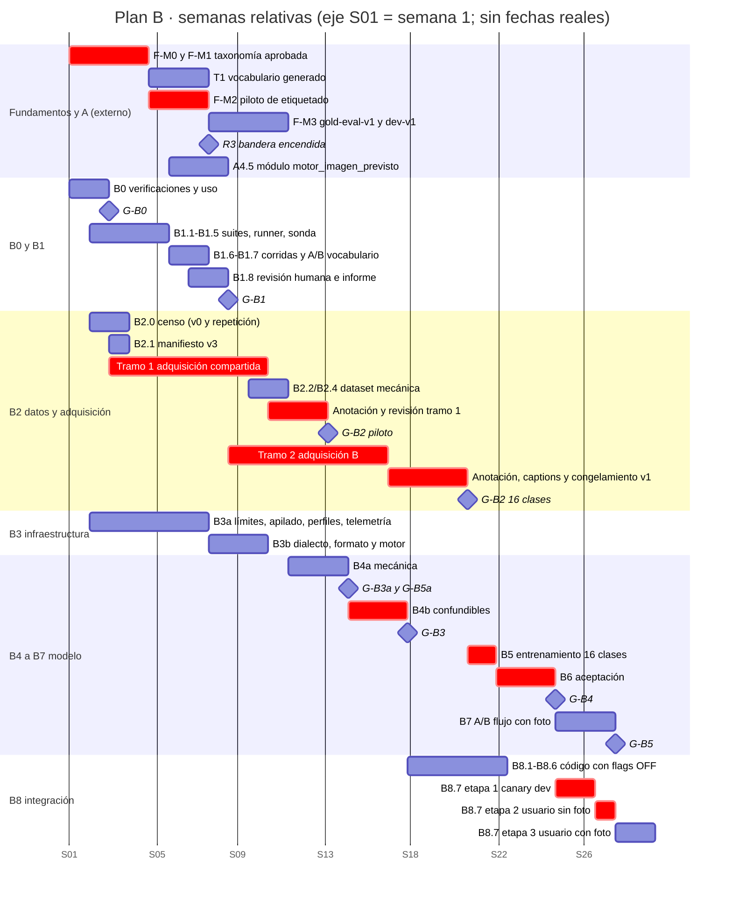

# 02 · Plan B: sub-LoRA de estructuras (16 oficiales) apilado con el LoRA de estilo, con y sin foto

- **Estado:** borrador v0.2 para revisión, tras dos revisiones adversariales (ML/LoRA y evidencia; producto, integración y riesgo; ver §13). No implementa nada.
- **Fecha:** 2026-09-15. **Base de código:** rama `2026-09-14`, HEAD `1408f22`, con cambios locales sin commit en 6 archivos. Las líneas citadas de `src/app/api/generate/route.ts` y `src/lib/ia/feature-flags.ts` corresponden a la copia de trabajo.
- **Fundamentos que aplica:** `00-fundamentos-compartidos.md` **v0.2**; `taxonomy_version = estructuras-2.0.0` (`[F §4.9]`). Este plan **no redefine** taxonomía, esquema de anotación, particiones, arnés ni renombre: los cita. Donde B necesita un cambio en Fundamentos, lo registra como propuesta `F-CAMBIO-B-nn` (§3.6) y no lo aplica por su cuenta (`[F §1.1]`).
- **Verificación hecha para este plan:** solo lectura del repo y de `data/`; consultas públicas (OpenAPI y precios de fal y Google, 2026-09-15); dos conteos locales de tamaño de imagen con `sharp` (`scratchpad/sizes.cjs` y `scratchpad/sizes-v007.cjs`, este último sobre una copia descomprimida en el scratchpad de `data/lora-artifacts/datasets/lora-dataset-v007-ordenes/dataset.zip`). No se llamó a ningún proveedor de pago ni se escribió en la base de datos.
- **Etiquetas:** **[H]** hecho con evidencia; **[I]** inferencia; **[P]** propuesta que requiere aprobación. Toda cifra no medida lleva **estimación** y sus supuestos.
- **Claves de cita:** `[F §x]` es `00-fundamentos-compartidos.md`; `[A §x]` es `01-plan-A-reconocimiento-y-propuesta.md`; `[C §x]` es `03-plan-C-entrenamiento-reconocimiento.md`. Las demás (`[crítica]`, `[lora_infra]`, `[research_lora]`, `[research_vision]`, `[renombre]`, `[inventario]`, `[reconocimiento]`, `[reconocimiento_externo]`, `[propuesta]`) son las de `[F]` (cabecera).

---

## 1. Resumen ejecutivo

- **Objetivo.** Que la imagen dibuje la estructura oficial que declara el plan (forma y variante primero; conteo y posición como no regresión) sin perder el estilo Sempertex, con y sin foto (DT-3, DT-4), **solo si** medir demuestra que el prompt y el LoRA actual no bastan.
- **Por qué.** Nadie midió v004 en 14 de 16 estructuras `[F §3.3]`; producción usa prompt **JSON** con v004 (`lora-prompt-format.ts:19`; `route.ts:1204,1262`); con foto genera Gemini (`route.ts:1098`); el apilado está bloqueado en 5 sitios; el único fallo medido (arco→aro 5/12) es de Gemini `[crítica §1.4]`.
- **Método.** Fase 0 barata → línea base con contrafactuales **sin entrenar** (formato JSON/texto, frases geométricas, layout→`/edit`) → censo de datos → piloto en dos tramos (mecánica; confundibles) → 16 clases → aceptación con comparadores concurrentes, verdad 100 % humana en los pares que deciden y márgenes fijados por negocio → A/B con foto → despliegue por etapas con flags.
- **Resultado esperado.** Perfil `estilo + estructuras` con soporte registrado por clase **y por régimen** (`photo_mode`), o una decisión documentada de no entrenar.
- **Costo de proveedores (estimación).** ≈US$490–890 en fal y Gemini imagen, hasta ≈US$1040 con una iteración de contingencia; aprobado por tramos ligados a compuertas (§6.10). Aparte: juez VLM, pre-caption y adquisición externa de imágenes (permisos, contraprestación y sesiones pagadas; `[F §7.9]`, guía `04` §6.4, `QB-02`).
- **Esfuerzo y plazo (estimación).** 96–143 persona-días técnicos; ≈30 semanas con 2 personas (ML/evaluación e integración). Revisión humana de generaciones ≈90–170 h.
- **Riesgos principales.** Bajo DT-7 todo el dataset sale de fuentes externas con permiso (guía `04`): tasa real de permisos y de nativas ≥1024 en las clases raras desconocida hasta medir el embudo (las fuentes internas, p. ej. 10/164 pseudo-órdenes y 6/83 web ≥1024 del ZIP v007, ya no cuentan); licencia `pending` de v004 (`DP-14`, bloquea entrenar); que `/edit` + LoRA no supere a Gemini; potencia estadística baja por clase; privacidad de fotos enviadas a fal.

---

## 2. Objetivo, alcance y fuera de alcance

### 2.1 Objetivo

Que la imagen generada represente **la estructura oficial que declara el plan** sin perder la fidelidad de estilo Sempertex, en dos regímenes:

- **sin foto:** `fal-ai/flux-2/lora`;
- **con foto del lugar o de referencia:** `fal-ai/flux-2/lora/edit` con una política de entradas explícita (ADR-0019). Es obligatorio por DT-4; si el A/B no lo aprueba, B **no cancela**: propone una ruta de remediación y escala al negocio (§7, `QB-11`).

Métrica principal: `forma_variante` (forma por clase ∧ variante). Conteo, lado y anclaje se miden como **no regresión**, porque el LoRA enseña cómo es cada clase y no dónde ni cuántas (`[research_lora §8]`, confianza media-alta; §5 P19).

### 2.2 Alcance

1. Fase 0: saldo, apilado real, `/edit` con 1–4 entradas, trainer v1 frente a v2, licencias, dimensionamiento de uso (B0).
2. Línea base por estructura con contrafactuales sin entrenar, con y sin foto; A/B barato de vocabulario (`DP-04`) (B1).
3. Censo de viabilidad, dataset `train-b-v1`, representación intermedia de captions y requisitos de adquisición entregados a `F-DATA` (B2).
4. Infraestructura determinista en dos partes: B3a (límites, apilado, perfiles, telemetría) y B3b (dialecto y motor) (B3).
5. Piloto en dos tramos (B4a mecánica, B4b confundibles), entrenamiento completo (B5) y aceptación (B6).
6. A/B del flujo con foto con control frente a copia (B7).
7. Integración, QA, despliegue gradual, reversión y observabilidad (B8).
8. Slices del renombre de B: `R5` y el vocabulario de captions y triggers (§3.5).

### 2.3 Fuera de alcance

- Taxonomía, anotación, particiones, `gold-eval`, arnés común, adquisición externa compartida (DT-7) y renombre de contratos: Fundamentos (`R0`–`R3`, `R6`, `R7`, `T0`–`T2`, `T4`, `T5`) y Plan A (`R4` → A7, `T3`); B solo es dueño de `R5` (`[F §6.4]`).
- Reconocimiento de referencias y validación plan↔foto: Plan A. Detector entrenado: Plan C.
- Entrenar o servir FLUX fuera de fal (ai-toolkit, SimpleTuner, LoKr, ControlNet propio, ZipLoRA o K-LoRA con entrenamiento): exige licencia BFL y GPU (`[F §9.2]`); solo se reabre con `QB-10`.
- Entrenar un LoRA de estilo nuevo (plan aparte si `DP-14` lo exige; `QB-06`).
- Recalibrar el ×0,7 (`DP-07`, ADR-0017).
- LoRA en el flujo "ajuste de imagen previa" (`esAjusteDeImagen`, `modo-vista-reglas.ts:36-40`): sigue en Gemini; B8 mide la inconsistencia de estilo que eso causa.
- Migrar el registro LoRA a Python: hoy vive solo en TS/Next (`[lora_infra §2.1]`); no se duplica.

---

## 3. Decisiones que aplica y dependencias

### 3.1 Decisiones tomadas (`[F §2.1]`)

| Id | Cómo la aplica este plan |
|---|---|
| DT-1 | Manifiestos, captions y registros nuevos usan **solo** ids `*_organico`/`*_organica`. Los captions ya entrenados (v004, v007) no se reescriben: están ligados por hash (`[F §6.5]`) |
| DT-2 | La cláusula de contorno del caption sale **solo de S1**, la prueba de silueta (`[F §4.3]`). R1 (adaptación al espacio) y R2 (motivo natural) no entran en el caption v1 porque no tienen fuente en inferencia (§B2.4). La mezcla de tamaños es un eje aparte. "organic" no se usa como rasgo distintivo (`[F §6.6]`) |
| DT-3 | Las 16 clases están en el contrato del dataset, el dialecto, las suites y el registro de soporte **desde el día 1**. La **aprobación** por clase depende de los datos y de las compuertas; una clase `provisional_sin_ejemplos` (`[F §4.5]`) se registra como `sin_evaluar`. Lanzar con un subconjunto se pregunta ya (`QB-03`) |
| DT-4 | Un LoRA de estructuras apilado con el estilo, también con foto vía `/edit`. Las compuertas no cancelan DT-4: un no-go dispara remediación y escalamiento (`QB-11`) |
| DT-5 | Pre-etiqueta y pre-caption de IA pasan por revisión humana. El caption se compila de forma determinista desde anotaciones revisadas, pasando por la misma representación intermedia que el plan (B2.4) |
| DT-6 | Este es el Plan B |
| DT-7 | `train-b`, `gen-*`, `venue-inputs-v1` y cualquier foto enviada a `/edit` o al entrenamiento salen **solo de fuentes externas en verde** con manifiesto de procedencia por imagen (`[F §7.1]`, guía `04-guia-fuentes-externas.md`). Las fotos Sempertex propias, v007, blog, pseudo-órdenes y `structure-v001` no se usan para entrenar ni evaluar; solo sirven para marcar `en_dataset_estilo` y deduplicar |

### 3.2 Decisiones pendientes que bloquean o condicionan B

| Id | Qué bloquea en B | Cuándo debe cerrarse |
|---|---|---|
| `QB-01` / `Q-21` (tolerancias por clase y márgenes δ) | Pre-registro de G-B1 y de todas las compuertas inferenciales | Antes de B1.5. Sin respuesta, G-B1 se pospone (§7) |
| `DP-04` (dueño: Plan B) | Vocabulario del dialecto `structure_scene_v1` | Provisional con el A/B de solo prompt (B1.7) antes de B3b; confirmado o revisado en B4b (G-B3) |
| `DP-14` | Entrenar y apilar sobre v004 | **Antes de B4a**, primer entrenamiento (`[F §2.2]`: "Antes de entrenar en B"). B0–B3 y la línea base offline no quedan bloqueados |
| `DP-10` (fuentes internas: **resuelta por DT-7**; queda la plantilla de permiso validada), `DP-15`, `Q-29`, `Q-30` | Fuentes admitidas en `train-b` (solo externas en verde), envío de fotos a fal (entrenamiento y `/edit`), a Gemini y al juez | Antes de B0.3 (una sola imagen) y de B1/B2.2 |
| `DP-13` | Cada tramo de gasto (§6.10) | Antes de B0.2; luego por tramo |
| `DP-01` | Vocabulario por dialecto en el artefacto de taxonomía (`[F §4.8]`) | Antes de B3b |
| `DP-18` | Que el plan declare siempre `estructura_oficial`; sin ella el compilador infiere por nombre | Antes de B8 |
| `DP-20` | Derivación anotación → campos del plan que usa la representación intermedia de captions | Antes de B2.4 |
| `DP-21`, `Q-28` | Volumen, fuente y estratos de `venue-inputs-v1` | Antes de B1 (parte con foto, exploratoria) y de B7 |
| `DP-08`, `DP-09` | Herramienta de etiquetado; almacenamiento de imágenes y pesos | Antes de B2.2 |

### 3.3 Hitos de Fundamentos consumidos

| Hito | Uso en B | Paquete |
|---|---|---|
| `F-M0` (ADR-0010/0011) | Base de ADR-0018, ADR-0019 y ADR-0021 | B3a |
| `F-M1` (taxonomía y guía, estado por clase) | Rúbrica por clase; clases con compuerta | B1.3, B2 |
| `F-M2` (piloto de etiquetado con κ) | κ por clase como compuerta del dataset | G-B2 |
| `F-M3` (`gold-eval-v1`, `dev-v1`) | Solo **disyunción** de `train-b`. B no usa `gold_eval` para generar ni para compuertas de generación (`[F §8.4]`) | B2.2 |
| `F-M4` (arnés común) | Formato de run y compuertas en JSON (`[F §8.5–§8.7]`); CI determinista | B1.4, B6 |
| `T1` (`[F §6.8]`) | Vocabulario generado para el dialecto nuevo | B3b |
| `R1` (`[F §6.4]`) | `ia:test-lora-compiler` y `lora:test-product-runtime` en CI antes de tocar compilador y apilado | B3a |
| `R3` **encendido** (`ESTRUCTURAS_EMITIR_ID_ORGANICO`) | Ids nuevos emitidos; si `DP-19` cambia el texto compilado sube `LORA_CAPTION_COMPILER_VERSION` y obliga a repetir brazos | B3b, B6, B8 |

### 3.4 Dependencias con los otros planes

| Plan | Qué necesita B | Qué entrega B |
|---|---|---|
| **A** | `R2`/`R3`; `DP-18`; A2 (el plan declara la estructura); **A4.5**: módulo único de servidor `motor_imagen_previsto` y ADR-A3 (allowlist según motor), que B extiende en vez de crear otra regla (`[A §A4.5]`); **A5**: QA con criterios atómicos y conteo por detección, y retiro de `IMAGE_QA_NON_BLOCKING` (A5.5), que B reutiliza | Mediciones por estructura de Gemini imagen y de v004 (B1); extensión de A4.5 con la capacidad del perfil (B3b); etiquetas humanas de generaciones para recalibrar la QA (B6/B7) |
| **C** | Detector validado en `gen-eval-v1` como contador (`[C §C6.5]`) | **`gen-eval-v1`**: subconjunto de imágenes de B6/B7 anotado por humanos con cajas `F-ANN`, excluido de `train_c` salvo el experimento CE4 con ablación (`[C §C6.5, CE4]`); umbral de uso como juez pre-registrado en conjunto |
| **Fundamentos** y guía `04` | Programa único de adquisición externa (`F-DATA`, nodo ACQ, `[F §1.5, §7.7]`; ejecución según guía `04` §5–§6); `venue-inputs-v1` | Requisitos de B para la lista de tomas (B2.3) y propuestas `F-CAMBIO-B-nn` (§3.6) |

### 3.5 Slices del renombre que pertenecen a B (`[F §6.4]`, `[F §6.6]`)

| Slice / tarea | Contenido en B | Paquete |
|---|---|---|
| `R5` | `scene_v004` y la QA de v004 quedan **intactos**; el vocabulario nuevo existe solo en `structure_scene_v1` y en la QA del perfil de estructuras | B3b, B8.4 |
| B-REN-1 | `LoraStructureTypeSchema` pasa de 7 clases (`src/lib/lora/schema.ts:6-14`) a los 16 ids generados (`[F §4.8]`), sin alias obsoletos | B2.1 |
| B-REN-2 | Trigger nuevo `eventdecor_structure_v2`, ligado a `estructuras-2.0.0`. Se elimina el literal `eventdecor_structure_v1` de 5 sitios: `schema.ts:220`, `src/lib/lora/dataset-builder.ts:30`, `src/app/api/lora/datasets/route.ts:53-54`, `datasets/preview/route.ts:37`, `LoraStructureConsole.tsx:125` | B3a |
| B-REN-3 | Sustantivos base del dialecto nuevo sin "organic"; contorno con frase de S1; mezcla con "mixed-size / uniform-size balloons" (candidatos de `[F §6.6]`, elegidos por B1.7) | B1.7, B2.4, B4b |
| B-REN-4 | En el dialecto nuevo, `semiarco` y `semiarco_organico` producen textos distintos (hoy no: `lora-caption-compiler.ts:161,972`; `[renombre §2.6]`) | B3b |
| B-REN-5 | Nunca reescribir captions de v004, v005, v007 ni `structure-v001` | Todos |

### 3.6 Propuestas de cambio a Fundamentos (no se aplican desde B)

| Id | Propuesta | Motivo | Si no se acepta |
|---|---|---|---|
| `F-CAMBIO-B-01` | `[F §8.4]`: permitir la suite sin foto como 16 clases × **8 prompts × 2 semillas** (mismas 256 imágenes por brazo) | La unidad estadística es el prompt; 4 semillas del mismo prompt están correlacionadas y aportan menos n efectivo que prompts distintos (§6.0b) | B usa 4 × 4 y reporta intervalos por bootstrap por prompt, más anchos |
| `F-CAMBIO-B-02` | `[F §7.4]`/`DP-21`: `venue-inputs-v1` con dos estratos disjuntos por cluster, `iteracion` y `compuerta` | Sin ellos, la parte con foto itera y decide sobre las mismas fotos (`[F §1.4]` regla 3) | La parte con foto de B1 y B4 queda sin compuerta; solo B7 decide |
| `F-CAMBIO-B-03` | `[F §7.7]`: la lista de tomas incluye **pares antes/después** con el mismo encuadre (trípode) por montaje y fotos del lugar vacío | Habilitan `flux-2-trainer-v2/edit` (15–50 pares, `[research_lora §1]`) y `venue-inputs-v1` | La remediación del flujo con foto (B7) no tiene datos |

---

## 4. Línea base verificada y brechas

| # | Hecho | Evidencia | Brecha para B |
|---|---|---|---|
| L1 | En producción el estilo es `lora-run-v004-1000`: trigger `eventdecor_style_v2`, 154 imágenes, 1000 pasos, lr 5e-5, rank 16; aprobado 6/6 a 0,8 con un panel de **composición** ("arco 3D que cierra, dos columnas separadas, mesa en cuadro"); licencia `pending` | `[F §3.3]`; `[lora_infra §1.1]`; `sempertex-lora.ts:210-216` | Sin medición por estructura ni de estilo propiamente dicho; licencia abierta (`DP-14`) |
| L2 | **Con v004 el prompt de producción es JSON por defecto.** `JSON_DEFAULT_TRIGGERS = {"eventdecor_style_v2"}` ("Product decision (2026-09-14)… in 2 cases"); `resolveLoraPromptFormat` se llama con `resolvedLoras?.[0]?.trigger`; la UI arranca en `automatico` y no envía `promptFormat`; con `json` el prompt principal es el JSON (tope 1800 caracteres) | `src/lib/ia/lora-prompt-format.ts:13-19,26-28`; `route.ts:1204,1262`; `src/app/page.tsx:533,1285`; `src/lib/lora/formato-prompt-cliente.ts:27-30`; `lora-caption-compiler.ts:16` | Toda línea base en texto mide otra cosa. El formato se decide por el **primer** trigger, no por perfil. El comentario de `lora-caption-compiler.ts:13-14` ("only sent when the user selects it") quedó desactualizado |
| L3 | Con foto, referencias o ajuste, el modo usuario no usa LoRA y el servidor lo rechaza | `modo-vista-reglas.ts:36-40`; `route.ts:1098` | DT-4 exige abrir `/edit` |
| L4 | `/edit` existe tras `SEMPERTEX_LORA_EDIT=true`, documentado como experimento de **condicionamiento por layout**; `buildInputs` ordena lugar (1), referencia principal (2), **fotos de producto** (3) y referencias extra (4); con LoRA `inputLimit = max(16, …)` y `prepararReferencias` recorta a 4. Como el servidor rechaza LoRA con lugar o referencias, hoy ese flag solo manda **fotos de producto**, incluso sin foto del cliente | `sempertex-lora.ts:221-231`; `route.ts:682,691,695,698,1118-1119` | Sin política de entradas; un alias del flag cambiaría el flujo sin foto |
| L5 | `fal-ai/flux-2/lora/edit`: `loras` máx. 3 (escala 0–4), `image_urls` máx. 4, `guidance_scale` 2,5 y 28 pasos por defecto, sin parámetro de *strength* | OpenAPI 2026-09-15: https://fal.ai/api/openapi/queue/openapi.json?endpoint_id=fal-ai/flux-2/lora/edit | Que el efecto se aplique no está verificado (B0.3) |
| L6 | Apilado bloqueado en 5 sitios: `validarUnaAplicacion` en `generarConSempertexLora` y en `ensureLoraTriggers`; `assertLoraCompatibility` (máx. 1); refine de `LoraSelectionSchema`; `test-lora-specializations.ts:30-43`. Además el inventario de códigos de `test-ui-error-contract.ts:143-151` y la regex de 409 de `route.ts:1326`, que no incluye `PREFLIGHT` ni `LANGUAGE` | `sempertex-lora.ts:233-235,274,406`; `compatibility.ts:25`; `schema.ts:78-83` | Desbloqueo controlado con inventario completo (B3a) |
| L7 | La compatibilidad exige igual `baseModel`, `tokenizerRevision` **y** `resolution`, y escala 0–1,5 | `compatibility.ts:27-36` | Normalizar `tokenizerRevision` y `resolution` (B3a) |
| L8 | `lora_generation_profiles` tiene columnas fijas `product_artifact_id` y `structure_artifact_id` (máximo real 2 pesos), **defaults** `product_scale 0.3` y `structure_scale 0.6`, e índice único que permite **un solo perfil activo global**; 0 filas | `scripts/migrations/016_lora_specializations.sql:109-127`; `[lora_infra §2.2]` | Evaluar a 0,3 "es hacer trampa" (`[lora_infra §1.5]`): quitar defaults; activación por slot (B3a) |
| L9 | El compilador elige dialecto por el primer trigger (`lora-caption-compiler.ts:77-78`; `route.ts:1221`); el presupuesto de 750 descuenta un trigger (`:27,1241-1242`); el preflight ya valida N triggers | Código | Dialecto, formato y presupuesto por perfil (B3b) |
| L10 | Con LoRA la QA **no bloquea ni reintenta**; con Gemini reintenta y bloquea con 422 (`bloquearPorQa`). El flag local sin commit `IMAGE_QA_NON_BLOCKING` altera ese bloqueo. El observador usa `MODELO_CHAT` (Gemini) con plazo de 30 s | `route.ts:124-130,1303-1317`; `feature-flags.ts:75`; `image-qa.ts:273-287` | Pasar a `/edit` quita garantías de QA del flujo con foto (B7, B8.4). El juez de B no puede ser Gemini para el brazo Gemini |
| L11 | Ruta de entrenamiento: pasos 100–2000, lr ≤ 1e-4, trainer v1 por defecto, US$0,0064/paso; para `structure` exige licencia `verified`, revisión aprobada, `structure_types` y `caption_audit`. Autenticación por una contraseña compartida | `api/lora/trainings/route.ts:12-13,19-20,75-85`; `src/lib/auth/request.ts:23-28` | Límites por endpoint y tope de gasto en servidor (B3a) |
| L12 | Trainers de fal: v1 pasos 100–10000; v2 "V2 input with multi-resolution bucketing.", pasos 100–20000, "images of a consistent style"; ambos lr 5e-5 por defecto, 5 parámetros, salidas `diffusers_lora_file` y `config_file`, sin rank, batch ni checkpoints; "0.0064 * steps" | OpenAPI v1/v2; https://fal.ai/models/fal-ai/flux-2-trainer-v2 | Batch desconocido: "pasadas" no calculables sin `config_file` (B0.4) |
| L13 | Precios: `flux-2/lora` US$0,021/MP; `/edit` US$0,021/MP de entrada y salida, entradas reescaladas a 1 MP; recargo solo si los LoRA suman >2 GB (dos pesos de 332 548 896 bytes) | https://fal.ai/models/fal-ai/flux-2/lora; https://fal.ai/models/fal-ai/flux-2/lora/edit; `[crítica §1.3]` | Sin recargo al apilar dos |
| L14 | Gemini imagen: `gemini-3.1-flash-image` a 2K, `calidad: "alta"`; US$0,101/imagen 2K; entrada US$0,50/M tokens | `src/lib/gemini.ts:4`; `src/lib/ia/gemini/imagen.ts:96`; https://ai.google.dev/gemini-api/docs/pricing (2026-09-15) | Brazo de referencia con foto |
| L15 | **Resolución por fuente, ZIP de v007 (336 imágenes), lado menor:** órdenes 89 (14 <768; 19 de 768–1023; 56 ≥1024); pseudo-órdenes `9500*` 164 (13; 141; **10**); web 83 (21; 56; **6**). Las órdenes están excluidas (`[F §7.1]`). Otros conjuntos: `sempertex-training-v001` 99/200 <1024; `recaption-v004/original` 77/154; `sempertex-full-v001` 0/200, pero 113 miden exactamente 1024 porque el script reescala con LANCZOS | `scratchpad/sizes-v007.cjs` (solo lectura); `scratchpad/sizes.cjs`; `scripts/build-sempertex-full-training-dataset.py:26-28` | En las fuentes con licencia plausible hay 16/247 nativas ≥1024. Las fotos Sempertex propias con licencia de entrenamiento probablemente son las del estilo v004 **[I]**, con riesgo de doble dosis (B2.0 lo verifica por sha256) |
| L16 | Datos por clase: indicios sin revisión humana; `arco_no_denso` y `columna_no_densa` 0, `pared_no_densa` 1, orgánicas 1–6, `aro_circular` 7, `techo_globos` 0 confirmadas | `[F §3.4]` | Adquisición dimensionada en montajes (B2.3) |
| L17 | Protocolo reutilizable: semillas `[101…606]` y escalas {0,8; 1,0} (`scripts/eval-lora-nuevo.ts:27-28`); promoción 5/6 (`scripts/promover-lora.ts:20`); runner con payload literal y gasto contra saldo (`scripts/exp-fal-lib.ts:1-40`) | Código | Base del runner B1.4 |
| L18 | `ai_call_log` ya tiene `coste_estimado`, `pricing_id`, `unidades_facturadas` y la tabla `ai_model_pricing` con `tipo_unidad ∈ {millon_tokens, generacion, segundo, corrida}`; fal registra `unidadesFacturadas: 1` por imagen; no hay columna de código de error ni de perfil. `registrarLlamadaIA` es API pública de `packages/agente-core` | `scripts/migrations/021_ai_call_log.sql`; `sempertex-lora.ts:290-303`; `packages/agente-core/src/telemetria.ts:150` | Con `/edit` el costo por "generación" es incorrecto (se cobra por MP de entrada y salida). Migración y versión de API (B3a) |
| L19 | Plazos: la ruta tiene `maxDuration = 120`; fal tiene plazo propio de 105 s; la QA suma hasta 30 s | `route.ts:71`; `sempertex-lora.ts:282`; `image-qa.ts:280` | 105 + 30 > 120: el peor caso actual ya puede exceder la ruta. Presupuesto de latencia de punta a punta (B8) |
| L20 | La guía de creatividad fija `guidance_scale` (1,5–5) y suma pistas al prompt | `sempertex-lora.ts:260-263`; `route.ts:1122,1223`; commit `f57a0f3` | Factor no controlado entre brazos si no se fija (§6.0b) |
| L21 | `resolveLoraSelection` valida `backed_up`, `approved` y URL, pero **no** la licencia | `src/lib/lora/mode-resolver.ts:188-210` | Fallo cerrado por licencia para artefactos de estructuras (B3a) |
| L22 | El motor se decide en tres sitios: cliente (`usarLoraEfectivo`), servidor (`route.ts:1098`) y chat, que restringe el catálogo porque la UI siempre manda `loraMode` | `modo-vista-reglas.ts:36-40`; `page.tsx:1005`; `chat/route.ts:212-224` | Una sola regla: el módulo de A4.5, extendido por B (B3b) |
| L23 | Licencias: FLUX.2 [dev] no comercial fuera de fal; fal marca "Commercial use". Fotos Sempertex propias: `entrenamiento_lora` y `evaluacion_local`, **no** envío a proveedores para evaluar ni `image_inference` hasta `Q-12` | https://huggingface.co/black-forest-labs/FLUX.2-dev; `[F §7.1, §9.2]` | Entrenar y servir solo en fal; B0.3 no usa fotos Sempertex propias como entrada de `/edit` (DT-7) |
| L24 | Scripts Python de dataset (`package-fal-final-dataset.py`, `build-sempertex-full-training-dataset.py`) y TS (`build-structure-dataset-v001.ts`, `dataset-builder.ts`); anotador y empaquetador v007 sin versionar | `git ls-files '*.py'`; `[lora_infra §0.7]` | Reutilizar el empaquetado Python; `[F RSK-16]` |

**Brechas que el plan cierra:**

1. No hay línea base por estructura en el formato real de producción, ni contrafactuales sin entrenamiento.
2. No hay prueba empírica de que se apliquen dos LoRA ni de `/edit` + LoRA con las entradas reales.
3. No hay censo de datos con licencia, consentimiento y resolución nativa por clase.
4. No hay dialecto ni representación de captions con fuente garantizada en inferencia.
5. No hay registro de soporte por clase y régimen, ni perfil activo por slot.
6. No hay compuertas con márgenes fijados antes de medir, comparadores concurrentes ni verdad humana en los pares decisivos.
7. No hay flujo con foto medido, ni distinción entre copiar la referencia y controlar la estructura.
8. No hay dueño único de la decisión de motor ni telemetría de costo por MP.

---

## 5. Principios y buenas prácticas

| # | Principio | Fuente | Por qué aplica aquí |
|---|---|---|---|
| P1 | **Medir antes de entrenar; umbrales tras la línea base** | `AGENTS.md` ("Set budgets from requirements and a measured baseline"); `[research_lora §6.2]` | La única señal de fallo (5/12) es de Gemini; v004 nunca se midió por estructura |
| P2 | **Contrafactual sin entrenamiento antes de atribuir una mejora al LoRA** | Principio de ablación; `[research_lora §8]` (layout por `/edit`) | Una frase geométrica en el prompt o el formato JSON podrían bastar; entrenar sin ese brazo sería "hacerlo por hacerlo" |
| P3 | **Medir en el régimen de producción** (formato de prompt, entradas, nivel de creatividad, flags de QA) | Evidencia propia: desalinear formato degradó v004 (`sempertex-lora.ts:210-216`); L2, L4, L10, L20 | Una línea base en texto con v004 no mide lo que ve el cliente |
| P4 | **Criterio y márgenes escritos antes de correr, fijados por requisito y no por el ruido** | ICH E9 (margen de no inferioridad elegido *a priori*); protocolo del repo (`promover-lora.ts:20`); "evaluar a 0,3 es hacer trampa" `[lora_infra §1.5]` | Un margen igual al semiancho del IC premia tener menos datos |
| P5 | **Sin selección y prueba sobre la misma muestra** | Kriegeskorte et al. (2009), *Circular analysis… double dipping*, Nat. Neurosci. 12 | Marcar clases "que necesitan" con una estimación ruidosa y compararlas contra esa misma estimación infla la mejora (regresión a la media) |
| P6 | **La unidad estadística es el prompt o la foto, no la imagen**; comparaciones pareadas con bootstrap por cluster y corrección por multiplicidad | `[F §8.1]` (bootstrap por cluster); Holm (1979), *A simple sequentially rejective multiple test procedure*, Scand. J. Statist. 6 | 4 semillas del mismo prompt están correlacionadas; 16 pruebas por clase sin corrección producen falsos positivos |
| P7 | **Un LoRA multiconcepto, no uno por clase** | Tope `loras` maxItems 3 (OpenAPI, [H]); la suma lineal de LoRA empeora al sumar más (https://arxiv.org/html/2402.16843; **[I]**, confianza media: medido en modelos que no son FLUX.2) | Con el estilo en un slot, 16 LoRA no componen una escena |
| P8 | **Contraste de clases confundibles dentro del mismo modelo mediante captions contrastivos** | `[research_lora §2]` (inferencia propia, confianza media). La analogía con la preservación de clase de DreamBooth (https://arxiv.org/abs/2208.12242) es **[I]** de confianza baja: fal no tiene esa pérdida | `arco`↔`aro_circular` es la confusión observada |
| P9 | **Describir en el caption lo que debe seguir controlable** (color, acabado, lugar) | LyCORIS: captions pobres "can lead to subpar results" (https://arxiv.org/html/2309.14859); `[research_lora §3.3–§3.4]` | Evita que el LoRA de estructuras amarre paleta o look |
| P10 | **Misma representación y renderizador para captions de entrenamiento y prompts de inferencia; ninguna ranura sin fuente en inferencia** | `[research_lora §3.6]`; `sempertex-lora.ts:210-216`; `AGENTS.md` (un dueño por regla) | Un caption con `curva_hacia` que el plan no tiene enseña algo que nunca se podrá pedir |
| P11 | **Geometría en positivo y lo importante primero** | "FLUX.2 does not support negative prompts"; "pays more attention to what comes first" (https://docs.bfl.ml/guides/prompting_guide_flux2, vía `[research_lora §3]`) | "open underneath, two bases on the floor" en lugar de "not a ring" |
| P12 | **Particiones disjuntas por cluster; evaluación nunca usada para iterar** | `[F §7.3–§7.4]`, `[F §1.4]` regla 3 | 43 pares casi idénticos `950*`↔`web` (`[F §3.4]`) |
| P13 | **Resolución nativa y aspectos de inferencia; el reescalado se valida con ablación** | fal: "Minimum resolution: 1024x1024px" (página trainer v2); bucketing en v2 (OpenAPI); `[research_lora §4]` | L15: casi no hay nativas ≥1024 con licencia |
| P14 | **Aumentos que no rompen etiquetas espaciales** | kohya: flip solo "if… no asymmetrical character traits" `[research_lora §4]` | Lado y posición son ranuras del caption |
| P15 | **Sintéticos con tope y ablación, nunca en evaluación** | `[F §7.1, §7.7]` | `[F RSK-14]` |
| P16 | **No confiar en un VLM para contar; rúbrica atómica; juez de otra familia; verdad humana donde se decide** | VLM 58,07 % (https://arxiv.org/abs/2407.06581); DSG (https://arxiv.org/abs/2310.18235); GenEval (https://arxiv.org/abs/2310.11513); autopreferencia de jueces LLM (Panickssery et al., https://arxiv.org/abs/2404.13076; Zheng et al., https://arxiv.org/abs/2306.05685); `[F DT-5, §7.5]` | El juez actual es Gemini y juzgaría al brazo Gemini |
| P17 | **Acuerdo que no colapsa con prevalencia alta** | Byrt, Bishop y Carlin (1993), *Bias, prevalence and kappa*, J. Clin. Epidemiol. 46(5) (PABAK) | Con celdas pequeñas y aciertos frecuentes, κ es inestable |
| P18 | **LoRA para la forma; condicionamiento para cantidad y posición** | `[research_lora §8]` (GenEval; "Make It Count", https://arxiv.org/abs/2406.10210) | La compuerta por clase no debe rechazar una forma bien aprendida por un fallo de conteo |
| P19 | **Deterministas en CI y probabilísticas offline** | `AGENTS.md`; `[F §8.8]` | Compilador, preflight, límites y perfiles en CI; generación y juez offline |
| P20 | **Slices reversibles, flags separados y fallback observable** | `AGENTS.md` ("Fallback behavior must be intentional, observable, and tested") | Sin alias entre flags con semántica distinta (L4) |
| P21 | **Plazos de punta a punta, concurrencia acotada, sin reintento de efectos inciertos** | `AGENTS.md`; `TRAINING_SUBMISSION_UNRECORDED` (`[id]/start/route.ts:226`); L19 | Entrenamientos cobrados; ruta de 120 s |
| P22 | **Procedencia, licencia y consentimiento como controles que fallan cerrado** | `AGENTS.md` ("commercial provenance checks"; "fail closed"); `[F §5.2, §7.1, DP-15]` | L21: el resolver no mira la licencia |
| P23 | **Un dueño por regla** | `AGENTS.md`; `[F §4.8]`; `[A §A4.5]` | Motor, vocabulario y derivaciones con un solo dueño |

---

## 6. Paquetes de trabajo

### 6.0 Tabla de precios y supuestos (fechada; se versiona en `eval/estructuras/precios/2026-09-15.json` [P])

| Concepto | Precio unitario | Fuente | Costo derivado (estimación) |
|---|---|---|---|
| `flux-2/lora` 1536×1024 (1,572864 MP) | US$0,021/MP | https://fal.ai/models/fal-ai/flux-2/lora | **US$0,033/imagen** |
| `flux-2/lora/edit`, salida 1,57 MP + k entradas a 1 MP | US$0,021/MP de entrada y salida | https://fal.ai/models/fal-ai/flux-2/lora/edit | k=1: **US$0,054**; k=2: US$0,075; k=3: US$0,096; k=4: **US$0,117** (supuesto: cada entrada se cobra como 1 MP; B0.3 lo verifica en factura) |
| Trainer v1 o v2 | US$0,0064/paso | Página trainer v2; `trainings/route.ts:20` | **US$6,40 por 1000 pasos** |
| `flux-2-trainer-v2/edit` | "0.0056 * steps * reference_multiplier" | `[research_lora §1]` | ≈US$11,82 por 1000 pasos con 1 referencia |
| Gemini imagen 2K (producción) | US$0,101/imagen; entrada US$0,50/M tokens | https://ai.google.dev/gemini-api/docs/pricing | US$0,101–0,202 por imagen entregada (con reintento correctivo) más la entrada |
| Juez VLM (familia distinta de Gemini, §6.0b) | Página de precios vigente del proveedor elegido (`DP-15`) | — | **A medir**: piloto de 20 imágenes con el uso reportado; no se inventa |
| Revisión humana | 1–2 min por imagen con 10–14 preguntas atómicas | Supuesto sin fuente; el piloto de B1.6 lo mide | Horas por paquete |

**Supuestos comunes de esfuerzo:** 2 personas técnicas que conocen el repo (una de ML/evaluación y una de integración); se excluyen las esperas de entrenamiento y de proveedores; las horas humanas van aparte.

### 6.0b Reglas comunes de evaluación y suites (aplican a B1, B4, B6 y B7)

**Régimen fijado por corrida** (se guarda en `run.json`, `[F §8.1]`): formato de prompt (`texto`/`json`), dialecto y `LORA_CAPTION_COMPILER_VERSION`, política de entradas de `/edit`, nivel de creatividad (se fija en el nivel por defecto de producción; si B0.8 muestra otra distribución, se estratifica), `guidance_scale`, 28 pasos, escalas, estado de `IMAGE_QA_NON_BLOCKING` y de `ESTRUCTURAS_EMITIR_ID_ORGANICO`, commit.

**Estadística:**
1. **Unidad:** el prompt/escena en suites sin foto y el cluster de la foto en suites con foto. Intervalos y diferencias pareadas por **bootstrap por unidad** (`[F §8.1]`); Wilson y McNemar solo como orientación.
2. **Márgenes δ y tolerancias T_c:** vienen de `QB-01`/`Q-21` y se fijan **antes** de la corrida. Nunca se derivan del semiancho de un intervalo. Si no existen, la compuerta afectada reporta estimación e intervalo y **no decide por clase**: decide por familia con la regla pre-registrada.
3. **Multiplicidad:** Holm entre clases dentro de cada compuerta.
4. **Potencia:** B1.8 calcula el efecto mínimo detectable con la varianza medida y fija el n por clase de las suites de compuerta para las 10 clases confundibles (estimación de partida: 48–64 ítems). Una clase bajo ese n queda `sin_evaluar`, no `no_aprobada`.
5. **Sin reutilizar comparadores:** en cada compuerta, v004 y la base se vuelven a correr **a la vez** que el candidato, con la misma versión de compilador y régimen (P5).
6. **Extensiones pre-registradas:** agregar ítems del holdout a una clase solo si el pre-registro lo declara.

**Verdad y juez:**
- `forma_variante` y las métricas decisivas son **100 % humanas** en los brazos que decide cada compuerta (se listan en cada paquete). En el resto, el juez criba y los humanos revisan ≥20 % estratificado más todos los fallos del juez (`[F §8.4]`).
- El juez es de una familia **no evaluada** (p. ej. Claude, sujeto a `DP-15`), ciego al brazo, una imagen por llamada y orden aleatorio.
- Se reporta por brazo y por pregunta: κ, **PABAK**, sensibilidad y especificidad del juez frente a humanos. Si en un brazo la especificidad o la sensibilidad difieren de las de otro brazo más allá de lo pre-registrado, esa pregunta es solo humana.
- Revisores con seudónimo, ciegos a brazo y escala; adjudica un decorador (`DP-11`).

**Suites** (`eval/estructuras/suites/*.json`, congeladas con sha256; compuertas en `eval/estructuras/gates/B-G*.json` validadas contra el esquema de `[F §8.5]`):

| Suite | Uso | Composición | Ítems por brazo |
|---|---|---|---|
| `gen-sin-foto-v1` | Compuertas sin foto | 16 clases × 8 prompts × 2 semillas (101, 202) si se acepta `F-CAMBIO-B-01`; si no, 16 × 4 × 4. Prompts: simple, con conteo, con posición, combinado con otra clase. Extensión por potencia en confundibles | 256 (+ extensión) |
| `gen-dev-v1` | Iteración y marcado "necesita sub-LoRA" | 16 × 8 prompts distintos (otras escenas y colores) × 2 semillas (505, 606) | 256 |
| `holdout_prompts_b` (`[F §7.4]`) | Combinaciones no vistas y **escenas mixtas** (clases confundibles con no confundibles) | 25 escenas × 4 semillas | 100 |
| `venue-inputs-v1` (`[F §7.4]`, `DP-21`) | Con foto; estratos `iteracion` y `compuerta` (`F-CAMBIO-B-02`) | 4 condiciones: **C1** solo lugar; **C2** solo referencia de la clase pedida; **C3** solo referencia de **otra** clase (mide control frente a copia); **C4** lugar + referencia de la clase pedida. Tamaño de referencia: 16 × 4 × 1 prompt × 4 semillas | 256 (a fijar con `DP-21`) |
| `panel-composicion-v004` | No regresión de composición | Protocolo de `promover-lora.ts:20` y `eval-lora-nuevo.ts:27`: 6 semillas a la escala de producción; aprueba 5/6 | 6 |
| `ref-estilo-sempertex-v1` | Fidelidad de estilo | Bajo DT-7, fotos **externas** en verde con estilo comparable (antes: fotos Sempertex propias con `evaluacion_local`; volver a ellas como referencia de estilo solo si el usuario confirma que DT-7 no alcanza a la referencia de estilo, `QB-14`); preferencia humana **pareada y ciega** frente a v004 solo. CSD opcional solo si su licencia lo permite (`[research_lora §6.8]`) | Reutiliza imágenes de la suite |
| `gen-eval-v1` (para C) | Validar el detector de C como contador | Subconjunto estratificado de B6/B7 con cajas humanas `F-ANN` | a acordar con C |

Los prompts **no se escriben a mano**: cada ítem es un `PlanDecoracion` fixture con `estructura_oficial` declarada que pasa por el compilador real (`compileProductPrompt`) y por `buildInputs` con la política de entradas del brazo.

---

### B0 · Verificaciones de Fase 0

**Objetivo.** Eliminar incertidumbres que invalidarían el plan antes de gastar en línea base y datos.

| Id | Tarea | Detalle | Costo (estimación) |
|---|---|---|---|
| B0.1 | Saldo y facturación de fal | `GET https://rest.alpha.fal.ai/billing/user_balance` (`exp-fal-lib.ts:22`), sin imprimir la llave. Registrar saldo, fecha, límite de concurrencia y causa de los 18 errores del 2026-09-15 (`[F §3.7]`) | US$0 |
| B0.2 | ¿`flux-2/lora` aplica **ambos** pesos? | Prompt de producción de v004 (formato JSON, L2), 1536×1024, 28 pasos, guidance 3,5, semillas 101, 202 y 303. Condiciones: **(a)** v004@0,8; **(a')** repetición de (a) (ruido); **(b)** v004@0,8 + v007@0,8; **(c)** v004@0,8 + v007@0,0; **(d)** v007@0,8 solo; **(e)** `[v007, v004]` (orden invertido); **(f)** `loras: []`. Identidad por `--artifact-id` (`exp-fal-lib.ts:24-40`). Distancias: diferencia de píxeles y hash perceptual | 7 × 3 × US$0,033 ≈ **US$0,69** |
| B0.3 | `/edit` + LoRA con 1, 2 y 4 entradas | Solo con una imagen que tenga `entrada_generacion` y `cubre_envio_a_proveedores_ia=true` (foto externa en verde con manifiesto, p. ej. Commons CC0 o foto de un espacio sin personas con permiso escrito; guía `04` §2). **No** una foto Sempertex propia (DT-7; L23). Condiciones (a), (a'), (b), (c), (d) con 1 entrada × 2 semillas; (a) con 2 y con 4 entradas × 1 semilla | 10 × 0,054 + 0,075 + 0,117 ≈ **US$0,73** |
| B0.4 | Trainer v1 frente a v2 | Descargar `config_file` de v004 (v2) y v007 (v1) si siguen accesibles; registrar **batch**, resolución, rank, bucketing y optimizador **antes** de fijar cualquier cuadrícula de pasos. Decisión [P]: v2 para estructuras (bucketing, tope 20000, antecedente v004). Solo si los `config_file` lo contradicen: A/B pagado en B4a | US$0 |
| B0.5 | Diseño de B3a | Límites por endpoint desde el OpenAPI, tope de gasto diario en servidor, migraciones de perfiles y telemetría | US$0 |
| B0.6 | Licencias y términos | (1) Confirmación escrita: entrenar y servir **solo en fal**. (2) `DP-14` con fecha y responsable, como criterio go antes de B4a. (3) Términos de fal sobre tratamiento y **retención** de imágenes enviadas a `/edit` y a entrenamiento (`QB-04`). (4) `DP-10` por fuente | US$0 |
| B0.7 | Presupuesto por tramos | Aprobar `DP-13` para el tramo T0–T1 (§6.10); versionar §6.0 | US$0 |
| B0.8 | Dimensionamiento de uso (solo lectura) | Consultas `SELECT` en transacción `READ ONLY` sobre `ai_call_log` y `plan_audit_log`, filtrando tráfico E2E y local (`Q-20`): proporción de generaciones con foto (`Q-19`); mezcla de `estructura_oficial` por plan (para estimar la tasa de fallback esperada); formato de prompt y nivel de creatividad efectivos; latencia p50/p95 por flujo | US$0 |

**Entregables:** `eval/results/estructuras/b0-verificaciones/run.json` con payloads literales, hashes, gasto por diferencia de saldo y factura por entrada; nota de licencias sin datos personales; informe de uso B0.8 (solo agregados); diseño de B3a.

**Criterios de aceptación (G-B0, §7):**
- saldo ≥ tramo T1;
- B0.2: distancia(b, a) y distancia(b, d) **ambas** mayores que el ruido máximo de (a', a); distancia(c, a) y distancia(e, b) dentro del ruido (tolerancia, no identidad); (f) distinta de (a);
- B0.3: `/edit` responde 200 con `loras` y 1, 2 y 4 entradas; efecto de (b) sobre el ruido; costo por entrada leído en la factura;
- confirmación escrita de licencias y lectura de términos de retención;
- informe B0.8 entregado.

**Dependencias:** `DP-13` (B0.2, B0.3); `DP-15` y una imagen con uso `entrada_generacion` (B0.3). **Esfuerzo:** 3–4 persona-días (estimación). **Costo:** ≈US$1,5 (estimación).

**Riesgos:** pesos de v007 no descargables (se sube la copia `data/lora-backup/sempertex-v007-1000.safetensors` a una URL de la cuenta); no determinismo con semilla fija (se usa el ruido de (a')); no hay imagen apta para B0.3 (se pospone B0.3 sin bloquear B0.2).

**Rollback:** no aplica. **Pruebas:** ninguna determinista; la prueba offline queda archivada. **ADR:** alimenta ADR-0018 y ADR-0019.

---

### B1 · Línea base por estructura y contrafactuales sin entrenamiento

**Objetivo.** Medir en el régimen de producción cómo dibujan hoy las 16 estructuras (base FLUX, v004 y Gemini imagen), y qué parte del problema resuelven cambios **sin entrenar** (formato del prompt, frases geométricas, layout). Con eso G-B1 decide en qué clases hace falta el sub-LoRA.

**Tareas:**

1. **B1.1 Suites** `gen-sin-foto-v1`, `gen-dev-v1` y `holdout_prompts_b` según §6.0b, con fixtures de plan para las 16 clases; se guardan `prompt_sha256`, `compiler_version`, `prompt_format` y `taxonomy_version`.
2. **B1.2 `venue-inputs-v1`, estrato `iteracion`:** inventario de fotos con `entrada_generacion`, `evaluacion_con_proveedor_externo` y `cubre_envio_a_proveedores_ia=true` (`[F §5.2, §7.1]`); nunca `gold_eval` (`[F §8.4]`). Si no hay fotos de lugar vacío con licencia, la suite se declara parcial (C2 y C3) y la brecha pasa a `Q-28`.
3. **B1.3 Rúbrica y juez:** `eval/estructuras/prompts/juez-generacion-estructuras.md` v1.0.0 (semver + sha256): presencia → forma por clase → variante (S1 para contorno; huecos para no denso) → conteo → lado y anclaje → piezas laterales separadas → color → artefactos; con foto, además, lugar preservado y adaptación al espacio. Respuestas `si | no | no_determinable`, esquema cerrado. Conteo y lado también por cajas `box_2d` con prompt de localización separado (`[research_vision §1]`).
4. **B1.4 Runner offline:** lógica importable en `scripts/lib/eval-generacion/` (payload, presupuesto, manifiesto, métricas, **renderizador de layout** desde `SceneSpec` a PNG con cajas) y CLI `scripts/eval-estructuras-generacion.ts`; scripts `eval:estructuras:generacion` y `eval:estructuras:juez`. Invariantes: reutiliza `exp-fal-lib.ts`; `--preview` sin red; `--max-usd`; concurrencia ≤ 4 [P]; plazo por llamada; sin reintento automático de envíos inciertos; reanudación idempotente por `run_id + item_id`; entradas de `/edit` construidas con `buildInputs` y la política del brazo; rechaza manifiestos sin consentimiento (`[F §8.1]`); imágenes a almacenamiento privado (`DP-09`).
5. **B1.5 Sonda geométrica sin entrenamiento** `structure_probe_v0` (solo en `scripts/lib/eval-generacion/`, no en producción): el prompt de `scene_v004` más cláusulas geométricas por clase tomadas de los candidatos de `[F §6.6]` y de la ficha de `[F §4.5]`. Sirve de contrafactual y de primer borrador de `structure_scene_v1`.
6. **B1.6 Corridas** (régimen de §6.0b):

   | Brazo | Suite | Imágenes | Costo (estimación) |
   |---|---|---|---|
   | 1. Base `loras: []`, prompt texto | `gen-sin-foto-v1` | 256 | US$8,45 |
   | 2. v004@0,8, formato **JSON** (producción) | `gen-sin-foto-v1` | 256 | US$8,45 |
   | 3. v004@0,8, formato texto | `gen-sin-foto-v1` | 256 | US$8,45 |
   | 4. v004@0,8 + `structure_probe_v0` | `gen-sin-foto-v1` | 256 | US$8,45 |
   | 5. Base + `structure_probe_v0` | `gen-sin-foto-v1` | 256 | US$8,45 |
   | 6. Gemini imagen 2K (flujo actual, con reintento y QA) | `gen-sin-foto-v1` | 256 | US$25,9–51,7 |
   | 7. Marcado "necesita sub-LoRA": v004 formato de producción | `gen-dev-v1` | 256 | US$8,45 |
   | 8. Diagnóstico v004 a {0,6; 1,0} (`[research_lora §6.2]`) | `gen-dev-v1`, 16 × 2 prompts × 2 semillas | 128 | US$4,22 |
   | 9. Layout renderizado → `/edit` + v004 (1 entrada) | `gen-dev-v1`, 16 × 2 × 2 | 64 | US$3,46 |
   | 10. Con foto, exploratorio: Gemini, `/edit` + v004, `/edit` + v004 + sonda | `venue-inputs-v1/iteracion`, 128 por brazo | 384 | US$26,7–55,9 más entrada de Gemini |
   | 11. A/B de vocabulario (B1.7) | `gen-dev-v1`, 10 clases × 8 × 2 × 2 candidatos | 320 | US$10,56 |
   | Juez | todas | ≈2500 | a medir (20 imágenes primero) |
   | **Total** | | | **≈US$121–176 + juez** |

7. **B1.7 A/B de solo prompt para `DP-04`:** candidatos de `[F §6.6]` para contorno (frase de S1) y mezcla, en las 6 variantes y sus bases (`arco`, `arco_organico`, `arco_no_denso`, `semiarco`, `semiarco_organico`, `columna`, `columna_organica`, `columna_no_densa`, `pared_densa`, `pared_no_densa`) con v004. Se elige el candidato con mayor `forma_variante` humana (bootstrap por prompt). Cierra `DP-04` **provisional**, que desbloquea B3b; B4b lo confirma.
8. **B1.8 Revisión humana y reporte:**
   - calibración del juez: 100 imágenes estratificadas por clase y brazo, dos revisores ciegos; κ, PABAK, sensibilidad y especificidad por brazo y pregunta;
   - **100 % humano** en los brazos 2, 4 y 7 (los que deciden G-B1) y en el brazo 11 (decide `DP-04`);
   - resto: juez + ≥20 % + fallos;
   - análisis de potencia (§6.0b regla 4) para fijar el n por clase de `gen-sin-foto-v1` en B6;
   - reporte por clase: `forma_variante` (principal), conteo, lado, anclaje, matriz de confusión, fuga, color, artefactos; por formato de prompt.

**Entregables:** suites congeladas; runner, renderizador de layout y prompts versionados; `eval/results/estructuras/b1-linea-base/<run_id>/run.json` por brazo; informe; `B-G1.json` pre-registrado **antes** de B1.6 con T_c de `QB-01`; decisión provisional de `DP-04`; recomendación sobre `prompt_format` para ADR-0018.

**Criterios de aceptación medibles:**
- 100 % de ítems con payload literal, régimen, hash y costo estimado y reportado;
- cobertura ≥ 95 % de ítems válidos por brazo (fallos del proveedor con código);
- acuerdo juez–humano reportado por brazo y pregunta;
- efecto mínimo detectable por clase reportado y n de B6 fijado con esa regla.

**Dependencias:** G-B0; `F-M1` (rúbrica por clase); `QB-01` (pre-registro); `DP-15` y `DP-21` para la parte con foto.

**Esfuerzo (estimación):** 14–20 persona-días (runner y renderizador 4–5; suites y fixtures 3–4; sonda y rúbrica 3; corridas 1–2; análisis y potencia 3–6). Revisión humana: calibración 4–7 h; 100 % de 1088 imágenes ≈18–36 h; muestra del resto ≈5–10 h (supuesto 1–2 min por imagen).

**Costo:** ≈US$121–176 + juez (estimación §6.0).

**Riesgos:** n por clase insuficiente (se agrega por familia y se fija n de B6 por potencia); la sonda resuelve casi todo (resultado válido: G-B1 recomienda integrar solo el prompt); falta de fotos con licencia para la parte con foto (se declara parcial).

**Rollback y flags:** no aplica.

**Pruebas a añadir:** **deterministas:** `eval:test-metricas-generacion` (bootstrap por unidad, Holm, PABAK, agregación sobre veredictos grabados), validación de suites y compuertas contra esquema, `--preview` sin red, cálculo de costo por MP, rechazo de manifiestos sin consentimiento, renderizador de layout con fixture; **offline:** corridas B1.6.

**ADR:** no (usa ADR-0014).

---

### B2 · Censo, dataset `train-b-v1`, representación de captions y requisitos de adquisición

**Objetivo.** Un dataset con licencia y consentimiento, sin fuga, con resolución validada y balanceado, cuyos captions salen de la misma representación que el plan en inferencia, para las 16 clases.

**B2.0 Censo de viabilidad (nuevo, sin pagos).**
- Script `scripts/lora/estructuras/censo-train-b.ts` (CLI separado de `scripts/lib/train-b/`), solo `--preview`.
- Cuenta por clase y por fuente, en este orden de filtros: licencia y `usos_permitidos ∋ entrenamiento_lora`; consentimiento y `cubre_envio_a_proveedores_ia` (subir a fal es envío a proveedor, `[F §5.2]`); PII tratada; resolución nativa (<768, 768–1023, ≥1024); deduplicación y tope por cluster; estado de clase de `F-M1`.
- Marca `en_dataset_estilo=true` por sha256 contra `recaption-v004/original` y los ZIP del estilo (riesgo de doble dosis, L15).
- Bajo DT-7 se corre sobre el manifiesto de ingesta externa (`ingesta-externa.v1.jsonl`, guía `04` §5.2) desde el piloto de la guía (semanas 1–2) y se repite con los manifiestos de `F-DATA` tras `F-M2`. Las fuentes internas solo se leen para marcar `en_dataset_estilo` y deduplicar.
- **Salidas:** N disponible por clase para B4a y B4b; clases que no llegan al mínimo; recálculo del tamaño del piloto `N_p` (la cifra anterior de 250–350 no tenía respaldo y se retira).

**B2.1 Contrato `lora-dataset-manifest.v3` [P]** (en `src/lib/lora/schema.ts`, junto al v2, que no se toca):
- `specialization: "structure"`; `trigger` validado contra `^eventdecor_structure_v\d+$`;
- `taxonomy_version`, `annotation_schema_version: "anotacion-estructuras.v1"`, `caption_dialect`, `caption_ir_version: "EscenaEstructurasCaption.v1"`, `caption_compiler_version`, `caption_format` (`texto` o `json`), `style_trigger_reservado`;
- `structureTypes ⊆` los 16 ids generados (`[F §4.8]`);
- por imagen: `image_sha256`, `dedup_cluster_id`, `event_group_id`, `particion: "entrenamiento"` con `usos_entrenamiento ∋ "lora"` (`[F §5.2]`), `native_min_side_px`, `reescalada`, `flip_derivada_de`, `en_dataset_estilo`, `license_ref`, `consent_ref`, `cubre_envio_a_proveedores_ia`, `pii_tratamiento`, `annotation_sha256`, `ir_sha256`, `caption_sha256`;
- `productMentionPolicy: "forbidden"` (`schema.ts:211`); `additionalProperties: false`.

**B2.2 Selección** (`scripts/lora/estructuras/construir-train-b.ts`, con `--preview`):
1. Solo anotaciones `F-ANN` revisadas con licencia verificada, uso `entrenamiento_lora`, consentimiento que cubra el envío a fal y PII tratada (`[F §7.1, §7.2]`). Falla cerrado si falta cualquiera.
2. **Disyunción:** 0 `dedup_cluster_id` compartidos con `gold-eval-v1`, `dev-v1` y `venue-inputs-v1`.
3. **Resolución:** nativas ≥1024 admitidas; <768 excluidas; 768–1023 solo reescaladas sin IA generativa (LANCZOS, refactorizando `build-sempertex-full-training-dataset.py:26-31` a módulo importable), marcadas `reescalada=true`, y **en la proporción que decida la ablación de B4a** (nativas frente a nativas + reescaladas en una clase dominante). Hasta esa decisión no hay tope fijo pre-aprobado.
4. **Encuadre [P]:** mayoría de escenas completas con anclajes visibles; recortes solo si conservan pies, soporte o techo (`[research_lora §4]`); `centro_mesa` y `bouquet` admiten primer plano.
5. **Aspecto:** 3:2 y 2:3 en proporción cercana a producción (`sempertex-lora.ts:198-204`), apoyado en el bucketing de v2.
6. **Balance multietiqueta:** selección voraz determinista que maximiza la cobertura de las clases con menor disponibilidad, con topes por clase y por cluster (ningún cluster aporta más del 20 % de una clase [P]); **no duplica** imágenes (fal no tiene `num_repeats`, `[research_lora §4]`). `--preview` reporta conteos por clase antes y después.
7. **Doble dosis:** las imágenes `en_dataset_estilo=true` se limitan y su efecto se mide en B4a (interferencia de estilo), no se asume.
8. **Contexto y negativos:** 5–10 % de escenas sin estructuras oficiales o con negativos (`[F §4.2]`).
9. **Sintéticos:** fuera de `train-b-v1` (`[F §7.7]`).

**B2.3 Requisitos de adquisición para la lista de tomas única de `F-DATA`** (`[F §1.5]` nodo ACQ, `[F §7.7]`). B no contrata por su cuenta; entrega sus requisitos y el dimensionamiento en **montajes** (un montaje fotografiado desde varios ángulos = un cluster):

La columna "Piso hoy" es un indicio interno que **no cuenta** para las metas bajo DT-7; las metas de montajes externos por clase están en `[F §7.7]` y guía `04` §6.1, y cubren estos mínimos de `train_b`.

| Clase | Piso hoy (`[F §3.4]`, indicio no usable) | Censo B2.0 | `train_b` mínimo (imágenes) | Montajes mínimos para `train_b` (tope 20 %/cluster ⇒ ≥5) | `gold_eval` (instancias efectivas por cluster, `[F §7.7]`) | Pares antes/después (B) |
|---|---|---|---|---|---|---|
| `arco` | 66–68 | a medir | 40 | 5 | 100 | sí |
| `arco_organico` | 1 | a medir | 40 | 5 | 50 | sí |
| `arco_no_denso` | 0 | a medir | 40 | 5 | 50 | — |
| `semiarco` | 5–11 | a medir | 40 | 5 | 100 | sí |
| `semiarco_organico` | 6 | a medir | 40 | 5 | 100 | sí |
| `columna` | 68–73 | a medir | 40 | 5 | 100 | sí |
| `columna_organica` | 5 | a medir | 40 | 5 | 100 | — |
| `columna_no_densa` | 0 | a medir | 40 | 5 | 50 | — |
| `guirnalda` | 92–103 | a medir | 40 | 5 | 50 | sí |
| `aro_circular` | 7 | a medir | 40 | 5 | 100 | sí |
| `pared_densa` | 40–41 | a medir | 30 | 5 | 50 | sí |
| `pared_no_densa` | 1 | a medir | 30 | 5 | 50 | — |
| `centro_mesa` | 11–12 | a medir | 30 | 5 | 50 | — |
| `bouquet` | 121–125 | a medir | 30 | 5 | 50 | — |
| `figura` | 15 (+15 candidatas) | a medir | 30 | 5 | 50 | — |
| `techo_globos` | 0 confirmadas | a medir | 30 | 5 | 50 | sí |

- **Mínimos de `train_b`:** 40 en las 10 clases confundibles (lista de `[research_lora §4]` más la familia `columna` por el fallo F1, `[F §7.7]`) y 30 en las demás; metas 80–150 y 40. Totales: mínimo 10 × 40 + 6 × 30 = **580** imágenes-clase; meta 10 × (80–150) + 6 × 40 = **1040–1740**. Confianza baja (`[research_lora §4]`); se valida con la curva de datos de B4b.
- **Conclusión [I]:** la adquisición la dominan `gold_eval` y la guía de Fundamentos (≈480 montajes solo para las 6 variantes, `[F §7.7]`). El incremento propio de B es ≥5 montajes por clase para entrenamiento (≤80, compartibles cuando un montaje tiene varias clases), los pares antes/después (15–50 en total, `[research_lora §1]`) y las fotos de lugar de `venue-inputs-v1`.
- **Requisitos específicos de B en la lista de tomas:** escena completa horizontal y vertical con anclajes visibles; celular y profesional; **par antes/después** con trípode y mismo encuadre (`F-CAMBIO-B-03`; en la práctica solo por sesión pagada o titular dispuesto a fotografiar); lugar vacío con permiso del lugar; permiso escrito que cubra entrenamiento en un proveedor tercero (fal) y envío a proveedores de IA; tope por titular ≤5 % (guía `04` §7.1); sin marcas de agua, personajes con licencia ni menores; consentimiento de personas.
- **Tramos:**
  - **Tramo 1 (compartido, `F-DATA`, calendario de la guía `04` §6.3: `gold-eval-v1` hacia la semana 8, mínimo de 1.300 montajes hacia la semana 8–10):** `gold_eval`, guía y el mínimo de `train_b` de `aro_circular`, `semiarco`, `semiarco_organico`, `arco_organico` y `columna_organica`. Se justifica antes de G-B1 porque también lo consumen A y C.
  - **Tramo 2 (incremento de B, tras G-B1 y G-B5a):** volumen hasta la meta de `train_b` y pares antes/después.
- **Estructura de cotización (DT-7):** permisos × contraprestación (`Q-29`) + sesiones pagadas en eventos reales para huecos (US$1.000–6.000 por sesión, estimación de la guía `04` §6.4) + licencia de datos solo si se justifica (`QB-02`). Las horas de contacto y gestión de permisos (≈20–40 min por permiso) están en `[F §7.9]` y no se duplican aquí.

**B2.4 Captions desde la representación intermedia `EscenaEstructurasCaption.v1`**

1. **Regla:** el caption de entrenamiento se obtiene **derivando de la anotación los campos equivalentes del plan** con las tablas de `[F §4.7, §4.10]` (`DP-20`) y renderizándolos con el **mismo** renderizador que el prompt de inferencia. Una ranura sin fuente en inferencia no entra.

   | Ranura | Fuente al entrenar | Fuente al inferir | ¿En v1? |
   |---|---|---|---|
   | Triggers | Manifiesto (estructura) + reserva del estilo | Perfil | Sí |
   | Clase (familia + contorno S1 + densidad) y frase geométrica | `estructura_oficial_derivada` → vocabulario por dialecto (`[F §4.8]`) | `estructura_oficial` del plan (`DP-18`) → mismo vocabulario | Sí |
   | Conteo | `grupo_piezas_identicas` → `repeticiones` (`[F §4.10]`) | `repeticiones` | Sí |
   | Posición y soporte | `soporte` + `lado` → `ubicacion` (`[F §4.10]`) | `ubicacion` (`fondo_pared`, `lateral_izquierdo`, `techo`…, `composicion.ts:66-72`) | Sí |
   | Mezcla de tamaños | `mezcla_tamanos` + `rango_tamanos` → `mezcla` (`[F §4.10]`); sin derivación → se omite | `mezcla` | Sí, si deriva |
   | Colores y acabado genéricos | `colores_visibles`, `acabado` (`F-ANN`) | Materiales del plan vía vocabulario de producto | Sí, sin ids ni SKU |
   | Lugar e iluminación genéricos | Pre-caption VLM validado con esquema | `SceneSpec.venue` y brief | Sí |
   | `curva_hacia` | Anotación | No existe en `EstructuraPlanSchema` (`tipos.ts:85-110`) | **No** (salvo que A/F lo agreguen al contrato) |
   | `adapta_al_espacio` (R1), `motivo_natural` (R2) | Anotación | No existen en el plan | **No** |

2. **Vectores dorados:** para cada clase, una anotación y el plan equivalente producen la **misma** IR y el **mismo** texto (y el mismo JSON si se usa).
3. **Formatos:** la IR se renderiza a texto y a JSON con un único renderizador. El formato de entrenamiento sigue a ADR-0018: si la inferencia del perfil es JSON, B4a mide la brecha entre captions de texto y prompt JSON y, si el JSON gana, entrena una corrida con captions JSON (B4a).
4. **`structure_scene_v1` es extensión estricta de `scene_v004`:** mismo cuerpo de escena con cláusulas geométricas insertadas; prueba dorada: quitar las cláusulas insertadas reproduce exactamente la salida de `scene_v004`. Así la diferencia entre brazos aísla el efecto de los pesos.
5. **Plantilla [P]** (estructura primero, P11): `<triggers>, <conteo> <frase de contorno S1> <frase de densidad> <sustantivo de familia> <frase geométrica>, <posición y soporte>, <mezcla>; <estructuras secundarias…>; <colores genéricos y acabado>; set in <lugar>`. Ejemplos de frase geométrica: arco "two bases resting on the floor, open underneath"; aro "closed circular ring frame covered all around"; columna "standing on one base with its top directly above the base"; no denso "spaced balloons with the backdrop visible through gaps along the whole piece"; contorno orgánico: el candidato elegido en B1.7. Sin "organic" como rasgo distintivo y sin negaciones.
6. **Presupuesto:** texto ≤ `LORA_PROMPT_MAX_LENGTH` (750) menos la suma de los triggers del perfil y separadores; JSON ≤ `LORA_JSON_PROMPT_MAX_LENGTH` (1800) menos lo mismo. La longitud del trigger de estilo **se parametriza** (no el 21 fijo de `eventdecor_style_v2, `): si `DP-14` cambia el estilo, se recompila sin reempaquetar a mano.
7. **Pre-caption de IA** (familia según `DP-15`): **solo** lugar, colores dominantes e iluminación, en JSON validado con esquema; nunca clase, conteo ni lado.
8. **Revisión humana de captions:** 100 % en las clases con piso ≤11; 20 % estratificado en las demás; error de geometría = clase, conteo, posición, anclaje o variante mal descritos.
9. **Auditoría automática** `auditarCaptionEstructura`, que falla cerrado si: el trigger no aparece exactamente una vez; se excede el presupuesto; queda español; hay fuga de producto; una instancia anotada con ranura v1 no está representada; aparece `*_asimetrico` u "organic" como variante; la IR tiene una ranura sin fuente en inferencia.
10. **Aumentos:** sin flip por defecto; flip fuera de línea solo con la anotación espejada (lado intercambiado) y la IR recompilada, excluyendo `figura` con letras o números y logos; el flip comparte cluster y no cuenta para mínimos. Sin rotación, perspectiva, estiramiento ni `random_crop` (`[research_lora §4]`).

**B2.5 Congelamiento:** ZIP (empaquetador Python refactorizado desde `package-fal-final-dataset.py`, CLI separada), manifiesto v3 con sha256, copia en almacenamiento privado (`DP-09`); registro en `lora_datasets` con `specialization='structure'`, `license_status='verified'`, `structure_types` y `caption_audit` (`trainings/route.ts:75-85`). `train-b-mecanica-v1` (B4a) y `train-b-pilot-v1` (B4b) se congelan antes.

**Entregables:** censo; esquema v3; IR y renderizador con vectores dorados (compartidos con B3b); scripts de construcción, auditoría y empaquetado con `--preview`; datasets congelados; informes de cobertura (por clase: imágenes, clusters, % reescaladas, % `en_dataset_estilo`, aspectos) y de revisión de captions; requisitos de adquisición entregados a `F-DATA`.

**Criterios de aceptación (G-B2):**
- 0 clusters compartidos con `gold-eval-v1`, `dev-v1` y `venue-inputs-v1`;
- 100 % con licencia verificada, uso `entrenamiento_lora`, consentimiento que cubre el envío a fal y PII tratada;
- κ por clase ≥ 0,6 en `F-M2` para las clases con estado `aprobada`; las `provisional_sin_ejemplos` no entran en la compuerta y se registran `sin_evaluar`;
- clases con el mínimo de la tabla (piloto: solo sus clases);
- 100 % de captions pasan la auditoría y la prueba de extensión estricta;
- revisión humana: 0 errores de geometría en clases revisadas al 100 % y límite superior del IC95 del error ≤ 10 % en la muestra [P] (antecedente: 16,7 % de error se consideró banda amarilla, `[lora_infra §1.6]`).

**Dependencias:** `F-M1`, `F-M2`, `F-M3` (disyunción), `DP-01`, `DP-04` provisional (B1.7), `DP-08`, `DP-09`, `DP-10`, `DP-15`, `DP-20`, B3b (renderizador).

**Esfuerzo (estimación):** 20–32 persona-días (censo 2; esquema 2; IR y renderizador 3–5, compartido con B3b; scripts y refactor Python 5–8; selección y balance 3–5; requisitos de adquisición 2–3; cobertura 1–2; revisión y corrección 2–5). Horas de anotación de `train_b`: `[F §7.9]` (17–101 h), sin sumar las compartidas con `train_c`. Revisión de captions ≈7–10 h (supuesto 1 min por caption).

**Costo de proveedores:** pre-caption de contexto a medir con 20 imágenes y el uso reportado. Adquisición externa: incremento de B (pares antes/después y tramo 2) según `QB-02`; el tramo 1 lo presupuesta `F-DATA` (`[F §7.9]`).

**Riesgos:** el censo confirma que faltan nativas ≥1024 en clases raras (tramo 1 y ablación de reescalado); sesgo de anclaje de pre-etiquetas (`[F RSK-02]`); doble dosis por fotos del estilo; el tramo 1 se retrasa (ruta crítica).

**Rollback:** datasets inmutables y versionados; un error se corrige con una versión nueva del manifiesto.

**Pruebas a añadir (deterministas):** `lora:test-manifest-v3`; `lora:test-train-b-disjuncion`; `lora:test-caption-ir` (vectores anotación ≡ plan equivalente, ranuras sin fuente rechazadas, espejo de lado, presupuestos con trigger parametrizado, extensión estricta de `scene_v004`, `semiarco` ≠ `semiarco_organico`); `lora:test-balance-train-b` (selección voraz reproducible con topes); `lora:test-censo` sobre fixtures; `pytest` del empaquetador (reescalado y rechazo <768).

**ADR:** **ADR-0021** [P] (número a confirmar en `[F §10.3]`): protocolo del sub-LoRA (trigger v2, IR y dialecto, política de resolución decidida por ablación, balance, flips, trainer v2, formato de caption).

---

### B3 · Infraestructura determinista (sin llamadas pagas)

**Objetivo.** Dejar listo, detrás de flags apagados, lo necesario para entrenar, apilar, elegir perfil y medir costo, sin cambiar el comportamiento actual. Se divide para no depender de `DP-04` ni de `T1` antes de tiempo.

#### B3a · Límites, apilado, perfiles, licencias y telemetría (S2–S7; no depende de `DP-04`)

**B3a.1 Límites de entrenamiento y gasto:**
- módulo `src/lib/lora/trainer-endpoints.ts`: registro cerrado (`flux-2-trainer` 100–10000 pasos; `flux-2-trainer-v2` 100–20000; múltiplos de 100; lr en (0, 1e-4]; `costPerStepUsd` 0,0064 con fecha y fuente);
- `CreateTrainingSchema` recibe `trainerEndpoint` y valida `steps` contra ese endpoint; v2 por defecto **solo** para `specialization='structure'`;
- tope de lr 1e-4 como **cota conservadora** (no como evidencia: v2 y v004 cambiaron a la vez pasos, lr y captions, `[lora_infra §1.1]`);
- confirmación de costo sobre `LORA_TRAINING_CONFIRM_ABOVE_USD` (sin variable, siempre se exige) y **tope diario de gasto en servidor** `LORA_TRAINING_DAILY_CAP_USD` que falla cerrado; la ruta hoy solo tiene una contraseña compartida (L11), limitación documentada sin crear roles;
- `FAL_TRAINER_ENDPOINT` solo acepta valores del registro (`[id]/start/route.ts:122`);
- si el receipt agrega campos, se versiona `lora-training-receipt.v2` (`schema.ts:255`).

**B3a.2 Desbloqueo del apilado** detrás de `LORA_STRUCTURE_STACK_ENABLED` (default OFF, en `feature-flags.ts`):
- `validarUnaAplicacion` → `validarAplicaciones` en **ambos** usos (`sempertex-lora.ts:274` y `ensureLoraTriggers`, `:406`), `assertLoraCompatibility` (`compatibility.ts:25`) y el refine de `LoraSelectionSchema` (`schema.ts:78-83`) con una sola regla: flag OFF → exactamente 1; flag ON → **exactamente 1 `product` y como máximo 1 `structure`** (≤2 pesos, que es lo que admite el esquema de perfiles). ≤2 de `structure` solo si ADR-0021 aprueba la alternativa D, con cambio de esquema;
- se actualizan `test-lora-specializations.ts:30-43`, el inventario de `test-ui-error-contract.ts:143-151` y `test-feature-flags` (en CI, `checks.yml:65`);
- se retira `LORA_ALLOW_REJECTED_FOR_TESTING` de `.env.local.example:42` (sin uso, `[lora_infra §4]`), coordinando con el cambio local sin commit de ese archivo.

**B3a.3 Perfiles y soporte por clase y régimen** — migración `scripts/migrations/024_lora_perfiles_estructuras.sql` [P] (número a confirmar; la última es `023`):
- `lora_generation_profiles`: `ALTER COLUMN product_scale DROP DEFAULT` y `structure_scale DROP DEFAULT` (escalas siempre explícitas); `DROP INDEX ux_lora_generation_profiles_active` (activación por slot, no global; con 0 filas, sin pérdida); nuevas columnas `caption_dialect TEXT NOT NULL`, `prompt_format TEXT NOT NULL CHECK (prompt_format IN ('texto','json'))`, `taxonomy_version TEXT`, `photo_mode TEXT NOT NULL CHECK (photo_mode IN ('none','edit'))`, `edit_input_policy TEXT`, `evaluation_id TEXT REFERENCES lora_evaluations(id)`;
- `lora_mode_slots.generation_profile_id TEXT NULL REFERENCES lora_generation_profiles(id)` (la activación es asignar el perfil al slot);
- tabla `lora_profile_structure_support(generation_profile_id, photo_mode, estructura_oficial, taxonomy_version, status CHECK IN ('aprobada','no_aprobada','sin_evaluar'), evaluation_id, created_at, PRIMARY KEY (generation_profile_id, photo_mode, estructura_oficial, taxonomy_version))`: una aprobación sin foto no vale para `/edit`, otras escalas ni otro estilo;
- reversión: script inverso documentado (recrear defaults e índice; soltar columnas y tabla), probado en base desechable.

**B3a.4 Resolver** `resolveLoraProfile` en `src/lib/lora/mode-resolver.ts`: con flag ON y slot con perfil, devuelve `[estilo, estructura]` con escalas, formato y dialecto del perfil; valida `approved`, `backed_up`, URL y **licencia `verified` del artefacto de estructuras (falla cerrado)**. v004 queda como **excepción explícita** registrada en ADR-0018, con condición de retiro "`DP-14` cerrado". Allowlist de catálogo **solo** del dataset de estilo (`productMentionPolicy: forbidden` en estructuras; `[crítica §1.2]`).

**B3a.5 Compatibilidad:** `tokenizerRevision` derivado de `baseModel + familia de trainer` y `resolution` con semántica "resolución de entrenamiento declarada" (1024 con bucketing v2), con script de corrección para v004 y v007 con `--preview` (escritura solo en migración revisada y aprobada).

**B3a.6 Errores:** códigos nuevos `LORA_PROFILE_*` y `LORA_STRUCTURE_LICENSE_*` en la regex de `route.ts:1326` y en el inventario de `test-ui-error-contract.ts`.

**B3a.7 Telemetría** — migración `025_ai_call_log_lora_perfil.sql` [P]: `codigo_error_proveedor`, `perfil_lora_id`, `photo_mode`, `prompt_format`, `mp_entrada`, `mp_salida`; `ai_model_pricing.tipo_unidad` admite `megapixel`; fal registra `unidadesFacturadas` = MP de entrada + salida en vez de 1 (`sempertex-lora.ts:303`). `registrarLlamadaIA` (`packages/agente-core/src/telemetria.ts:150`) agrega campos opcionales con versión de paquete (cambio aditivo de API pública).

**B3a.8 Trigger parametrizado:** sustituir el literal `eventdecor_structure_v1` en los 5 sitios de B-REN-2.

**B3a.9 Extracción** (sin reescribir la ruta): la orquestación LoRA de `/api/generate` pasa a `src/lib/generacion/generar-con-perfil-lora.ts`; el handler conserva autenticación, validación y traducción (`AGENTS.md`). `lora_composition_events` (`016:137-150`) se inserta con plazo; un fallo se registra con `request_id` y no se convierte en éxito.

#### B3b · Dialecto, formato por perfil y motor (tras `DP-04` provisional, `T1` y `R3` encendido)

- **Formato por perfil:** `resolveLoraPromptFormat` recibe el `prompt_format` del perfil cuando hay perfil; `resolvedLoras[0].trigger` queda solo para el camino de un LoRA (`route.ts:1204`).
- **Dialecto y presupuesto por perfil** (`caption_dialect`), no por el primer trigger (`route.ts:1221`); el presupuesto descuenta todos los triggers (`lora-caption-compiler.ts:1241-1242`).
- **`structure_scene_v1`** con la IR y el renderizador de B2.4, vocabulario del TS generado (`src/lib/taxonomia/generated/…`, `[F §4.8]`); sube `LORA_CAPTION_COMPILER_VERSION`.
- **Preflight** con triggers en el orden del perfil (la validación "cada trigger una vez" ya existe).
- **Motor de imagen con dueño único:** B **extiende** el módulo de servidor `motor_imagen_previsto` de A4.5 (`[A §A4.5]`) con la capacidad del perfil (`photo_mode`, flags, soporte por clase); `/api/generate`, `/api/chat` y la UI lo consumen; la capacidad llega al cliente por un contrato versionado de modos (`modos-imagen.v1` [P]); coescrito en ADR-A3/ADR-0019.
- **Fallback:** regla por defecto "si el plan contiene una clase `no_aprobada` o `sin_evaluar` para el perfil y régimen, se genera con el camino de estilo solo" (sin foto: v004; con foto: Gemini), con `motivo_fallback`. La regla alternativa para escenas mixtas se habilita solo si G-B4 criterio 6 la aprueba.

**Entregables B3:** código con flags OFF; migraciones 024 y 025 con reversión probada; ADR-0018; pruebas.

**Criterios de aceptación:**
- con flags OFF, `/api/generate` produce payloads **idénticos** para los fixtures actuales (snapshot de payload, prompt, formato y QA);
- `npm run lint`, `npm run build --workspaces --if-present` y `npx tsc --noEmit` en verde;
- `contracts:check`, `plan:test`, `test-feature-flags` y las pruebas nuevas en verde y conectadas a `plan:test` o CI;
- migraciones aplicadas y revertidas en base desechable.

**Dependencias:** B3a: `F-M0`, `R1` en CI, cambios locales de `route.ts` y `.env.local.example` coordinados. B3b: `DP-01`/`T1`, `DP-04` provisional, `R3` **encendido**, A4.5.

**Esfuerzo (estimación):** B3a 12–17 persona-días (límites y gasto 2; apilado 2; migraciones y resolver 4–6; compatibilidad y errores 1–2; telemetría 2–3; trigger y extracción 1–2). B3b 5–8 persona-días.

**Costo de proveedores:** US$0.

**Riesgos:** romper el camino v004 (snapshot y flags OFF); conflicto con cambios locales sin commit; cambio de API pública de `agente-core` (aditivo y versionado); desacuerdo con A sobre el módulo de motor (ADR-A3).

**Rollback:** flags OFF; migraciones con script inverso; revertir commits no requiere tocar datos (0 filas en perfiles).

**Pruebas a añadir (deterministas):** `lora:test-trainer-limits` (endpoint, lr, confirmación, tope diario, fallo cerrado sin variables); `lora:test-specializations` actualizado; `lora:test-profiles` (resolver, activación por slot, sin defaults de escala, licencia que falla cerrado con excepción v004, allowlist solo del estilo, fallback con motivo, soporte por `photo_mode`); `ia:test-lora-compiler` con vectores del dialecto (16 clases, 2 triggers, presupuestos, extensión estricta); `ia:test-lora-prompt-format-perfil` (formato efectivo = el del perfil); `ia:test-lora-preflight-multi`; `lora:test-payload-snapshot`; `lora:test-composition-events`; `lora:test-telemetria-mp` (unidades en MP, sin imágenes ni prompts); `test-ui-error-contract` con códigos nuevos; `motor-imagen` matriz (entradas × flags × perfil × soporte).

**ADR:** **ADR-0018** (apilado con perfiles por slot, 1 `product` + ≤1 `structure`, formato y dialecto por perfil, fallback, excepción de licencia v004, revierte el límite de `d239467`).

---

### B4 · Piloto de arquitectura en dos tramos

**Objetivo.** Confirmar con evidencia la mecánica y la arquitectura antes de gastar en las 16 clases, sin renunciar a que el diseño cubra las 16 (DT-3, DT-4). Es un experimento de reducción de riesgo, no el producto.

**Opciones y criterios**

| Opción | Composición con tope de fal y del esquema | Datos para variantes raras | Separación de confundibles | Mantenimiento | Viable en fal | Evidencia |
|---|---|---|---|---|---|---|
| **A. Un LoRA multiconcepto con vocabulario factorizado** | Sí (estilo + 1) | Comparte geometría entre variantes | Captions contrastivos en el mismo modelo (P8) | 1 artefacto | Sí | `[research_lora §2]`, media-alta |
| B. Multiconcepto con nombres planos | Sí | Peor **[I]** | Igual que A | 1 | Sí | Control del efecto del vocabulario |
| C. Un LoRA por familia | **No** para escenas con ≥2 familias | Aislado | Sin contraste entre familias | 10 | No compone | Solo techo de referencia de la familia `arco` |
| D. Dos LoRA por grupos de familias | Estilo + 2: exige cambio de esquema de perfiles (L8) y ADR-0021 | Parcial | Solo dentro del grupo | 2 | Sí | Alternativa si A sufre interferencia |
| E. Entrenar sobre base + estilo fusionado | — | — | — | Acoplado a v004 | **No** en fal | `[research_lora §6.3]`; `[F §9.2]` |
| F. LoKr/LoHa; ZipLoRA; K-LoRA | — | — | — | — | **No** (fal no lo expone) | `[research_lora §1, §2, §6.5]` |

**Recomendación [P]:** A sobre FLUX.2 [dev] base (única opción en fal); D condicionada a G-B3; C solo como techo.

#### B4a · Mecánica (tras G-B1, `DP-14` cerrado, B3a, B3b y censo; S12–S14)

- **Datos:** `train-b-mecanica-v1` con las clases que el censo muestre con datos suficientes (se esperan `arco`, `columna`, `guirnalda`, `bouquet` **[I]**); N_a lo fija el censo.
- **Pasos:** anclados en **pasos absolutos**, no en "pasadas" (batch desconocido salvo que B0.4 lo lea): 1000 (valor por defecto de fal y de v004) y 2000; si B0.4 informa el batch, se registra el equivalente en épocas.
- **Corridas:** A-1000, A-2000, **ablación de resolución** (A-2000 con nativas frente a nativas + reescaladas, mismo N, en una clase dominante) y, si ADR-0018 elige JSON, una corrida con captions JSON.
- **Evaluación** en `gen-dev-v1` restringida a las clases de B4a (k ≈ 4 × 8 × 2 = 64 ítems por brazo): cada LoRA solo y apilado con v004; v004 con `structure_scene_v1` (dialecto emparejado, concurrente); barrido estilo {0,6; 0,8; 1,0} × estructuras {0,6; 0,8; 1,0; 1,2} en k × 1 prompt × 4 semillas por celda; factor `prompt_format` {texto, json} en el apilado; `panel-composicion-v004` apilado; interferencia de estilo con `ref-estilo-sempertex-v1` (doble dosis por `en_dataset_estilo`).
- **Brazo con foto temprano:** `/edit` + A-mejor + v004 con fotos de `venue-inputs-v1/iteracion` (56–112 imágenes) → **G-B5a**.
- **Brazo de layout:** layout renderizado → `/edit` + v004 + A-mejor (64 imágenes).

| Concepto | Costo (estimación) |
|---|---|
| Entrenamientos: 1000 + 2000 + 2000 pasos (+2000 opcional con captions JSON) | US$32,0 (hasta US$44,8) |
| Evaluación en `gen-dev-v1` (≈512 imágenes) | US$16,9 |
| Barrido de escalas (12 celdas × 16) | US$6,3 |
| Panel de composición (3 × 6) y factor de formato (64) | US$2,7 |
| `/edit` temprano (56–112 × US$0,054–0,096) | US$3,0–10,8 |
| Layout → `/edit` (64 × US$0,075) | US$4,8 |
| **Total B4a** | **≈US$66–86** + juez |

- **Criterios (G-B3a, pre-registrados):** (1) el artefacto entrenado pasa registro, resolver, preflight y payload de dos LoRA de punta a punta; (2) existe al menos una celda del barrido con `panel-composicion-v004` ≥ 5/6 y fidelidad de estilo no inferior a v004 solo con δ de `QB-01`; (3) decisión de política de resolución con la ablación (diferencia en `forma_variante` con intervalo); (4) `prompt_format` medido y recomendado a ADR-0018; (5) G-B3a **no** cierra `DP-04` ni criterios de confundibles.
- **Revisión humana:** 100 % en apilado frente a v004 con dialecto emparejado (≈128 imágenes, 2–4 h) y en G-B5a (≈2–4 h); resto con juez y muestra.

#### B4b · Confundibles (tras tramo 1, G-B2 piloto y G-B3a; S15–S17)

- **Clases:** `arco`, `arco_organico`, `aro_circular`, `semiarco`, `semiarco_organico`, `columna`, `guirnalda`, más contexto y negativos (pares de `[F §4.6]`). **Pre-registro:** si `arco_organico`, `semiarco_organico` o `aro_circular` no llegan a 30 imágenes en `train-b-pilot-v1`, esas clases se excluyen, el criterio 2 de G-B3 no se evalúa y `DP-04` queda con la decisión provisional de B1.7.
- **Corridas** (pasos: el mejor absoluto de B4a escalado por N_p/N_a y redondeado a 100, tope ≤ 2000 salvo evidencia): A-mejor (factorizado), B-plano, C-arco (solo familia arco), **curva de datos** A con 50 % de `train-b-pilot-v1` (parte del diseño, no opcional); opcional A con lr 1e-4 solo si A muestra subajuste (los modificadores no cambian nada, `[research_lora §5]`).
- **Evaluación** en `gen-dev-v1` restringida a las 7 clases (7 × 8 × 2 = 112 ítems por brazo): cada LoRA solo y apilado; v004 formato de producción y v004 + `structure_scene_v1`, concurrentes; chequeo de orden de triggers solo si B0.2 no mostró conmutatividad; fuga (prompts sin estructura), amarre de color y fondos repetidos (`[research_lora §5]`).

| Concepto | Costo (estimación) |
|---|---|
| Entrenamientos: 4 corridas ≤ 2000 pasos (+1 opcional) | ≤US$51,2 (hasta US$64,0) |
| Evaluación: ≈768 imágenes de LoRA + 224 de v004 | US$32,7 |
| **Total B4b** | **≈US$84–97** + juez |

- **Revisión humana:** 100 % en A-mejor apilado, B-plano apilado y v004 + `structure_scene_v1` (336 imágenes, ≈6–11 h); resto con juez y muestra.

**Entregables B4:** artefactos del piloto registrados (`specialization='structure'`, receipts con sha y rank de cabecera safetensors, como `registrar-lora-v007-fal.ts:42-63`); `run.json` por brazo; G-B3a, G-B5a y G-B3; `DP-04` confirmado o provisional; política de resolución; recomendación de formato.

**Criterios de aceptación (G-B3, pre-registrados antes de entrenar B4b):**
1. En la familia `arco`, A-mejor no inferior a C-arco en `forma_variante` con δ de `QB-01` (bootstrap por prompt, pareado).
2. A-mejor ≥ B-plano en exactitud de variante y en la tasa `arco`→`aro_circular` (prueba pareada pre-registrada, Holm).
3. A-mejor apilado > v004 + `structure_scene_v1` (efecto de los pesos) en `forma_variante` agregada de las clases del piloto.
4. `panel-composicion-v004` apilado ≥ 5/6 y fidelidad de estilo no inferior (δ de `QB-01`).
5. Fuga y adherencia de color no inferiores a v004 solo (δ de `QB-01`); conteo, lado y anclaje sin regresión.

**Dependencias:** G-B1, `DP-14`, B3a, B3b, censo, G-B2 (mecánica y piloto), tramo 1, `DP-13` (tramos T2 y T3).

**Esfuerzo (estimación):** B4a 5–7 persona-días; B4b 6–9 persona-días. **Costo:** ≈US$150–183 + juez.

**Riesgos:** N_p pequeño (se decide por familia); vocabulario factorizado que confunde (se revisa `DP-04`); el trainer se presenta para "images of a consistent style" y un multiconcepto está fuera de ese caso declarado (`[research_lora §1]`); **capacidad**: rank 16 fijo en fal para 16 conceptos **[I]** (se observa en la curva de datos y en la interferencia; si satura, D o `QB-10`).

**Rollback:** los artefactos del piloto nunca se asignan a slots de producción.

**Pruebas:** **deterministas:** artefactos con `evaluation_status` distinto de `approved` no resolubles por perfil (`lora:test-profiles`); **offline:** `eval:estructuras:piloto`.

**ADR:** actualiza ADR-0021 (arquitectura, resolución, formato) y ADR-0018 (formato por perfil).

---

### B5 · Entrenamiento con las 16 clases

**Objetivo.** Producir los candidatos `eventdecor_structure_v2` sobre `train-b-v1`.

**Tareas:**

1. **Cuadrícula** (trainer v2; lr 5e-5 salvo que G-B3 favorezca 1e-4; N = imágenes únicas de `train-b-v1`):
   - **S1** = pasos del mejor de B4b × (N / N_p), redondeado a 100; **S2** = 2 × S1; **S3** (condicional) = 4 × S1, tope de fal 20000 (L12).
   - Si B0.4 leyó el batch, se reporta el equivalente en épocas; si no, las "pasadas" no se usan como justificación (L12).
   - `[research_lora §5]` propone 3000/6000/10000 para ≈1000 imágenes (confianza baja-media) como contraste de orden de magnitud.
   - S3 solo si S2 supera a S1 en `gen-dev-v1` y no hay señales de sobreajuste (fondos clonados, colores ignorados, caída de adherencia al texto).
2. **Sin checkpoints en fal:** cada número de pasos es una corrida y un artefacto; `lora_checkpoints` con `step` = total; concurrencia ≤ 2 entrenamientos [P].
3. **Envío seguro:** confirmación literal `ENVIAR ENTRENAMIENTO` (`[id]/start/route.ts:10`), `idempotencyKey`, sin reintento ante `TRAINING_SUBMISSION_UNRECORDED` (`:226`), conciliación consultando fal antes de reenviar; saldo consultado antes de cada envío; tope diario de B3a.1.
4. **Recepción genérica** `scripts/lora/recibir-entrenamiento.ts` parametrizado por `run_id` (reemplaza los ids fijos de `recibir-lora.ts:422,427`): descarga con plazo y límite de tamaño; sha256 y rank de cabecera; copia privada inmediata (`DP-09`; `[F RSK-15]`); receipt con `taxonomy_version`, `manifest_sha256`, `caption_dialect`, `caption_format`, `caption_compiler_version`, endpoint, pasos, lr, costo estimado y reportado.
5. **Humo:** por artefacto, 2 prompts × 4 semillas, estructuras solo frente a base (16 imágenes ≈US$0,53).

**Entregables:** 2–3 artefactos `structure` con receipts; costos estimados y reportados.

**Criterios de aceptación:** 100 % de corridas con receipt completo, pesos respaldados con sha y costo reportado; humo con cambio visible frente a la base en ≥ 6/8 imágenes, verificado por un humano [P].

**Dependencias:** G-B2 (16 clases), G-B3, tramo T4 aprobado.

**Esfuerzo (estimación):** 4–6 persona-días. **Costo (estimación):** con N = 800–1500 y S1 en 1500–4500 pasos: S1 + S2 ≈ US$29–86; con S3, hasta ≈US$202 (tope de la envolvente); humo ≤ US$1,6.

**Riesgos:** saldo agotado a mitad de corrida; pesos no descargables (descarga inmediata); sobreajuste de clases raras (balance B2.2); capacidad de rank 16.

**Rollback:** los artefactos no se asignan a ningún slot hasta G-B4 y G-B6.

**Pruebas (deterministas):** `lora:test-recepcion` con respuesta de fal grabada (sha, cabecera, receipt, conciliación, sin reintento automático).

**ADR:** ninguno nuevo.

---

### B6 · Aceptación, interferencia y regresión de estilo (sin foto)

**Objetivo.** Decidir la promoción y el soporte **por clase** en régimen sin foto (`photo_mode='none'`), con la suite congelada y comparadores concurrentes.

**Tareas:**

1. **Selección en `gen-dev-v1`:** mejor corrida y barrido de escalas (12 celdas × 16 × 2 prompts × 2 semillas = 768 imágenes ≈US$25,3).
2. **Compuerta en `gen-sin-foto-v1`** (256 ítems + extensión por potencia), **todos los brazos corridos a la vez**, con el mismo compilador:
   - (a) base; (b) v004 formato de producción; (c) v004 + `structure_scene_v1` (dialecto emparejado); (d) estructuras solo; (e) estilo + estructuras a la escala elegida y con el formato del perfil.
   - 5 × 256 × US$0,033 ≈ **US$42,2**. Extensión por potencia en las 10 confundibles (hasta +48 ítems por clase en los brazos b, c y e): ≤ 1440 imágenes ≈ **US$47,5** (condicional a B1.8).
3. **Holdout** `holdout_prompts_b` con **escenas mixtas** (confundibles con no confundibles): 100 ítems × 3 brazos (b, c, e) ≈ US$9,9. Se evalúa la regla de apilado en escenas con clases no aprobadas.
4. **Interferencia** (16 × 2 prompts × 4 semillas × 2 brazos = 256 ≈ US$8,5): fuga (prompts sin la clase), amarre de color (colores atípicos), interferencia estructural = `forma_variante`(d) − `forma_variante`(e).
5. **Estilo:** `panel-composicion-v004` apilado (≈US$0,2) como no regresión de composición; `fidelidad_estilo` como preferencia humana pareada y ciega (e) frente a (b) contra `ref-estilo-sempertex-v1`, sobre imágenes ya generadas.
6. **Revisión humana:** **100 %** en (b), (c) y (e) de la compuerta (768 imágenes + extensión) y del holdout; doble revisión del 20 % para κ entre revisores; resto con juez y muestra.
7. **`gen-eval-v1` para C:** subconjunto estratificado con cajas `F-ANN` humanas (tamaño y umbral acordados con C, `[C §C6.5]`); excluido de `train_c` salvo CE4.
8. **Registro:** `lora_evaluations` con `suite_id`, `gate_id`, métricas y `manifest_sha256`; `lora_profile_structure_support` por clase con `photo_mode='none'` (escritura con `--preview` y confirmación).

**Métricas por clase** (verdad humana en los brazos decisivos):

| Métrica | Definición | Rol |
|---|---|---|
| `forma_variante` | Cada clase pedida: presencia ∧ forma (rúbrica por clase) ∧ variante (contorno por S1 o densidad) | **Principal** |
| `conteo_exacto`, `lado`, `anclaje` | Por instancia pedida | No regresión |
| `piezas_laterales_separadas` | Hueco visible entre piezas pareadas (`ia:test-qa-piezas-separadas`) | No regresión |
| `confusion_pares` | Matriz en los pares de `[F §4.6]` | Diagnóstico |
| `fuga`, `adherencia_color`, `artefactos` | Pruebas de interferencia | No inferioridad |
| `composicion_v004` | Panel de 6 semillas, 5/6 | No regresión |
| `fidelidad_estilo` | Preferencia pareada ciega frente a v004 solo | No inferioridad |
| `latencia_p50/p95`, `costo_imagen` | De punta a punta por brazo | Presupuesto |

**Criterios de aceptación (G-B4, pre-registrados con los números de B1 y B4):**
1. **Efecto de los pesos y del producto:** (e) > (c) **y** (e) > (b) en `forma_variante` global (bootstrap por prompt, intervalo de la diferencia excluye 0, α pre-registrado).
2. **Por clase c** (estado `aprobada` en `F-M1` y n efectivo ≥ el fijado por potencia): `aprobada` si (e) no es inferior a (b) con δ_c de `QB-01` **y**, en las clases marcadas "necesita sub-LoRA" en `gen-dev-v1` (B1.6 brazo 7), (e) supera a (b) **concurrente** con Holm, **o** el límite inferior del intervalo de (e) ≥ T_c. Si n < potencia o la clase es provisional → `sin_evaluar`. En otro caso, `no_aprobada`.
3. **Estilo:** `composicion_v004` ≥ 5/6 y `fidelidad_estilo` no inferior con δ de `QB-01`.
4. **Interferencia:** fuga, color y artefactos no inferiores a (b); conteo, lado y anclaje sin regresión frente a (b).
5. **Latencia:** p95 de punta a punta de la ruta < 120 s con el margen aprobado (L19).
6. **Escenas mixtas:** si en el holdout las clases no aprobadas no regresan con (e) frente a (b), se habilita "apilar con clases no aprobadas"; si no, fallback de escena completa.
7. **Tasa de fallback esperada** con la mezcla de clases de B0.8, reportada al negocio (`QB-03`).

**Si falla:** no se promueve; diagnóstico por clase (datos, captions, escala, capacidad); como máximo 1 iteración `train-b-v1.1` + B5 con el tramo de contingencia (≈US$150, `QB-07`); interferencia persistente → D o `QB-10`.

**Dependencias:** B5, B1, B4, revisores (`DP-11`), `R3` encendido y compilador estable.

**Esfuerzo (estimación):** 8–12 persona-días. Revisión humana: 100 % de 768 imágenes + holdout 300 ≈18–36 h; extensión ≤1440 ≈24–48 h (condicional); muestra del resto ≈5–10 h; doble revisión ≈3–5 h. `gen-eval-v1` con cajas: horas a acordar con C.

**Costo:** ≈US$86 (hasta ≈US$134 con extensión) + juez (estimación).

**Riesgos:** potencia insuficiente en clases raras (`sin_evaluar` en vez de aprobar por azar); el juez sobreestima (verdad humana en decisivos); compilador que cambia por `DP-19` (repetición concurrente, ya presupuestada).

**Rollback:** sin cambios en producción.

**Pruebas:** **deterministas:** `eval:test-compuertas-b` (bootstrap, Holm, estados por clase y regla de escenas mixtas sobre veredictos grabados); escritura de soporte desde el run con `--preview`; **offline:** `eval:estructuras:aceptacion`.

**ADR:** actualiza ADR-0018 con el perfil aprobado.

---

### B7 · Flujo con foto: `/edit` + LoRA frente a Gemini (DT-4)

**Objetivo.** Decidir con evidencia, en el régimen real de entradas, si los flujos con foto del lugar o de referencia pasan a `flux-2/lora/edit` con estilo + estructuras, y registrar el soporte por clase con `photo_mode='edit'`.

**Tareas:**

1. **Política de entradas (ADR-0019) antes de medir:** propuesta [P]: `/edit` recibe solo lugar y referencia principal (máx. 2); la identidad de producto viaja por texto (como ya documenta `sempertex-lora.ts:218-219`); las fotos de producto (prioridad 3 de `buildInputs`) no se envían. Alternativas medidas en `iteracion`: con 1 foto de producto; con layout renderizado como entrada adicional.
2. **Brazos en `venue-inputs-v1/compuerta`, corridos a la vez** (condiciones C1–C4 de §6.0b; entradas construidas con `buildInputs` + política):
   - (i) Gemini imagen actual, con reintento correctivo y QA como en producción, flags de QA fijados en `run.json`;
   - (ii) `/edit` + v004;
   - (ii') `/edit` + v004 + `structure_scene_v1` (dialecto emparejado);
   - (iii) `/edit` + v004 + estructuras a la escala de G-B4;
   - (iv) opcional: layout renderizado como entrada extra + (iii).
3. **Variantes en `iteracion`:** prompt sin y con bloque `INPUT IMAGE GUIDE` (`sempertex-lora.ts:252-258`, que infla el prompt fuera de la distribución, `:212-216`); 3 pares de escalas cercanos al óptimo de B6.
4. **QA con `/edit`:** decisión explícita, medida en `iteracion`, de si `/edit` bloquea con 422 o reintenta con otra semilla (costo por intento §6.0), reutilizando la QA de A5 (`[A §A5.3]`).
5. **Métricas:** las de B6 más `lugar_preservado`, `estructura_adaptada_al_espacio`, `integracion_fotorrealista`; **control frente a copia** = `forma_variante` en C3 (referencia de otra clase) comparada con C1 (solo lugar); **tasa de imagen conforme entregada por solicitud** (409, 422, preflight, timeout y fallback cuentan como fallo); costo por imagen conforme entregada con MP reales y reintentos; latencia p95 de punta a punta.
6. **Fotos:** solo con `entrada_generacion`, `evaluacion_con_proveedor_externo` y `cubre_envio_a_proveedores_ia=true` (`DP-15`); `QB-04` por escrito y términos de retención de fal leídos (B0.6).
7. **Registro:** `lora_profile_structure_support` con `photo_mode='edit'` por clase, con la regla de G-B4 criterio 2 aplicada a (iii) frente a (i).
8. **Remediación pre-aprobada si G-B5 falla** (tope `QB-12`): (R-a) `fal-ai/flux-2-trainer-v2/edit` con los pares antes/después del tramo 2 (≈US$11,82 por 1000 pasos con 1 referencia, `[research_lora §1]`); (R-b) layout renderizado → `/edit`; (R-c) híbrido (Gemini con foto del lugar; `/edit` solo para referencias sin lugar), cada una con su propio mini A/B en `iteracion`.

**Costo (estimación, 256 ítems por brazo):**
- (i): 256 × US$0,101–0,202 ≈ US$25,9–51,7 más entrada;
- (ii), (ii'), (iii): 3 × 256 × US$0,054–0,096 ≈ US$41,5–73,7;
- (iv): 256 × US$0,075–0,117 ≈ US$19,2–30,0;
- variantes en `iteracion` (5 × 64): ≈US$17,3–30,7;
- **total ≈US$104–186**, más juez.

**Criterios de aceptación (G-B5):**
1. Tasa de imagen conforme entregada de (iii) no inferior a (i) con δ de `QB-01`/`QB-05`; y `forma_variante` de (iii) > (i), **o** no inferior con `fidelidad_estilo` superior.
2. (iii) > (ii') en `forma_variante` (efecto de los pesos con foto).
3. Control frente a copia: en C3, `forma_variante` de (iii) no inferior a su valor en C1 (δ de `QB-01`).
4. `lugar_preservado` de (iii) no inferior a (i).
5. Costo por imagen conforme entregada de (iii) ≤ presupuesto de `QB-05`; latencia p95 de punta a punta < 120 s y ≤ p95 de (i) + margen de `QB-05`.
6. `QB-04` aprobado por escrito; soporte por clase registrado con `photo_mode='edit'`.

**Dependencias:** G-B4; G-B5a; B3b (`photo_mode='edit'`, política de entradas); `venue-inputs-v1/compuerta` (`DP-21`, `Q-28`); `QB-04`; tramo T5.

**Esfuerzo (estimación):** 7–10 persona-días. Revisión humana: **100 %** en (i), (ii') y (iii) (768 imágenes ≈13–26 h); muestra del resto ≈3–6 h.

**Riesgos:** un LoRA entrenado texto→imagen no transfiere a `/edit` (señal temprana en G-B5a); `/edit` sin *strength* reescribe el lugar; copia de la referencia (condición C3); privacidad en fal; QA sin bloqueo en `/edit`.

**Rollback:** flujo con foto en Gemini mientras `LORA_PHOTO_EDIT_ENABLED` esté OFF.

**Pruebas a añadir (deterministas):** `lora:test-foto-edit`: flag OFF → se conserva el rechazo de `route.ts:1098`; **sin foto nunca va a `/edit`**, aunque `LORA_PHOTO_EDIT_ENABLED` o `SEMPERTEX_LORA_EDIT` estén encendidos; flag ON y perfil `photo_mode='edit'` → endpoint `/edit`, entradas según la política, `loras` del perfil, costo con MP de entrada; matriz de `motor_imagen_previsto` con capacidad del perfil.

**ADR:** **ADR-0019** (política de entradas, bloqueo o reintento de QA, privacidad y retención, soporte por régimen, remediación, reversión).

---

### B8 · Integración, QA, despliegue gradual y observabilidad

**Objetivo.** Llevar a producción el perfil aprobado de forma reversible y medible.

**Tareas:**

1. **B8.1 Flags** en `src/lib/ia/feature-flags.ts` (default OFF, **sin alias**): `LORA_STRUCTURE_STACK_ENABLED`; `LORA_PHOTO_EDIT_ENABLED` (flujo con foto del cliente). `SEMPERTEX_LORA_EDIT` se mueve a `feature-flags.ts` con su semántica documentada de experimento de layout (`sempertex-lora.ts:221-224`) y queda bloqueado en producción; condición de retiro: B7 cierra la decisión de layout.
2. **B8.2 Perfil activo:** fila en `lora_generation_profiles` (estilo según `DP-14`, estructuras aprobadas, escalas de G-B4, `caption_dialect`, `prompt_format`, `photo_mode`, `edit_input_policy`); asignación a `lora_mode_slots.generation_profile_id`; escritura por script con `--preview` y confirmación.
3. **B8.3 Motor y UI:** `motor_imagen_previsto` (A4.5 extendido en B3b) decide para chat, generación y UI; mensajes de fallback en modo dev. **Ajuste de imagen tras una generación LoRA:** sigue en Gemini; en la etapa 1 se mide la consistencia de estilo entre turnos (preferencia pareada en ≥20 conversaciones internas [P]) y G-B6 decide entre aceptarlo o avisar al usuario.
4. **B8.4 QA:** el observador recibe el vocabulario QA de la taxonomía para el perfil; se recalibra con las etiquetas humanas de B6 y B7 (hoy hay 48 casos, `[crítica §4.5]`): precisión y recall por pregunta frente al humano; sin foto sigue sin bloquear hasta que G-B6 apruebe bloquear o reintentar; con foto aplica la decisión de ADR-0019.
5. **B8.5 Observabilidad** (§9) con las migraciones de B3a.7; alertas con dueño y canal (`QB-13`).
6. **B8.6 Presupuesto de latencia:** el plazo de fal se deriva del tiempo restante de la ruta (hoy 105 s fijos + 30 s de QA pueden superar `maxDuration = 120`, L19); la QA se omite con motivo registrado si no queda presupuesto, sin fabricar un `pass`.
7. **B8.7 Despliegue gradual:** etapa 0 código con flags OFF (snapshot de payload); etapa 1 modo dev interno con flags ON, ≥50 generaciones internas [P] revisadas con la rúbrica; etapa 2 modo usuario sin foto; etapa 3 modo usuario con foto (solo tras G-B5, `QB-04` y términos de fal). Cada etapa dura ≥1 semana o N generaciones, lo que ocurra después [P].
8. **B8.8 Runbook de reversión:** flags OFF → v004 de un LoRA sin foto y Gemini con foto; perfil desasignado del slot; migraciones sin revertir datos; se prueba en la etapa 1 apagando y encendiendo.

**Entregables:** flags, perfil, QA recalibrada, paneles y consultas, runbook.

**Criterios de aceptación (G-B6):** §7.

**Dependencias:** G-B4 (y G-B5 para la etapa 3); `R3` encendido; `DP-14` y `DP-18` cerrados; A4.5 y A5.5.

**Esfuerzo (estimación):** 12–18 persona-días. Revisión humana de canary y consistencia ≈3–6 h.

**Costo:** canary ≈50 × US$0,033–0,117 ≈US$2–6; producción según §6.10.

**Riesgos:** costo mayor con foto; licencia v004 sin cerrar; QA mal calibrada; latencia por encima de la ruta.

**Rollback:** B8.8.

**Pruebas a añadir (deterministas):** `lora:test-flags-estructuras` (defaults OFF, sin alias, `SEMPERTEX_LORA_EDIT` bloqueado en producción); `ia:test-qa-perfil-estructuras` (vocabulario por perfil; v004 sin cambios); `lora:test-telemetria-perfil` (solo hashes, códigos y MP); `generate:test-presupuesto-latencia` (plazo de fal derivado, QA omitida con motivo); E2E existentes en verde con flags OFF.

**ADR:** se actualizan ADR-0018 y ADR-0019 con el estado de despliegue.

---

### 6.10 Resumen de esfuerzo, costo, tramos y costo en producción (estimación)

| Paquete | Persona-días | Proveedores (US$) | Horas humanas de revisión |
|---|---|---|---|
| B0 | 3–4 | ≈1,5 | — |
| B1 | 14–20 | 121–176 + juez | 27–53 |
| B2 | 20–32 | pre-caption a medir; encargo (`QB-02`) | etiquetado `[F §7.9]` + 7–10 |
| B3 (a + b) | 17–25 | 0 | — |
| B4 (a + b) | 11–16 | 150–183 + juez | 10–19 |
| B5 | 4–6 | 29–202 | 1 |
| B6 | 8–12 | 86–134 + juez | 26–51 (+24–48 con extensión) |
| B7 | 7–10 | 104–186 + juez | 16–32 |
| B8 | 12–18 | 2–6 | 3–6 |
| **Total** | **96–143** | **≈490–890**; hasta **≈1040** con 1 iteración de contingencia (≈150, `QB-07`); sin juez, pre-caption ni encargo | **≈90–170** (+ extensión y etiquetado) |

**Tramos de presupuesto (`DP-13`), cada uno liberado por la compuerta anterior:**

| Tramo | Paquetes | Tope (estimación) | Se libera con |
|---|---|---|---|
| T0 | B0 | US$2 | Aprobación inicial |
| T1 | B1 | US$176 + juez | G-B0 y `QB-01` |
| T2 | B4a | US$86 | G-B1 y `DP-14` |
| T3 | B4b | US$97 | G-B3a, G-B5a y G-B2 piloto |
| T4 | B5 + B6 | US$336 | G-B3 y G-B2 (16 clases) |
| T5 | B7 | US$186 | G-B4 |
| T6 | B8 | US$6 + producción | G-B5 (etapa 3) / G-B4 (etapas 1–2) |
| Contingencia | 1 iteración | US$150 | `QB-07` |

**Persona-días valorizados:** 96–143 × tarifa diaria (`QB-13`); no se inventa la tarifa.

**Costo en producción por cada 1000 generaciones (aritmética con §6.0; la proporción con foto f y el volumen salen de B0.8):**

| Mezcla | Sin foto con LoRA apilado | Con foto por `/edit` (1–3 entradas) | Con foto por Gemini (con/sin reintento) |
|---|---|---|---|
| f = 0 | US$33 | — | — |
| f = 0,5 | — | US$43,5–64,5 | US$67–117,5 |
| f = 1 | — | US$54–96 | US$101–202 |

Más los tokens de QA, medidos en `ai_call_log`. `promptFormat: "ambos"` duplica la generación y queda solo para modo dev.

---

## 7. Puertas de decisión (go / no-go)

Todas se pre-registran en `eval/estructuras/gates/B-G*.json`, validadas contra el esquema de compuertas de `[F §8.5, §8.7]`: fecha y commit, `manifest_sha256` de suite y dataset, régimen (§6.0b), δ y T_c de `QB-01`, α, n por potencia, brazos con verdad 100 % humana, extensiones permitidas y tramo de presupuesto. **Ninguna compuerta cancela DT-3 ni DT-4:** un no-go que las afecte produce una recomendación escrita y la pregunta `QB-11` al negocio.

| Puerta | Cuándo | Criterios go (todos) | Si es no-go |
|---|---|---|---|
| **G-B0** Viabilidad | Fin de B0 (S2) | (1) saldo ≥ T1; (2) B0.2: ambos pesos aplicados (distancias (b,a) y (b,d) sobre el ruido; (c) y (e) dentro del ruido); (3) B0.3: `/edit` con `loras` y 1, 2 y 4 entradas con efecto y costo por entrada leído; (4) confirmación escrita "solo fal" y términos de retención leídos; (5) `DP-14` con fecha antes de B4a; (6) informe B0.8 | (1) → se pausa lo pago; siguen B2.0 y B3a. (2) → ADR-0018 evalúa un LoRA único estilo+estructura o fusión fuera de línea (`QB-10`). (3) → **no se cancela B7**: se escala con `QB-11` y se diseñan las remediaciones R-a…R-c. (4) → solo evaluación, sin integración |
| **G-B1** Dónde hace falta | Fin de B1 (S8); pre-registro antes de B1.6 | T_c por clase de `QB-01` fijadas antes de medir. **Go** si existe al menos una clase c (estado `aprobada` en `F-M1`) en la que el límite superior del intervalo (bootstrap por prompt) de `forma_variante` del **mejor brazo sin entrenamiento** (brazos 2–4 de B1.6) es < T_c. Clases donde la sonda `structure_probe_v0` alcanza T_c → "resueltas por prompt" (candidatas a integrarse sin entrenar, vía B3b). Juez: κ, PABAK, sensibilidad y especificidad por brazo reportados | Si todas las clases cumplen T_c sin entrenar: **no se entrena**; recomendación escrita de integrar solo el prompt y redirigir esfuerzo al Plan A, con `QB-11` sobre el alcance de DT-4. Sin `QB-01`: G-B1 se **pospone** (no se liberan T2+; B2.0, B3a y el tramo 1 compartido siguen). Juez insuficiente: solo humanos y se re-presupuestan horas |
| **G-B2** Dataset (mecánica, piloto, 16 clases) | Antes de B4a, B4b y B5 | Criterios de B2 (disyunción 0; licencia, uso, consentimiento y PII 100 %; κ ≥ 0,6 en clases `aprobada`; mínimos; auditoría y extensión estricta 100 %; error de captions dentro del umbral) | Clases bajo el mínimo: el negocio eligió de antemano (`QB-03`) entre (a) esperar la adquisición o (b) entrenar con esas clases `sin_evaluar`. No se relajan licencia, consentimiento ni disyunción |
| **G-B3a** Mecánica | Fin de B4a (S14) | Criterios 1–5 de B4a | Mecánica rota → corrección en B3 antes de B4b; sin región de escalas aceptable → se revisan captions y `en_dataset_estilo` antes de B4b |
| **G-B5a** Foto temprana | Fin de B4a (S14) | Descriptivo, pre-registrado: con `/edit` + A-mejor + v004 en `iteracion`, efecto del LoRA de estructuras sobre el ruido y `lugar_preservado` sin colapso frente a `/edit` + v004 | No se contrata la parte del tramo 2 específica de `/edit` sin antes decidir remediación (R-a…R-c) con `QB-11`/`QB-12`; B7 se rediseña |
| **G-B3** Arquitectura | Fin de B4b (S17) | Criterios 1–5 de B4b; si faltan datos en confundibles, solo 3–5 (pre-registrado) | A inferior a C y D prometedora → re-plan con 2 LoRA de estructuras (ADR-0021, cambio de esquema). Sin efecto de los pesos (criterio 3) → se detiene el entrenamiento, se revisan datos y captions y se evalúa condicionamiento por layout (R-b) como camino principal |
| **G-B4** Aceptación sin foto | Fin de B6 (S25) | Criterios 1–7 de B6; soporte por clase registrado | Sin promoción; como máximo 1 iteración v1.1 (contingencia); después, decisión de negocio con `QB-11` |
| **G-B5** Foto | Fin de B7 (S28) | Criterios 1–6 de B7 | Los flujos con foto siguen en Gemini; se ejecuta la remediación pre-aprobada (tope `QB-12`); decisión de negocio sobre DT-4 con `QB-11` |
| **G-B6** Producción (por etapa) | Etapas 1–3 de B8 | (1) canary: `forma_variante` humana no inferior a la de B6/B7 (δ de `QB-01`); (2) errores 5xx/409 del flujo ≤ tasa del mismo flujo en la semana previa + margen aprobado; (3) etapa 2: rechazos de preflight ≤ tasa del camino v004; etapa 3: tasa de imagen conforme entregada por solicitud ≥ la medida en B7 − δ (Gemini no tiene preflight, así que no se compara con él); (4) costo por imagen dentro de `DP-13`; (5) reversión probada; (6) `DP-14` cerrado; etapa 3: `QB-04` y consentimiento; (7) decisión sobre consistencia de estilo en ajustes (B8.3); (8) p95 de punta a punta < 120 s | Flags OFF (B8.8); análisis por clase y corrección antes de reintentar la etapa |

---

## 8. Cronograma relativo

Semanas desde el inicio de B (S1 = primera semana). Supuestos: Fundamentos avanza en paralelo con los hitos indicados; el tramo 1 de adquisición tarda unas 8 semanas y el tramo 2 otras 8 (supuesto; `QB-02`); **2 personas técnicas** (ML/evaluación e integración). La base de fechas del diagrama es un artificio para que Mermaid dibuje semanas (el eje `S01` = semana 1); **no son fechas del proyecto**.

| Semana (fin) | Hito |
|---|---|
| S2 | G-B0 |
| S8 | G-B1 (requiere `QB-01`) |
| S14 | G-B3a y G-B5a |
| S14 | G-B2 piloto |
| S17 | G-B3 (`DP-04` confirmado) |
| S20 | G-B2 con 16 clases |
| S21–S25 | B5 y B6 |
| S25 | G-B4 |
| S28 | Etapas 1–2 de despliegue sin foto |
| S28 | G-B5 |
| S30 | Etapa 3 con foto |

**Ruta crítica:** `F-M1` → tramo 1 de adquisición → anotación con `F-M2` → G-B2 piloto → B4b y G-B3 → tramo 2 (contratado tras G-B1) y `train-b-v1` → B5 → B6 y G-B4 → etapas 1–2; para foto: B7 → G-B5 → etapa 3. Cualquier retraso del tramo 1, del tramo 2 o de `F-M1` desplaza la entrega uno a uno. B0, B1, B2.0, B3a y B4a pueden avanzar sin esperar la adquisición. **Nivelación:** con 1 sola persona el esfuerzo (96–143 persona-días) no cabe en este calendario; la entrega se desplazaría a ≈S36–S40 [I].

---

## 9. Métricas y observabilidad en producción

### 9.1 Qué se registra por generación (sin imágenes, prompts en claro ni conversaciones)

| Campo | Fuente | Nota |
|---|---|---|
| `request_id`, `correlation_id`, `proveedor_request_id` | Existentes en `ai_call_log` (`021`) y `registrarLlamadaIA` (`sempertex-lora.ts:290-304`) | Correlación entre chat, generación y QA |
| `modelo` (`flux-2/lora` o `flux-2/lora/edit`), `ms`, `resultado`, `intento` | Existentes | — |
| `codigo_error_proveedor` (`FAL_403_SALDO`, `FAL_422`, `TIMEOUT`, `SAFETY`…) | **Nuevo** (migración 025) | Hoy no se guarda (`[F §3.7]`) |
| `perfil_lora_id`, `photo_mode`, `prompt_format` | **Nuevo** (025) | — |
| `artifact_ids[]`, `escalas[]`, `triggers[]` | `lora_composition_events` (`016:137-150`) | Sin URLs de pesos en logs |
| `caption_dialect`, `compiler_version`, `taxonomy_version`, `prompt_sha256`, `scene_spec_hash`, `plan_hash` | Respuesta actual (`route.ts:1319`) y eventos | Solo hashes |
| `mp_entrada`, `mp_salida`, `n_imagenes_entrada`, `seed`, `guidance_scale`, nivel de creatividad | **Nuevo** (025) | Base del costo por MP |
| `unidades_facturadas` (MP), `pricing_id`, `coste_estimado`, `coste_es_estimado=true` | Existentes (`021`), con `tipo_unidad='megapixel'` nuevo | Hoy fal registra 1 unidad por imagen (`sempertex-lora.ts:303`); se corrige |
| `motivo_fallback` (`clase_no_aprobada:<id>`, `flag_off`, `preflight:<código>`, `qa_sin_presupuesto`) | **Nuevo** | Fallback observable |
| `qa_resumen` (pass, códigos, clases con fallo), `imagen_entregada_conforme` | Existente en auditoría + campo nuevo | Base de la tasa conforme entregada |

### 9.2 Métricas, alertas y dueños [P]

**Métricas:** uso por perfil y régimen; tasa de fallback por motivo y clase (contra la esperada de G-B4 criterio 7); rechazos de preflight por código; QA `pass=false` por clase; tasa de imagen conforme entregada por solicitud; errores del proveedor por código; p50/p95 de punta a punta por flujo; costo estimado por generación y por día; proporción con foto; lecturas de `SEMPERTEX_LORA_EDIT` en producción (debe ser 0).

**Alertas:** `FAL_403_SALDO` > 0 → aviso inmediato; tasa de error del perfil > umbral de G-B6; p95 de punta a punta > presupuesto; costo diario estimado > `DP-13`; gasto diario de entrenamiento > tope de B3a.1. **Dueño:** responsable técnico de B8; **canal:** a definir (`QB-13`).

**Reconciliación semanal:** costo estimado frente a factura y saldo de fal (`billing/user_balance`); si difieren, se revisa la tabla de precios y se registra la diferencia.

---

## 10. Riesgos

| Riesgo | Prob. | Impacto | Mitigación | Dueño sugerido |
|---|---|---|---|---|
| Datos con licencia, consentimiento y nativos ≥1024 insuficientes en clases raras (L15: 16/247 en fuentes plausibles) | Alta | Alto | Censo B2.0; tramo 1 compartido; ablación de reescalado; pre-registro de qué decide el piloto | Dueño B + `F-DATA` |
| Adquisición no contratada o retrasada | Media | Alto (ruta crítica) | `QB-02` en los primeros 10 días; tramos; B0–B4a sin esperarla | Negocio |
| Línea base en un régimen distinto al de producción (texto frente a JSON, entradas, creatividad) | Alta sin mitigación | Alto | Régimen fijado en `run.json`; formato como factor; `buildInputs` en el runner | Dueño B |
| Atribuir al LoRA una mejora que da el prompt | Media | Alto (gasto innecesario) | Contrafactuales sin entrenar y dialecto emparejado concurrente (P2) | Dueño B |
| Regresión a la media al elegir clases | Media | Medio | Marcado en `gen-dev-v1`; comparador concurrente (P5) | Dueño B |
| Potencia baja por clase; márgenes permisivos | Alta | Medio | Márgenes de negocio; bootstrap por prompt; Holm; potencia fija n; `sin_evaluar` | Dueño B + Negocio |
| Juez con autopreferencia o error distinto por brazo | Media | Alto | Juez de otra familia, ciego; 100 % humano en decisivos; sensibilidad/especificidad por brazo | Dueño B |
| `v004` con licencia `pending` bloquea entrenar y producción | Media | Alto | `DP-14` antes de B4a; fallo cerrado con excepción explícita; `QB-06` | Negocio |
| FLUX.2 [dev] usado fuera de fal sin licencia BFL | Baja | Alto (legal) | G-B0 (4); ADR-0021 "solo fal"; `QB-10` | Técnico + Legal |
| Fotos de clientes o lugares enviadas a fal sin base legal o con retención no aceptada | Media | Alto (privacidad) | `DP-15`, `QB-04`, términos de retención; consentimiento en manifiestos y runner; etapa 3 condicionada; logs sin imágenes | Negocio + Técnico |
| `/edit` recibe fotos de producto o más entradas de las medidas | Alta sin mitigación | Medio | Política de entradas ADR-0019; flags sin alias; prueba "sin foto nunca va a `/edit`" | Técnico |
| Pasar a `/edit` quita el bloqueo y reintento de QA | Media | Medio | Tasa conforme entregada en G-B5; decisión explícita en ADR-0019 | Dueño B + A |
| El apilado no aplica ambos pesos o interfiere | Baja-Media | Alto | B0.2 con (d) y (e); brazos de interferencia; D o `QB-10` | Dueño B |
| Doble dosis de estilo (fotos del dataset v004 en `train_b`) | Media | Medio | `en_dataset_estilo`; medición en B4a; captions con color, acabado y lugar | Dueño B |
| Capacidad de rank 16 fijo para 16 conceptos | Media | Medio | Curva de datos; interferencia; D | Dueño B |
| Batch del trainer desconocido | Media | Bajo-Medio | Pasos absolutos; `config_file` (B0.4) | Dueño B |
| `/edit` + LoRA no respeta el lugar o copia la referencia | Media | Medio | G-B5a temprano; condición C3; remediaciones con tope | Dueño B |
| Latencia de punta a punta > 120 s | Media | Medio | Plazo de fal derivado; presupuesto en G-B4/G-B5/G-B6 | Técnico |
| Decisión de motor duplicada entre cliente, servidor y chat | Media | Medio | Módulo único de A4.5 extendido; contrato versionado | Técnico + A |
| Saldo agotado o gasto por encima del presupuesto; gasto de entrenamiento con contraseña compartida | Media | Medio | Tramos; `--max-usd`; tope diario en servidor; confirmación de costo | Técnico |
| Pesos o artefactos perdidos | Media | Alto | Almacenamiento privado versionado con sha (`DP-09`) | Técnico |
| Regresión del camino v004 al tocar compilador o ruta | Media | Alto | Snapshot de payload con flags OFF; CI | Técnico |
| Cambios de compilador por `R3`/`DP-19` invalidan comparaciones | Media | Medio | Comparadores concurrentes; compilador fijado por corrida | Dueño B |
| Colisión de vocabulario "organic" | Media | Medio | Dialecto sin "organic" como variante; `R5` | Dueño B |
| Pre-etiquetas sesgadas (14/15 asimétricas) copiadas a captions | Alta | Alto | Captions desde anotación revisada vía IR; pre-caption solo de contexto | Dueño B + Fundamentos |
| Fuga entre `train-b` y evaluación | Media | Alto | Disyunción por cluster verificada en CI | Técnico |
| Fotos del encargo con personas, marcas o texto | Media | Medio | Contrato con consentimiento; exclusión o difuminado (`[F §7.2]`) | Negocio |

---

## 11. Preguntas abiertas para el negocio (específicas de B)

- **QB-01 (bloquea G-B1 y las compuertas; amplía `Q-21`).** ¿Qué tolerancia por clase T_c se acepta en forma y variante (p. ej. "un arco dibujado como aro cuántas veces de cada 100") y qué margen δ de no inferioridad en estilo, fuga, conteo y lugar preservado? Debe fijarse antes de medir.
- **QB-02 (ruta crítica; bajo DT-7).** El tramo 1 compartido es la adquisición externa de `F-DATA` y se decide en `Q-15`/`Q-29`. Para B queda: ¿se financia el tramo 2 (incremento de B, tras G-B1) con permisos y sesiones pagadas que cubran entrenar en fal, y se aceptan pares antes/después con trípode y fotos del lugar vacío en eventos reales?
- **QB-03 (se pregunta ya).** ¿Se acepta lanzar con un subconjunto de clases aprobadas, generando las demás con estilo solo y registro? ¿O deben aprobarse las 16? ¿Qué tasa de fallback es aceptable?
- **QB-04.** ¿La política de privacidad cubre enviar fotos del lugar o de referencia a fal (además de Gemini) y los términos de retención de fal? ¿Hay requisitos de región?
- **QB-05.** Con foto, ¿qué costo máximo por imagen conforme entregada (hasta US$0,117 con 4 entradas, estimación) y qué latencia máxima se aceptan?
- **QB-06.** Si `DP-14` no se cierra para v004, ¿hay presupuesto y fuente con licencia para entrenar un estilo nuevo (plan aparte), aunque retrase B?
- **QB-07.** ¿Se autoriza el tramo de contingencia (≈US$150, estimación) para una segunda iteración sin nueva aprobación?
- **QB-08.** (Amplía `DP-11`/`Q-14` a las generaciones de B.) ¿Quién de Sempertex revisa las imágenes de las compuertas (≈90–170 h en total, estimación) y adjudica desacuerdos?
- **QB-09.** ¿Se requieren fotos de lugar de clientes reales para `venue-inputs-v1`, o bastan lugares de fuentes externas en verde (permisos, sesiones pagadas, Commons)? Bajo DT-7 no se usa stock con licencia estándar. (Complementa `Q-28`.)
- **QB-10 (solo si G-B3 o G-B4 fallan por interferencia).** ¿Se permite, con revisión legal, manipular fuera de fal pesos LoRA derivados de FLUX.2 [dev] (TIES/DARE o K-LoRA estático) para subir un único archivo a fal?
- **QB-11 (enmienda de alcance).** Si una compuerta muestra que DT-3 o DT-4 no se cumplen con la evidencia (no hace falta entrenar, o `/edit` no supera a Gemini), ¿quién decide y con qué información entre remediar, reducir el alcance o aceptar el costo? B no cancela por su cuenta.
- **QB-12.** ¿Qué tope de presupuesto se pre-aprueba para las remediaciones del flujo con foto (R-a trainer de edición, R-b layout, R-c híbrido)?
- **QB-13.** ¿Se asignan 2 personas técnicas? ¿Cuál es la tarifa para valorizar persona-días? ¿Qué canal y dueño reciben las alertas de producción?
- **QB-14.** (DT-7) ¿La suite de fidelidad de estilo (`ref-estilo-sempertex-v1`) puede usar fotos Sempertex propias como referencia de estilo, o también debe ser externa?

---

## 12. Primeros 10 días hábiles

1. **Día 1.** Confirmar Fundamentos v0.2 y `estructuras-2.0.0`. Abrir el tablero con B0–B8 y las compuertas. Enviar al negocio `QB-01`, `QB-02`, `QB-03`, `QB-04`, `QB-13` y las pendientes que bloquean (`DP-13` tramo T0–T1, `DP-14`, `DP-10`, `DP-15`, `DP-21`). Registrar `F-CAMBIO-B-01…03` ante Fundamentos.
2. **Día 1.** B0.1: saldo y dashboard de fal; causa de los errores del 2026-09-15.
3. **Día 2.** B0.6: nota de licencias (solo fal; estado de v004 con fecha antes de B4a; términos de retención de fal; fuentes de `train-b`). Pedir confirmación escrita.
4. **Día 2.** B0.8: consultas de solo lectura (foto, mezcla de clases, formato efectivo, creatividad, latencia), filtrando E2E. Acordar con A el alcance de A4.5 y ADR-A3.
5. **Día 3.** B0.2 (y B0.3 si hay una imagen con `entrada_generacion`): 21–35 llamadas con `exp-fal-lib.ts`, payload literal y gasto por saldo; archivar `run.json`.
6. **Día 3.** B0.4: `config_file` de v004 y v007; registrar batch, resolución y rank.
7. **Día 4.** G-B0 con el negocio; si hay no-go, aplicar la rama de §7.
8. **Días 4–6.** B3a.1–B3a.2: diseño y pruebas deterministas (`lora:test-trainer-limits`, `lora:test-specializations`, inventario de `test-ui-error-contract`) con flags OFF; borrador de ADR-0018. Verificar que `R1` está en CI.
9. **Días 5–8.** B1.1–B1.4: esquema de suites y compuertas en JSON, fixtures de plan para las 16 clases, runner con régimen fijado, `--preview`, `--max-usd`, `buildInputs` y rechazo por consentimiento; renderizador de layout; `eval:test-metricas-generacion` (bootstrap por prompt, Holm, PABAK) en CI.
10. **Días 6–8.** B2.0: censo v0 con sidecars, tamaños nativos y `en_dataset_estilo`; informe por clase y fuente.
11. **Días 8–9.** B1.3 y B1.5: rúbrica por clase alineada con `[F §4.5]` (S1 para contorno) y sonda `structure_probe_v0`; prueba del juez de otra familia con 20 imágenes para medir tokens y costo (sujeto a `DP-15`).
12. **Día 9.** B2.1 y B2.3: esquema `lora-dataset-manifest.v3`; requisitos de B para la lista de tomas entregados a `F-DATA` con el dimensionamiento en montajes.
13. **Día 10.** Revisión de avance: `--preview` de B1.6 con costo por brazo; pre-registro de `B-G1.json` si `QB-01` llegó; checklist de dependencias (`F-M1`, `T1`, `R3`, A4.5); actualizar riesgos y cronograma.

---

## 13. Registro de revisión

Revisión v0.1 → v0.2 (2026-09-15). Cada hallazgo se verificó contra el repo (solo lectura), los informes y Fundamentos v0.2; no se llamó a proveedores ni se escribió en la base de datos. **Aceptado** = aplicado; **Aceptado en parte** = aplicado con la corrección indicada; **Rechazado** = no aplicado, con motivo.

**Alineación con Fundamentos v0.2 (hallazgos del editor)**

| # | Hallazgo | Decisión | Motivo / dónde |
|---|---|---|---|
| F-1 | El plan citaba Fundamentos v0.1, "señales S1–S3" y `gen-con-foto-v1` | Aceptado | `[F §4.3]` v0.2: S1 única señal decisiva, R1–R2 de refuerzo; `[F §7.4]` `venue-inputs-v1`; cabecera, §3.1, B2.4, §6.0b |
| F-2 | Compuertas en YAML | Aceptado | `[F §8.5]` fija JSON validado con esquema; §6.0b y §7 |
| F-3 | La suite con foto de compuerta usaba `gold-eval-v1` | Aceptado | `[F §8.4]` exige `venue-inputs-v1`, no `gold_eval`; §3.3, B1.2, B7 |
| F-4 | B0.3 enviaba a `/edit` una foto Sempertex propia | Aceptado | `[F §7.1]`: esas fotos no tienen envío a proveedores ni `image_inference` confirmado (`Q-12`); B0.3 exige `entrada_generacion` |
| F-5 | "9 clases prioritarias" no coincidía con la tabla (10 filas) ni con `[F §7.7]` v0.2 | Aceptado | Mínimos 40 en 10 confundibles y 30 en 6; totales recalculados (580; 1040–1740); B2.3 |
| F-6 | Estados de clase y `T1`, `R1`, `R3` encendido, `DP-20`, `DP-21` no citados | Aceptado | §3.2, §3.3 |

**Revisión 1 (ML/LoRA y evidencia)**

| # | Hallazgo | Decisión | Motivo / dónde |
|---|---|---|---|
| R1-1 | Piloto sin datos con los propios filtros; DP-04 no cierra en B4 | Aceptado | Verificado con `scratchpad/sizes-v007.cjs` sobre el ZIP v007: pseudo-órdenes 10/164 y web 6/83 nativas ≥1024 (las cifras de la revisión, 11/171 y 7/94, venían de otra carpeta; la conclusión se mantiene). Censo B2.0; N_p retirado; tramos de adquisición; B4 dividido (B4a mecánica, B4b tras tramo 1); pre-registro de qué no decide el piloto; tope fijo de 15 % sustituido por ablación |
| R1-2 | Prompt JSON por defecto con v004 ignorado | Aceptado | Verificado (`lora-prompt-format.ts:19`, `route.ts:1204,1262`, `page.tsx:533`). L2; factor `prompt_format` en B1, B4a y perfiles; ADR-0018 decide |
| R1-3 | Brazos confunden dialecto y pesos | Aceptado | Brazo v004 + `structure_scene_v1` concurrente en B4, B6 y B7 **y** extensión estricta de `scene_v004` con prueba dorada (B2.4) |
| R1-4 | Márgenes circulares, potencia nula, sin multiplicidad, unidad incorrecta | Aceptado | §6.0b: δ y T_c de `QB-01` antes de medir; bootstrap por prompt; Holm; potencia fija n; `F-CAMBIO-B-01` (8 prompts × 2 semillas) propuesto a Fundamentos, no aplicado unilateralmente |
| R1-5 | Regresión a la media en G-B4.2(b) | Aceptado | Marcado "necesita" en `gen-dev-v1` (B1.6 brazo 7); comparador concurrente en la suite congelada (§6.0b regla 5; G-B4 criterio 2) |
| R1-6 | Verdad casi toda del juez; juez de la familia de un brazo; κ inestable | Aceptado | 100 % humano en brazos decisivos de cada compuerta; juez de otra familia y ciego; sensibilidad, especificidad y PABAK por brazo (§6.0b); horas recalculadas |
| R1-7 | Conteo y posición exigidos al LoRA sin layout | Aceptado | Métrica principal `forma_variante`; conteo, lado y anclaje como no regresión; brazos layout → `/edit` en B1 (sin entrenar), B4a y B7 |
| R1-8 | Flujo con foto tardío; la suite mide copia | Aceptado en parte | Brazo `/edit` en B4a y G-B5a; condiciones C1–C4 con C3 (otra clase) para control frente a copia; pares antes/después en la lista de tomas (`F-CAMBIO-B-03`). "Casi no cuestan nada" no está verificado: se cotiza en `QB-02` |
| R1-9 | Faltan estados de clase y dimensionamiento conjunto | Aceptado | `provisional_sin_ejemplos` → `sin_evaluar`; tabla por montajes con `gold_eval` de `[F §7.7]`; `QB-03` ya; no-go de G-B1 como recomendación y `QB-11` |
| R1-10 | Pasadas y tope de lr apoyados en inferencias causales | Aceptado | Pasos absolutos anclados en el piloto; batch leído de `config_file` antes de la cuadrícula; lr 1e-4 como cota conservadora; riesgo de capacidad de rank 16 (B4, B5, §10) |
| R1-11 | Números de suite contradictorios | Aceptado | `gen-dev-v1` = 16 × 8 × 2 = 256; brazos por artefacto; costos recalculados en B1, B4, B6 y §6.10 |
| R1-12 | Fotos de compuerta antes de existir; reutilización de brazos tras subir el compilador | Aceptado | Parte con foto de B1 exploratoria en `iteracion`; B7 corre (i) y (ii) de nuevo, concurrentes, con presupuesto propio |
| R1-13 | Fallback por clase apaga la escena; aprobación medida en prompts de una clase | Aceptado | Escenas mixtas en `holdout_prompts_b`; G-B4 criterio 6 decide la regla de apilado |
| R1-14 | Desalineado con Fundamentos v0.2 | Aceptado | Ver F-1; `DP-21` en §3.2 |
| R1-15 | El panel de v004 mide composición, no estilo | Aceptado | `panel-composicion-v004` como no regresión; `fidelidad_estilo` por preferencia pareada ciega contra `ref-estilo-sempertex-v1` |
| R1-16 | Regla de apilado contradice la alternativa D | Aceptado | 1 `product` + ≤1 `structure`; ≤2 de `structure` solo con ADR-0021 y cambio de esquema (B3a.2, B4) |
| R1-17 | Sin algoritmo de balance multietiqueta | Aceptado | Selección voraz determinista con topes y reporte antes/después (B2.2.6) con prueba |
| R1-18 | B0 con n = 1 y escala 0 como control | Aceptado | 3 semillas por condición; `loras: []` como referencia (f); tolerancia en lugar de identidad |
| R1-19 | Citas usadas con más fuerza de la que tienen | Aceptado | P7 y P8 marcadas **[I]** con confianza media y baja; el mecanismo es el caption contrastivo |
| R1-20 | `assertLoraCompatibility` también exige `resolution` | Aceptado | Verificado (`compatibility.ts:29,33`); semántica de resolución declarada y normalización (B3a.5) |

**Revisión 2 (producto, integración y riesgo)**

| # | Hallazgo | Decisión | Motivo / dónde |
|---|---|---|---|
| R2-1 | Línea base y dialecto suponen texto; producción usa JSON | Aceptado | Igual que R1-2; además formato resuelto **por perfil** (columna `prompt_format`), presupuesto JSON de 1800 y prueba determinista (B3b) |
| R2-2 | `/edit` recibiría hasta 4 entradas, incluidas fotos de producto; el alias cambiaría el flujo sin foto | Aceptado | Verificado (`route.ts:682-698,1118`; `sempertex-lora.ts:226-231`). Política de entradas en ADR-0019; entradas vía `buildInputs`; flags sin alias; prueba "sin foto nunca va a `/edit`"; costos con 1–4 entradas |
| R2-3 | Sin contrafactual sin entrenamiento | Aceptado | Brazos 4, 5 y 9 de B1; G-B1 con "resueltas por prompt"; `forma_variante` como métrica principal |
| R2-4 | Captions con campos que no existen al inferir | Aceptado | Verificado (`tipos.ts:85-110`). IR `EscenaEstructurasCaption.v1` con tabla de ranuras; `curva_hacia`, R1 y R2 fuera de v1; vectores anotación ≡ plan; dependencia `DP-20` |
| R2-5 | Plazo de `DP-14` contradice Fundamentos | Aceptado | `[F §2.2]`: "Antes de entrenar en B". `DP-14` antes de B4a; trigger de estilo parametrizado en el presupuesto |
| R2-6 | Soporte por artefacto y no por régimen; fallback con foto indefinido | Aceptado | `lora_profile_structure_support` con `(generation_profile_id, photo_mode, …)`; B7 registra soporte; fallback con foto = Gemini con motivo; tasa esperada con B0.8 |
| R2-7 | Motor decidido en tres sitios | Aceptado en parte | Verificado. En lugar de crear `resolverMotorImagen`, B extiende el módulo único `motor_imagen_previsto` que ya propone A4.5 (`[A §A4.5]`), para no crear un segundo dueño; contrato versionado al cliente; ADR-A3/ADR-0019 |
| R2-8 | `/edit` quita garantías de QA; comparación de preflight sin sentido | Aceptado en parte | Verificado (`route.ts:1303-1317`; `IMAGE_QA_NON_BLOCKING` local). Tasa de imagen conforme entregada en G-B5; flags de QA en `run.json`; decisión de bloqueo en ADR-0019; códigos en regex e inventario. La comparación de preflight se mantiene en la etapa 2 (el camino v004 sí tiene preflight) y se sustituye solo en la etapa 3 |
| R2-9 | Privacidad y licencias no ejecutables | Aceptado | Verificado (`mode-resolver.ts:188-210` no mira licencia). Consentimiento y PII en B2.1, B2.2 y G-B2; `QB-04` y retención en G-B5 y etapa 3; resolver que falla cerrado con excepción v004 y condición de retiro |
| R2-10 | Márgenes que se relajan con n chico; parada a conveniencia; G-B1 subjetivo | Aceptado | §6.0b; extensiones pre-registradas; G-B1 con T_c de `QB-01` y regla objetiva; sin `QB-01`, G-B1 se pospone |
| R2-11 | Juez del mismo proveedor; cribado asimétrico | Aceptado | Igual que R1-6 |
| R2-12 | Encargo incoherente, subdimensionado y con dueño duplicado | Aceptado en parte | Lista de tomas única de `F-DATA`; B entrega requisitos y montajes mínimos; estructura de cotización. Se contrata el tramo 2 tras G-B1, pero el tramo 1 empieza antes porque lo consumen también A y C (reconcilia con R1-1) |
| R2-13 | DT-3 y DT-4 convertidas en condicionales sin escalar | Aceptado | Ninguna compuerta cancela; `QB-11` (enmienda de alcance) y `QB-12` (remediación con tope); rutas R-a…R-c |
| R2-14 | Costos no aprobables por tramos; errores de cuenta | Aceptado | Verificado el doble conteo de B6 (57,5 + 16,9 ya incluido) y la curva de datos opcional. Tramos T0–T6; B0.8; escenarios por 1000 generaciones; persona-días a valorizar con `QB-13`; `/edit` con 1–4 entradas |
| R2-15 | B0.2 no prueba que se apliquen ambos pesos | Aceptado | Condición (d) v007 solo y (e) orden invertido; tolerancia para (c) |
| R2-16 | Esquema de perfiles de 016 no encaja | Aceptado | Verificado (`016:117-118,125-127`). Migración quita defaults y el índice global, activación por slot, máximo 2 pesos, normalización de `resolution` |
| R2-17 | Cronograma no nivelado y dependencias circulares | Aceptado | B3 dividido en B3a y B3b; `DP-04` provisional con A/B de solo prompt (B1.7); dependencia de `R3` **encendido**; 2 personas y efecto de 1 sola persona documentado; calendario ≈30 semanas |
| R2-18 | Coordinación con C y Fundamentos | Aceptado en parte | Entregable `gen-eval-v1` con cajas `F-ANN` y exclusión de `train_c` salvo CE4 (`[C §C6.5]`); `venue-inputs-v1` y `DP-21`. Lo de `train_c` ya coincidía con CE4; se precisa |
| R2-19 | Observabilidad y latencia sin contrato ni migración | Aceptado en parte | Migración 025 y versión aditiva de `registrarLlamadaIA`; presupuesto de latencia de punta a punta; dueño de alertas y `QB-13`. Corrección: `ai_call_log` **ya** tiene `coste_estimado`, `pricing_id` y `unidades_facturadas` (`021`); lo que falta es la unidad `megapixel`, el código de error y el perfil (§9.1). Hallazgo adicional verificado: 105 s de fal + 30 s de QA pueden superar `maxDuration = 120` |
| R2-20 | Nivel de creatividad no controlado | Aceptado | Verificado (`sempertex-lora.ts:260-263`; `route.ts:1122`). Régimen fijado o estratificado según B0.8 (§6.0b) |
| R2-21 | Inventario de bloqueos y pruebas incompleto | Aceptado | Verificado (`sempertex-lora.ts:406`; `test-ui-error-contract.ts:143-151`; `checks.yml:65`). L6, B3a.2 y dependencia de `R1` |
| R2-22 | El ajuste de imagen vuelve a Gemini tras LoRA | Aceptado | Medición de consistencia en la etapa 1 y decisión en G-B6 (B8.3) |
| R2-23 | Gasto de entrenamiento protegido solo por contraseña compartida | Aceptado en parte | Verificado (`auth/request.ts:23-28`). Tope diario en servidor que falla cerrado y versión del receipt si cambia; no se crean roles (no existe infraestructura de identidad por usuario y excede el alcance de B), limitación documentada |

Ningún hallazgo se rechazó por completo; los parciales se explican arriba.
