# Plan C · Entrenamiento de un modelo de reconocimiento de estructuras de globos

- **Estado:** borrador v0.2 para revisión, tras una revisión adversarial de sistemas de ML, datos y despliegue (ver "Registro de revisión" al final). No implementa nada.
- **Fecha:** 2026-09-15. **Base de código:** rama `2026-09-14`, HEAD `1408f22`, con 6 archivos modificados sin commit (ninguno toca reconocimiento ni ai-api).
- **Se apoya en:** `00-fundamentos-compartidos.md` **v0.2** (en adelante **[F §n]**), con `taxonomy_version = estructuras-2.0.0` [F §4.9]. Fundamentos está en revisión editorial: si cambia, prevalece su texto más reciente y este plan se ajusta, no lo contradice.
- **Verificación:** solo lectura. Ninguna llamada a proveedores pagos, ninguna escritura en BD, ningún cambio de código. Se consultaron páginas públicas de términos y precios (fechas en cada cita).
- **Convenciones:** las de [F] (**[H]** hecho con evidencia, **[I]** inferencia, **[P]** propuesta). Toda cifra no medida lleva **estimación** y sus supuestos. Precios consultados el 2026-09-15; hay que reverificarlos antes de gastar.
- **Claves de cita de informes:** las de [F, tabla inicial]: `[crítica]`, `[reconocimiento]`, `[propuesta]`, `[lora_infra]`, `[renombre]`, `[research_lora]`, `[research_vision]`, `[reconocimiento_externo]`, `[inventario]`.
- **Plan A** se cita como `[A §n]` (`01-plan-A-reconocimiento-y-propuesta.md`) y **Plan B** como `[B §n]`.

---

## 1. Resumen ejecutivo

- **Objetivo:** entrenar un reconocedor propio (cajas, familia, atributos, candidatos) que derive la clase con la tabla única de [F §4.7] y que se integre **por clase**, detrás de compuertas, solo donde supere a la mejor configuración Gemini medida por el Plan A.
- **Por qué:** en RF100-VL, Gemini 2.5 Pro zero-shot logra 13,3 mAP frente a 55–62 de detectores afinados (`[reconocimiento_externo §1b]`; no hay cifra publicada para 3.6 Flash). Hoy el detector marca "asimétrico" 14 de 15 veces y nunca emite 10 de las 16 clases [F §3.5]. Un modelo propio es determinista, da puntajes calibrables y corre en CPU propia.
- **Ruta:** medir primero (gold y línea base de A) → inventario del pool **con licencia de detector** (hoy vacío, H28) → piloto solo en las familias que alcancen → adquisición presupuestada en **montajes** → RF-DETR (Apache-2.0) + probes sobre recortes → ONNX en CPU en ai-api → sombra → A/B en capa exclusiva con A → autoritativo por clase.
- **Compuertas:** `G-C0` (pool, licencias de datos **y de etiquetas**), `G-C1` (factibilidad proyectada), `G-C2` (gold, bootstrap pareado por cluster con Holm), `G-C3` (sombra), `G-C4` (A/B), `G-C5` (reentrenos).
- **Esfuerzo y costo (estimación, §6 y Anexo):** ≈63–100 pd de ingeniería (+4–8 de seguimiento); 6–39 pd de anotación del detector (49–308 h con el subconjunto ciego, [F §7.9]); **cómputo** ≈US$35–470; aparte, la adquisición externa de montajes (DT-7; presupuesto de `F-DATA` [F §7.9] y guía `04` §6.4; incremento de C en C1.4), hosting de etiquetado y asesoría legal.
- **Plazo:** `G-C2` ≈ semana 23–24 y rollout ≈ semana 33 (calendario común de [F §1.3]: `F-M3` en la semana 11), condicionados a `F-M3` y al ritmo real de la adquisición externa (DT-7).
- **Riesgos principales:** pool con licencia de detector hoy inexistente; términos de Gemini/Anthropic sobre modelos que compiten (etiquetas); atajo "mezcla = orgánico"; potencia estadística insuficiente por clase; CPU compartida; un Plan A mejorado que vuelva innecesario el modelo (salida válida).

---

## 2. Objetivo, alcance y fuera de alcance

### 2.1 Objetivo

Obtener un reconocedor de estructuras que, sobre el mismo set congelado y con la misma taxonomía:
1. supere a la mejor configuración Gemini registrada por A en F1 macro por estructura oficial, y no sea inferior en cada clase que se habilite [F §7.7];
2. sea determinista con el mismo runtime y dé puntajes calibrados, para abstenerse y preguntar según el costo del error [F §4.6];
3. cumpla el presupuesto de latencia en la CPU de producción sin bloquear el event loop ni ahogar al reranker;
4. entregue su salida en un contrato de transporte versionado que el adaptador de Next traduce al contrato de dominio de A (`estructura_v2`, `DP-17`, `[A §A2.1]`), con la clase derivada por el dueño único de la taxonomía [F §4.8].

### 2.2 Alcance

- **Datos:** inventario del pool por uso licenciado, export y uso de la partición `entrenamiento` con `usos_entrenamiento ∋ detector` [F §7.4] y esquema `anotacion-estructuras.v1` [F §5]; piloto por familia; adquisición específica del detector expresada en montajes; cuotas `contorno × mezcla_tamanos`.
- **Entrenamiento:** detector de familias, clasificadores de atributos sobre recortes, reglas deterministas, estrategia de desbalance, calibración con predicciones *out-of-fold*, umbrales en `dev`, reproducibilidad (dependencias bloqueadas, semillas, manifiestos sha256, reanudación desde checkpoint, seguimiento de experimentos, model cards).
- **Evaluación:** runner Python que escribe `prediccion-estructuras.v1` [F §8.5]; métricas en el proyecto común `tools/eval-estructuras/` [F §8.5] (C aporta mAP); compuertas `C-*` pre-registradas en JSON [F §8.5, §8.7].
- **Experimentos alternativos con criterios de entrada y salida:** proponedor de una clase + clasificador de familia, SFT de Gemini en Vertex, open-vocabulary few-shot, VLM pequeño, sintéticos del Plan B, keypoints.
- **Servicio:** inferencia ONNX en CPU en `services/ai-api`, contrato de transporte generado por la cadena Zod → JSON Schema → Pydantic, preprocesado único en Python, adaptador en Next, modo híbrido con Gemini, banderas combinadas con las de A, sombra, A/B y rollback.
- **Operación:** métricas sin imágenes, drift contra una referencia de producción, captura de correcciones (condicionada a consentimiento), aprendizaje activo, cadencia de reentrenamiento y versionado.
- **Cobertura:** las 16 clases en el esquema, la evaluación y el contrato desde el inicio (DT-3). El modelo es **autoritativo por clase** solo cuando esa clase pasa su compuerta; en el resto se abstiene y decide la vía Gemini o el cliente.

### 2.3 Fuera de alcance

- Taxonomía, guía, esquema de anotación, dedup, particiones, `gold-eval`, contrato de predicciones y proyecto de métricas: son de Fundamentos. Este plan los **consume** y propone cambios allí (lista en §3.4).
- La línea base Gemini y las mejoras de prompt: Plan A (`A0.4`, `A1`, `A2`). C reutiliza sus predicciones grabadas.
- La UI de confirmación al cliente y la matriz de preguntas: Plan A y `DP-12`.
- Colores, acabados y ambientación de la foto: siguen en Gemini (modo híbrido, C6.4).
- Segmentación en producción, SAM 3 (licencia propia de Meta; [F §9.2]) y servir con GPU. Solo como experimento.
- Ultralytics (YOLO, RT-DETR, YOLOE): excluido por AGPL-3.0, que cubre también los modelos entrenados (https://www.ultralytics.com/license; [F §9.2]), salvo licencia Enterprise (`Q-18`).
- Recalibrar el ×0,7 (`DP-07`, ADR-0017).
- Retener fotos de clientes sin consentimiento. C7 depende de una decisión legal.

---

## 3. Decisiones que aplica y dependencias

### 3.1 Decisiones del usuario (vinculantes)

| Id | Cómo la aplica el Plan C |
|---|---|
| DT-1 | El espacio de salida usa solo ids nuevos (`arco_organico`, `semiarco_organico`, `columna_organica`) derivados por la tabla generada [F §4.7, §4.8]. El modelo nunca emite ids como texto libre ni conoce alias obsoletos; el alias es asunto del contrato del plan [F §6.3]. El cambio del reconocedor pertenece a A (antes `R4`, [F §6.4]); C se conecta a él |
| DT-2 | `contorno` y `mezcla_tamanos` son **dos clasificadores separados**. Ninguna característica de mezcla entra como etiqueta de orgánico. Como los embeddings codifican la mezcla de tamaños y en v007 `mixed_organic` domina en arco (62 frente a 15, `[crítica §2.2]`), la fuga no solo se mide: se **previene** con cuotas por celda `contorno × mezcla_tamanos` en adquisición y en entrenamiento de probes (C1.4, C3.2) y se exige en `G-C2` (12) una tasa de falsos `organico` en `regular∧mixta` no peor que en `regular∧uniforme`. Incluye el contraejemplo obligatorio "arco de tamaños mixtos con silueta regular" [F §4.3, §4.5]. El ×0,7 no se toca |
| DT-3 | Las 16 clases están en el esquema de etiquetas, la evaluación y el contrato desde el día uno. La autoridad se habilita **por clase** con evidencia (§7). Las clases `provisional_sin_ejemplos` [F §4.5] o "sin compuerta" en gold [F §7.7] no se habilitan hasta la ampliación planificada del gold |
| DT-4 | C entrega al Plan B un detector validado para contar y ubicar estructuras en imágenes generadas, también con foto [F §8.4]. Antes se valida sobre imágenes generadas con etiqueta humana (C6.5). C no genera imágenes |
| DT-5 | La verdad de `entrenamiento` sale de pre-etiqueta de IA + revisión humana [F §7.5]. **Restricción añadida:** los términos de Gemini API y de Anthropic prohíben usar sus servicios para desarrollar modelos que compitan (H26); hasta que legal responda `QC-11`, las pre-etiquetas de la partición `entrenamiento` del detector salen de modelos abiertos locales (Grounding DINO Apache-2.0, Florence-2 MIT) o del propio modelo del piloto, que siguen siendo "pre-etiqueta de IA con revisión humana". C **nunca** pre-etiqueta `gold_eval` ni el `dev` usado en sus compuertas (C1.3) |
| DT-6 | Este documento es el Plan C |
| DT-7 | Todo `entrenamiento-detector-*`, el `dev` de sus compuertas y el gold que consume salen **solo de fuentes externas en verde** con manifiesto de procedencia por imagen [F §7.1], adquiridas con el programa único de [F §7.7] y la guía `04-guia-fuentes-externas.md`. Las Sempertex propias, web, blog, pseudo-órdenes y órdenes **no** entran al pool (a lo sumo, deduplicación). El permiso escrito del titular debe cubrir explícitamente `entrenamiento_detector` y, si aplica, pre-etiquetado y entrenamiento en proveedores externos |
| Usuario (6) | Cada paquete cita la práctica que lo justifica (§5) y tiene salida explícita si no aporta (§7) |

### 3.2 Dependencias con Fundamentos (v0.2)

| Ref. | Qué necesita C | Bloquea |
|---|---|---|
| `F-M0` (ADR-0010, carpeta de ADRs) | Dónde registrar ADR-0020 | C0.3 |
| `F-TAX` §4.4, §4.7, §4.8 (`DP-01`), slices `T0`–`T1` [F §6.8] | Árbol, tabla expandida y módulo generado `services/ai-api/app/generated_taxonomia.py` | C5 (derivación en ai-api) |
| `F-ANN` §5.1–§5.2 | Cajas, keypoints, `grupo_composicion`, `no_determinable`, `truncada_por_borde`, `particion`/`usos_entrenamiento`, `usos_permitidos` granulares, `labeling.prelabel.familia_modelo` | C1 |
| `F-DATA` §7.1 (DT-7) y guía `04` §2, §4, §5 | Compuertas de fuentes externas: permiso escrito del titular con `entrenamiento_detector`, Commons verificado, sesiones pagadas; manifiesto de procedencia. Las fuentes internas no se usan (H28 queda como antecedente) | `G-C0`, C1 |
| `F-DATA` §7.3 | Dedup sha256 + dHash + **embeddings obligatorios** + evento; partición por cluster | C1.1, C1.2 |
| `F-DATA` §7.4 | Particiones `gold_eval`, `gold-eval-v0`, `dev`, `entrenamiento`, `guia`; `dev` crece solo desde el pool sin asignar; `guia` nunca entra a `entrenamiento` (partición de valor único) | C1, C4 |
| `F-DATA` §7.5 | Pre-etiqueta en dos etapas, familia no evaluada en gold, subconjunto ciego del 10 % en `dev` y `entrenamiento`, emparejamiento húngaro, calificación y centinelas | C1.3 |
| `F-DATA` §7.7 | Objetivos del detector (piloto 100–200 por familia; v1 400–1000 y 150–300 por valor de atributo); gold de 50 efectivos por clase (100 en F1 y arco↔aro); "sin compuerta" | C1, `G-C2` |
| `F-DATA` §7.8, §7.9 | Manifiestos (`entrenamiento-detector-v1`) y horas (detector 43–268 h; ciego 6–40 h) | C1, estimaciones |
| `F-M2` | Acuerdo κ/α y `gold-eval-v0` | `G-C0` |
| `F-M3` | `gold-eval-v1` congelado y `dev-v1` | `G-C1` (dev), `G-C2` (gold) |
| `F-M4`, `F-EVAL` §8.1, §8.2, §8.5, §8.7, §8.8 | Bootstrap por cluster; métricas; contrato `prediccion-estructuras.v1`; proyecto `tools/eval-estructuras/`; compuertas JSON; reparto CI/offline | C3, C4 |
| `DP-08`, `DP-09` | Herramienta de etiquetado y almacenamiento | C1 |
| `DP-10`, `DP-15` | Licencias y envío a proveedores (pre-etiquetas y GPU alquilada) | C1, C2 |
| `DP-12` | Matriz de costo del error: margen δ de no inferioridad y tolerancia de cotización | `G-C2` |
| `DP-13` | Presupuesto por corrida | C1, C3, C4 |
| `DP-16`, `DP-02`, `DP-03`, `Q-22`–`Q-26` | Niveles de densidad, precedencias, fronteras y unidad de pieza | C1 (etiquetas), C5 (derivación) |
| `DP-17` | Contrato de dominio del reconocedor (A lo concreta como `estructura_v2`) | C5, C6 |
| `DP-21` | Estratos de gold (tipo de foto) | `G-C2`, `G-C3` |
| ADR-0020 [F §10.3] | Lo redacta C | C0.3, C5 |

### 3.3 Dependencias con los otros planes

| Plan | C recibe | C entrega |
|---|---|---|
| **A** | `A0.4`: predicciones grabadas de la configuración Gemini actual sobre `dev-v1` y `gold-eval-v1` con N=5 y versiones completas `[A §A0.4]`; el adaptador `familia` v1→v2 del paso 1 de [F §4.7] (`[A §A0.3]` tarea 4); la mejor configuración de A registrada en `A-REC-01` (`[A §G2]`); contrato `estructura_v2` y bandera `RECONOCEDOR_ESTRUCTURAS_V2` (`[A §A2.1, §A2.2]`); calendario de su sombra al 10 % (`[A §A3.3]`) y de su activación (`[A §A8]`); UI de confirmación con correcciones estructuradas | Detector que asiste o reemplaza la detección de Gemini en el flujo de A (C6); umbrales de abstención calibrados por clase; propuesta de `origen: detector` y `score_calibrado` en `estructura_v2`; tabla de combinaciones de banderas; aporte de mAP al proyecto común de métricas |
| **B** | Anotaciones compartidas (misma partición `entrenamiento` con `usos_entrenamiento` `lora` y `detector`, [F §7.4]); imágenes generadas con etiqueta humana solo para `entrenamiento` y con ablación (CE4, `[B §2]`) | Detector validado como contador en las suites de generación [F §8.4] (C6.5); lista de fallos por clase que orienta la adquisición |

### 3.4 Cambios que C propone a Fundamentos (no los redefine aquí)

| Propuesta | Sección de F | Motivo |
|---|---|---|
| Nuevo uso `entrenamiento_en_proveedor_externo` en `usos_permitidos` | §5.2, `DP-15` | Ningún uso cubre entrenar el detector en GPU de terceros (Modal, HF Jobs), así que `QC-02` no se puede hacer cumplir en el manifiesto |
| Regla de asignación del pool escaso por clase: `gold_eval` hasta ≥30 efectivos → `dev` hasta `n_dev_min` → `entrenamiento`; por encima, completar gold hasta su objetivo (50/100) | §7.4, §7.7 | Hoy el mismo pool escaso lo reparten gold, dev y entrenamiento sin prioridad escrita |
| Ampliación planificada del gold **aditiva** (lotes nuevos solo para clases sin compuerta, sin tocar ítems congelados), con nombre de versión que fije F (propuesta `gold-eval-v1.N`) | §7.4 | La adquisición termina después de `F-M3`; sin esto las clases escasas nunca se habilitan |
| Cuotas en gold para las 4 celdas `contorno × mezcla_tamanos` en arco, semiarco y columna | §7.7 | Criterio (12) de `G-C2` (DT-2) |
| Umbrales 0,4/0,6 de `sideFromBBox` como datos del artefacto de taxonomía | §4.1, §4.8 | Evitar una segunda implementación del lado en Python (P20) |
| Regla común de δ para A y C: semiancho del IC 95 % por bootstrap por cluster de la línea base en esa clase, acotado por el δ de negocio de `DP-12` cuando exista; métrica de cotización = proporción de escenas con \|Δprecio\| > tolerancia y P90 (la mediana queda informativa) | §8.7 A y C deben pre-registrar la misma regla de δ (A v0.2 ya usa bootstrap por cluster, pero no fija la regla de δ en F) y la mediana del error es 0 en casi todas las escenas para ambos sistemas **[I]** |
| Manifiestos de `orden_cliente` y de fotos de producción con consentimiento **fuera de git** (almacenamiento privado), con solo agregados en git | §7.8 | El historial de git no se puede borrar ante una solicitud de borrado |
| Ampliar la consecuencia de DT-5 a pre-etiquetadores abiertos locales mientras legal responde `QC-11` | §2.1, §7.5 | Términos de Gemini y Anthropic (H26) |

---

## 4. Línea base verificada y brechas

### 4.1 Lo que existe hoy

| # | Hecho | Evidencia |
|---|---|---|
| H1 | No existe ningún modelo entrenado de reconocimiento. Todo vive en Next con Gemini: 11 tipos detectados y la estructura oficial se infiere después con regex | `src/lib/ia/reference-structure.ts:16-19`; `estructuras-oficiales.ts:147-179`; `[reconocimiento §0, §2.6]` |
| H2 | No hay verdad terreno humana, ni P/R por clase, ni IoU, ni arnés de N corridas | [F §3.5]; `[reconocimiento §5.3]` |
| H3 | No hay cajas humanas en ninguna fuente. Solo 18 cajas `balloon_structure` generadas por Gemini en 10 fotos Pexels | `[inventario §0, §1.5]` |
| H4 | Por clase, tras dedup d≤2 en v007: `semiarco` 11, `pared` 40, `centro_mesa` 12; `arco_no_denso` 0, `columna_no_densa` 0, `pared_no_densa` 1, variantes orgánicas 1–6. Son **indicios** de modelo, e incluyen las 103 fotos de órdenes reales (excluidas) y las 173 pseudo-órdenes de origen no documentado que duplican `web-NNN` en 43 pares | [F §3.4, §7.1]; `[inventario §3, §4]` |
| H5 | Los sidecars Sempertex propios declaran `approved_uses: [lora_training, model_evaluation, image_inference]`, **sin entrenamiento de detectores** | `[inventario §1.6]`; [F §7.1] |
| H6 | Las fotos de clientes no se retienen (`Map` en memoria y miniaturas en `sessionStorage`) y no hay flujo de consentimiento | `src/lib/ia/analizar-referencias-v2.ts:210`; `src/lib/estado/persistencia-adjuntos.ts`; `[inventario §2]` |
| H7 | La EC2 no tiene GPU; ai-api instala torch solo CPU | `services/ai-api/pyproject.toml:36-41` |
| H8 | `deploy.yml` ejecuta por SSH `scripts/deploy-demo-decoracion.sh <sha>` (en el repo desde `ebf5551`), que solo reconstruye y reemplaza el contenedor `demo-decoracion` de Next (líneas 32–50). ai-api se construye **a mano** en el servidor desde el mismo commit; el pipeline no ordena servicios | `scripts/deploy-demo-decoracion.sh:32-50`; `README.md:52-53`; [F §3.10] |
| H9 | Patrón de modelo en CPU en ai-api: `asyncio.to_thread` (ejecutor por defecto del loop) con `threading.Semaphore(1)` y precalentamiento en `lifespan`. No hay `torch.set_num_threads` | `services/ai-api/app/main.py:195, 215-223, 298-306, 857-862` |
| H10 | Frontera operacional común `_handle_operational_request`: firma, scope por operación, deadline con `asyncio.wait_for`, idempotencia opcional y códigos estables. El límite de cuerpo sale de un único `runtime_settings.max_body_bytes` | `main.py:654-811` (límite en `:667-677`; `wait_for` en `:727`) |
| H11 | Límite de cuerpo por defecto: **64 KB** | `main.py:61`, `:82` |
| H12 | La ruta de análisis acepta hasta 10 MB y 1–3 imágenes; `maxDuration = 120`; la página espera 45 s | `src/app/api/references/analyze/analisis-http.ts:19-20`; `route.ts:7`; `src/app/page.tsx:163` |
| H13 | La UI recomprime las fotos subidas a 1800 px con calidad 0,9 | `src/app/page.tsx:1661` |
| H14 | El reranker se hornea en la imagen con revisión fija; el `Dockerfile` solo copia `app` (`COPY app ./app`), sin carpeta de modelos | `services/ai-api/Dockerfile:16-20` |
| H15 | Precedente de "apagado hasta evaluar": `RAG_RERANK_ENABLED` default OFF con `eval_rerank.py`; `feature-flags.ts` es el dueño único de las banderas de IA | `src/lib/ia/feature-flags.ts:1-3, 44-54`; `services/ai-api/scripts/eval_rerank.py` |
| H16 | `ai_call_log` guarda latencia y tokens sin imágenes; sus CHECK solo admiten `proveedor IN ('gemini','fal')` y una lista cerrada de capacidades | `scripts/migrations/021_ai_call_log.sql:24, 78-89` |
| H17 | 242 llamadas `analisis_referencia`, todas del 2026-09-15 y con tráfico mezclado | `[inventario §2]`; [F Q-20] |
| H18 | CI corre ruff, mypy, `pytest` y `uv lock --check` sobre ai-api | `.github/workflows/checks.yml:74-94` |
| H19 | `onnxruntime` no está en `uv.lock`; sí `pillow` 12.3.0, `scikit-learn` 1.9.0 y `transformers` 4.57.6 | `services/ai-api/uv.lock:659-660, 992-993, 1261-1262` |
| H20 | Script Python de dataset que normaliza la orientación EXIF | `scripts/prepare-sempertex-dataset.py:87` (`ImageOps.exif_transpose`) |
| H21 | El lado se deriva en TS con umbrales 0,4 y 0,6 sobre el centro de la caja | `reference-structure.ts:120-123` |
| H22 | Next valida en runtime las respuestas de Python | `src/lib/ia/python-adapter.ts:997` |
| H23 | Licencias verificadas el 2026-09-15: RF-DETR N/S/M/L Apache-2.0 (XL y 2XL, PML 1.0); DINOv2, SigLIP 2, Grounding DINO, Label Studio, MLflow, FiftyOne, fiftyone-brain y cleanlab Apache-2.0; CVAT Community MIT; `pycocotools` BSD-2-Clause | https://github.com/roboflow/rf-detr · https://github.com/facebookresearch/dinov2 · https://huggingface.co/google/siglip2-base-patch16-224 · https://github.com/IDEA-Research/GroundingDINO · https://github.com/HumanSignal/label-studio · https://github.com/cvat-ai/cvat · https://github.com/mlflow/mlflow · https://github.com/voxel51/fiftyone · https://github.com/voxel51/fiftyone-brain · https://github.com/cleanlab/cleanlab · https://github.com/cocodataset/cocoapi/blob/master/license.txt |
| H24 | En CVAT Community, SAM está disponible autoalojado; SAM 2 y SAM 3 quedan para CVAT Online de pago y Enterprise. Matiza [F §7.5] | README de https://github.com/cvat-ai/cvat (2026-09-15) |
| H25 | RF-DETR entrena con COCO o YOLO; EMA, early stopping y checkpoint del mejor modelo por defecto; la documentación no dice si el volteo horizontal está activo ni cómo trata `iscrowd`; exporta a ONNX (opset 17) | https://rfdetr.roboflow.com/latest/learn/train/ · https://rfdetr.roboflow.com/latest/learn/export/ |
| H26 | Términos de Gemini API: *"You may not use the Services to develop models that compete with the Services (e.g., Gemini API or Google AI Studio)."* (actualizados 2026-04-28). Términos comerciales de Anthropic (vigentes desde 2025-06-17): el cliente no puede *"access the Services to build a competing product or service, including to train competing AI models"* | https://ai.google.dev/gemini-api/terms · https://www.anthropic.com/legal/commercial-terms (§D.4) |
| H27 | Modal cobra GPU (L4 US$0,000222/s, A10 US$0,000306/s) **más** CPU (US$0,0000131/núcleo físico/s) y memoria (US$0,00000222/GiB/s); ×1,15–1,75 por región; no interrumpible ×3; US$30/mes gratis. HF Jobs cobra por segundo con CPU y RAM incluidas: `l4x1` US$0,80/h (8 vCPU, 30 GB), `a10g-small` US$1,00/h (15 GB RAM), `a10g-large` US$1,50/h (46 GB); timeout por defecto 30 min | https://modal.com/pricing · https://huggingface.co/docs/huggingface_hub/guides/jobs (2026-09-15) |
| H28 | En Fundamentos v0.2, las Sempertex propias admiten `entrenamiento_lora` y `evaluacion_local`, **no** `entrenamiento_detector` ni `prelabel_proveedor_externo`; el blog no admite nada hasta confirmación escrita; el Pinterest y las órdenes están excluidos. **Hoy el pool con licencia para entrenar el detector es vacío.** Con DT-7 (2026-09-15) esas fuentes internas quedan fuera de todos modos: el pool se llena solo con la adquisición externa [F §7.7] | [F §7.1]; [F §2.1] DT-7 |
| H29 | La frontera guarda las fallas cuando hay `idempotency_key` (incluidas `HTTPException`) y las reproduce en reintentos; `/readyz` responde 503 para **todo** el servicio si falla el precalentamiento del reranker | `main.py:692-720, 736-781`; `main.py:953-954` |
| H30 | Plan A define `estructura_v2` dentro de `reference-blueprint.v2` con `estado ∈ {estable, ambigua, confirmada_cliente}` (sin estado `descartada`: "no es estructura" = `confirmada_cliente` + `es_estructura_globos=false`, `[A §3.5]` punto 3), `soporte_votos {k,N}`, `origen ∈ {inventario, recorte, cliente}` y `lado` derivado, detrás de `RECONOCEDOR_ESTRUCTURAS_V2`; en su v0.2 G2 usa bootstrap por cluster y deja Wilson solo como orientación (`[A §7]`); su sombra al 10 % corre en `/api/references/analyze` | `01-plan-A…` §3.5, §A2.1, §7 |
| H31 | Los esquemas de dominio se generan desde Zod (`scripts/export-domain-contract-schemas.ts`) y `generate_models.py` exige exactamente 39 esquemas | `services/ai-api/scripts/generate_models.py:53-54`; [F §3.10] |

### 4.2 Brechas

| Id | Brecha | Consecuencia | Se cierra en |
|---|---|---|---|
| B1 | Sin `gold-eval` ni línea base `A0.4` | Ninguna opción se puede comparar | `F-M3` + Plan A |
| B2 | Pool con licencia de detector vacío (H5, H28) | No se puede entrenar legalmente; el piloto no puede arrancar | Adquisición externa (DT-7, [F §7.7], guía `04`; C1.4); `G-C0` (7) |
| B3 | Clases con 0 a 11 ejemplos (H4), repartidos entre gold, dev y entrenamiento | Riesgo de cobertura falsa y de clases que nunca se habilitan | C1.4 (montajes); regla de asignación (§3.4); autoridad por clase |
| B4 | Sin GPU y sin decisión de dónde entrenar (H7) | No se puede entrenar; implicaciones de privacidad | C2.1, `QC-02` |
| B5 | Cuerpo único de 64 KB en la frontera (H10, H11) | Tres imágenes de 1800 px no caben | C5.3 (cambio de firma con pruebas) |
| B6 | Sin `onnxruntime` ni módulo de detección (H19) | — | C5 |
| B7 | `ai_call_log` no admite un proveedor ni una capacidad locales (H16) | Sin telemetría durable del detector | C6.2 |
| B8 | Instancia EC2 desconocida (tipo, vCPU, arquitectura) y compartida con Next | Latencia y contención sin medir | C0.1 |
| B9 | ai-api desplegado a mano, sin verificación de SHA ni orden de servicios (H8) | Incumple "deploy only the same revision that passed the required checks" (`AGENTS.md`) antes de A/B | C0.2, C5.7, `G-C3` (7) |
| B10 | Sin consentimiento ni persistencia de correcciones (H6) | No hay aprendizaje con producción | C7 (condicionada) |
| B11 | Sin seguimiento de experimentos, model cards ni registro de modelos | Resultados irreproducibles | C2 |
| B12 | El lado se deriva solo en TS (H21) | Riesgo de segunda implementación | C5.4 |
| B13 | Hipótesis de desalineación EXIF sin verificar `[reconocimiento_externo §0]` | Cajas desplazadas | C0.6 |
| B14 | Latencia actual del análisis sin agregar (H17) | Sin presupuesto de latencia | C0.1 |
| B15 | Licencia de las **etiquetas** no revisada (H26) | Un lote pre-etiquetado con Gemini o Claude podría tener que rehacerse | `QC-11`; C1.3; `G-C0` (8) |
| B16 | Contrato de C no alineado con `estructura_v2` de A (H30) | Dos contratos de dominio para el mismo hecho | C5.1, C6.1 |
| B17 | Ejecutor de hilos compartido con el reranker, torch sin límite de hilos, 503 cacheables por idempotencia y `/readyz` global (H9, H29) | Inanición del reranker, sobresuscripción de CPU y respuestas de "ocupado" reproducidas | C5.5, C5.6 |

---

## 5. Principios y buenas prácticas

| # | Principio | Fuente | Por qué aplica aquí |
|---|---|---|---|
| P1 | **Medir la línea base antes de construir y compararse con la más fuerte** | `AGENTS.md` ("Set budgets from requirements and a measured baseline"); Rules of ML, regla 1 (https://developers.google.com/machine-learning/guides/rules-of-ml) | Si A mejora a Gemini, C debe superar esa versión; la regla se pre-registra, no el sistema |
| P2 | **Test congelado, sin reutilización adaptativa; contar las consultas** | [F §1.4, §7.4]; Dwork et al., "Generalization in Adaptive Data Analysis and Holdout Reuse" (https://arxiv.org/abs/1506.02629) | Gold solo en compuertas; también se registra cuántas veces se consulta `dev` |
| P3 | **Particiones por grupo, sin fuga** | Kapoor y Narayanan, "Leakage and the Reproducibility Crisis in ML-based Science" (https://arxiv.org/abs/2207.07048); [F §7.3] | 43 pares casi idénticos `950*`↔`web` [F §3.4] |
| P4 | **Calidad de etiqueta sobre cantidad; auditar el ruido** | Northcutt et al., "Pervasive Label Errors in Test Sets…" (https://arxiv.org/abs/2103.14749); techo de mAP por ruido en LVIS (https://arxiv.org/abs/2409.09412) | 11 de 26 duplicados exactos con etiquetas distintas [F §3.4] |
| P5 | **Transferencia desde backbones preentrenados; afinar le gana al zero-shot en nicho** | RF100-VL (https://arxiv.org/html/2505.20612v1); DINOv2 linear probe (https://arxiv.org/html/2304.07193v2) | Dominio nicho con pocos datos |
| P6 | **Primero atributos, luego clase; jerarquía familia → variante** | [F §4.4]; Finer/AttrSeek (https://arxiv.org/html/2402.16315) | Contorno y densidad se comparten entre familias y juntan datos escasos |
| P7 | **Calibración de detectores incluyendo falsos positivos, y predicción selectiva** | Guo et al., "On Calibration of Modern Neural Networks" (https://arxiv.org/abs/1706.04599); Küppers et al., "Multivariate Confidence Calibration for Object Detection", CVPR Workshops 2020 (https://arxiv.org/abs/2004.13546); Geifman y El-Yaniv, "Selective Classification for DNNs" (https://arxiv.org/abs/1705.08500) | La abstención debe penalizar detecciones sin pareja, no solo las emparejadas |
| P8 | **Comparaciones pareadas con dependencia por cluster y no inferioridad con IC unilateral** | [F §8.1]; Dietterich, *Neural Computation* 10(7), 1998; Efron y Tibshirani, *An Introduction to the Bootstrap* (1993), bootstrap por bloques/cluster; guía de no inferioridad de la FDA "Non-Inferiority Clinical Trials to Establish Effectiveness" (2016, https://www.fda.gov/media/78504/download) | Instancias agrupadas por imagen y evento; "no significativo" no es "no inferior" |
| P9 | **Control de multiplicidad al habilitar varias clases** | Holm, "A Simple Sequentially Rejective Multiple Test Procedure", *Scand. J. Statist.* 6(2), 1979 | Hasta 16 decisiones por clase: sin corrección hay maldición del ganador |
| P10 | **Análisis de potencia antes de la compuerta** | Cohen, *Statistical Power Analysis for the Behavioral Sciences* (1988) | Con n=30 y p≈0,9 el IC de Wilson va de 0,74 a 0,97 [F §7.7]: sin potencia, las clases fallan por azar |
| P11 | **Curvas de aprendizaje y extrapolación con incertidumbre** | Hestness et al., "Deep Learning Scaling is Predictable, Empirically" (https://arxiv.org/abs/1712.00409); Figueroa et al., "Predicting sample size required for classification performance", *BMC Med. Inform. Decis. Mak.* 12:8 (2012) | `G-C1` decide una inversión de ~10 semanas con un piloto chico |
| P12 | **Evitar el sesgo entre entrenamiento y servicio** | Rules of ML, reglas 29–37 (URL de P1) | Un solo preprocesado en Python; evaluación por el código de servicio; probes entrenados con cajas como las que verán en servicio |
| P13 | **Desbalance en detección: muestreo por frecuencia de repetición y pesos** | Gupta et al., "LVIS: A Dataset for Large Vocabulary Instance Segmentation" (repeat factor sampling, https://arxiv.org/abs/1908.03195); `[reconocimiento_externo §3]` | bouquet ≈121 frente a aro 7 y techo 0 [F §3.4] |
| P14 | **Documentar datos y modelos** | "Datasheets for Datasets" (https://arxiv.org/abs/1803.09010); "Model Cards for Model Reporting" (https://arxiv.org/abs/1810.03993) | Procedencia y licencia por versión |
| P15 | **Deuda técnica de ML y preparación para producción** | Sculley et al., NeurIPS 2015 (https://papers.nips.cc/paper/5656-hidden-technical-debt-in-machine-learning-systems); "The ML Test Score" (https://research.google/pubs/the-ml-test-score-a-rubric-for-ml-production-readiness-and-technical-debt-reduction/) | Pruebas de datos, modelo, infraestructura y monitoreo |
| P16 | **Reproducibilidad con semillas y límites del no determinismo** | PyTorch, "Reproducibility" (https://pytorch.org/docs/stable/notes/randomness.html); ONNX Runtime, "Thread management" (https://onnxruntime.ai/docs/performance/tune-performance/threading.html) | Varias semillas; tolerancias numéricas explícitas; mismo número de hilos en evaluación y producción |
| P17 | **Despliegue progresivo con rollback probado y experimentos sin solaparse** | Google SRE Workbook, "Canarying Releases" (https://sre.google/workbook/canarying-releases/); Tang et al., "Overlapping Experiment Infrastructure", KDD 2010 (https://research.google/pubs/overlapping-experiment-infrastructure-more-better-faster-experimentation/) | A y C experimentan sobre el mismo flujo y la misma métrica |
| P18 | **Detectar el cambio de distribución con una referencia de producción** | Rabanser et al., "Failing Loudly" (https://arxiv.org/abs/1810.11953) | `dev` es curado y balanceado; no representa el tráfico |
| P19 | **No bloquear el event loop; concurrencia acotada, deadlines y aislamiento de recursos** | `AGENTS.md`; FastAPI "Concurrency and async/await" (https://fastapi.tiangolo.com/async/); precedente H9 | CPU compartida con Next y el reranker |
| P20 | **Un solo dueño por regla de negocio** | `AGENTS.md`; [F §4.8] | Derivación de clase, lado y métricas no se reimplementan |
| P21 | **Licencias compatibles con SaaS, también de datos y etiquetas** | [F §9.2]; H23; H26 | AGPL de Ultralytics; términos de proveedores de pre-etiqueta |
| P22 | **Minimización de datos, consentimiento y derecho de supresión** | `AGENTS.md`; [F §7.2]; Ley 1581 de 2012 (Colombia), si aplica | Telemetría sin imágenes; opt-in; borrado que alcance a manifiestos y modelos |
| P23 | **Aprendizaje activo con muestra aleatoria de control** | `[reconocimiento_externo §3]` (incertidumbre inestable con pocos datos) | Evita sesgar el dataset |
| P24 | **Sintéticos solo en entrenamiento y con ablación** | [F §7.7]; `RSK-14`; https://arxiv.org/pdf/2509.15045 | Los sintéticos del LoRA heredan sus sesgos |

---

## 6. Fases y paquetes de trabajo

**Supuestos comunes de esfuerzo (estimación):**
- 1 ingeniero de ML con Python y 1 ingeniero full-stack para la integración.
- 1 persona-día (pd) = 6 h efectivas de ingeniería u 8 h de anotación.
- Las horas de anotación salen de [F §7.9]; no incluyen el `gold-eval`, que pertenece a Fundamentos.

**Precios de referencia (consultados el 2026-09-15; a reverificar):**
- **GPU de entrenamiento (fórmula):** costo por corrida = horas × (GPU + CPU + memoria) × multiplicador de región. Modal L4 con 4 núcleos físicos y 32 GiB (supuesto): 0,7992 + 0,1886 + 0,2557 ≈ US$1,24/h base, US$1,43–2,18/h con región; A10 con los mismos supuestos ≈ US$1,55/h base, US$1,78–2,71/h (H27). HF Jobs `l4x1` US$0,80/h y `a10g-large` US$1,50/h con CPU y RAM incluidas (H27). **Rango usado:** US$0,80–2,71/h. La ejecución interrumpible (por defecto en Modal) exige reanudar desde checkpoint (C2.5); sin reanudación, la no interrumpible cuesta ×3.
- **Gemini 3.6 Flash, nivel pago:** US$0,75/M tokens de entrada y US$3,75/M de salida hasta el 2026-12-31; US$1,50 y US$7,50 desde el 2027-01-01; Batch −50 %. El nivel gratuito usa el contenido para mejorar productos: **prohibido** para estos datos (https://ai.google.dev/gemini-api/docs/pricing). Uso sujeto a `QC-11` (H26).
- **Kaggle:** cuota semanal de unas 30 h de GPU y sesiones de hasta 9 h (https://www.kaggle.com/docs/notebooks; confianza media).

### C0 · Preparación, mediciones previas y decisiones (semanas 0–2)

**Objetivo:** fijar el presupuesto de latencia, confirmar el entorno real, abrir las preguntas legales que bloquean la ruta crítica y pre-registrar las compuertas antes de tocar datos o modelos.

| Id | Tarea concreta | Entregable |
|---|---|---|
| C0.1 | **Latencia y tokens actuales:** `SELECT` de solo lectura sobre `ai_call_log` (p50/p95 de `ms` por capacidad `analisis_referencia_*`, mediana de tokens de entrada y salida para la fórmula de [F §8.6], excluyendo en lo posible E2E y local, `Q-20`). **Instancia:** con acceso del usuario, `lscpu`, `nproc`, memoria, `docker stats` de ai-api y Next | `eval/estructuras/baselines/latencia-analisis-v1.json` y ficha de la instancia |
| C0.2 | **Despliegue:** comparar `~/deploy-demo-decoracion.sh` del servidor con `scripts/deploy-demo-decoracion.sh` del repo (`ebf5551`); documentar el procedimiento manual de ai-api (`README.md:53`): contexto de build, variables, reversión | Nota de verificación en ADR-0020 (sin secretos) |
| C0.3 | Borrador de **ADR-0020**: problema; opciones (Gemini mejorado, RF-DETR+probes, proponedor de una clase + clasificador, SFT Vertex, open-vocab, VLM, YOLO con licencia); licencias de pesos, datos y etiquetas; CPU frente a GPU; preprocesado único; artefactos; modo sombra; rollback | `docs/architecture/decisions/0020-modelo-reconocimiento-estructuras.md` (estado "propuesto") |
| C0.4 | Pre-registrar compuertas en JSON validado contra el esquema de compuertas [F §8.5, §8.7], con `linea_base: null`, reglas de δ, potencia, multiplicidad y regla de elección del sistema base (§7) | `eval/estructuras/gates/C-FACT-01.json` (G-C1), `C-REC-01.json` (G-C2), `C-SOMBRA-01.json` (G-C3), `C-AB-01.json` (G-C4) |
| C0.5 | **Spike de latencia sin datos propios** en una **instancia temporal del mismo tipo** que la de C0.1 (no en la EC2 de producción, que atiende clientes): RF-DETR N/S/M preentrenados a ONNX; 3 resoluciones; 1 y 3 imágenes; `intra_op_num_threads` ∈ {1, 2, nproc}; concurrencia 1 y 2; `allow_spinning` on/off `[reconocimiento_externo §1b]`; con el reranker cargado en paralelo y `docker run --cpus` en 2 valores. Mismo spike con DINOv2-S y SigLIP 2-B para K recortes | `eval/estructuras/baselines/latencia-cpu-candidatos-v1.json` |
| C0.6 | Verificar la orientación EXIF en toda la cadena (UI 1800 px → ruta → Gemini → caja dibujada) con 4 fixtures (orientaciones 1, 3, 6 y 8). Compartido con A | Informe y fixtures en `eval/fixtures/exif/` (sin PII) |
| C0.7 | Revisar el código de RF-DETR (versión fijada): aumentos por defecto (volteo), manejo de `iscrowd`/regiones a ignorar, semillas, determinismo del export. **Alternativa escrita** si no admite regiones a ignorar: (a) enmascarar píxeles de la región con el valor medio antes de entrenar; (b) excluir la imagen del entrenamiento; (c) clase auxiliar `no_determinable` que no se evalúa. Se elige en `dev` con el piloto | Nota técnica anexa a ADR-0020 |
| C0.8 | **Preguntas que bloquean la ruta crítica:** enviar `QC-11` (términos de proveedores y etiquetas) a legal, `QC-03` y `QC-05` al negocio | Registro de envío con fecha comprometida de respuesta |

- **Criterios de aceptación medibles:**
  - C0.1 reporta p50/p95 con n y rango de fechas, y medianas de tokens.
  - C0.5 reporta p50/p95 sobre ≥200 inferencias por configuración, con tipo de instancia y CPU identificados.
  - Las 4 compuertas validan contra el esquema de [F §8.5] y tienen `preregistrado.commit`.
  - C0.6 concluye "alineado" o "desalineado" con evidencia en las 4 orientaciones.
- **Presupuesto de latencia `B_lat`:** se fija al cerrar C0 con esta regla: p95 del detector completo con 3 imágenes en la instancia ≤ **a fijar tras línea base**, de modo que en paralelo no aumente el p95 del análisis de C0.1 más allá de su IC y que el total quede por debajo de los 45 s de la página (`page.tsx:163`), salvo otra cifra del negocio (`Q-14`).
- **Dependencias:** acceso de solo lectura a Neon y a la EC2 (usuario); cuenta para una instancia temporal (`QC-01`).
- **Esfuerzo:** 5–8 pd (estimación).
- **Costo de proveedores:** US$0 en APIs. Instancia temporal: horas × precio bajo demanda del tipo de C0.1 (a obtener en https://aws.amazon.com/ec2/pricing/on-demand/; supuesto ≤8 h).
- **Riesgos:** instancia temporal no equivalente (mitigación: mismo tipo y AMI); respuesta legal lenta (mitigación: la ruta sin proveedores externos sigue, C1.3).
- **Rollback:** documental.
- **Pruebas:** ninguna de producto. Los scripts de spike quedan en `ml/estructuras/bench/`, fuera de CI.
- **ADR:** ADR-0020 (borrador).

### C1 · Datos de entrenamiento del detector (semanas 7–20, en paralelo con Fundamentos)

**Objetivo:** tener `entrenamiento-detector-piloto` (100–200 instancias por familia **pilotada**) y después `entrenamiento-detector-v1` (400–1000 por familia y 150–300 por valor de atributo decisivo) [F §7.7, §7.8], con uso `entrenamiento_detector`, dedup por cluster, revisión humana y procedencia de cada etiqueta.

| Id | Tarea concreta | Entregable |
|---|---|---|
| C1.1 | **Inventario del pool por uso licenciado:** dedup sha256 + dHash + embeddings + evento/`setup_id` [F §7.3] sobre el manifiesto de ingesta externa (`ingesta-externa.v1.jsonl`, guía `04` §5.2), deduplicado también contra las fuentes internas excluidas por DT-7; contar **clusters únicos por familia y por uso** (`entrenamiento_detector`, `prelabel_proveedor_externo`, `evaluacion_local`); marcar usos faltantes (H5, H28). Reutiliza `scripts/prepare-sempertex-dataset.py` para EXIF y sha256 (H20), con lógica separada de la CLI | `datasets/estructuras/manifests/pool-detector-inventario-v1.jsonl` + informe: familias que alcanzan el objetivo del piloto con licencia vigente y brecha por clase |
| C1.2 | **Reserva anti-fuga y asignación:** ningún cluster de `gold_eval` o `dev` entra en `entrenamiento`; aplicar la regla de asignación del pool escaso propuesta a F (§3.4) cuando F la adopte. Verificación con `compute_leaky_splits()` (fiftyone-brain, Apache-2.0) | `scripts/datasets/verificar_fuga.py` + reporte versionado |
| C1.3 | **Pre-etiquetado y revisión** con el flujo de [F §7.5] (dos etapas, subconjunto ciego del 10 %, doble anotación estratificada, centinelas). Requisitos propios de C: (a) **todas** las instancias de globos etiquetadas (el etiquetado parcial daña al detector, https://docs.ultralytics.com/yolov5/tutorials/tips_for_best_training_results/); (b) regiones `no_determinable` según C0.7; (c) 0–10 % de negativas difíciles `[reconocimiento_externo §2.4]`; (d) **proveedor de pre-etiqueta:** hasta `QC-11`, modelos abiertos locales (Grounding DINO para cajas genéricas, Florence-2 o probes del piloto para atributos), sin enviar imágenes fuera; con respuesta favorable de legal, Gemini/Claude solo con `prelabel_proveedor_externo`; (e) **nunca** pre-etiqueta el modelo C sobre `gold_eval` ni sobre el `dev` de sus compuertas; en `dev`, subconjunto ciego o pre-etiqueta de una tercera familia; (f) `labeling.prelabel.provider`, `familia_modelo` y `model` obligatorios para poder rehacer un lote; tasa de aceptación reportada **por fuente de pre-etiqueta** | Anotaciones `anotacion-estructuras.v1` validadas |
| C1.4 | **Requisitos del detector para la adquisición externa única, en montajes** (DT-7: permisos escritos de titulares como base y sesiones pagadas en eventos reales para huecos, que cubran `entrenamiento_detector`, evaluación y, si `QC-02` lo permite, `entrenamiento_en_proveedor_externo`) [F §7.1, §7.7]; C no contrata por su cuenta: entrega cuotas a `F-DATA`, que ejecuta con la guía `04` §5–§6. **Fórmula:** montajes por valor = ⌈instancias objetivo / `k_m`⌉, con `k_m` = instancias útiles por montaje medidas en el primer lote (supuesto 1–3). Para C, además del gold de F (≈480 montajes para las 6 clases no densas y orgánicas, [F §7.7]): entrenamiento `contorno=organico` y `densidad=no_densa`, 150–300 instancias cada uno → **50–300 montajes por valor**; `dev` ≥ `n_dev_min` clusters por valor. **Cuotas DT-2:** en arco, semiarco y columna, las 4 celdas `contorno × mezcla_tamanos` con mínimo por celda (propuesta: ≥30 efectivos en gold, [F §7.7] "≥30"; en entrenamiento, proporción balanceada que fija el pliego). Prioridad por impacto [F §4.6]: no densas, orgánicas, `aro_circular`, `techo_globos`, `semiarco`, `centro_mesa`, `figura`. Eventos reales, quien monta no adjudica [F §7.1] | Pliego de encargo (clases, celdas, ángulos, celular y profesional, consentimiento), presupuesto en montajes con `k_m` supuesto, conteo semanal por celda |
| C1.5 | **Export COCO:** categorías = 10 familias + `otra_estructura_globos`; atributos por instancia (`contorno`, `densidad`, `mezcla_tamanos`, `curva_hacia`, `voladizo_superior`, `oclusion`, `truncada_por_borde`, `grupo_composicion`); keypoints si existen; regiones a ignorar según C0.7; conversión `xywh` normalizado → píxeles con prueba. **Dos unidades de caja** hasta que se responda `Q-23`: por pieza y caja unión por `grupo_composicion` | `scripts/datasets/exportar_coco_detector.py` (CLI separada, `--preview`, reejecución idempotente por sha256) + manifiestos `entrenamiento-detector-piloto` y `-v1` [F §7.8] |
| C1.6 | **Auditoría de ruido** con predicciones *out-of-fold* por cluster: candidatas a error con `cleanlab` (Apache-2.0) o desacuerdo OOF, a revisión humana, nunca a corrección automática | `ruido-entrenamiento-detector-vN.json` y decisiones |
| C1.7 | **Datasheet** (P14): fuentes, licencias de imágenes **y de etiquetas**, dedup, distribución por clase, celda y cluster, sesgos (estudio frente a celular, [F §7.7]) y usos no permitidos | `datasets/estructuras/datasheets/entrenamiento-detector-v1.md` |

- **Criterios de aceptación medibles:**
  - 100 % de las imágenes de entrenamiento con `license.status=verificada` y `entrenamiento_detector`; si hubo pre-etiqueta externa, además `prelabel_proveedor_externo` y `cubre_envio_a_proveedores_ia` cuando aplique: validación automática del manifiesto, que falla con una sola excepción.
  - 0 clusters compartidos entre `entrenamiento` y `gold_eval`/`dev` (C1.2).
  - **Piloto:** ≥100 instancias revisadas **en clusters distintos** por cada familia pilotada. Las familias pilotadas son las que alcancen ese mínimo con licencia vigente según C1.1 (candidatas [I]: `guirnalda`, `bouquet`, `arco`, `columna`; `semiarco` con 11 y `pared` con 40 indicios brutos no alcanzan, H4). Las demás se reportan con n y quedan fuera del piloto.
  - **v1:** ≥400 instancias por familia y ≥150 por valor decisivo, reportando también clusters distintos. Si una clase no llega, queda **no habilitada** para autoridad (§7), sin retrasar el resto.
  - Cuotas DT-2: n por celda reportado; celda bajo mínimo → criterio (12) de `G-C2` "no concluyente" y `contorno=organico` no habilitado.
  - En la muestra doble: κ por familia y α de `contorno` y `densidad` ≥ 0,6 [F §7.5 paso 9]. Por debajo, se revisa la definición antes de seguir.
  - IoU medio de cajas entre anotadores reportado (referencia ≈0,87–0,88).
  - Tasa de aceptación y diferencia en el subconjunto ciego reportadas por clase y por fuente de pre-etiqueta.
- **Dependencias:** `F-M1`, `F-M2`, `DP-08`, `DP-09`, `DP-15`, `DP-16`, programa de adquisición externa de `F-DATA` (DT-7; `Q-15`, `Q-29`, `Q-30`), `QC-11` (etiquetas). `DP-10`, `Q-12` y `QC-03` quedan resueltas por DT-7.
- **Esfuerzo (estimación):**
  - Ingeniería: 8–13 pd (C1.1, C1.2, C1.5, C1.6, cuotas y validación de usos).
  - Anotación: 6–39 pd (43–268 h del detector + 6–40 h del subconjunto ciego, [F §7.9]; se descuentan las imágenes compartidas con el LoRA).
  - Coordinación con la adquisición externa (cuotas por celda y seguimiento): 2–4 pd. Las horas de contacto, permisos y curación son de `F-DATA` ([F §7.9], guía `04` §6.3: 80–260 h) y no se suman aquí.
- **Costo de proveedores (estimación):**
  - **Pre-etiquetado local con modelos abiertos:** US$0 en APIs; tiempo de CPU o GPU a medir en el piloto (si se usa GPU alquilada, fórmula de precios de §6).
  - **Pre-etiquetado con Gemini 3.6 Flash (solo si `QC-11` lo permite):** supuestos por imagen ≈1120 tokens de imagen a `media_resolution: high` `[research_vision §1]` + ≈3000 de prompt + 2000–4000 de salida → 4100 × 0,75 e-6 + (2000–4000) × 3,75 e-6 ≈ US$0,011–0,018; para 2000–4000 imágenes, US$22–72 estándar o US$11–36 Batch (precios 2026; ×2 desde 2027). Se reemplaza por la fórmula con medianas de `ai_call_log` de [F §8.6] (C0.1) y luego por el uso reportado.
  - **Adquisición externa:** la presupuesta `F-DATA` ([F §7.9]; guía `04` §6.4: contraprestación US$0–26.000 según `Q-29`, sesiones US$1.000–6.000 cada una); el incremento de C son los montajes extra por celda `contorno × mezcla_tamanos` (`QC-05`).
  - **Herramienta autoalojada:** infraestructura a cotizar con el proveedor de `DP-09`.
- **Riesgos:** pool con licencia vacío hoy (H28); anclaje (`RSK-02`); PII en fotos de eventos; celdas `organico∧uniforme` inexistentes en la oferta real (`QC-12`).
- **Rollback / feature flag:** datasets inmutables por versión; se revierte apuntando al manifiesto anterior. Un lote cuya fuente de pre-etiqueta resulte no permitida se identifica por `labeling.prelabel` y se re-etiqueta a ciegas.
- **Pruebas deterministas (CI):** validación de manifiesto y anotación contra el esquema; conversión de cajas (`box_2d` 0–1000 → `xywh` → COCO px) con vectores; dedup sobre fixtures; export COCO con imagen EXIF rotada; rechazo de imágenes sin `entrenamiento_detector` o con pre-etiqueta externa sin `prelabel_proveedor_externo`; caja unión por `grupo_composicion`.
- **Evaluaciones offline:** acuerdo entre anotadores, aceptación de pre-etiquetas por fuente.
- **ADR:** ninguno nuevo; aplica ADR-0013.

### C2 · Infraestructura de entrenamiento y reproducibilidad (semanas 1–4)

**Objetivo:** que cualquier modelo candidato se reconstruya desde git, un manifiesto y una imagen de contenedor, sin GPU propia, con datos protegidos y costos trazables.

**C2.1 · Dónde entrenar (decisión [P] para ADR-0020):**

| Opción | Costo (estimación con precios citados) | Privacidad y control | Recomendación |
|---|---|---|---|
| Colab / Kaggle | Cuota gratuita (Kaggle ≈30 h/semana) | Cuentas y términos de consumo; difícil de auditar y de borrar | **Solo** spikes con pesos públicos o imágenes públicas propias con aprobación explícita. Nunca fotos de clientes ni del encargo |
| GPU serverless: Modal | US$1,24–2,71/h con CPU y memoria (H27) | Tercero; DPA y retención a revisar; volúmenes cifrados | Candidata para piloto y v1 si `QC-02` lo aprueba y existe `entrenamiento_en_proveedor_externo` en el manifiesto |
| GPU serverless: **HF Jobs** (no Inference Endpoints, que es de inferencia) | `l4x1` US$0,80/h, `a10g-large` US$1,50/h (H27) | Tercero; buckets privados; timeout explícito obligatorio | Alternativa equivalente |
| Vertex AI custom training | Precio a obtener en https://cloud.google.com/vertex-ai/pricing | GCS del proyecto; mismo proveedor que Gemini | Solo si se adopta Vertex para CE1 |
| GPU propia en la cuenta AWS (bajo demanda, se apaga al terminar) | Precio a obtener en https://aws.amazon.com/ec2/pricing/on-demand/ | Los datos no salen de la cuenta ni de la región | Preferible si el negocio exige que los datos no salgan de AWS (`QC-02`) |

**C2.2–C2.7 · Tareas:**

| Id | Tarea | Entregable |
|---|---|---|
| C2.2 | Proyecto de entrenamiento **separado de la imagen de servicio**: `ml/estructuras/` con `pyproject.toml` y `uv.lock` propios, Python 3.11, torch CUDA fijado solo aquí, `rfdetr` con versión exacta, `ruff`, `mypy`, `pytest`. Consume el paquete de preprocesado compartido de C5.2 como dependencia de ruta | Proyecto + job CI `ml-estructuras-quality` sin GPU |
| C2.3 | Contenedor de entrenamiento con digest fijado; `run.json` lo registra | `ml/estructuras/Dockerfile.train` |
| C2.4 | **Manifiesto obligatorio:** el entrenamiento se niega a correr si el sha256 del manifiesto o de una imagen no coincide, si hay clusters de `gold`/`dev`, o si el proveedor de cómputo no está cubierto por los usos de todas las imágenes | `ml/estructuras/entrenar.py --manifest ... --config ...` |
| C2.5 | **Semillas, varianza y reanudación:** semillas de Python, NumPy y torch registradas; candidatos finales con ≥3 semillas (media y rango, P16); checkpoint periódico a almacenamiento privado y **reanudación obligatoria** tras interrupción; timeout explícito del job | Plantilla `configs/*.yaml`; prueba de reanudación |
| C2.6 | **Seguimiento de experimentos:** MLflow autoalojado (Apache-2.0) o *file store* en el almacenamiento de `DP-09`. Cada corrida guarda commit, sha de `uv.lock`, digest, manifiesto, semillas, hiperparámetros (incluidos RFS y pesos por clase), métricas en `dev`, **contador de consultas a `dev`**, GPU, segundos de GPU/CPU/memoria, costo **estimado** (tabla fechada) y **reportado** (facturación) [F §8.6] | `eval/results/estructuras/<run_id>/run.json`; artefactos pesados en almacenamiento privado |
| C2.7 | **Model card** por versión (P14): uso previsto y no previsto, datos, métricas por clase con IC por cluster, calibración, fallos conocidos, licencias de pesos base, datos y etiquetas, `taxonomy_version`, clases habilitadas | `models/estructuras/<model_version>/MODEL_CARD.md` |

- **Criterios de aceptación medibles:**
  - Reentrenar `smoke-v0` (≤50 imágenes públicas propias, 2 épocas) dos veces con la misma semilla en el mismo tipo de GPU da métricas de `dev` con |Δ| ≤ tolerancia fijada antes de correr (propuesta: 0,005 absoluto en F1 macro y mAP@0,5; [P]); si se supera, no se acepta el entorno. Un segundo ingeniero lo repite siguiendo solo el README.
  - Export ONNX: ONNX Runtime en CPU frente a PyTorch sobre 50 imágenes de `dev` coinciden en clase y en caja con IoU ≥ tolerancia fijada en C0.7 (propuesta 0,99 [P]).
  - `entrenar.py` falla con manifiesto alterado y con proveedor no cubierto (pruebas).
  - Una corrida interrumpida a mitad se reanuda y termina con métricas dentro de la tolerancia anterior.
- **Dependencias:** `QC-02`, `DP-09`, `DP-15`.
- **Esfuerzo:** 5–8 pd (estimación).
- **Costo de proveedores:** smoke ≤5 h × US$0,80–2,71/h ≈ **US$4–14** (estimación), cubierto por los US$30 gratis de Modal si se elige.
- **Riesgos:** no determinismo de GPU; dependencias CUDA frágiles; costo reportado olvidado; interrupciones sin reanudación.
- **Rollback:** no afecta producción.
- **Pruebas deterministas (CI, sin GPU):** verificación de manifiesto y de usos por proveedor, carga de configuración, semillas registradas, paridad del conversor COCO.
- **ADR:** ADR-0020 (entorno y privacidad).

### C3 · Piloto de factibilidad sobre `dev-v1` (semanas 11–14)

**Objetivo:** decidir con evidencia si vale la pena invertir en `entrenamiento-detector-v1`, en la adquisición externa adicional y en el servicio (`G-C1`).

| Id | Tarea | Entregable |
|---|---|---|
| C3.1 | RF-DETR Nano, Small y Medium con familias pilotadas sobre `entrenamiento-detector-piloto`. **Curva de aprendizaje** con 25 %, 50 % y 100 % **de los clusters**, 3 semillas cada una. **Desbalance (P13):** repeat factor sampling y pesos por clase como hiperparámetros registrados, además del recorte de clases dominantes al etiquetar [F §7.7] | Corridas registradas |
| C3.2 | **Probes de atributos sobre recortes:** embeddings congelados de DINOv2 ViT-S/14 y SigLIP 2-B; recorte con margen fijo tomado de la imagen de 1800 px (no de la entrada del detector); regresión logística y kNN para `contorno` (arco, semiarco, columna) y `densidad` (arco, columna, pared). `mezcla_tamanos` como cabeza **independiente**. **Muestreo balanceado por celda** `contorno × mezcla_tamanos` (DT-2). Para evitar el sesgo caja verdadera/caja predicha (P12), se entrenan con cajas perturbadas (jitter de escala y desplazamiento) **y** con cajas predichas *out-of-fold* por el detector; se elige en `dev` | Pesos del probe versionados (JSON/npz con sha256) |
| C3.3 | **`curva_hacia`:** probe con volteo que **intercambia la etiqueta**, o volteo desactivado si C0.7 no permite controlarlo | Decisión documentada |
| C3.4 | **Reglas deterministas:** `lado` con los umbrales de la taxonomía (C5.4) y conteo por grupos de la misma clase derivada; tolerancia de similitud fijada en `dev` | Reglas en `postproceso.py` (C5.2), usadas también offline |
| C3.5 | **Ablación de arquitectura (CE0)** en `dev`, tres brazos: (a) cabeza plana de 16 clases; (b) familias + probes; (c) **proponedor de una sola clase** "estructura de globos" + clasificador de familia y atributos sobre recortes (probe/kNN), opción (e) de `[reconocimiento_externo §1e]`, pensada para escasez | Tabla comparativa por familia y valor de atributo |
| C3.6 | **Runner del detector** que escribe `prediccion-estructuras.v1` [F §8.5] a partir del caso de uso de C5 (o del modelo del piloto con el mismo postproceso). Las métricas se calculan en `tools/eval-estructuras/` [F §8.5]; C aporta al proyecto común el cálculo de mAP@0,5 y @0,5:0,95 con `pycocotools` (BSD-2-Clause) y sus pruebas. **No** se crea un módulo de métricas propio | `ml/estructuras/runners/predicciones_detector.py` (CLI separada) + PR al proyecto común |
| C3.7 | **Análisis de potencia** para `G-C2` con la varianza por cluster observada en `dev` (A0.4 y piloto): por clase, probabilidad de pasar no inferioridad con Δ real = 0; clases con potencia < 0,8 [P] se marcan "no concluyentes" antes de ver gold | Anexo al JSON de `C-REC-01` antes del congelamiento del candidato |

- **Criterios de aceptación:** los define `G-C1` (§7).
- **Dependencias:** `F-M3` (`dev-v1` congelado), `A0.4` sobre `dev-v1` y adaptador v1→v2 de A, C1 piloto, C2, `F-M4` (proyecto de métricas).
- **Esfuerzo:** 10–15 pd (estimación).
- **Costo de proveedores (estimación):**
  - ≈33 corridas (3 tamaños × 3 fracciones × 3 semillas + 3 del brazo (c) + smoke) × 0,5–2 h × US$0,80–2,71/h = **US$13–179**.
  - Embeddings y predicciones OOF de recortes en CPU o minutos de GPU: <US$5.
  - Supuesto de horas: `[reconocimiento_externo §6]` (1–3 h para 2–4k imágenes, confianza baja), escalado a un piloto más chico; se reemplaza por los segundos reportados de la primera corrida.
- **Riesgos:** pocos datos → curva engañosa; sobreajuste a `dev` por muchas corridas (contador de consultas); extrapolación frágil con 3 puntos (P11).
- **Rollback:** sin impacto en producción.
- **Pruebas deterministas:** runner con modelo doble y resultado conocido (formato `prediccion-estructuras.v1` válido); mAP del proyecto común contra vectores con resultado a mano; regla de lado contra los vectores de la taxonomía; muestreo RFS reproducible con semilla.
- **Evaluación offline:** métricas en `dev` por familia y estrato; latencia del pipeline con los modelos del piloto.
- **ADR:** actualización de ADR-0020 con el resultado.

### C4 · Modelo v1 y evaluación offline en gold (semanas 20–24)

**Objetivo:** entrenar `estructuras-det-v1`, calibrar con predicciones OOF, fijar umbrales en `dev` y evaluar **una sola vez** en `gold-eval-v1` (y en la ampliación planificada para las clases que se sumen) con `C-REC-01`.

| Id | Tarea | Entregable |
|---|---|---|
| C4.1 | Barrido pequeño en `dev` (resolución, épocas, tamaño N/S/M dentro de `B_lat`, factor RFS); candidato final con ≥3 semillas. **Antes de congelarlo:** registrar en `C-REC-01.json` el `run_id` del sistema base según la regla de §7 y la lista de clases candidatas fijada en `dev` | Candidato congelado + `run.json` + JSON de compuerta actualizado y commiteado |
| C4.2 | **Evaluación por el código de servicio (P12):** el runner de C3.6 carga ONNX, probes y umbrales **a través del caso de uso de C5**, con el mismo `intra_op_num_threads` y el mismo tipo de instancia que producción | Predicciones de `gold` y `dev` grabadas por hash |
| C4.3 | **Calibración:** validación cruzada de 5 pliegues **por cluster** sobre `entrenamiento` [P]; con sus predicciones OOF, *temperature scaling* de los probes y calibración de puntajes del detector (Platt; isotónica solo por familia y con n suficiente) usando **todas** las detecciones sobre el piso de puntaje (emparejada = 1, sin pareja = 0; P7). Diagramas de confiabilidad y ECE por familia en `dev` | `calibracion-vN.json` con sha256 |
| C4.4 | **Umbrales y abstención** elegidos en `dev` [F §8.2] sobre la curva riesgo-cobertura, con la acción de [F §4.6] y el tope de preguntas (`DP-12`, `QC-07`). Clases con menos de `n_dev_min` clusters en `dev` (propuesta 20 [P], se ajusta con C3.7) no reciben umbral propio: usan el de su familia | `thresholds-vN.json` (umbrales, clases candidatas) |
| C4.5 | **Robustez:** recompresión JPEG como la UI (1800 px, q 0,9; H13), EXIF rotado y recorte leve del borde → *flip rate* de clase por instancia | Reporte |
| C4.6 | **Análisis de errores:** pares confundibles [F §4.6]; falsos `organico` por celda `contorno × mezcla_tamanos` (DT-2); error de cotización con el plan canónico [F §8.2]; métricas por estrato de `tipo_foto` (`DP-21`); resultados con ambas unidades de pieza (C1.5) hasta `Q-23` | Informe de `C-REC-01` |
| C4.7 | Model card, datasheet y registro | `models/estructuras/registry.json` (sha256 de artefactos, manifiesto, run de compuerta, licencias, clases habilitadas) |

- **Criterios de aceptación:** los de `G-C2` (§7), medidos en `gold-eval-v1` con el manifiesto sha256 fijado en el JSON.
- **Dependencias:** `entrenamiento-detector-v1` (C1), `F-M3`, predicciones de `A0.4` y del mejor candidato de A en gold, C5.1–C5.2 (código de servicio), ampliación planificada del gold para clases sin compuerta (F).
- **Esfuerzo:** 9–14 pd (estimación).
- **Costo de proveedores (estimación):**
  - ≈25 corridas (20 de barrido y semillas + 5 pliegues OOF) × 1–3 h × US$0,80–2,71/h = **US$20–203**.
  - Gemini: US$0 adicionales; se reutilizan predicciones grabadas de A.
- **Riesgos:** usar gold más de una vez por candidato (P2); ganancia concentrada en clases fáciles; potencia insuficiente por clase (C3.7).
- **Rollback:** no afecta producción.
- **Pruebas deterministas:** registro con sha incorrecto → error; mismos umbrales offline y en servicio (golden de postproceso); calibrador aplicado igual en ambos caminos.
- **ADR:** ADR-0020 pasa a "aceptado" o "rechazado" según `G-C2`.

### C5 · Servicio de inferencia en `services/ai-api` (semanas 14–19, con el modelo del piloto como sustituto)

**Objetivo:** capacidad `deteccion_estructuras` en CPU que no bloquee el event loop ni ahogue al reranker, con concurrencia acotada, deadline, contrato versionado y validación en runtime, lista para sombra.

| Id | Tarea concreta | Entregable |
|---|---|---|
| C5.1 | **Tres contratos, un dueño cada uno:** (1) **transporte** Next↔Python `deteccion-estructuras-request.v1` y `-result.v1`, definidos en Zod y exportados por `scripts/export-domain-contract-schemas.ts` a `contracts/domain/v1/`, con `generated_models.py` regenerado y el conteo de `generate_models.py:53-54` actualizado de 39 a 41 **en el mismo commit** (H31). Resultado por imagen e instancia: `bbox` `xywh` normalizado tras EXIF; `familia {valor, score_calibrado}` y top-k; `atributos` (`contorno`, `densidad`, `mezcla_tamanos`, `curva_hacia`) con valor y probabilidades; `estructura_oficial` o `null`; `candidatos[]`; `estado` (`estable`/`ambigua`); `abstencion {motivo: score_bajo \| clase_no_habilitada \| atributo_indeterminado}`; `grupo_piezas_identicas`; metadatos `model_version`, `model_sha256`, `thresholds_version`, `taxonomy_version`, `latencia_ms` por etapa; `additionalProperties: false`. (2) **Dominio** `estructura_v2` de A (`[A §A2.1]`), al que traduce el adaptador de Next; C propone a A y a `DP-17` agregar `origen: detector` y un campo opcional `score_calibrado`, con `soporte_votos = null` para el detector y `estado` derivado de los umbrales. (3) **Evaluación** `prediccion-estructuras.v1` [F §8.5] | Zod + esquemas + modelos regenerados + vectores dorados en `contracts/domain/v1/golden/deteccion-estructuras/` + propuesta escrita a A |
| C5.2 | **Módulos Python** por responsabilidad (`AGENTS.md`): `app/estructuras/detector.py` (interfaz `DetectorEstructuras` + `OnnxDetector`), `recortes.py` (embeddings ONNX + probe), `postproceso.py` (puro: calibración, umbrales, abstención, grupos), `artefactos.py` (carga única y sha256 contra el registro), `caso_uso.py` (sin HTTP ni entorno). **Preprocesado único [P, ADR-0020]:** paquete pequeño `libs/python/estructuras_preproceso/` (solo `pillow` y `numpy`: decodificación, `exif_transpose`, redimensionado a la entrada del detector, recortes a resolución original) consumido como dependencia de ruta por ai-api y por `ml/estructuras` (C2.2). La derivación a clase oficial busca en `app/generated_taxonomia.py` [F §4.8]; C no la reimplementa | Código + pruebas + prueba de paridad de preprocesado |
| C5.3 | **Transporte:** `POST /internal/v1/structures/detect` a través de `_handle_operational_request` (`main.py:654`) con scope `ai.structures.detect`. **Cambio de firma declarado:** la frontera acepta un `max_body_bytes` opcional por ruta (hoy lee solo `runtime_settings.max_body_bytes`, `:667-677`), con prueba de que las rutas existentes conservan 64 KB. `STRUCTURE_DETECTION_MAX_BODY_BYTES` = 3 × p99 del tamaño medido de los JPEG de 1800 px q 0,9 (fixtures de C0.6 y muestra con licencia) × 4/3 (base64) + margen de JSON. **Next envía la imagen de 1800 px que ya produce la UI (H13), sin redimensionar en TS**; todo redimensionado y recorte ocurre en Python | Ruta + pruebas de 413 y de rutas existentes |
| C5.4 | **Lado sin segunda implementación (P20):** propuesta a F (§3.4) de mover 0,4/0,6 a `taxonomia-estructuras.json`. Mientras no esté, ai-api **no** devuelve `lado` y Next lo deriva con `sideFromBBox` | Cambio propuesto en [F §4.1/§4.8] |
| C5.5 | **Concurrencia y aislamiento (P19):** `ThreadPoolExecutor` **dedicado** (`max_workers` = tamaño del semáforo de trabajo, 1 por defecto) usado con `loop.run_in_executor`, sin tocar el ejecutor por defecto que usa el reranker (`main.py:223, 306`); **admisión no bloqueante**: si la cola supera `STRUCTURE_DETECTION_MAX_QUEUE`, responde de inmediato `detector_ocupado` 503 (motivo: `asyncio.wait_for` no detiene el hilo, `main.py:727`). `intra_op_num_threads` fijado por configuración según C0.5 e hilos de torch del reranker fijados (`torch.set_num_threads`) si C0.5 muestra sobresuscripción; `docker run --cpus` (o cpuset) para ai-api según C0.5. **Idempotencia:** la detección es pura; Next la llama **sin** `idempotency_key` (opcional, `main.py:692`), y una prueba verifica que un 503 `detector_ocupado` no queda guardado. Métricas `structures_detect.timeout`, `.busy`, `.completed` | Código + prueba de saturación + prueba de no inanición del reranker |
| C5.6 | **Carga del modelo:** en `lifespan`, sha256 y precalentamiento opcional (precedente `main.py:857-862`). Si falla, la **capacidad** queda `no_disponible` en `/readyz` **sin** 503 global. Es un cambio deliberado frente al precedente del reranker (`main.py:953-954`), documentado en ADR-0020 y probado; Next hace *fallback* a Gemini, observable y probado | `/readyz` con `structures_detector: {estado, model_version}` |
| C5.7 | **Artefactos sin credenciales en capas:** almacenamiento privado por sha256 (`DP-09`); `models/estructuras/registry.json` en git. **Opción preferida [P]:** paso previo al build en el host descarga y verifica sha256 hacia `services/ai-api/models/` (ignorado en git), y el `Dockerfile` agrega `COPY models ./models` (hoy solo copia `app`, H14); la descarga nunca ocurre dentro de `docker build` (o solo con secretos de BuildKit). Se conserva N-1 en la imagen para revertir por variable. **Alternativa:** volumen de solo lectura verificado por sha256 en `lifespan`. Extender el despliegue de ai-api a un script por SHA verificado equivalente a `scripts/deploy-demo-decoracion.sh` (o runbook firmado, `G-C3` (7)) | Procedimiento en ADR-0020 y runbook |
| C5.8 | **Adaptador Next:** `llamarPythonDeteccionEstructuras` en `src/lib/ia/python-adapter.ts` con deadline heredado (`python-adapter.ts:221-222, 343-356`) y **validación runtime** con el esquema generado (H22); códigos estables `STRUCTURE_DETECTOR_UNAVAILABLE`, `…_BUSY`, `…_TIMEOUT`, `…_INVALID_RESPONSE`; traducción a `estructura_v2` de A | Adaptador + pruebas |
| C5.9 | **Dependencias:** `onnxruntime` con versión exacta en `pyproject.toml`/`uv.lock` de ai-api (verificar wheels para la arquitectura de C0.1); **no** agregar `rfdetr` ni torch de entrenamiento a la imagen | `uv lock --check` en verde |

- **Criterios de aceptación medibles:**
  - `pytest`, `ruff`, `mypy`, `generate_models.py --check` y `contracts:check` en verde (`checks.yml:26, 88-94`).
  - En la instancia temporal de C0.5: p95 de la operación con 3 imágenes ≤ `B_lat`; p95 de `/internal/v1/rerank` con 2 análisis concurrentes no aumenta más que el margen fijado en C0.
  - Saturación: con la cola llena, rechazo p95 < 100 ms **[P] a confirmar** y número de hilos vivos acotado por `max_workers`.
  - Determinismo: 3 ejecuciones de la misma imagen con el mismo `intra_op_num_threads` y tipo de instancia dan JSON idéntico tras redondear cajas a 1e-4 y puntajes a 1e-4 **antes** de aplicar umbrales.
  - Paridad de servicio: predicciones idénticas a las de C4.2 sobre 50 imágenes bajo el mismo redondeo; paridad de preprocesado entre ai-api y `ml/estructuras` con tensor idéntico (sha256) para 20 fixtures.
  - Ningún log contiene bytes de imagen ni base64 (prueba sobre registros capturados).
- **Dependencias:** `DP-17` y propuesta aceptada por A, `F-TAX` §4.8 (módulo generado, `T1`), C0.5, C0.2, `DP-09`.
- **Esfuerzo:** 13–19 pd (estimación).
- **Costo de proveedores:** US$0 por llamada (CPU propia). Si C0.1 muestra falta de CPU, instancia mayor cotizada en AWS (`QC-01`).
- **Riesgos:** contención con Next y el reranker; imagen más pesada; wheels ARM; EXIF (B13); cambio de firma de la frontera compartida.
- **Rollback / feature flag:** la ruta existe pero Next no la llama con `RECONOCIMIENTO_DETECTOR_MODO=off` (default). Revertir ai-api no afecta el flujo actual. Como el pipeline despliega Next primero y ai-api a mano [F §3.10], cada commit debe ser seguro en cualquier orden: Next tolera la ausencia de la ruta (capacidad no disponible → Gemini).
- **Pruebas deterministas (CI, sin descargar modelos):** contrato y vectores dorados (TS y Python); conteo de esquemas; `postproceso.py` con salidas grabadas; detector doble; EXIF en 4 orientaciones; 413 por ruta y 64 KB en rutas existentes; `detector_ocupado` no cacheado; `deadline_exceeded`; sha256 incorrecto → capacidad no disponible sin 503 global; ejecutor dedicado sin inanición del reranker; adaptador con respuestas malformadas; ausencia de imágenes en logs.
- **Evaluaciones offline:** latencia real y paridad con el ONNX verdadero (job manual `eval:estructuras:detector`).
- **ADR:** ADR-0020 (despliegue, contrato, `/readyz`, fallback).

### C6 · Integración con el Plan A: sombra → A/B → autoritativo por clase (semanas 24–33)

**Objetivo:** llevar el modelo a producción de forma reversible, sin cambiar lo que ve el cliente hasta pasar `G-C3` y `G-C4`, y sin contaminar los experimentos de A.

| Id | Tarea | Entregable | Esfuerzo (estimación) |
|---|---|---|---|
| C6.1 | **Banderas** en `src/lib/ia/feature-flags.ts` (H15): `RECONOCIMIENTO_DETECTOR_MODO` ∈ {`off`, `sombra`, `ab`, `autoritativo`} (default `off`); `RECONOCIMIENTO_DETECTOR_CLASES` (allowlist validada contra la taxonomía); `RECONOCIMIENTO_DETECTOR_AB_PORCENTAJE`. **Tabla de combinaciones con `RECONOCEDOR_ESTRUCTURAS_V2` de A** (H30): `ab`/`autoritativo` exigen A en `activo` (el híbrido escribe `estructura_v2`); `sombra` admite cualquier valor de A; combinación inválida → el detector se degrada a `sombra` y se emite evento | Banderas + tabla + pruebas | 1–2 pd |
| C6.2 | **Telemetría:** migración aditiva que amplía los CHECK de `ai_call_log` (`proveedor` `local`, `capacidad` `deteccion_estructuras`) con reversión escrita, o tabla `deteccion_estructuras_log` (§9); decisión en ADR-0020 | `scripts/migrations/0NN_…sql` con rollback | 1–2 pd |
| C6.3 | **Modo sombra** en `/api/references/analyze`: llamada paralela con deadline propio ≤ al del análisis; el resultado **no** entra en el blueprint; se registra la comparación con Gemini (emparejamiento IoU, acuerdo de familia y de clase derivada) y latencias. La galería con análisis fijo no ejecuta Gemini (`[reconocimiento F12]`): se excluye o se mide aparte. Tráfico E2E y local filtrado (`Q-20`) antes de contar n | `src/lib/ia/deteccion-estructuras-sombra.ts` | 2–3 pd |
| C6.4 | **Modo híbrido** (A/B y autoritativo): adaptador **temporal** `src/lib/ia/deteccion-estructuras-hibrida.ts` que (1) empareja cajas detector↔Gemini por IoU con asignación húngara; (2) para clases habilitadas y `estado=estable`, toma del detector caja, familia, atributos y clase derivada, y de Gemini colores, acabados, composición y ambientación; (3) si el detector se abstiene, no está disponible o la clase no está habilitada, **mantiene Gemini** y lo registra; (4) instancias que solo ve uno → reglas explícitas con vectores dorados. **Condición de retiro:** el análisis de referencias migra a Python o A reemplaza su pipeline | Adaptador + vectores | 3–5 pd |
| C6.5 | **Uso por el Plan B (DT-4):** antes de usar el detector como contador en imágenes generadas, etiquetar con humanos `gen-eval-v1` (imágenes de B; **no** entra en entrenamiento salvo CE4) y medir P/R, conteo y lado; solo se usa como juez en las clases que pasen el umbral pre-registrado con B | `eval/estructuras/suites/gen-eval-v1.json` + informe | 1–2 pd |
| C6.6 | **Clave de caché:** la clave del análisis incluye `model_version` y `thresholds_version` cuando el modo ≠ `off` (además de `taxonomy_version`, [F §4.9]) | Cambio en `analisisCacheKey` + prueba | 0,5–1 pd |
| C6.7 | **A/B en capa exclusiva con A** (P17): unidad sesión, asignación determinista por hash de un id de sesión no personal, pegajosa y estratificada por "con foto". Las sesiones de la sombra al 10 % de A (`[A §A3.3]`) y de su activación (`[A §A8]`) y las del A/B de C son **mutuamente excluyentes** por capa; si no se implementan capas, calendario secuencial acordado con A (el A/B de C empieza después de la activación de A, semana ≥18 de A) | Informe A/B | 2–3 pd |
| C6.8 | **Runbook** de rollback: `off` en Next (inmediato), luego revertir clases, luego volver a N-1 del modelo | `docs/runbooks/detector-estructuras.md` | 0,5–1 pd |

- **Criterios de aceptación:** `G-C3` y `G-C4` (§7).
- **Dependencias:** `G-C2`, C5, Plan A (`A2` en `activo`, UI de confirmación, `estructura_v2`, calendario de experimentos), `RSK-17` resuelto por A si el blueprint pasa a validarse contra el plan.
- **Esfuerzo:** 11–19 pd (suma del desglose), más ≈1 pd por semana de seguimiento durante la sombra (2–4 semanas) y el A/B (2–4 semanas) (estimación; se contrasta con A8 de A, 3–5 pd, que no incluye híbrido ni A/B).
- **Costo de proveedores:** US$0 incremental (Gemini ya corre en cada análisis). C6.5: horas humanas a estimar con B.
- **Riesgos:** tráfico insuficiente (`Q-20`, `QC-04`); inconsistencias caja del detector ↔ colores de Gemini; efecto de la latencia en la conversión; contaminación con experimentos de A.
- **Rollback / feature flag:** C6.1 y C6.8; cada paso es reversible sin desplegar código.
- **Pruebas deterministas:** banderas (parseo, inválidos → `off`, tabla de combinaciones); híbrido con blueprints y detecciones grabadas; sombra: blueprint idéntico con el modo encendido y apagado; caché; asignación A/B determinista y exclusiva con la capa de A; migración idempotente.
- **Evaluaciones offline:** acuerdo en sombra frente a gold (shift), `gen-eval-v1`.
- **ADR:** ADR-0020 (sombra, híbrido, capas de experimentos, retiro del adaptador).

### C7 · Retroalimentación con consentimiento, aprendizaje activo y reentrenamiento (semana 24 en adelante; condicionada)

**Objetivo:** mejorar el modelo con datos nuevos sin violar privacidad ni sesgar el dataset.

| Id | Tarea | Entregable |
|---|---|---|
| C7.1 | **Eventos de corrección sin imagen** (telemetría mínima, a confirmar con legal): `{analysis_request_id, instance_ref, campo, valor_modelo, valor_final, origen: cliente\|revisor, model_version, taxonomy_version, ts}` desde la UI de A. Solo contadores por clase; **no** son etiquetas. Retención alineada con la de derivados de A (90 días [P], `[A §A3.3]`) | Tabla `correccion_estructura_evento` + migración con rollback |
| C7.2 | **Retención opt-in de fotos** (solo si `Q-11` y `QC-06` lo aprueban): consentimiento con propósito, casilla desmarcada por defecto, TTL, borrado a pedido, cifrado (`DP-09`), `cubre_envio_a_proveedores_ia` separado. **PII de terceros:** detección automática de personas (modelo local) + revisión humana → difuminado o exclusión **antes** de ingresar [F §7.2]. **Manifiestos de estas fotos fuera de git** (almacenamiento privado; en git solo agregados; propuesta a F §3.4). **Política de modelos tras borrado:** el siguiente reentrenamiento programado excluye la imagen y los modelos entrenados con ella se retiran del registro en un plazo X fijado por legal (`QC-06`). Ingreso como `orden_cliente` con `consent.status=obtenido` y revisión humana | ADR específico (número a asignar en [F §10.3]) + flujo y endpoint de borrado |
| C7.3 | **Selección para etiquetar** desde el pool sin asignar con licencia y desde fotos con consentimiento: incertidumbre o margen bajo, desacuerdo detector↔Gemini, clases no habilitadas o raras, y **muestra aleatoria de control** (P23). Proporciones revisadas tras 2 ciclos | `ml/estructuras/seleccion_activa.py` (CLI separada, `--preview`) |
| C7.4 | **Reentrenamiento por evento [P]:** lote revisado que suba ≥20 % [P] las instancias de una clase no habilitada, alarma de drift sostenida (§9) o borrado que alcance a un modelo vigente | Regla en ADR-0020 |
| C7.5 | **Versionado:** cada ciclo produce `entrenamiento-detector-vN`, `estructuras-det-vN`, model card y registro. `gold-eval-v1` no se toca; nuevas versiones solo por cambio MAJOR de taxonomía o **ampliación planificada** [F §7.4] (incluida la aditiva para clases sin compuerta, §3.4), o tras K evaluaciones de compuerta (K en ADR-0020; P2) | Registro actualizado |

- **Criterios de aceptación:**
  - Ninguna foto de cliente entra a ninguna partición sin `consent.status=obtenido` ni sin tratamiento de PII registrado (validación de manifiesto).
  - El borrado a pedido elimina imagen, anotación, manifiesto privado y referencias en ≤ plazo legal (`Q-11`), verificado por prueba de integración con BD desechable; ningún sha256 de esas fotos aparece en git (prueba de CI sobre manifiestos versionados).
  - Cada promoción pasa `G-C5`.
- **Dependencias:** `Q-11`, `QC-06`, Plan A (UI de confirmación y retención), `DP-09`.
- **Esfuerzo:** 9–16 pd, más asesoría legal no estimada (estimación).
- **Costo de proveedores:** reentrenamiento ≈ C4 por ciclo (US$20–203, estimación); pre-etiquetado de lotes con la fórmula de C1.
- **Riesgos:** etiquetas de cliente ruidosas; sesgo de selección; incumplimiento de retención; modelo entrenado con foto borrada.
- **Rollback:** desactivar la retención (flag) y borrar el lote; modelo N-1.
- **Pruebas deterministas:** manifiesto rechaza cliente sin consentimiento o sin PII tratada; TTL; borrado; selección reproducible con semilla; ausencia de sha256 de clientes en git.
- **Evaluación offline:** `G-C5`.

### CE · Experimentos alternativos (opcionales, con criterios explícitos)

Cada experimento declara su hipótesis y usa las mismas métricas y compuertas. **Ninguno toca `gold` antes de pasar `dev`.**

| Id | Hipótesis | Entrada (cuándo se hace) | Salida (qué decide) | Costo (estimación) | Riesgos y licencia |
|---|---|---|---|---|---|
| **CE0** Arquitectura (dentro de C3.5) | Con escasez, un proponedor de una clase + clasificador sobre recortes iguala o supera a familias + probes | Siempre, en el piloto | Se elige el brazo con mayor F1 macro de familia en `dev` (bootstrap por cluster); empate dentro del IC → el de menor latencia | Incluido en C3 | Errores del proponedor se arrastran `[reconocimiento_externo §1e]` |
| **CE1** SFT de Gemini en Vertex | Un Gemini afinado mejora **atributos** frente a los probes | `entrenamiento-detector-v1` existe; `G-C1` pasado; `DP-15` y `QC-11` aprueban (entrenar un modelo de Google con datos propios no es "competir", pero lo confirma legal); licencias cubren entrenamiento en tercero | Solo para atributos si supera a los probes en F1 de `contorno` y `densidad` en `dev` y gold (bootstrap por cluster), con *flip rate* entre N=5 ≤ al del sistema elegido, aceptando inferencia 1,5×. Para cajas no se adopta sin evidencia `[reconocimiento_externo §1a]` | Entrenamiento: precio por token **a obtener** en https://cloud.google.com/vertex-ai/generative-ai/pricing (≈15M tokens por corrida, confianza baja). Evaluación en gold con 3.5 Flash tuneado a 1,5× (US$2,25/US$13,50 por M; base https://ai.google.dev/gemini-api/docs/pricing; 1,5× de fuente secundaria): ≈US$0,023 × 270–730 imágenes × 5 ≈ **US$31–84** | Lock-in, privacidad, no determinismo, sin puntajes por caja |
| **CE2** Open-vocabulary few-shot (Grounding DINO afinado, Apache-2.0) | En clases con <100 instancias, GDINO con pocos ejemplos supera a un detector cerrado (en RF100-VL, 10-shot: GDINO 33,3 frente a YOLOv8 ~21 mAP; RF-DETR no se reporta en ese régimen, `[reconocimiento_externo §1c]`) | Tras C3, alguna clase prioritaria con F1 en `dev` por debajo de `A0.4` | (a) Pre-etiquetador si sube la aceptación en el subconjunto ciego sin aumentar el anclaje; (b) producción solo si supera a RF-DETR en esa clase en `dev` y gold **y** cabe en `B_lat` | 5–10 corridas × 1–2 h × US$0,80–2,71/h ≈ **US$4–54** | Latencia en CPU probablemente alta **[I]**; el texto no separa bien arco y aro |
| **CE3** VLM pequeño afinado (Florence-2 MIT, CPU posible; Qwen3-VL-2B Apache-2.0, GPU) | Un modelo unificado mejora atributos frente a los probes | Probes de `contorno` o `densidad` por debajo de `A0.4` en `dev` tras v1 | Solo si supera a los probes en `dev` y gold y cabe en CPU (Florence-2) o el negocio aprueba GPU (`Q-18`) | ≈20 GB de VRAM `[reconocimiento_externo §1d]` → 24 GB; 5–10 corridas × 2–4 h × US$0,80–2,71/h ≈ **US$8–108** | Salida generativa con problemas de formato |
| **CE4** Sintéticos del Plan B | Sintéticos verificados mejoran clases escasas | Imágenes de B con etiqueta humana y `G-C2` o un ciclo de C7 en curso | Ablación solo-real frente a real + sintético (≤20–30 %, [F §7.7]) medida en gold real con `G-C5`; nunca en gold ni dev | Costo de B + horas de verificación; GPU como C4 | "Look render", sesgos del LoRA, fuga circular (`RSK-14`) |
| **CE5** Keypoints (`pie`, `cima`) | Resuelven semiarco↔columna y arco↔guirnalda | Tras v1, `semiarco↔columna` entre las 2 confusiones principales en `dev`. Gold ya trae keypoints en arco, semiarco y columna [F §4.1] | Se adopta si reduce esa confusión en `dev` y gold sin empeorar el resto | Anotación de puntos en entrenamiento (horas a medir en 20 imágenes); GPU como C3 | Volteo con intercambio de puntos |

---

## 7. Puertas de decisión (go/no-go)

Todas se pre-registran en `eval/estructuras/gates/*.json` antes de ver resultados [F §8.5, §8.7]. Cuando un umbral dice "a fijar tras línea base", la regla va escrita en el JSON **antes** de medir el candidato.

**Reglas estadísticas comunes (P8–P10; [F §8.1]):**
- **Emparejamiento:** asignación húngara con IoU ≥ 0,5 [F §7.5 paso 9, §8.2]; se cuentan verdaderos positivos, falsos positivos (detecciones sin pareja) y falsos negativos.
- **Comparación pareada:** bootstrap por cluster (`dedup_cluster_id`) sobre las mismas imágenes, B = 10 000 remuestreos [P]; McNemar y Wilson solo como orientación.
- **Emparejar a Gemini (N=5):** predicción de consenso por instancia = cajas emparejadas entre corridas con soporte k/N ≥ 3/5 y clase modal (métrica de estabilidad de [F §8.2]); **sensibilidad:** la comparación se repite contra cada corrida y se reporta el rango de Δ; si la decisión cambia en alguna corrida, el resultado se marca "frágil" en el informe.
- **Superioridad:** límite inferior del IC unilateral 95 % de Δ > 0.
- **No inferioridad por clase:** límite inferior del IC unilateral 95 % de Δ_clase > −δ_c. **δ_c** = mín(semiancho del IC 95 % por bootstrap por cluster de la línea base en esa clase; δ de negocio de `DP-12` si existe). Se propone como regla única con A (§3.4).
- **Multiplicidad:** la lista de clases candidatas a habilitar se fija en `dev` (C4.1); en gold solo se **confirma**, con corrección de Holm sobre esa lista. Clases fuera de la lista no se habilitan en esta ronda.
- **Potencia:** clases con potencia < 0,8 [P] (C3.7) se declaran "no concluyentes" antes de ver gold y no se habilitan.

| Puerta | Cuándo | Criterios (todos requeridos) | Si es no-go |
|---|---|---|---|
| **G-C0** Listo para piloto | Fin de C0 + `F-M2` (≈ semana 7) | (1) Partición por cluster fijada para las fuentes ingeridas [F §7.5 paso 1] y clusters de gold y dev reservados. (2) κ por familia y α de `contorno`/`densidad` ≥ 0,6 en `F-M2`. (3) 100 % de `entrenamiento-detector-piloto` con `entrenamiento_detector` (y `prelabel_proveedor_externo` si hubo pre-etiqueta externa). (4) `QC-02` decidido y, si es tercero, uso de manifiesto que lo cubra. (5) `B_lat` fijado. (6) `A0.4` sobre `dev-v1` grabado o fecha comprometida por A. (7) **Pool:** el inventario de C1.1 muestra clusters con licencia vigente ≥ objetivo del piloto en ≥ 2 familias, **o** el encargo está contratado con volumen por celda y fecha. (8) **Licencia de etiquetas:** respuesta de legal a `QC-11`, o pre-etiquetas del piloto hechas con modelos abiertos locales | C se limita a datos, adquisición y C5 con pesos públicos; A sigue. Si falla (2), se redefinen clases en Fundamentos. Si falla (7), el piloto espera al primer lote del encargo y el cronograma se desplaza 1:1 |
| **G-C1** Factibilidad (`C-FACT-01`), sobre **`dev-v1`** | Fin de C3 (≈ semana 14) | (0) `dev-v1` congelado (`F-M3`). (1) Por familia pilotada, con A0.4 puntuado con el mismo adaptador v1→v2 de A (`cluster` → `candidatos=[bouquet, centro_mesa]`, cuenta como abstención): se ajusta una ley de potencia a 25/50/100 % de clusters (3 semillas) y se proyecta al tamaño planificado de v1; **el límite inferior del IC 95 % (bootstrap por cluster sobre la proyección) es ≥ F1 de A0.4** en esa familia, o ≥ A0.4 − δ si el negocio acepta un modelo **asistente** (`QC-10`). Debe cumplirse en ≥ la mitad de las familias pilotadas. (2) Diferencia 50 %→100 % reportada con bootstrap pareado por cluster (informativa: curva plana con proyección bajo A0.4 = cierre). (3) p95 del pipeline con 3 imágenes ≤ `B_lat` en la CPU de C0.5. (4) Licencias de componentes verificadas (H23). (5) ONNX ≈ PyTorch dentro de la tolerancia de C2 | Falla (1): se detiene la línea de entrenamiento (no se contrata el encargo para C), "no adoptar" en ADR-0020; las etiquetas quedan para A y B; CE2 solo si alguna clase escasa justifica la entrada. Falla solo (3): tamaño o resolución menor, o CE3 Florence-2; se reevalúa |
| **G-C2** Aceptación offline (`C-REC-01`), sobre **`gold-eval-v1`** (y ampliación planificada) | Fin de C4 (≈ semana 23–24) | **Sistema base (regla pre-registrada):** la configuración de A con mejor F1 macro en `A-REC-01` registrada **antes de congelar el candidato de C en C4.1**; su `run_id` se escribe en el JSON antes de correr C en gold (`A0.4` informativo). (1) F1 macro por estructura oficial (clases con compuerta): superioridad. (2) No inferioridad por clase candidata con δ_c, n efectivo ≥ 50 [F §7.7] y Holm; las demás quedan **no habilitadas**. (3) % de imágenes con conteo exacto: no inferior (δ con la misma regla); MAE con IC que no empeora. (4) Exactitud de lado: no inferior. (5) **Cotización:** proporción de escenas con \|Δprecio\| > tolerancia (`DP-12`/`Q-05`) no inferior y P90 de \|Δprecio\| con IC que no empeora (plan canónico, [F §8.2]; mediana informativa). (6) IoU medio emparejado: no inferior. (7) ECE por familia ≤ valor medido en `dev` + tolerancia pre-registrada. (8) En el umbral elegido, tasa de preguntas ≤ tope de `DP-12`/`QC-07` con error no inferior. (9) Determinismo: 3 corridas idénticas con el redondeo de C5. (10) *Flip rate* por recompresión y EXIF (C4.5) ≤ umbral fijado en `dev`. (11) p95 ≤ `B_lat` y memoria dentro del límite del contenedor. (12) **DT-2:** tasa de falsos `organico` en `regular∧mixta` ≤ tasa en `regular∧uniforme` + δ (IC por cluster), con n ≥ 30 efectivos por celda [P]; sin n → `contorno=organico` no habilitado. (13) Manifiestos de gold con la familia de pre-etiqueta no evaluada [F §7.5 paso 3] y métricas por estrato `DP-21` reportadas | No se integra; se documenta el run. Opciones: adquisición y ciclo C7.3; CE1–CE3 según su entrada; o cierre (ADR "rechazado"), según lo fijado en `QC-10` antes de la compuerta. No se reintenta en gold el mismo candidato con otros umbrales (P2). Clases que se sumen por ampliación planificada se evalúan una vez en el lote nuevo con el mismo JSON |
| **G-C3** Sombra → A/B (`C-SOMBRA-01`) | ≥2 semanas **y** ≥ N análisis de sombra reales (N por potencia con `QC-04`, tráfico E2E/local excluido) | (1) Tasa `timeout`+`busy`+`error` del detector ≤ tasa de error del análisis Gemini de C0.1. (2) La sombra no cambia el p95 del análisis (diferencia dentro del IC). (3) Acuerdo de familia detector↔Gemini en sombra dentro del IC del mismo acuerdo en gold (fuera = cambio de dominio). (4) Drift: línea de referencia = **primeras 2 semanas de sombra**; `dev` solo como contraste informativo. (5) Auditoría: 0 imágenes y 0 conversaciones en logs. (6) Revisión de privacidad aprobada. (7) Despliegue de ai-api automatizado por SHA verificado (C5.7) o runbook firmado que lo sustituya | Se queda en sombra o vuelve a `off`; se investiga el cambio de dominio (muestra con consentimiento si existe C7.2, o fotos de celular con licencia) |
| **G-C4** A/B → autoritativo (`C-AB-01`) | Tamaño de muestra alcanzado según potencia con volumen real filtrado | Capa exclusiva con los experimentos de A (C6.7). Primarias pre-registradas con A [F §8.3]: correcciones del cliente sobre estructuras por análisis y preguntas por turno; guardas: convergencia del plan (telemetría con tráfico separado, [F §8.3]), turnos sin plan, p95 de turno, errores. Regla: primaria superior o no inferior con δ pre-registrado y ninguna guarda peor | Vuelta a sombra. **Si el volumen no da potencia en ≤ 6 semanas [P]:** decisión en ADR-0020 de habilitar por clase solo con `G-C2` + `G-C3` y monitoreo reforzado, o esperar. Nunca se declara "ganó el A/B" sin potencia |
| **G-C5** Promoción de reentrenamiento | Cada `estructuras-det-vN` | Frente al modelo en producción, en gold y pareado por cluster: ninguna clase habilitada no inferior falla con δ_c; mejora en una clase objetivo o habilitación nueva (con Holm); `G-C2` (7)–(12) se mantienen; ≥1 semana en sombra junto al vigente sin alarmas | Se mantiene el vigente; el lote pasa a análisis de errores |

---

## 8. Cronograma relativo y ruta crítica

**Supuestos del cronograma (estimación):**
- Semana 0 = aprobación de este plan.
- `F-M1` al final de la semana 4, `F-M2` en la 7 y `F-M3` en la 11: calendario común de referencia de [F §1.3], el mismo de A y B (la v0.2 anterior de C decía 3/5/9 y no coincidía con A).
- `A0.4` en gold en la semana 12 y `G2` de A en la 13 (`[A §8]`, ruta crítica).
- Respuesta a `QC-11` antes de la semana 7; `Q-12`/`QC-03` resueltas por DT-7; plantilla de permiso validada (`Q-30`) en la semana 0–1 y embudo de permisos medido en las semanas 1–2 (guía `04` §6.3).
- La adquisición externa alcanza el mínimo de 1.300 montajes hacia la semana 8–10 y la meta recomendada hacia la 13–16 (guía `04` §6.3, estimación); lo que llegue tras `F-M3` entra al gold por ampliación planificada.

```mermaid
gantt
  title Plan C (semanas relativas; eje aproximado, sin fechas reales)
  dateFormat X
  axisFormat %W
  section Fundamentos y A (dependencias)
  F-M1 taxonomía y guía            :fm1, 0, 28d
  F-M2 piloto de acuerdo           :fm2, after fm1, 21d
  F-M3 gold y dev congelados       :fm3, after fm2, 28d
  A0.4 línea base A                :a04, after fm3, 7d
  section C0 y C2
  C0 mediciones, ADR, gates, legal :c0, 0, 14d
  C2 infra de entrenamiento        :c2, 604800, 21d
  G-C0                             :milestone, gc0, after fm2, 0d
  section C1 datos del detector
  C1 piloto                        :c1a, after fm2, 21d
  C1 adquisición externa y v1      :c1b, after c1a, 70d
  Ampliación planificada del gold (F) :gamp, after c1b, 14d
  section C3 y C4 modelo
  C3 piloto en dev                 :c3, after fm3, 21d
  G-C1                             :milestone, gc1, after c3, 0d
  C4 v1, calibración, gold         :c4, after c1b, 28d
  G-C2                             :milestone, gc2, after c4, 0d
  section C5 y C6 servicio e integración
  C5 servicio ONNX en ai-api       :c5, after gc1, 35d
  C6 sombra                        :c6s, after gc2, 28d
  G-C3                             :milestone, gc3, after c6s, 0d
  C6 A/B en capa exclusiva         :c6ab, after gc3, 28d
  G-C4                             :milestone, gc4, after c6ab, 0d
  Rollout por clase                :c6r, after gc4, 7d
  section C7 (condicionada)
  C7 consentimiento y aprendizaje activo :c7, after gc2, 70d
```

**Ruta crítica:**
`F-M1` → `F-M2` → `G-C0` (pool con licencia y etiquetas) → C1 piloto → `F-M3` → C3 → `G-C1` → **adquisición externa y etiquetado de `entrenamiento-detector-v1`** → ampliación planificada del gold → C4 → `G-C2` → sombra → `G-C3` → A/B → `G-C4`.

El eslabón más largo e incierto es la adquisición externa (permisos y sesiones pagadas, DT-7) en montajes de las clases con 0 a 11 ejemplos y de las celdas `contorno × mezcla_tamanos`. C5 se adelanta con el modelo del piloto para no sumarse a la ruta crítica. Las clases con compuerta en `gold-eval-v1` no esperan a la ampliación: su `G-C2` puede correr en la semana 23 y las clases nuevas se confirman en la 24.

**Hitos resultantes (estimación):** `G-C0` ≈ semana 7, `G-C1` ≈ 14, `G-C2` ≈ 23–24, `G-C3` ≈ 28, `G-C4` ≈ 32, rollout ≈ 33. Un retraso en `F-M3`, en `QC-11` o en la adquisición externa desplaza todo lo posterior sin comprimirse.

---

## 9. Métricas y observabilidad en producción

**Por análisis (tabla `deteccion_estructuras_log` o `ai_call_log` extendido, C6.2).** Nunca se guardan imágenes, base64, recortes, embeddings de fotos de clientes ni texto de conversación (`AGENTS.md`; [F §7.2]).

| Campo | Contenido |
|---|---|
| Correlación | `request_id` y `correlation_id` del análisis (middleware de ai-api, `main.py:897-899`) |
| Versiones | `model_version`, `model_sha256`, `thresholds_version`, `calibracion_version`, `taxonomy_version`, versión del contrato de transporte y del adaptador híbrido |
| Modo | `modo` (`sombra`/`ab`/`autoritativo`), valor de `RECONOCEDOR_ESTRUCTURAS_V2`, capa y `brazo` A/B, hash de la allowlist de clases |
| Resultado | `resultado` ∈ {`ok`, `timeout`, `ocupado`, `no_disponible`, `error`, `respuesta_invalida`} |
| Latencias | `ms_cola`, `ms_preproceso`, `ms_detector`, `ms_recortes`, `ms_total`; número de imágenes |
| Imagen (solo metadatos) | Ancho y alto en buckets, bytes en buckets, formato, si traía EXIF rotado |
| Predicciones agregadas | Instancias por familia y clase derivada; abstenciones por motivo; `estado=ambigua` por clase; histograma de puntajes calibrados en deciles |
| Acuerdo con Gemini | Emparejadas y no emparejadas por lado, acuerdo de familia y de clase derivada, fuente final por instancia en el híbrido |
| Correcciones (C7.1) | Por clase y campo, sin imagen |
| Origen de tráfico | Marca de E2E/local para excluirlo de n y de las compuertas (`Q-20`) |

**Monitoreo y alarmas (umbrales a fijar tras las 2 primeras semanas de sombra):**
- **Operación:** tasa de `timeout`/`ocupado`/`error`; p95 de `ms_total` y `ms_cola`; disponibilidad de la capacidad en `/readyz`; p95 del reranker (no inanición).
- **Drift (P18):** PSI de la distribución de familias y de la tasa de abstención **frente a las 2 primeras semanas de sombra**; `dev` como contraste informativo; deriva del histograma de puntajes; buckets de resolución; caída del acuerdo con Gemini.
- **Calidad observable:** tasa de correcciones por clase (C7.1) y fallback a Gemini por clase. Un aumento sostenido dispara la revisión de la clase (quitarla de `RECONOCIMIENTO_DETECTOR_CLASES`).
- **Reporte semanal:** script de solo lectura `scripts/reportes/deteccion-estructuras-semanal.ts`, sin datos personales.

**Costos:**
- **Inferencia:** sin costo por llamada (CPU propia); `ms` registrado para imputar CPU si el negocio lo pide.
- **Entrenamiento y evaluación:** `run.json` con costo **estimado** (GPU + CPU + memoria, tabla fechada) y **reportado** (facturación del proveedor y `usage` de Gemini si se usó), etiquetados [F §8.6]. `ai_model_pricing` hoy solo admite `gemini`/`fal` (`021_ai_call_log.sql:24`); ampliarlo es opcional y va en la misma migración.
- **Presupuesto por corrida:** declarado y con corte automático (`DP-13`).

---

## 10. Riesgos

| Riesgo | Prob. | Impacto | Mitigación | Dueño sugerido |
|---|---|---|---|---|
| Pool con licencia de detector vacío hoy; clases con 0 a 11 ejemplos sin cubrir (H4, H28) | Alta | Alto | `G-C0` (7); piloto solo en familias que alcancen; adquisición externa en montajes (C1.4); regla de asignación; autoridad por clase; fallback a Gemini | Negocio + dueño de C |
| Términos de Gemini/Anthropic: usar sus servicios para desarrollar un modelo que compite (etiquetas y posiblemente evaluación) (H26) | Media | Alto | `QC-11` a legal en C0.8; pre-etiquetas abiertas locales mientras tanto; procedencia por etiqueta para rehacer lotes; riesgo en ADR-0020 | Negocio (legal) + dueño de datos |
| Las licencias propias no cubren entrenamiento de detectores ni pre-etiqueta externa (H5, H28) | Alta | Alto | DT-7: esas fuentes no se usan; permiso externo que cubra el detector (`Q-30`); validación automática de manifiesto por uso real | Negocio (legal) |
| Atajo aprendido "mezcla de tamaños = orgánico" | Alta | Alto | Cuotas por celda en adquisición y gold; muestreo balanceado de probes; `G-C2` (12) | Dueño de C + Decorador |
| Acuerdo humano bajo en `contorno` o `densidad` | Media | Alto | `F-M2` antes de escalar; ejemplos canónicos; `indeterminado` válido | Decorador + Fundamentos |
| Anclaje a pre-etiquetas (sesgo "asimétrico") o sesgo a favor del pre-etiquetador en `dev`/gold | Media | Alto | Subconjunto ciego, doble anotación y adjudicación [F §7.5]; C nunca pre-etiqueta sus sets de compuerta; aceptación por fuente | Dueño de datos |
| Fuga entre particiones (duplicados, mismo evento, otro ángulo) | Media | Alto | Dedup con embeddings [F §7.3]; `compute_leaky_splits` (C1.2) | Dueño de datos |
| Compuertas sin potencia o con maldición del ganador | Alta | Alto | Bootstrap por cluster, potencia previa (C3.7), lista fijada en `dev` y Holm (§7) | Dueño de C + Fundamentos |
| Cambio de dominio: fotos de celular y recomprimidas frente a datos licenciables de estudio o encargo (`RSK-21`) | Media | Medio-alto | Estratos `DP-21`; robustez C4.5; referencia de drift de producción | Dueño de C |
| Sobresuscripción de CPU con Next y el reranker; inanición del ejecutor compartido | Media | Medio | Ejecutor dedicado, hilos fijados, `--cpus`, admisión (C5.5); medición en instancia temporal | Técnico/infra |
| 503 de "ocupado" cacheado por idempotencia | Media | Medio | Detección sin `idempotency_key`; prueba (C5.5) | Dueño de C |
| Sesgo entre entrenamiento y servicio (preprocesado, cajas predichas) | Media | Alto | Paquete de preprocesado único con paridad; probes con cajas perturbadas/OOF; evaluación por el código de servicio | Dueño de C |
| Experimentos de A y C solapados sobre el mismo flujo | Media | Medio | Capas exclusivas o calendario secuencial (C6.7) | Dueños de A y C |
| Un Gemini mejorado (A) deja sin ventaja al modelo | Media | Medio | Regla del mejor sistema de A; cierre como salida válida (`QC-10`) | Dueños de A y C |
| Tráfico insuficiente para un A/B con potencia | Alta | Medio | Potencia con tráfico filtrado; alternativa documentada (`G-C4`) | Dueño de C + Negocio |
| Privacidad: entrenar en GPU de terceros | Media | Alto | `QC-02`; opción AWS propia; uso `entrenamiento_en_proveedor_externo` en manifiesto; nada de Colab/Kaggle con datos no públicos | Negocio + Técnico |
| Privacidad: retención de fotos, PII de terceros y supresión (git, modelos ya entrenados) | Media | Alto | C7 condicionada; manifiestos privados; detección y difuminado de personas; retiro de modelos tras borrado | Negocio (legal) |
| Credenciales de artefactos privados en capas de imagen | Baja | Alto | Descarga fuera de `docker build` o secretos de BuildKit (C5.7) | Técnico |
| Despliegue manual de ai-api sin SHA verificado | Alta | Medio | C0.2; automatización o runbook firmado (`G-C3` (7)); flag en Next como rollback independiente | Técnico/infra |
| Licencia: introducir Ultralytics AGPL, RF-DETR XL/2XL PML o SAM 3 | Baja | Alto | Licencias en model card; lista permitida en revisión de `uv.lock` [P] | Técnico |
| Licencia de pesos base preentrenados con datos de terceros (COCO) | Baja | Medio | Registrar la licencia de pesos; consulta legal si se exige | Negocio (legal) |
| Gold sobreusado | Media | Medio | Registro de consultas; K máximo; ampliación planificada | Dueño de Fundamentos |
| Costo de GPU mayor al estimado (CPU/memoria, interrupciones) | Media | Bajo | Fórmula completa; reanudación desde checkpoint; tope por corrida | Dueño de C |
| Pérdida de artefactos o de reproducibilidad | Media | Medio | Almacenamiento versionado por sha256, registro en git, contenedor con digest | Técnico |
| Aumento de precios de Gemini desde 2027-01-01 | Alta | Bajo | Solo aplica si `QC-11` permite su uso; Batch −50 % | Dueño de datos |

---

## 11. Preguntas abiertas para el negocio (específicas de C)

Se referencian, sin repetirlas, las de Fundamentos que bloquean este plan: **Q-11** (consentimiento de fotos de clientes; bloquea C7), **Q-12** (resuelta por DT-7), **Q-29**/**Q-30** (contraprestación y revisión legal del permiso externo; bloquean `G-C0`), **Q-14** (quién etiqueta y latencia; bloquea C1 y `B_lat`), **Q-15** (presupuesto de adquisición externa y sintéticos; bloquea C1.4 y CE4), **Q-16** (almacenamiento; bloquea C1), **Q-18** (GPU y AGPL; bloquea C2.1 y CE3), **Q-20** (tráfico real; bloquea `G-C3`/`G-C4`), **Q-22–Q-26** (unidad de pieza, fronteras, no densas; bloquean `F-M3`).

- **QC-01.** ¿Qué instancia EC2 corre Next y ai-api (tipo, vCPU, RAM, x86 o Graviton)? ¿Se acepta una instancia temporal del mismo tipo para medir, y CPU dedicada o una instancia aparte si la medición lo exige?
- **QC-02.** ¿Pueden salir imágenes con licencia hacia un proveedor de GPU (Modal, HF Jobs, Vertex) para entrenar? ¿En qué región? ¿O el entrenamiento debe quedar dentro de la cuenta AWS?
- **QC-03.** *(Resuelta por DT-7: las fotos Sempertex, web y blog no se usan para entrenar ni evaluar; la plantilla de permiso externo debe cubrir el detector, `Q-30`.)* ¿Sempertex extiende por escrito la aprobación de sus fotos (hoy `lora_training`, `model_evaluation`, `image_inference`), de la web y del blog a **entrenamiento de un modelo de detección** y a pre-etiquetado con proveedores externos?
- **QC-04.** ¿Cuántos análisis de referencia reales hay por semana, sin tráfico local ni E2E? Define la duración de la sombra y si un A/B puede tener potencia.
- **QC-05.** (Acotada por DT-7; el presupuesto general de adquisición es `Q-15`/`Q-29`.) ¿Se financia el incremento propio de C: montajes externos extra para las celdas `contorno × mezcla_tamanos` y 400–1000 instancias por familia en v1, con permiso que cubra entrenamiento de un detector?
- **QC-06.** Si se retienen fotos con opt-in: ¿TTL, quién accede, plazo de borrado y plazo para retirar modelos entrenados con una foto borrada?
- **QC-07.** ¿Qué tasa de "preguntas al cliente" por análisis es aceptable para una clase habilitada? Fija el punto de la curva riesgo-cobertura junto con `DP-12`.
- **QC-08.** ¿Quién es el dueño operativo del modelo (monitoreo semanal, reentrenos, guardia)?
- **QC-09.** ¿Se muestran al cliente cajas y clases del detector cuando la clase está habilitada, o solo se usan internamente?
- **QC-10.** Si C no supera a Gemini en `G-C1` o `G-C2`, ¿se cierra la línea o se financia otro ciclo? ¿Se acepta un modelo **asistente** no inferior (con δ de `DP-12`) en lugar de uno superior? Se fija antes de las compuertas para evitar el sesgo de costo hundido.
- **QC-11 (legal).** Con los términos de Gemini API ("develop models that compete with the Services") y de Anthropic ("train competing AI models") (H26): ¿un detector de estructuras de globos entrenado con etiquetas **revisadas por humanos** a partir de pre-etiquetas de esos servicios, o evaluado con sets pre-etiquetados por ellos, se considera un modelo que compite? ¿Qué pasa con los lotes ya pre-etiquetados si la respuesta es sí?
- **QC-12.** ¿Existen en la oferta Sempertex montajes orgánicos de un solo tamaño de globo (`organico∧uniforme`) y arcos regulares de tamaños mezclados (`regular∧mixta`)? Si una celda no existe en la práctica, se documenta y el criterio (12) se redefine con esa evidencia.

---

## 12. Primeros 10 días hábiles

Checklist ordenado. Nada incluye llamadas pagas ni escrituras en BD.

1. **Día 1.** Confirmar con el usuario acceso de solo lectura a Neon y a la EC2, cuenta para instancia temporal y dueños de `QC-01`, `QC-02` y `QC-08`. **C0.8:** enviar `QC-11` a legal y `QC-03`, `QC-05` y `QC-12` al negocio, con fecha de respuesta.
2. **Día 1–2.** C0.1: `SELECT` de solo lectura de p50/p95 de `ms` y medianas de tokens en `ai_call_log` por capacidad de análisis; ficha de la instancia. Guardar `latencia-analisis-v1.json`.
3. **Día 2.** C0.2: comparar el script de despliegue del servidor con `scripts/deploy-demo-decoracion.sh` (`ebf5551`) y documentar el procedimiento manual de ai-api, sin secretos.
4. **Día 2–3.** C0.3: borrador de ADR-0020 (si `F-M0` no creó la carpeta, dejarlo en esta carpeta de planes y moverlo después), incluyendo licencia de etiquetas, preprocesado único, artefactos y `/readyz`.
5. **Día 3–4.** C0.5: spike de latencia ONNX en la instancia temporal con RF-DETR N/S/M y DINOv2-S/SigLIP 2-B, variando hilos, spinning y `--cpus`, con el reranker cargado. Guardar `latencia-cpu-candidatos-v1.json`.
6. **Día 4.** C0.7: revisar en `rfdetr` (versión fijada) volteo, regiones a ignorar, semillas y export; escribir la alternativa para regiones a ignorar y el manejo de `curva_hacia`.
7. **Día 5.** C0.6: 4 fixtures EXIF sin PII; recorrido UI → ruta → dibujo de caja con análisis fijo o respuestas grabadas. Medir de paso el tamaño de los JPEG de 1800 px q 0,9 para C5.3. Informe compartido con A.
8. **Día 6–7.** C1.1 (parte local): dedup sha256 + dHash (y embeddings locales si el modelo ya está en disco) sobre fuentes Sempertex propias, web y blog; contar clusters por familia y por uso licenciado (`approved_uses` de los sidecars, [F §7.1]). Informe de brechas por clase y licencia para `G-C0` (7).
9. **Día 7–8.** Con el dueño de A: propuesta escrita de `origen: detector` y `score_calibrado` para `estructura_v2`, tabla de combinaciones de banderas, calendario o capas de experimentos, y confirmación de que `A0.4` graba `prediccion-estructuras.v1` en `dev-v1` y gold.
10. **Día 8–9.** Insumo para `DP-08`: Label Studio Community local con 20 imágenes propias con licencia; importar predicciones de un modelo abierto local con atributos; exportar a COCO con atributos, `grupo_composicion` y regiones a ignorar; medir minutos por instancia para contrastar [F §7.9].
11. **Día 9.** C0.4: escribir y commitear `C-FACT-01.json`, `C-REC-01.json`, `C-SOMBRA-01.json` y `C-AB-01.json` validados contra el esquema de compuertas, con líneas base en `null`, reglas de δ, potencia, Holm y regla del sistema base.
12. **Día 10.** C2.2: esqueleto de `ml/estructuras/` y de `libs/python/estructuras_preproceso/` (pyproject, `uv.lock`, verificación de manifiesto y de usos por proveedor con prueba). Propuesta de presupuesto (`DP-13`) con las fórmulas de C1–C4. Enviar a Fundamentos las propuestas de §3.4. Revisión del plan con los dueños de A, B y Fundamentos.

---

### Anexo · Resumen de estimaciones

| Fase | Ingeniería (pd) | Anotación (pd) | Proveedores / cómputo (US$, estimación) |
|---|---|---|---|
| C0 | 5–8 | — | 0 en APIs + instancia temporal (≤8 h, precio AWS a obtener) |
| C1 | 10–17 | 6–39 | 0 con pre-etiqueta local (o 11–72 con Gemini si `QC-11` lo permite) + incremento de adquisición externa (C1.4) |
| C2 | 5–8 | — | 4–14 |
| C3 | 10–15 | — | 13–184 |
| C4 | 9–14 | — | 20–203 |
| C5 | 13–19 | — | 0 (CPU propia) |
| C6 | 11–19 (+ ≈1 pd/semana durante 4–8 semanas) | horas de `gen-eval-v1` con B | 0 incremental |
| **Total C0–C6** | **≈63–100 (+4–8 de seguimiento)** | **6–39** | **≈37–401 sin Gemini; ≈48–473 con Gemini** (redondeado en §1 a ≈US$35–470) |
| C7 (condicionada) | 9–16 + legal | según lotes | ≈20–203 por ciclo |
| CE1–CE5 (opcionales) | 3–8 cada uno | CE5: a medir | CE1 ≈31–84 + tokens de tuning a cotizar; CE2 ≈4–54; CE3 ≈8–108 |

Supuestos: los de §6 y los precios citados al 2026-09-15 (GPU US$0,80–2,71/h con CPU y memoria). **No incluye:** adquisición externa de montajes (DT-7, [F §7.9]; fórmula en C1.4: gold de F ≈480 montajes para 6 clases [F §7.7] más 50–300 por valor de atributo para entrenamiento, según `k_m`), hosting de etiquetado, almacenamiento privado, una instancia mayor si C0 la exige ni asesoría legal. Todos se cotizan con el proveedor que se elija.

---

## Registro de revisión

Revisión 1 (sistemas de ML, datos y despliegue), aplicada el 2026-09-15 contra Fundamentos v0.2, Plan A, el código y fuentes públicas.

1. **[BLOQUEANTE] Pool con licencia insuficiente y gold congelado antes de la adquisición** — aceptado. Verificado: `semiarco` 11 y `pared` 40 tras dedup incluyen órdenes excluidas y pseudo-órdenes (`[inventario §4]`, [F §3.4, §7.1]); además F v0.2 niega hoy `entrenamiento_detector` a las fotos propias (H28). Se añadieron `G-C0` (7), piloto solo en familias que alcancen, regla de asignación y ampliación planificada aditiva propuestas a F (§3.4), y encargo presupuestado en montajes (C1.4). Se usa "ampliación planificada" de [F §7.4] (el nombre de versión lo fija F) en vez de imponer `v1.x`.
2. **[ALTA] Términos de Gemini sobre modelos que compiten** — aceptado. Verificado en https://ai.google.dev/gemini-api/terms y en los términos comerciales de Anthropic (H26). Nuevo riesgo, `QC-11`, `G-C0` (8), pre-etiquetas locales abiertas mientras tanto y procedencia por etiqueta (C1.3). Se matiza como pregunta legal, no como prohibición confirmada.
3. **[ALTA] Diseño estadístico de `G-C2`** — aceptado. Verificado: n=30, p=0,9 → Wilson 0,74–0,97 [F §7.7]. F v0.2 ya exige bootstrap por cluster [F §8.1]; §7 define emparejamiento con FP/FN, consenso k/N con sensibilidad por corrida, IC unilateral, δ común propuesto a F, potencia previa, lista fijada en `dev` con Holm y métrica de cotización por proporción y P90.
4. **[ALTA] "Mejor línea base" congelada en la semana 2** — aceptado. Se pre-registra la regla (mejor configuración de A en `A-REC-01` antes de congelar el candidato en C4.1) y el `run_id` se escribe antes de correr gold.
5. **[ALTA] Contrato de C frente a `DP-17` de A** — aceptado. Verificado en `01-plan-A…:467-491` y `generate_models.py:53-54`. C5.1 separa transporte (Zod → JSON Schema → Pydantic, conteo 39→41), dominio `estructura_v2` con propuesta de `origen: detector`/`score_calibrado`, y evaluación `prediccion-estructuras.v1`; C6.1 añade la tabla de combinaciones de banderas.
6. **[ALTA] Calibración y umbrales sobre `dev` indefinido** — aceptado con ajuste. Calibración con todas las detecciones y predicciones OOF por cluster (C4.3); `n_dev_min` con umbral de familia y contador de consultas. Los **umbrales** se siguen eligiendo en `dev` porque así lo fija [F §8.2]; OOF se usa para ajustar los calibradores.
7. **[ALTA] `G-C1` no discrimina** — aceptado. Ley de potencia sobre 25/50/100 % de clusters con límite inferior de la proyección ≥ A0.4 (o ≥ A0.4 − δ si `QC-10` acepta modelo asistente), solo en familias pilotadas con el adaptador v1→v2 de A.
8. **[ALTA] Sin cuotas contra "mezcla = orgánico"** — aceptado. Verificado `mixed_organic` 62 frente a 15 en arco (`[crítica §2.2]`). Cuotas por celda en C1.4 y propuestas a F para gold, muestreo balanceado en C3.2, criterio (12) redefinido y `QC-12`.
9. **[MEDIA] Preprocesado repartido y recortes a baja resolución** — aceptado. Next envía la imagen de 1800 px (H13); paquete único de preprocesado en Python con paridad; recortes a resolución original; límite por ruta calculado con tamaño **medido** (no se adopta la cifra supuesta de 1,5 MB).
10. **[MEDIA] Hechos de despliegue y horneado de artefactos** — aceptado. Verificado `scripts/deploy-demo-decoracion.sh` en el repo (`ebf5551`, líneas 32–50) y `COPY app ./app`. Corregidos H8, B9 y C0.2; C5.7 descarga fuera del build; `G-C3` (7).
11. **[MEDIA] Concurrencia en CPU incompleta** — aceptado. Verificado `to_thread` del reranker (`main.py:223, 306`), fallas guardadas por idempotencia (`:736-781`) y 503 global de `/readyz` (`:953-954`). C5.5 y C5.6 reescritos.
12. **[MEDIA] Faltan decisiones de modelado** — aceptado. RFS y pesos por clase (C3.1), probes con cajas perturbadas u OOF (C3.2), alternativa para regiones a ignorar (C0.7) y brazo proponedor de una clase (C3.5/CE0). El comportamiento de `iscrowd` en RF-DETR queda a verificar en C0.7, no se afirma.
13. **[MEDIA] Métricas duplicadas** — aceptado. F v0.2 fija `tools/eval-estructuras/` y `prediccion-estructuras.v1` [F §8.5]; C3.6 pasa a runner y aporta mAP (`pycocotools` BSD-2-Clause, verificado).
14. **[MEDIA] Desfase con Fundamentos v0.2** — aceptado. Referencias actualizadas (particiones, usos granulares, `guia`, `grupo_composicion`, horas de §7.9, módulo `generated_taxonomia.py`, compuertas JSON); uso `entrenamiento_en_proveedor_externo` propuesto; `guia` no entra a entrenamiento por ser partición de valor único.
15. **[MEDIA] `G-C0` exige `dev-v1` antes de `F-M3`** — aceptado. `G-C0` (1) pide partición por cluster fijada; `dev-v1` congelado pasa a `G-C1` (0); `F-M3` alineado a la semana 9 del Plan A.
16. **[MEDIA] Sesgo de pre-etiqueta en `dev` y futuro pre-etiquetador C** — aceptado. C nunca pre-etiqueta gold ni el `dev` de sus compuertas; aceptación reportada por fuente (C1.3).
17. **[MEDIA] Privacidad de C7 incompleta** — aceptado. Manifiestos de clientes fuera de git (propuesta a F), detección y difuminado de personas, política de modelos tras borrado y retención alineada con A (C7.1, C7.2).
18. **[MEDIA] Costo de GPU subestimado** — aceptado. Verificados precios de CPU y memoria de Modal y de HF Jobs (H27). Fórmula completa, reanudación obligatoria, HF Jobs en vez de Endpoints; §1 separa cómputo de persona-días y montajes.
19. **[MEDIA] Experimentos solapados de A y C** — aceptado. Verificada la sombra al 10 % de A (`01-plan-A…:683`). C6.7 en capa exclusiva o calendario secuencial; tráfico E2E/local filtrado.
20. **[BAJA] Evidencia mal atribuida** — aceptado. Verificado en `[reconocimiento_externo §1b, §1c]`: ~21 es YOLOv8 y 13,3 es Gemini 2.5 Pro. Corregidos §1 y CE2.
21. **[BAJA] Nombres y precedentes de código** — aceptado con corrección de línea: la función es `_handle_operational_request` en `main.py:654` (no 655) y el límite se lee de `runtime_settings.max_body_bytes` (`:667-677`). C5.3 declara el cambio de firma con pruebas.
22. **[BAJA] Drift contra `dev`** — aceptado. Referencia = primeras 2 semanas de sombra (§9, `G-C3` (4)).
23. **[BAJA] Reproducibilidad y paridad frágiles** — aceptado. Tolerancia numérica fija en C2, mismo tipo de instancia y `intra_op_num_threads` en C4.2/C5, redondeo antes de umbrales.
24. **[BAJA] Benchmark en la EC2 de producción** — aceptado. C0.5 usa una instancia temporal del mismo tipo.
25. **[BAJA] Esfuerzo de C6 subestimado** — aceptado. Desglose por tarea (11–19 pd), contrastado con A8 del Plan A (3–5 pd sin híbrido ni A/B).
