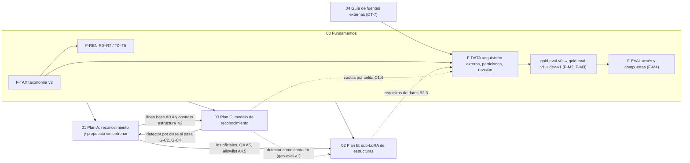

# Planes de estructuras de globos (2026-09)

Índice y vista consolidada de los cinco documentos de planificación. **No sustituye** a ninguno: ante una diferencia, prevalece `00-fundamentos-compartidos.md` para taxonomía, anotación, renombre, datos, evaluación e identificadores, y cada plan para sus paquetes de trabajo. Fecha de consolidación: 2026-09-15 (incluye la decisión DT-7).

## Documentos

**`00-fundamentos-compartidos.md` (Fundamentos, v0.2).** Única fuente de los acuerdos comunes: taxonomía v2 de las 16 estructuras y definición operativa de "orgánico" por prueba de silueta S1 (`F-TAX`, §4), esquema de anotación por instancia (`F-ANN`, §5), renombre `*_asimetrico` → `*_organico` con slices `R0`–`R7` y mudanza del dueño de la taxonomía `T0`–`T5` (`F-REN`, §6), programa de datos etiquetados con fuentes externas, particiones por titular y montaje, pre-etiquetado y revisión humana (`F-DATA`, §7), arnés de evaluación y formato de compuertas (`F-EVAL`, §8), riesgos, ADRs, preguntas para el negocio y el calendario común de referencia (§1.3). Es dueño único del gold, de la adquisición de imágenes, de la herramienta de etiquetado (`DP-08`) y del proyecto de métricas.

**`01-plan-A-reconocimiento-y-propuesta.md` (Plan A).** Mejora el reconocimiento de estructuras en fotos de referencia **sin entrenar modelos** (configuración explícita de Gemini, reconocedor por atributos con clase derivada y escalera de ablación), agrega humano en el circuito y preguntas al cliente según el costo del error, valida la propuesta contra lo detectado, fortalece la QA de imagen con foto y aporta evidencia para recalibrar el factor ×0,7. Es dueño de la línea base Gemini de reconocimiento (A0.4) que C debe superar, del cambio del reconocedor (antes `R4`) y de `T3`.

**`02-plan-B-sublora-estructuras.md` (Plan B).** Mide cómo dibujan hoy las 16 estructuras la base FLUX, el LoRA de estilo v004 y Gemini imagen, prueba contrafactuales sin entrenar y, solo donde haga falta, entrena un sub-LoRA de estructuras apilado con el estilo, también para flujos con foto (`/edit` + LoRA, DT-4), con despliegue gradual por flags. Es dueño de `R5`, de la línea base de generación y de los requisitos propios de datos (B2.3), que entrega al programa de adquisición de Fundamentos.

**`03-plan-C-entrenamiento-reconocimiento.md` (Plan C).** Entrena un reconocedor propio (RF-DETR + clasificadores de atributos sobre recortes), lo sirve en CPU dentro de `services/ai-api` e integra en el flujo de A **por clase**, detrás de compuertas pareadas contra la mejor configuración de A (sombra → A/B → autoritativo). Consume el gold de Fundamentos y la línea base de A; entrega a B un detector validado como contador.

**`04-guia-fuentes-externas.md` (guía operativa de DT-7).** Cómo conseguir legalmente las imágenes de las 16 estructuras: semáforo de fuentes (permiso escrito del titular como base; Commons CC0/PDM/CC BY y sesiones o licencias pagadas como complemento; stock estándar, Unsplash, Pexels/Pixabay sin permiso, NC/ND, marcas de agua, personajes y menores excluidos también para evaluar), consultas por clase, plantilla de permiso, flujo de estados y manifiesto de procedencia, metas por clase, embudo, calendario y costos, y preguntas para el abogado. Alimenta `F-DATA`; no redefine taxonomía ni particiones.

## Dependencias

**Calendario común de referencia (Fundamentos §1.3, estimación):** semana 0 = 2026-09-15. `F-M1` semana 4, `F-M2` semana 7, cierre de la selección de gold en la guía hacia la semana 8, `F-M3` (gold congelado) semana 11. A: `G2` ≈ semana 13. B: `G-B1` ≈ S8, `G-B4` ≈ S25, `G-B5` ≈ S28. C: `G-C1` ≈ semana 14, `G-C2` ≈ 23–24, rollout ≈ 33.

## Decisiones tomadas por el usuario

| Id | Decisión |
|---|---|
| DT-1 | Renombrar en todo el producto `arco_asimetrico`/`semiarco_asimetrico`/`columna_asimetrica` → `*_organico/a` y la redacción "asimétrico" → "orgánico" (alcance exacto en `DP-05`). |
| DT-2 | "Orgánico" = estructura asimétrica que usualmente se adapta al espacio y/o imita la naturaleza; la mezcla de tamaños no define la clase. Operativamente: solo la prueba de silueta S1 decide (Fundamentos §4.3). |
| DT-3 | Alcance: las 16 estructuras oficiales desde el inicio. |
| DT-4 | El sub-LoRA de estructuras, apilado con el de estilo, soporta las 16 y también genera con foto de referencia o del lugar (FLUX.2 edit + LoRA). |
| DT-5 | Verdad terreno: la IA pre-etiqueta y un humano revisa y corrige. |
| DT-6 | Tres planes sobre una base común: A, B y C. |
| DT-7 | Todas las imágenes de entrenamiento y evaluación de las 16 estructuras vienen de fuentes externas (no fotos propias ni de Sempertex), con permiso escrito del titular como base y manifiesto de procedencia por imagen (guía `04`). |

## Puertas de decisión

| Puerta | Documento | Criterio (resumen) | Si es no-go |
|---|---|---|---|
| F-M0 | 00 | Carpeta de ADRs; ADR-0010 y ADR-0011 aceptados | Nadie implementa taxonomía ni renombre |
| F-M1 | 00 | Taxonomía aprobada por clase por ≥2 decoradores a ciegas (κ reportado); guía v1 y examen | Clases quedan `provisional_sin_ejemplos` y sin compuerta |
| F-M2 | 00 | Piloto estratificado con κ/α ≥ sustancial y `gold-eval-v0` | Se revisan definiciones antes de etiquetar a escala |
| F-M3 | 00 | `gold-eval-v1` y `dev-v1` congelados; DP/Q de fronteras cerradas; n efectivo por clase ≥ objetivo | La clase se declara sin compuerta; ninguna compuerta sobre gold |
| F-M4 | 00 | Arnés con pruebas deterministas en CI, validado con `gold-eval-v0` | No se corren compuertas |
| G0 | 01 | Línea base reproducible (seed y gold), costo ±30 %, p95 por etapa | No se itera; se corrige arnés o precios |
| G1 | 01 | Configuración con menor flip rate, exactitud no inferior y p95 acotado | Se mantiene la configuración actual (ADR-0015) |
| G2 (`A-REC-01`) | 01 | Reconocedor v2 mejor que la línea base en F1 macro sobre clases con compuerta, en gold | Rama degradada: peldaño inferior o `estado=ambigua` |
| G2b | 01 | Clase adquirida con n ≥ 50 en ampliación de gold, no inferior a preguntar | La clase sigue en `ambigua` |
| G3 | 01 | Tasa de preguntas ≤ Q_max y menor error de cotización | UI en `aviso`; se revisa la matriz |
| G4 | 01 | Validación plan↔referencia con falsos rechazos acotados | Se queda en `aviso` |
| G5 (`A-QA-01`) | 01 | QA bloqueante con bloqueo falso ≤ tolerancia y recall no inferior | `IMAGE_QA_NON_BLOCKING` sigue sin habilitarse |
| G6 | 01 | Precisión suficiente para decidir el ×0,7 (ADR-0017) | Se mantiene preguntar en ese par |
| G7 | 01 | Esqueleto determinista mejora coincidencia sin empeorar convergencia ni p95 | Flag `off` |
| G-B0 | 02 | Saldo fal, ambos pesos LoRA aplicados, `/edit` con LoRA y licencias confirmadas | Pausa de gasto; ADR-0018 evalúa alternativas; escala `QB-11` |
| G-B1 | 02 | Alguna clase aprobada incumple T_c sin entrenar | No se entrena; se integra solo el prompt (`QB-11`) |
| G-B2 | 02 | Dataset con disyunción 0, licencias 100 %, κ ≥ 0,6 y captions auditados | Esperar adquisición o entrenar con clases `sin_evaluar` (`QB-03`) |
| G-B3a / G-B5a | 02 | Mecánica del piloto; efecto temprano del LoRA con foto | Corrección en B3; remediación R-a…R-c antes del tramo 2 |
| G-B3 | 02 | Arquitectura del piloto por confundibles | Re-plan con 2 LoRA o se detiene el entrenamiento |
| G-B4 | 02 | Aceptación sin foto (criterios de B6) | Sin promoción; ≤1 iteración; decisión `QB-11` |
| G-B5 | 02 | Con foto, `/edit` + LoRA frente a Gemini (B7) | Con foto sigue Gemini; remediación con tope `QB-12` |
| G-B6 | 02 | Producción por etapas: calidad, errores y preflight | Flags OFF |
| G-C0 | 03 | κ/α ≥ 0,6, pool externo con licencia de detector, `B_lat`, licencia de etiquetas | C se limita a datos y servicio con pesos públicos |
| G-C1 | 03 | Proyección de la curva de aprendizaje ≥ A0.4 en ≥ mitad de familias (en `dev-v1`) | Se cierra la línea de entrenamiento ("no adoptar" en ADR-0020) |
| G-C2 | 03 | Superioridad en F1 macro y no inferioridad por clase frente a la mejor config de A, en gold | No se integra; otro ciclo o cierre según `QC-10` |
| G-C3 | 03 | Sombra sin errores, sin impacto en p95, sin drift ni datos en logs | Se queda en sombra u `off` |
| G-C4 | 03 | A/B con potencia: primaria superior o no inferior, guardas intactas | Vuelta a sombra; sin potencia, decisión en ADR-0020 |
| G-C5 | 03 | Reentreno no inferior por clase frente al vigente | Se mantiene el modelo vigente |

## Decisiones pendientes del negocio

Deduplicadas; se lista el id principal y, entre paréntesis, los que lo amplían. Las técnicas puras (`DP-01`, `DP-06`, `DP-08`, `DP-09`, `DP-19`) quedan en Fundamentos §2.2.

| Id | Pregunta | Dueño | Documento |
|---|---|---|---|
| Q-30 | ¿Se contrata ya la revisión legal de la plantilla de permiso (Colombia/México, envío a fal y Google, Ley 1581) antes del primer contacto? | Negocio + legal | 00, 04 §7.2 |
| Q-29 | ¿Qué contraprestación se ofrece a titulares (crédito, US$2–10 por imagen) y quién custodia permisos y manifiesto? | Negocio | 00, 04 §4.5 |
| Q-15 (QB-02, QC-05) | ¿Qué presupuesto y ritmo se aprueban para la adquisición externa (contactos, permisos, sesiones pagadas en clases raras), más los incrementos de B y C? ¿Sintéticos solo para entrenar? | Negocio | 00, 02, 03 |
| Q-31 | ¿Cuenta como "externa" la foto propia de un artista certificado por Sempertex? | Usuario | 00, 04 §3.1 |
| QB-14 | ¿La suite de fidelidad de estilo puede usar fotos Sempertex propias o también debe ser externa? | Usuario | 02 |
| Q-01 (DP-11, Q-14, QB-08) | ¿Qué ≥2 decoradores aprueban la taxonomía, quién etiqueta, revisa y adjudica, y con cuántas horas? | Negocio | 00, 02 |
| DP-02, DP-03, DP-16, Q-02, Q-22–Q-26 | Precedencias y fronteras de clase (orgánico leve, arco abierto frente a 2 semiarcos, semiarco frente a guirnalda, qué es "no denso", piezas híbridas) | Decorador + Negocio | 00 |
| Q-03, Q-07–Q-10 | Estructuras fuera de las 16, bouquet con foil, variantes no densas, techo y aro, clásicas | Decorador + Negocio | 00 |
| Q-04 | ¿Las fotos 01, 03 y 05 de la galería son semiarcos o columnas? | Decorador | 00 |
| Q-27 | ¿Qué entiende el cliente por "arco orgánico" y cómo lo restringe el chat? | Negocio | 00 |
| DP-12 / Q-05 (QC-07, A-11.2) | Matriz de costo del error, cotizar "a confirmar" y cuántas preguntas por análisis se toleran | Negocio | 00, 01, 03 |
| DP-07 / Q-06 (A-11.11, A-11.12) | ¿Se mantiene, anula o invierte el ×0,7? ¿Quién firma la subida de cotizaciones y se aprueba el experimento de conteo? | Negocio + geometría | 00, 01 |
| Q-11 (A-11.9) | Base legal para analizar desgloses de órdenes en A6.1 (ya excluidas de entrenamiento y evaluación por DT-7) | Negocio + legal | 00, 01 |
| DP-13 / Q-17 (QB-07, QB-12) | Presupuesto de llamadas pagas, contingencia y tope de remediaciones con foto | Negocio | 00, 02 |
| DP-14 / Q-13 (QB-06) | ¿Se cierra la licencia `pending` de v004 o se entrena un estilo nuevo? | Negocio + dueño B | 00, 02 |
| DP-15 / Q-16 (QB-04, QC-02) | Proveedores que pueden recibir imágenes (Gemini, Claude, fal, GPU), región y retención | Negocio + técnico | 00, 02, 03 |
| QC-11 | ¿Los términos de Gemini/Anthropic permiten usar sus etiquetas para entrenar el detector? | Legal | 03 |
| DP-21 / Q-28 (QB-09) | Estratos de gold (≥25 % celular propuesto) y fuente y volumen de `venue-inputs-v1` | Negocio + dueños A y B | 00, 02 |
| Q-18 (QB-10) | ¿Se descarta FLUX fuera de fal? ¿Se acepta AGPL o GPU alquilada? ¿Manipular pesos fuera de fal? | Negocio + legal | 00, 02, 03 |
| Q-19, Q-20 (QC-04) | Fecha objetivo y prioridad entre A, B y C; volumen real con foto y clientes reales | Negocio | 00, 03 |
| Q-21 / QB-01 | Tolerancias por clase y márgenes δ para imágenes generadas | Negocio | 00, 02 |
| QB-03 | ¿Lanzar B con un subconjunto de clases aprobadas? | Negocio | 02 |
| QB-05 | Costo y latencia máximos por imagen con foto | Negocio | 02 |
| QB-11 / QC-10 | Quién decide remediar, reducir alcance o cerrar si una compuerta niega DT-3/DT-4 o si C no supera a A | Negocio | 02, 03 |
| QB-13 / QC-08 | Personas asignadas, tarifa, dueño de alertas y dueño operativo del modelo | Negocio | 02, 03 |
| QC-01 | Instancia EC2 y si se acepta una temporal para medir | Técnico + negocio | 03 |
| QC-06, A-11.4 | Retención de fotos o derivados con opt-in, TTL y borrado | Negocio + legal | 01, 03 |
| QC-09, QC-12 | Mostrar cajas al cliente; existencia real de celdas `organico∧uniforme` y `regular∧mixta` | Negocio + decorador | 03 |
| A-11.1, A-11.3, A-11.5–A-11.8, A-11.10, A-11.13–A-11.15 | UX y operación del Plan A: pausa del envío automático, cliente contra la foto, segunda llamada en sombra, QA no disponible, bandera de QA, motor en dev, laboratorio, espera de 45 s, revisión en producción, ventanas por n | Negocio | 01 §11 |

**Resueltas por DT-7 (se conservan en su documento):** `DP-10` para fuentes internas, `Q-12` (licencia de blog, web y fotos Sempertex), `QC-03` (ampliar la aprobación Sempertex al detector) y la parte de `Q-11` sobre entrenamiento y evaluación.
